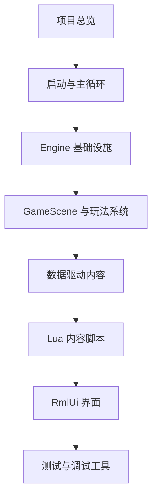

# TinyFarmRPG 文档入口

TinyFarmRPG 是一个教学演示项目。文档的目标不是只记录接口，而是帮助学生按顺序理解一个小型 C++ 游戏工程如何从入口、引擎层、游戏层、数据层、Lua 内容层和 UI 层组合起来。

如果你是第一次读项目，建议先走 [学习路线](tutorial/learning-path.md)，再按需要跳到具体模块。

## 推荐阅读顺序

1. [项目总览](overview.md)
2. [构建与运行](build_and_run.md)
3. [学习路线](tutorial/learning-path.md)
4. [启动到第一帧](engine/entry_to_first_frame.md)
5. [GameScene](game/game_scene.md)
6. [ECS 约定](engine/ecs.md) 与 [系统调度器](game/system_scheduler.md)
7. [地图数据管线](game/map_data_pipeline.md) 与 [MapManager](game/map_manager.md)
8. [数据 Catalog 总览](game/data-catalogs.md)
9. [Lua 内容编写指南](tutorial/lua-content-authoring.md)
10. [Game UI Scenes](game/ui-scenes.md)
11. [调试与崩溃定位](tutorial/debugging.md)

## 按主题查找

| 主题 | 入口 |
|------|------|
| 引擎层基础设施 | [engine/README.md](engine/README.md) |
| 游戏层系统 | [game/README.md](game/README.md) |
| 玩法闭环 | [gameplay/README.md](gameplay/README.md) |
| 数据目录 | [数据 Catalog 总览](game/data-catalogs.md) |
| Lua 内容层 | [Lua 内容编写指南](tutorial/lua-content-authoring.md) / [Lua 绑定教程](tutorial/lua-binding-guide.md) |
| 多线程教程 | [tutorial/multi-thread/README.md](tutorial/multi-thread/README.md) |
| UI 与工具 | [Game UI Scenes](game/ui-scenes.md) / [调试与验证工具](testing/tools.md) |
| UI 回归检查 | [testing/ui-regression-checklist.md](testing/ui-regression-checklist.md) / [testing/ui-layout-regression-checklist.md](testing/ui-layout-regression-checklist.md) |

## 常见任务入口

| 我想做什么 | 先读 |
|------------|------|
| 把项目跑起来 | [构建与运行](build_and_run.md) |
| 理解程序怎么启动 | [启动到第一帧](engine/entry_to_first_frame.md) |
| 理解 Scene 栈 | [场景系统](engine/scenes.md) |
| 理解输入如何到玩家移动 | [输入系统](engine/input_system.md) / [玩家控制](game/player_control.md) |
| 新增地图交互物 | [地图数据管线](game/map_data_pipeline.md) / [交互与对话](game/interaction_and_dialogue.md) |
| 新增 NPC 对话或剧情触发 | [Lua 内容编写指南](tutorial/lua-content-authoring.md) |
| 新增任务或商店内容 | [任务系统](gameplay/quest-system.md) / [商店系统](gameplay/shop-system.md) |
| 新增队友、装备或休息恢复 | [队伍、装备、休息与招募](gameplay/party-equipment-rest-recruitment.md) |
| 理解战斗系统 | [回合制战斗](gameplay/turn-based-battle.md) |
| 调 UI 或查布局问题 | [Game UI Scenes](game/ui-scenes.md) / [RmlUi 运行时](engine/ui_framework.md) / [布局契约](engine/layout-contract.md) |
| 查存档结构 | [存档与流程](game/save_and_flow.md) |
| 查本地化文本 | [本地化系统](game/localization.md) |

## 文档维护提示

- 文档应以当前源码、资源和配置为准。
- Mermaid 图中的换行使用 ` `。
- 新增重要系统时，至少补一个入口说明、关键文件列表、运行链路和扩展点。
