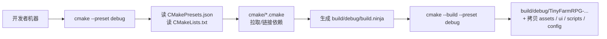
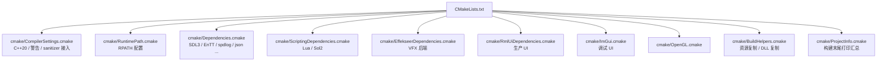

# 构建与运行

> 用途：第一次拿到代码的学生需要的"如何把项目跑起来"。CMake / Ninja / 预设 / 依赖 / 资源复制 / 工具与测试，集中说明。
>
> 调试细节（ASan / TSan / LLDB / 给 AI 报告模板）见 [tutorial/debugging.md](tutorial/debugging.md)，本篇是更基础的入口。

## 一、快速上手（3 步）

```bash
# 1. 配置（首次或修改 CMakeLists 后）
cmake --preset debug

# 2. 构建
cmake --build --preset debug

# 3. 运行
./build/debug/TinyFarmRPG-Darwin     # macOS
./build/debug/TinyFarmRPG-Linux      # Linux
build\debug\TinyFarmRPG-Windows.exe  # Windows
```

可执行文件名形如 `TinyFarmRPG-<SystemName>`，由 `CMakeLists.txt:16` 的 `set(TARGET ${PROJECT_NAME}-${CMAKE_SYSTEM_NAME})` 决定。

工作目录约定：直接从 `build/<preset>/` 启动，所有资源（`assets/` / `ui/` / `scripts/` / `config/`）已经在构建时被拷过去，开箱即用。

## 二、系统依赖

| 工具 | 最低版本 | 说明 |
|------|----------|------|
| CMake | 3.21+ | `CMakePresets.json` 用 v6 schema，要求 3.21 |
| Ninja | 任意现代版本 | 所有预设强制使用 Ninja 生成器 |
| C++ 编译器 | C++20 | macOS: AppleClang；Linux: GCC 10+ / Clang 12+；Windows: MSVC 2022 |
| Python | 3 | 部分依赖构建脚本需要 |
| Git | 任意 | 拉取项目和子模块 |

依赖库本身（SDL3 / RmlUi / Lua / Effekseer 等）由 CMake 在配置阶段自行拉取或链接，多数情况下**不需要手动安装**。默认按 `external/` 本地源码 → 在线下载的顺序解析，以保证不同开发机上的依赖版本一致。若显式打开 `TF_USE_SYSTEM_DEPS`，优先级变为系统库 → `external/` → 在线下载：

```bash
cmake --preset debug -DTF_USE_SYSTEM_DEPS=ON
```



## 三、CMake 预设

由 `CMakePresets.json` 提供，全部使用 Ninja，构建目录统一在 `build/<presetName>/`。

| 预设 | `CMAKE_BUILD_TYPE` | 额外开关 | 用途 |
|------|--------------------|----------|------|
| `debug` | Debug | 仅游戏目标 | 快速编译、日常运行调试 |
| `dev` | Debug | 测试 + 调试工具 | 日常开发与自动化验证 |
| `dev-full` | Debug | 测试 + 工具 + 学习目标 | 需要验证全部教学/实验目标 |
| `debug-asan` | Debug | ASan + 测试（macOS / Linux） | 怀疑内存错误（越界 / use-after-free） |
| `debug-tsan` | Debug | TSan + 测试（macOS / Linux） | 怀疑多线程竞争 |
| `release` | Release | 关闭调试 UI | 性能测试 |
| `relwithdebinfo` | RelWithDebInfo | 关闭调试 UI | 优化构建的崩溃定位 |

> `debug-asan` 和 `debug-tsan` 在 Windows 上不可用（`condition` 跳过）。Windows 用 `debug` 配合 Visual Studio 调试器。

每个 preset 对应一个独立 `build/` 目录，预设之间互不干扰。**第一次切换预设后**也无需 clean，直接 `cmake --preset <name>` + `cmake --build --preset <name>` 即可。

## 四、CMake 选项一览

`CMakeLists.txt` 顶部定义的可控选项（默认值在括号内）：

| 选项 | 默认 | 含义 |
|------|------|------|
| `BUILD_SHARED_LIBS` | OFF | 依赖库默认静态链接。改成 ON 会让大部分库变成动态库 |
| `ENABLE_DEBUG_UI` | ON | ImGui 调试面板（定义 `TF_ENABLE_DEBUG_UI` 宏） |
| `ENABLE_RMLUI_DEBUGGER` | ON | RmlUi 内置 inspector |
| `ENABLE_TSAN` | OFF | ThreadSanitizer（`debug-tsan` 预设自动打开） |
| `TF_USE_SYSTEM_DEPS` | OFF | 是否优先查找系统依赖；关闭时使用 `external/` → 在线下载 |
| `BUILD_TOOLS` | OFF | 编译 `tools/` 下的调试工具；`dev` 预设自动打开 |
| `BUILD_RMLUI_TESTER` | ON | 单独控制 `rmlui_tester` |
| `BUILD_LEARN` | OFF | 编译 `learn/` 下的实验目标；`dev-full` 预设自动打开 |
| `BUILD_TESTING` | OFF | 编译 `tests/` 下的 GoogleTest；`dev` 预设自动打开 |

显式覆盖示例：

```bash
cmake --preset debug -DENABLE_DEBUG_UI=OFF -DBUILD_LEARN=OFF
```

另外，顶层 `CMakeLists.txt` 会为 EnTT 全局定义两项构建前提：`ENTT_ID_TYPE=std::uint64_t` 把 ID 类型强制设为 64 位，降低 catalog / cue / resource 哈希冲突风险；`ENTT_USE_ATOMIC` 让 EnTT 在多线程访问时使用 atomic 内部共享状态，配合 SystemScheduler 的并行岛使用。

## 五、构建产物结构

```
build/debug/
├── TinyFarmRPG-<System>              # 可执行文件（即 ${TARGET}）
├── assets/                           # 由 BuildHelpers.setup_asset_copy 复制
├── ui/                               # 由 setup_ui_copy 复制
├── scripts/                          # 由 setup_script_copy 复制
├── config/                           # 由 setup_config_copy 复制
├── tools/                            # 调试工具（若 BUILD_TOOLS=ON）
├── tests/                            # GoogleTest 可执行文件（若 BUILD_TESTING=ON）
└── learn/                            # 学习实验目标（若 BUILD_LEARN=ON）
```

资源 / UI / 脚本 / 配置通过游戏目标依赖的同步任务写入 build 目录。修改 `assets/data/*.json`、`scripts/*.lua`、RML 或配置后，再执行一次 `cmake --build --preset <name>` 即会增量同步，不会因此重链接 C++ 可执行文件。源目录中删除的文件也会从 build 副本中清理；运行时生成、未被同步清单记录的文件（例如 `config/user_settings.json`）会保留。

Windows 上还有 `setup_windows_dll_copy`（`CMakeLists.txt:185`）负责把动态库 DLL 复制到可执行文件旁。

## 六、CMake 模块布局

`CMakeLists.txt` 把各部分拆到 `cmake/*.cmake`：



工程目标三层（`CMakeLists.txt:80-153`）：

- `engine` 静态库：通用引擎层
- `game` 静态库：依赖 engine，包含 TinyFarmRPG 玩法
- `${TARGET}` 可执行文件：依赖 game，加 `src/main.cpp` 入口

子目录：

- `src/`：游戏源码（`add_subdirectory(src)`）
- `tools/`：调试工具（如 `BUILD_TOOLS && ENABLE_DEBUG_UI`）
- `tests/`：GoogleTest（如 `BUILD_TESTING`）
- `learn/`：实验目标（如 `BUILD_LEARN`）

## 七、运行可执行文件

构建完成后直接运行：

```bash
./build/debug/TinyFarmRPG-Darwin       # macOS
./build/debug/TinyFarmRPG-Linux        # Linux
.\build\debug\TinyFarmRPG-Windows.exe  # Windows
```

默认窗口大小 / 输入映射 / 渲染参数等在 `config/` 下的 JSON：

| 文件 | 用途 |
|------|------|
| `config/window.json` | 窗口大小、标题、全屏策略 |
| `config/input.json` | 键鼠 / 手柄 action 映射 |
| `config/render.json` | 分辨率、视口、letterbox |
| `config/audio.json` | 音量、空间声参数 |
| `config/text.json` | 字体、字号 |

修改 config 后通常**重启游戏**即可生效（构建时会复制到 build 目录，运行时直接读 build 内副本）。

## 八、调试工具与测试

工具目标在 `tools/`（`BUILD_TOOLS=ON` 时编译）：

- `tools/battle_tester/` — 不开 GameScene 直接搭一场战斗调公式 / AI
- `tools/rmlui_tester/` — 单独跑 RmlUi 文档，验证布局 / 数据绑定
- `tools/visual_tester/` — 视觉回归
- `tools/scheduler_dot_dump/` — 把 SystemScheduler 的并行岛打成 DOT 图
- `tools/rpg_importer/` — RPG Maker 风格数据导入

详见 [testing/tools.md](testing/tools.md)。

测试用 GoogleTest（`tests/` 下按 `engine/game/shared/data/scripts` 分层）：

```bash
cmake --preset dev
cmake --build --preset dev --target engine_tests game_tests
ctest --test-dir build/dev --output-on-failure
ctest --test-dir build/dev -R "Battle" --output-on-failure
```

或者直接跑单个测试二进制（在 `build/dev/tests/<dir>/<name>`）。

## 九、常见错误

| 现象 | 原因 / 处理 |
|------|-------------|
| `Could not find Ninja` | 装 Ninja。macOS `brew install ninja`，Linux `apt install ninja-build`，Windows 通过 winget / chocolatey |
| `cmake too old` | 升级 CMake 到 3.21+ |
| `assets/data/xxx.json not found` | 直接从 `build/<preset>/` 启动可执行文件，不是从仓库根目录 |
| 修改了 JSON / Lua 看不到效果 | `cmake --build --preset <name>` 重新触发资源复制（也可手动 cp 进 build 目录验证） |
| ASan / TSan 在 Windows 编译失败 | 预设条件已自动跳过，确认你用的是 `debug-asan` / `debug-tsan` 而非默认 `debug` |
| 重新切换分支后构建怪异 | 删 `build/<preset>/` 后重 configure；不要混合不同分支的 build 目录 |

## 十、推荐工作流

- **只运行游戏**：`debug` 预设，默认不编译测试、工具和学习目标
- **日常开发与验证**：`dev` 预设，包含测试和调试工具
- **验证全部教学目标**：`dev-full` 预设
- **要试性能影响**：`relwithdebinfo`（保留符号但优化）
- **遇到崩溃**：先用 `debug-asan` 跑一次，多数情况下能定位到行号
- **怀疑数据竞争**：`debug-tsan`

更细的崩溃定位（LLDB / sanitizer 输出格式 / 给 AI 报错模板）见 [调试与崩溃定位](tutorial/debugging.md)。

## 相关文档

- [启动到第一帧](engine/entry_to_first_frame.md) — 可执行文件里第一帧之前发生了什么
- [项目总览](overview.md) — 顶层目录结构与技术栈
- [调试与验证工具](testing/tools.md) — `tools/` 下各工具用法
- [调试与崩溃定位](tutorial/debugging.md) — ASan / TSan / LLDB 的详细用法
- [运行时装配](game/runtime-assembly.md) — 可执行文件启动后如何装配 catalog / service / system
