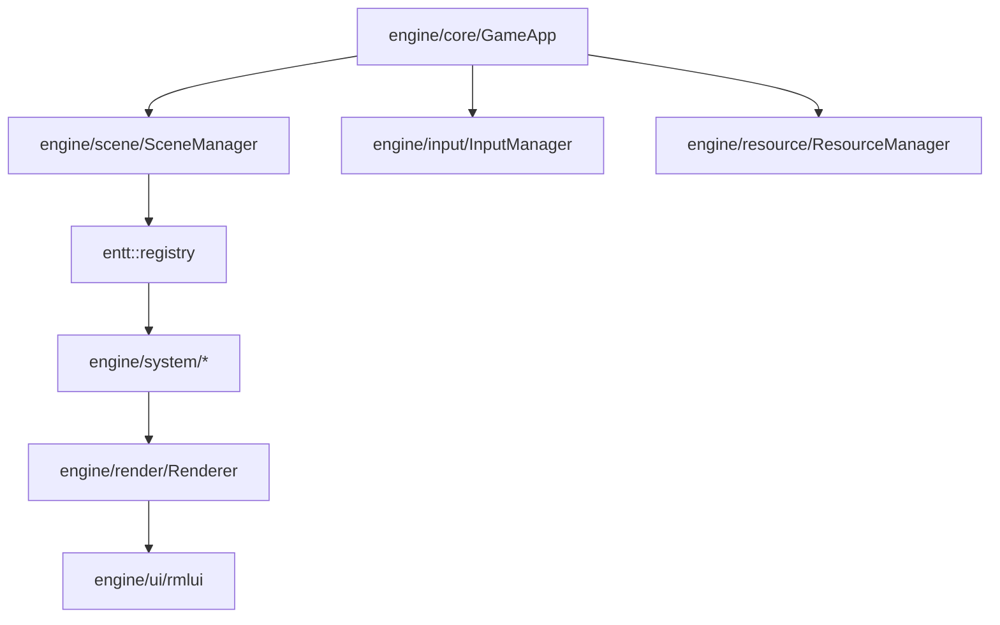

# Engine 文档索引

`src/engine` 是与具体 TinyFarm 玩法无关的基础设施层。它负责窗口、主循环、输入、资源、渲染、UI、脚本宿主、ECS 通用系统、空间索引、音频和 VFX。

## 推荐顺序

1. [启动到第一帧](entry_to_first_frame.md)
2. [场景系统](scenes.md)
3. [事件分发约定](events.md)
4. [ECS 约定](ecs.md)
5. [输入系统](input_system.md)
6. [资源系统](resources.md)
7. [渲染约定](rendering.md)
8. [RmlUi 运行时](ui_framework.md)

## 文档地图

| 文档 | 适合什么时候读 |
|------|----------------|
| [entry_to_first_frame.md](entry_to_first_frame.md) | 想知道程序怎么从入口跑到第一帧 |
| [loop_timing_contract.md](loop_timing_contract.md) | 想理解固定步、渲染插值和帧尾事件刷新 |
| [scenes.md](scenes.md) | 想理解 Title / Game / Pause / Battle 等 Scene 如何切换和覆盖 |
| [events.md](events.md) | 分不清 `trigger`、`enqueue`、`dispatcher.update` 时 |
| [ecs.md](ecs.md) | 第一次读 EnTT registry、component、system、tag 时 |
| [input_system.md](input_system.md) | 查动作映射、输入上下文、手柄、rebind、RmlUi 输入路由 |
| [resources.md](resources.md) | 查 `ResourceManager`、`resource_mapping.json` 和资源 ID 策略 |
| [rendering.md](rendering.md) | 查 Sprite、YSort、光照、后处理和渲染层级 |
| [resolution_and_viewport.md](resolution_and_viewport.md) | 查逻辑分辨率、letterbox、视口换算 |
| [text_rendering.md](text_rendering.md) | 查 FreeType、HarfBuzz、字体 atlas 和文本绘制 |
| [ui_framework.md](ui_framework.md) | 查 RmlUi runtime、document controller、data model、输入集成 |
| [layout-contract.md](layout-contract.md) | 查 RmlUi 布局与浮动控件边界 |
| [movement_and_collision.md](movement_and_collision.md) | 查移动系统、碰撞响应和动态阻挡 |
| [spatial_index.md](spatial_index.md) | 查静态/动态空间网格 |
| [audio_system.md](audio_system.md) | 查音频资源、播放事件、音量设置 |
| [vfx_and_effekseer.md](vfx_and_effekseer.md) | 查 Effekseer、VfxService、VfxCatalog、双通道渲染 |
| [debug_ui.md](debug_ui.md) | 查 ImGui debug panel 注册和使用 |

## 读源码入口

