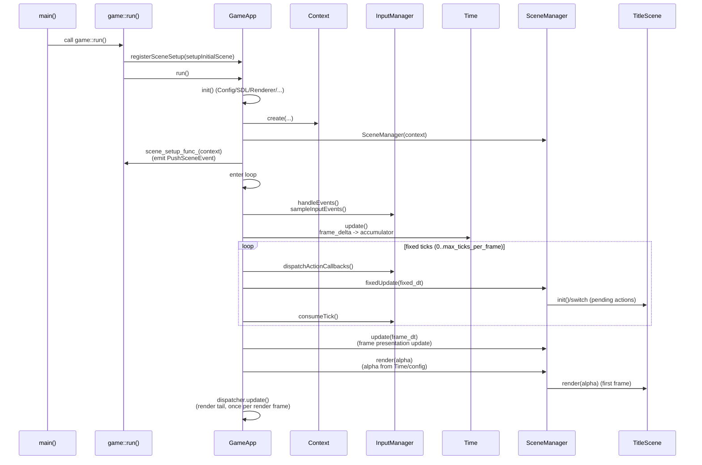
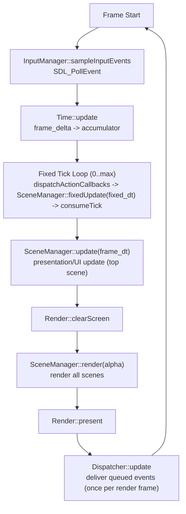

# 从入口到第一帧：main → game::run → GameApp

> 用途：给协作者/读者一个“可复现的启动心智模型”，用于快速定位入口、主循环、初始场景注入点（不逐行讲实现）。

## 启动链路（时序）

## 每帧节拍（数据流）

其中：
- `alpha = render_interpolation ? Time::getInterpolationAlpha() : 1.0f`
- `dispatcher.update()` 仍保持在 `render()` 之后，保证 enqueue 事件语义兼容

## 输入与更新阶段约定
- SDL 事件采样：每个渲染帧一次（`sampleInputEvents`）
- 输入回调分发：每个 fixed tick 一次（`dispatchActionCallbacks`）
- 输入边沿消费：每个 fixed tick 一次（`consumeTick`）
- 逻辑更新：`SceneManager::fixedUpdate(fixed_dt)`（仅栈顶）
- 帧表现更新：`SceneManager::update(frame_dt)`（仅栈顶）
- 渲染：`SceneManager::render(alpha)`（全栈叠加）

## 关键设计点：初始场景由游戏层注入
引擎层（`GameApp`）只负责把“一个可运行的壳”搭起来：初始化子系统、进入主循环、提供渲染/输入/事件分发等基础能力。

“启动时进入哪个 Scene”属于游戏逻辑决策，放在游戏层更合理：
- 游戏层通过 `GameApp::registerSceneSetup(...)` 注入一个回调；
- 回调拿到 `Context` 后，通过 dispatcher 触发 `PushSceneEvent/ReplaceSceneEvent` 把 Scene 交给 `SceneManager` 管理；
- 这样引擎层不需要知道 `TitleScene/GameScene/...`，也更便于以后替换启动流程（例如直接进调试场景、跳过标题、从存档启动等）。

> 事件分发的约定（`trigger`/`enqueue`/`dispatcher.update`）见：`docs/engine/events.md`
