# 输入系统：InputManager / 动作映射 / 多设备 / 上下文 / Rebind（TinyFarm）

> 统一项目内"输入系统"的心智模型与约定。

TinyFarm 的输入系统可以用一句话概括：
> **InputManager 把 SDL 的"物理输入事件"（键盘/鼠标/手柄）翻译成"动作（Action）状态"，上层只依赖动作，不直接依赖 SDL。**

### 整体架构

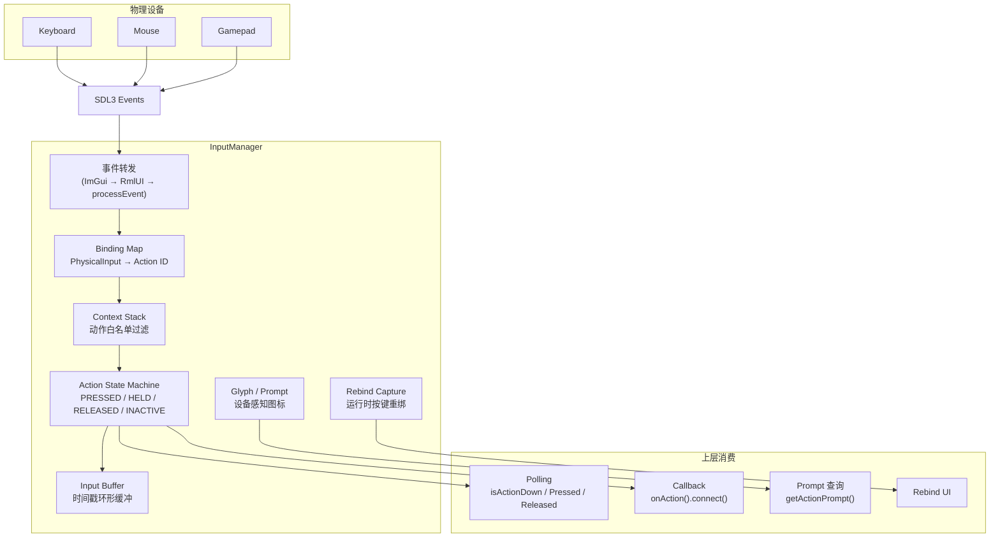

---

## 1) 文件结构

| 文件 | 职责 |
|---|---|
| `src/engine/input/input_manager.h/.cpp` | 顶层类，SDL 事件消费、动作状态机、上下文栈、rebind、手柄管理 |
| `src/engine/input/input_buffer.h/.cpp` | 带时间戳的按键环形缓冲区（用于跨 tick 的缓冲输入检测） |
| `src/engine/input/input_glyphs.h/.cpp` | 按键提示图标 ID / 回退文本的构建函数 |
| `config/input.json` | 运行时可编辑的动作→按键映射配置（rebind 后原子写回） |

命名空间：`engine::input`

---

## 2) 关键类型与枚举

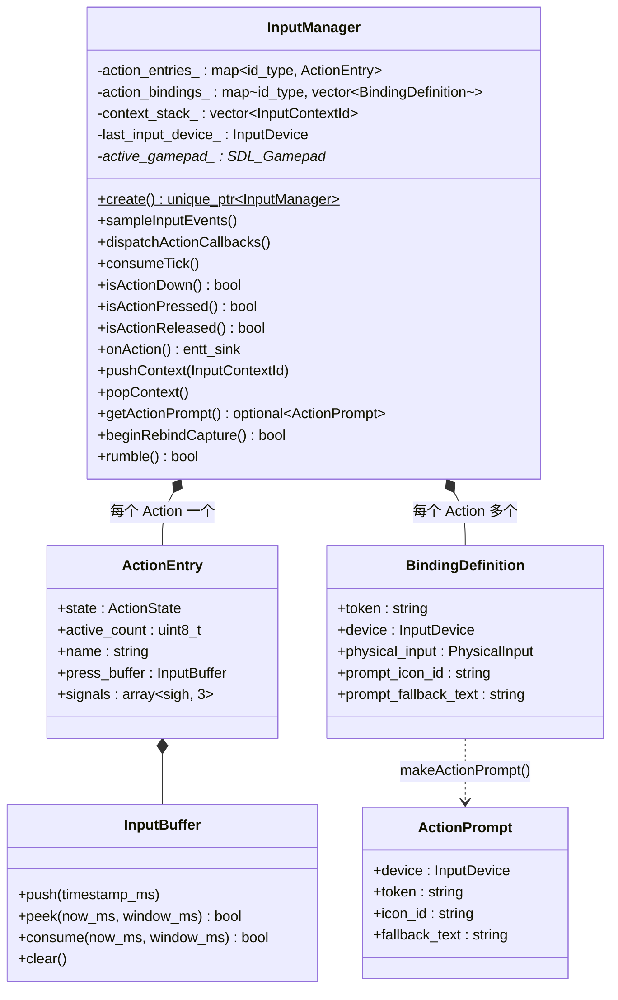

### 2.1 InputDevice

```cpp
enum class InputDevice : std::uint8_t { Keyboard, Mouse, Gamepad };
```

追踪最近一次物理输入来源，用于 prompt 图标自动切换（键盘/手柄提示）。

### 2.2 ActionState

```cpp
enum class ActionState { PRESSED, HELD, RELEASED, INACTIVE };
```

- `PRESSED`：本 tick 首次按下（边沿）
- `HELD`：持续按住
- `RELEASED`：本 tick 释放（边沿）
- `INACTIVE`：未激活

前三个值同时用作回调信号数组的索引（`CALLBACK_STATE_COUNT = 3`）。

### 2.3 InputContextId

```cpp
enum class InputContextId : std::uint8_t { Gameplay, Menu, Dialogue, Battle };
```

输入上下文标识。每个上下文定义了允许的动作子集，详见 [第 5 节](#5-输入上下文context-stack)。

### 2.4 GamepadAxisDirection

```cpp
enum class GamepadAxisDirection : uint8_t {
    LeftStickUp, LeftStickDown, LeftStickLeft, LeftStickRight,
    RightStickUp, RightStickDown, RightStickLeft, RightStickRight,
    LeftTrigger, RightTrigger,
    Count  // sentinel, GAMEPAD_AXIS_DIRECTION_COUNT = 10
};
```

摇杆和扳机通过滞回阈值数字化为方向布尔值（press 0.6 / release 0.4）。

### 2.5 PhysicalInput

```cpp
using PhysicalInput = std::variant<SDL_Scancode, Uint32, SDL_GamepadButton, GamepadAxisDirection>;
```

覆盖四种物理输入：键盘扫描码、鼠标按钮常量、手柄按钮、手柄轴方向。

### 2.6 BindingDefinition

```cpp
struct BindingDefinition {
    std::string token;                // 配置文件中的字符串，如 "W", "MouseLeft", "GamepadSouth", "LeftStickUp"
    InputDevice device;               // 所属设备
    PhysicalInput physical_input;     // 解析后的 SDL 值
    std::string prompt_icon_id;       // UI 图标 ID，如 "key_w", "gamepad_a"
    std::string prompt_fallback_text; // 无图标时的回退文本
};
```

### 2.7 ActionPrompt

```cpp
struct ActionPrompt {
    InputDevice device;
    std::string token;
    std::string icon_id;
    std::string fallback_text;
};
```

设备感知的显示描述符。`getActionPrompt()` 根据 `last_input_device_` 自动选择最合适的 binding。

### 2.8 ActionEntry（内部）

```cpp
struct ActionEntry {
    ActionState state = ActionState::INACTIVE;
    uint8_t active_count = 0;    // 当前有多少物理键在按住此动作
    std::string name;
    InputBuffer press_buffer{};
    std::array<entt::sigh<bool()>, 3> signals;
};
```

`active_count` 支持多键绑定同一动作：`PRESSED` 仅在 0→1 时触发，`RELEASED` 仅在回到 0 时触发。

---

## 3) InputManager 核心接口

### 3.1 创建

```cpp
[[nodiscard]] static std::unique_ptr<InputManager> create(
    entt::dispatcher* dispatcher,
    engine::core::GameState* game_state,
    std::string_view config_path = DEFAULT_CONFIG_PATH);
```

参数为空返回 `nullptr`。内部调用 `loadConfig()` 加载映射，失败时回退到 `defaultMappings()`。

### 3.2 三阶段更新

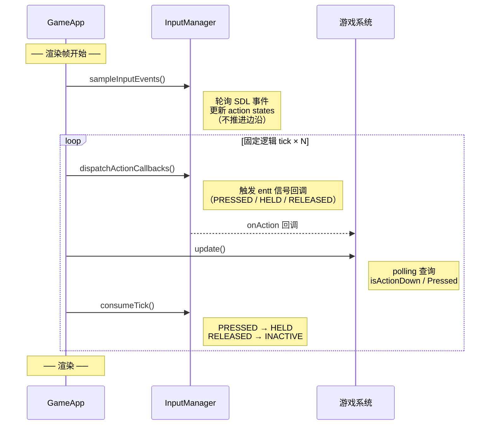

- `sampleInputEvents()` 只负责采样与更新输入事实，不推进边沿生命周期
- `consumeTick()` 在 fixed tick 末尾推进，保证同一渲染帧内多 tick 的边沿语义一致

### 3.3 Polling 查询

```cpp
bool isActionDown(entt::id_type action_name_id) const;     // PRESSED || HELD
bool isActionPressed(entt::id_type action_name_id) const;   // 仅 PRESSED
bool isActionReleased(entt::id_type action_name_id) const;  // 仅 RELEASED
```

### 3.4 回调注册

```cpp
entt::sink<entt::sigh<bool()>> onAction(entt::id_type action_name_id, ActionState state = ActionState::PRESSED);
```

- 回调返回 `bool`：返回 `true` 时本次分发停止（占用输入）
- 订阅调用顺序为"后绑定先调用"

### 3.5 鼠标

```cpp
glm::vec2 getMousePosition() const;         // window coordinates
glm::vec2 getLogicalMousePosition() const;  // 逻辑分辨率坐标（letterbox 感知）
glm::vec2 getMouseWheelDelta() const;       // 每 consumeTick() 清零
```

逻辑坐标通过 `computeLetterboxMetrics()` + `GameState::getWindowSize/LogicalSize()` 计算。

### 3.6 Input Buffer（缓冲输入）

```cpp
[[nodiscard]] bool peekBufferedPress(entt::id_type action_name_id, Uint64 window_ms) const;
bool consumeBufferedPress(entt::id_type action_name_id, Uint64 window_ms);
```

检测/消费 `window_ms` 毫秒内的 PRESSED 事件。适用于需要跨 tick 容差的场景（如战斗/菜单中的按键缓冲）。

内部使用 `InputBuffer`——固定容量环形缓冲区，记录每次 PRESSED 的 `SDL_GetTicks()` 时间戳。

### 3.7 Prompt / Glyph

```cpp
[[nodiscard]] std::vector<BindingDefinition> getActionBindings(entt::id_type action_name_id) const;
[[nodiscard]] std::optional<ActionPrompt> getActionPrompt(entt::id_type action_name_id) const;
```

`getActionPrompt` 选择策略：优先匹配 `last_input_device_`；非手柄模式下回退到任意非手柄 binding；最终回退到 `bindings.front()`。

Glyph 构建函数（`input_glyphs.h`）：
- `buildPromptIconId()`：生成 CSS 安全 ID，如 `"key_w"`, `"mouse_left"`, `"gamepad_a"`, `"gamepad_left_stick_up"`
- `buildPromptFallbackText()`：生成人类可读文本
- `makeActionPrompt()`：从 `BindingDefinition` 构建 `ActionPrompt`

---

## 4) 动作状态机（帧语义）

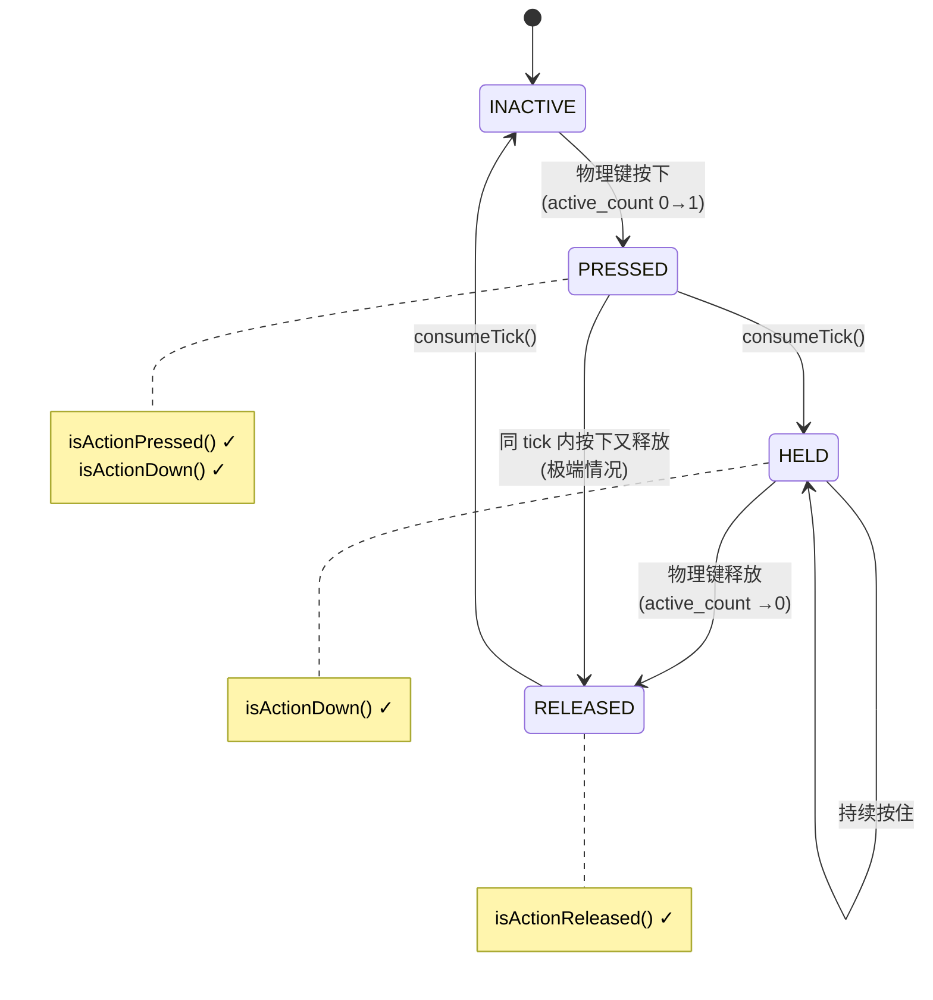

这允许上层清晰地区分：
- "按下一次触发"（`isActionPressed` / 绑定 `PRESSED`）
- "持续按住移动"（`isActionDown` / 绑定 `HELD`）

**多键绑定语义**：通过 `active_count` 引用计数。例如 W 和 LeftStickUp 都绑定了 `move_up`，同时按住两者 `active_count=2`，松开其中一个不会触发 `RELEASED`，直到全部松开。

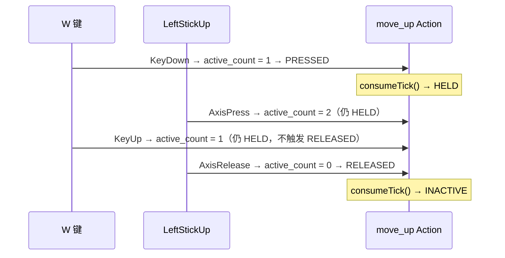

---

## 5) 输入上下文（Context Stack）

```mermaid
graph TB
    subgraph Context Stack（后进先出）
        direction TB
        C3["栈顶 → 当前生效"]
        C2["..."]
        C1["栈底"]
    end

    subgraph 场景生命周期
        direction LR
        INIT["init()"] -->|pushContext| STACK["Context Stack"]
        CLEAN["clean()"] -->|popContext| STACK
    end

    subgraph 上下文过滤
        ALL["所有 Action"] --> FILTER{"currentContext<br/>allowed_actions"}
        FILTER -->|通过| ACTIVE["激活的 Action"]
        FILTER -->|拦截| BLOCKED["被屏蔽的 Action"]
    end
```

```cpp
void pushContext(InputContextId id);
void popContext();
[[nodiscard]] std::optional<InputContextId> currentContext() const;
```

- 每个上下文定义一个动作白名单（`allowed_actions`）
- push/pop 时自动调用 `clearAllInputState()` 防止状态泄漏
- 栈为空时所有动作均允许（兼容旧行为）

### 上下文定义（硬编码于 `initializeContextDefinitions()`）

| 上下文 | 允许的动作 |
|---|---|
| **Gameplay** | 移动、primary/secondary action、interact、pause、inventory、hotbar 1-10 + prev/next、rotate、player_light、camera_reset_zoom、toggle_prompt_bar |
| **Menu** | menu_left/right/up/down、menu_confirm、menu_cancel |
| **Dialogue** | 同 Menu |
| **Battle** | 同 Menu |

### 场景中的使用

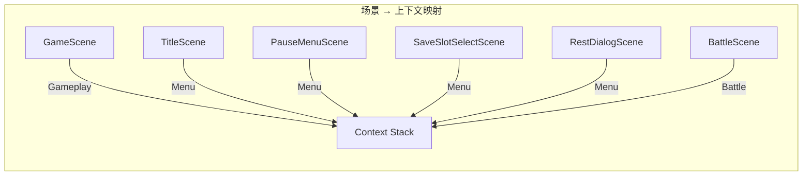

- `GameScene` → `Gameplay`（移动、交互、物品栏等）
- `TitleScene` / `PauseMenuScene` / `SaveSlotSelectScene` / `RestDialogScene` → `Menu`（方向导航、确认、取消）
- `BattleScene` → `Battle`（同 Menu）

---

## 6) 手柄支持

单活跃手柄模型（单人 RPG）。

### 6.1 热插拔

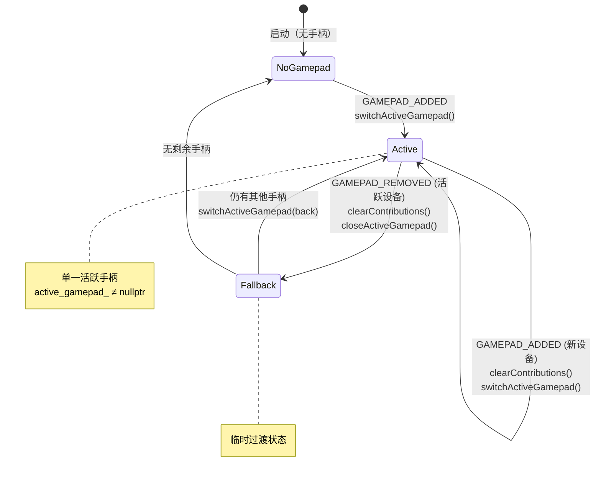

- `clearGamepadContributions()` 确保移除/替换手柄时正确递减所有已按下按钮/轴的 `active_count`

### 6.2 摇杆数字化

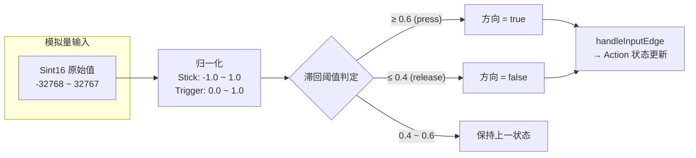

| 输入 | 归一化范围 | Press 阈值 | Release 阈值 |
|---|---|---|---|
| 摇杆轴 | `[-1.0, 1.0]` | 0.6 | 0.4 |
| 扳机轴 | `[0.0, 1.0]` | 0.6 | 0.4 |

每个轴事件同时更新两个方向（如 `LEFTX` 更新 `LeftStickLeft` 和 `LeftStickRight`）。

### 6.3 Rumble

```cpp
[[nodiscard]] bool rumble(float intensity, Uint32 duration_ms);
```

将 `intensity`（0.0–1.0）映射到双马达振幅（`intensity * 65535`）。新调用立即替代旧振动。无活跃手柄或 `intensity <= 0` 时返回 `false`。

### 6.4 支持的手柄 Token

**按钮：** `GamepadSouth`, `GamepadEast`, `GamepadWest`, `GamepadNorth`, `GamepadBack`, `GamepadGuide`, `GamepadStart`, `GamepadLeftStick`, `GamepadRightStick`, `GamepadLeftShoulder`, `GamepadRightShoulder`, `GamepadDpadUp`, `GamepadDpadDown`, `GamepadDpadLeft`, `GamepadDpadRight`

**轴方向：** `LeftStickUp/Down/Left/Right`, `RightStickUp/Down/Left/Right`, `LeftTrigger`, `RightTrigger`

---

## 7) Rebind 系统

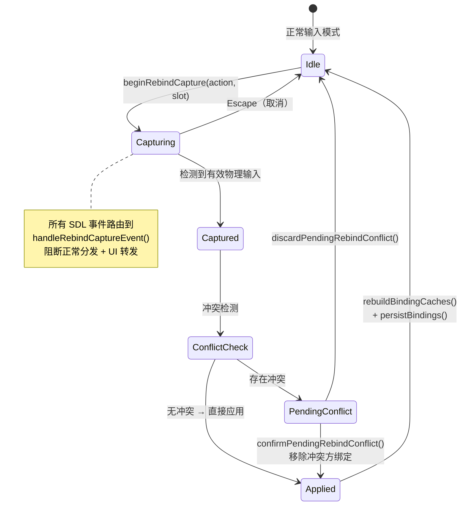

```cpp
[[nodiscard]] bool beginRebindCapture(entt::id_type action_name_id, std::size_t binding_index);
void cancelRebindCapture();
[[nodiscard]] bool confirmPendingRebindConflict();
void discardPendingRebindConflict();
```

### 流程

1. `beginRebindCapture()` 进入捕获模式，清空所有输入状态
2. 捕获期间 `sampleInputEvents()` 将事件路由到 `handleRebindCaptureEvent()`，阻断正常动作分发和 RmlUI/ImGui 转发
3. `Escape` 无条件取消捕获
4. 检测到有效物理输入后进行冲突检测
5. 若存在冲突 → 存储 `PendingRebindConflict`，调用方需调用 `confirm` 或 `discard`
6. 确认冲突后移除冲突方的绑定槽
7. 绑定变更后调用 `rebuildBindingCaches()` + `persistBindings()`

### 持久化

`persistBindings()` 使用原子写入（临时文件 + rename），失败时从备份恢复。

---

## 8) `config/input.json`（配置格式）

### 绑定加载流水线

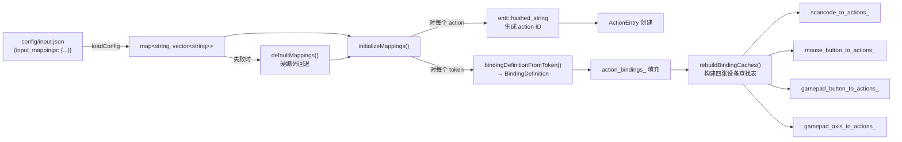

```json
{
  "input_mappings": {
    "action_name": ["Token1", "Token2", ...]
  }
}
```

### Token 解析规则（`bindingDefinitionFromToken()`）

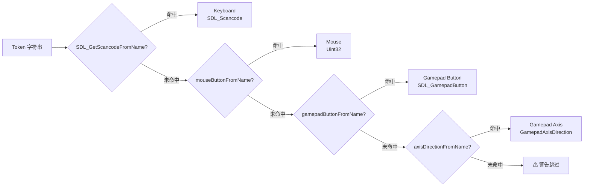

### Token 类型

| 类型 | 示例 |
|---|---|
| 键盘（SDL key name） | `"W"`, `"Space"`, `"Escape"`, `"Left"`, `"1"` |
| 鼠标 | `"MouseLeft"`, `"MouseRight"`, `"MouseMiddle"`, `"MouseX1"`, `"MouseX2"` |
| 手柄按钮 | `"GamepadSouth"`, `"GamepadDpadUp"` |
| 手柄轴方向 | `"LeftStickUp"`, `"RightTrigger"` |

---

## 9) RmlUI / ImGui 集成

### 事件转发顺序

```mermaid
flowchart TD
    SDL["SDL Event"] --> RBC{"Rebind Capture<br/>活跃?"}
    RBC -->|是| RBH["handleRebindCaptureEvent()<br/>（吞掉所有事件）"]
    RBC -->|否| IMGUI

    IMGUI["ImGui callback<br/>(仅 TF_ENABLE_DEBUG_UI)"] --> IGCAP{"ImGui<br/>WantCapture?"}
    IGCAP -->|是 (键盘/鼠标)| ALWAYS{"总是放行?<br/>KEY_UP / MOUSE_UP<br/>MOTION / GAMEPAD_*"}
    IGCAP -->|否| RMLUI

    RMLUI["RmlUI callback"] --> SUP{"shouldSuppress<br/>RmlUiKeyboard?"}
    SUP -->|是| PE["processEvent()<br/>（游戏输入）"]
    SUP -->|否| RMLPROC["RmlUI 处理"]
    RMLPROC --> RMLCAP{"RmlUI<br/>已处理?"}
    RMLCAP -->|是| ALWAYS
    RMLCAP -->|否| PE

    ALWAYS -->|是| PE
    ALWAYS -->|否| DONE["丢弃"]
```

### RmlUI 键盘抑制

在菜单类上下文（Menu / Dialogue / Battle）中，绑定到 `menu_*` 动作的扫描码（Tab 除外）会被 `shouldSuppressRmlUiKeyboardEvent()` 拦截，不转发给 RmlUI，防止双重处理。

### 总是放行的事件

以下事件类型即使 RmlUI 声称已处理，也会继续传递给 `processEvent()`：
`KEY_UP`, `MOUSE_BUTTON_UP`, `MOUSE_MOTION`, `GAMEPAD_BUTTON_UP`, `GAMEPAD_AXIS_MOTION`, `GAMEPAD_ADDED`, `GAMEPAD_REMOVED`, `GAMEPAD_REMAPPED`

---

## 10) 系统事件处理

`processEvent()` 还负责转发以下 SDL 窗口事件：
- `SDL_EVENT_WINDOW_RESIZED` → `WindowResizedEvent`（pixel=false）
- `SDL_EVENT_WINDOW_PIXEL_SIZE_CHANGED` → `WindowResizedEvent`（pixel=true）
- `SDL_EVENT_WINDOW_FOCUS_LOST` / `MINIMIZED` → `clearAllInputState()` + `FocusLostEvent`
- `SDL_EVENT_QUIT` → `QuitEvent`

---

## 11) 与 GameApp 的集成

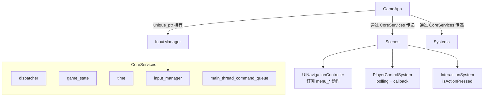

`InputManager` 由 `GameApp` 以 `std::unique_ptr` 持有，通过 `CoreServices` 传递给场景和系统：

```cpp
struct CoreServices {
    entt::dispatcher& dispatcher;
    engine::core::GameState& game_state;
    engine::core::Time& time;
    engine::input::InputManager& input_manager;
    engine::async::MainThreadCommandQueue& main_thread_command_queue;
};
```

`UINavigationController`（引擎层）订阅 `menu_*` 动作驱动 RmlUI 焦点导航。

---

## 12) Debug

```cpp
[[nodiscard]] InputDebugSnapshot getDebugSnapshot(Uint64 now_ms = 0) const;
[[nodiscard]] GamepadDebugState getGamepadDebugState() const;
```

所有调试数据通过不可变快照暴露，不泄漏内部引用。`InputDebugSnapshot` 聚合了动作状态、手柄状态、Rumble 状态、Rebind 捕获状态等。

验证入口：`F5` → `Engine Debug Panels` → `Input`

---

## 13) 常见坑

1. **调试 UI 打字时游戏动作被误触发**
   - 原因：ImGui 捕获键盘时仍把 KEY_DOWN 映射成动作
   - 排查：看 Input 面板状态变化 + 日志

2. **UI 点击与世界点击同时触发**
   - 原因：UI 没有吃掉输入
   - 解决：回调返回 `true` 占用；必要时用 `UIInputBlocker`

3. **鼠标坐标不对（缩放/letterbox/高 DPI）**
   - 解决：统一使用 `getLogicalMousePosition()`

4. **上下文切换后动作残留**
   - 原因：手动管理状态而未通过 `pushContext/popContext`
   - 解决：依赖上下文栈，push/pop 自动 `clearAllInputState()`

5. **手柄热插拔后动作卡住**
   - 已由 `clearGamepadContributions()` 处理：移除/替换手柄时正确递减所有已按下输入的 `active_count`
