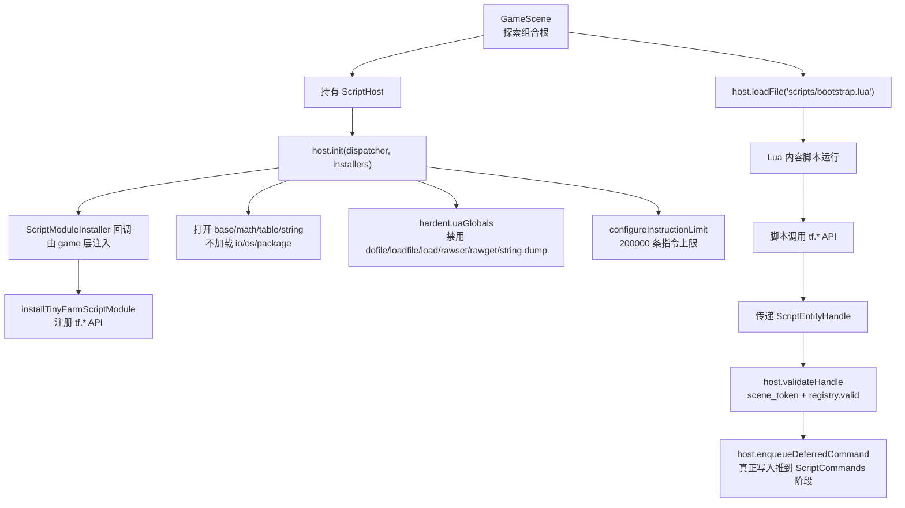
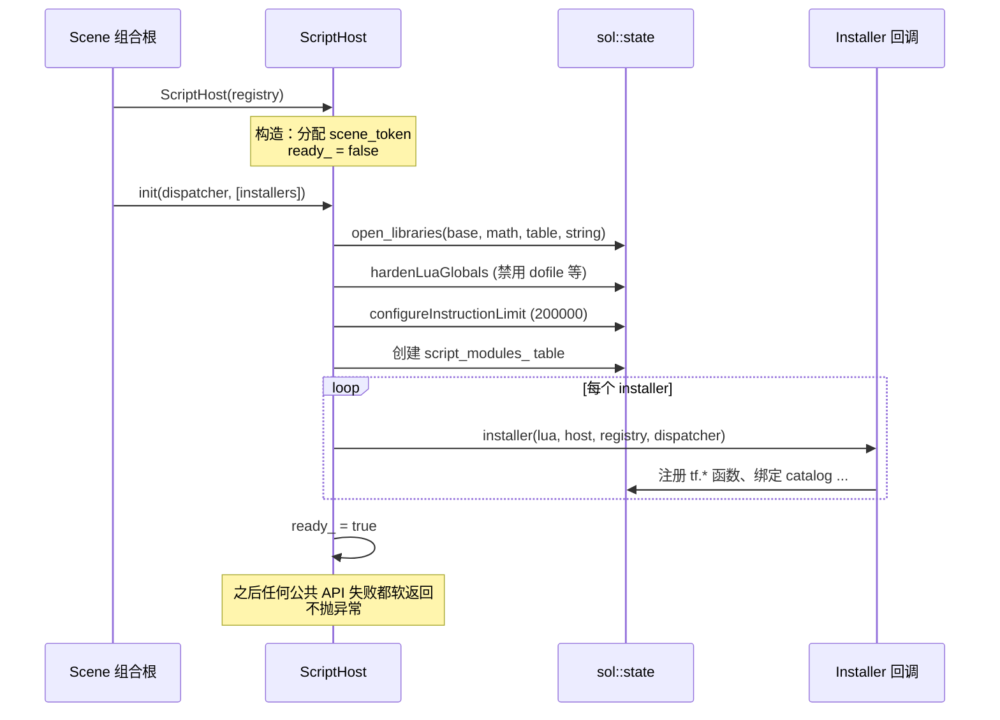
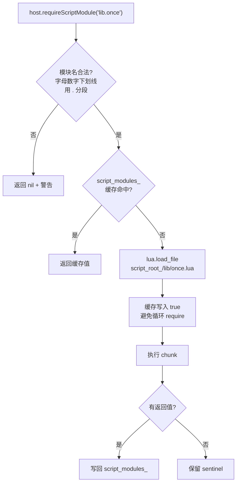
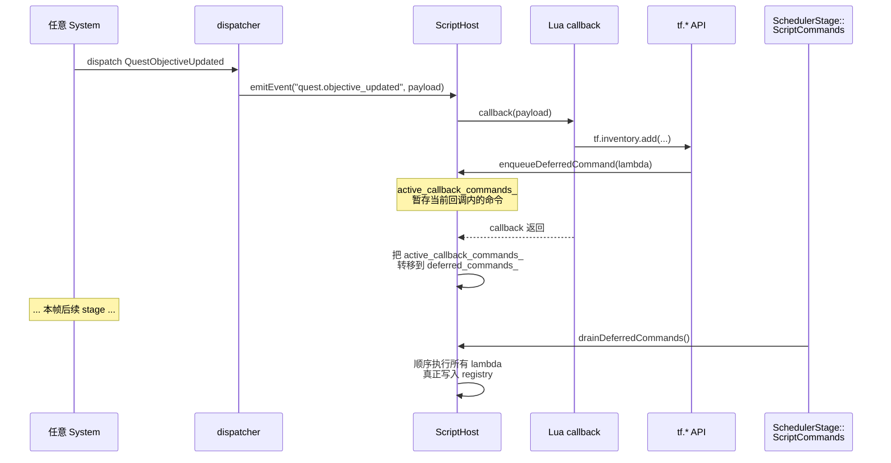
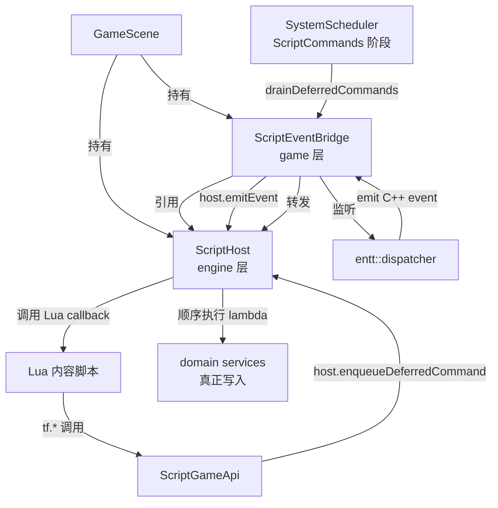

# ScriptHost — Lua 脚本宿主内核

> 用途：解释 `src/engine/script/` 这一层"做什么、为什么这样设计、如何被游戏层接入"。是 Lua 体系的**底层支柱**。
>
> 与现有 Lua 文档的分工：[Lua 内容编写指南](../tutorial/lua-content-authoring.md) 讲剧本侧怎么写脚本；[Lua 绑定教程](../tutorial/lua-binding-guide.md) 讲怎么往 Lua 注册 C++ 函数；**本篇讲承载这一切的引擎层宿主本身**。

## 它是什么

`engine::script::ScriptHost` 是一个**与游戏无关**的 Lua 宿主：

- 拥有一个 `sol::state`（即 Lua VM）的生命周期
- 提供"安装模块（绑定函数到 Lua）"、"执行脚本文件 / 字符串"、"句柄校验"、"事件回调"、"延迟命令"这些通用能力
- 不知道 `tf.quest`、`tf.shop` 是什么——这些由游戏层 `src/game/script/` 通过 **installer 回调** 注入



## 关键文件

`src/engine/script/` 共 7 个文件：

| 文件 | 内容 |
|------|------|
| `script_host.h` / `.cpp` | `ScriptHost` 类本体：sol::state 生命周期、init/shutdown、loadFile/exec/reload、句柄校验、事件、延迟命令 |
| `script_module.h` | `ScriptModuleInstaller` 类型别名（一个回调签名）。游戏层通过它注入 `tf.*` |
| `script_entity_handle.h` / `.cpp` | `ScriptEntityHandle`（entity + scene_token），含 `isNullHandle` / `toRawEntity` 辅助 |
| `script_binding_utils.h` / `.cpp` | `createReadOnlyProxy` — 给 Lua 暴露只读 catalog 时用的代理表工厂 |

> 注意：`src/engine/script/` 里**不包含任何 game 语义**。`tf.time`、`tf.quest`、`tf.party` 等 API 都在 `src/game/script/`（特别是 `tinyfarm_script_module.cpp` 和 `script_game_api.cpp`），由 game 层在 `host.init(dispatcher, {installer})` 时作为 installer 注入。

## 两阶段初始化



为什么拆两阶段？**构造时不知道有哪些 installer**：installer 列表由调用方（GameScene）按当前场景拼好后传入。这样 `ScriptHost` 自身可以在引擎层独立编译/测试，不依赖任何游戏模块。

构造时已经分配 `scene_token`，是为了让`makeHandle` 在 init 之前也能返回一致的 token（例如调试工具创建句柄）。

## Soft-failure 模式

所有公共方法在 `!ready_` 时通过 `ensureReady()` 早退并打 warn：

```cpp
// script_host.cpp ensureReady
if (ready_) return true;
spdlog::warn("ScriptHost: {} 被忽略，宿主未初始化", op_name);
return false;
```

意思是：**Lua 初始化失败也不会让游戏崩溃**——脚本相关的功能集体降级（NPC 默认对话、任务推进等仍可通过 C++ 系统兜底）。学生第一次接入 Lua 时如果 `bootstrap.lua` 有语法错误，应能看到一行 spdlog::error，但游戏仍可运行。

## 安全边界

引擎层主动收敛 Lua 能力，避免脚本误操作或主动作恶：

| 边界 | 实现 | 原因 |
|------|------|------|
| 不加载 `io` / `os` / `package` | `open_libraries(base, math, table, string)` | 内容脚本不该读写文件、不该 require 任意 OS 模块 |
| 禁用 `dofile` / `loadfile` / `load` | `hardenLuaGlobals()` 置 `lua_nil` | 内容脚本只能通过 `requireScriptModule` 走宿主控制的加载路径 |
| 禁用 `rawset` / `rawget` | 同上 | 防止绕过 `createReadOnlyProxy` 创建的只读 catalog 代理 |
| 禁用 `string.dump` | 同上 | 不暴露 Lua 字节码 |
| 指令上限 200000 | `lua_sethook(..., LUA_MASKCOUNT, 200000)` | 死循环 / 失控递归会被 `luaL_error` 强制中止 |

> 指令上限不只在 `loadFile` 时设置，每次 `exec` / `requireScriptModule` / `emitEvent` 都会 `configureInstructionLimit()` 一次。Lua 的 hook 会随 `pcall` 调用栈层级保持，但显式重置更稳。

## ScriptEntityHandle — 双层校验

Lua 脚本经常拿着实体引用做事：玩家、NPC、宝箱等。直接把 `entt::entity`（一个 32-bit id）暴露给脚本会有两个问题：

1. **跨场景误用**：玩家离开 GameScene 进战斗，旧的 entity id 在新 registry 上可能恰好命中另一个实体（典型 ABA）。
2. **同场景实体重建**：entity 被销毁后立即被复用，旧句柄看起来"还存活"。

`ScriptEntityHandle` 解决这两个问题：

```cpp
struct ScriptEntityHandle {
    entt::entity entity{entt::null};   // 含 version，已经能检测同 registry 内的 ABA
    std::uint64_t scene_token{0};      // ScriptHost 构造时分配，跨场景区分
};
```

`validateHandle` 三步校验：

```mermaid
flowchart LR
    H["ScriptEntityHandle"] --> R{ready?}
    R -->|否| F1["fail<br/>'宿主未初始化'"]
    R -->|是| N{isNullHandle?}
    N -->|是| F2["fail<br/>'空句柄'"]
    N -->|否| T{scene_token == host.scene_token_?}
    T -->|否| F3["fail<br/>'scene_token 不匹配'<br/>跨场景误用"]
    T -->|是| V{registry.valid(entity)?}
    V -->|否| F4["fail<br/>'entity 无效'<br/>同场景 ABA"]
    V -->|是| OK["out_entity = handle.entity<br/>return true"]
```

所有 `tf.*` API 接收 Lua 句柄时第一步都应该 `host.validateHandle(handle, out, "tf.xxx")`，失败立即 return 而不是继续访问 registry。

## 模块系统

Lua 内容脚本经常需要复用工具函数（如 `lib.once`、`lib.dialogue`）。`ScriptHost::requireScriptModule(name)` 提供轻量级的模块加载 + 缓存：



约定：
- `script_root_` 默认 `"scripts"`，可通过 `setScriptRoot` 修改（测试常用 `assets/tests/scripts`）。
- 模块名 `a.b.c` 映射到文件 `<root>/a/b/c.lua`。
- 模块名只允许字母数字下划线 + 点号分段，避免脚本路径穿越。
- 循环 require 时 sentinel `true` 保证至少返回非 nil，避免无限递归。

## 事件回调与延迟命令

ScriptHost 提供两条独立但相关的链路，让 Lua 既能"被动响应事件"也能"主动请求 C++ 写入"。

### 事件回调（Lua 监听 C++ 派发）

```cpp
host.registerEventCallback("battle.victory", callback);   // Lua 注册
host.emitEvent("battle.victory", payload_table);          // C++ 触发
```

`emitEvent` 内部用 `sol::protected_function`（即 `lua_pcall`）调 Lua，任何 Lua 异常被捕获为 `runResult` 的 false 值，记录 error 而不传播。

### 延迟命令（Lua 请求 C++ 写入）

为什么不让 Lua 直接调"加物品 / 完成任务"？因为：

- Lua 可能在 system tick 的中段调用，此时直接写入会破坏当前帧的不变量
- Lua 回调本身可能在 dispatcher 派发过程中被触发，递归派发事件会让顺序混乱

解决方案：所有"会改状态"的 `tf.*` API 把真正的写入打包成 lambda，调 `host.enqueueDeferredCommand(lambda)`，由专门的 `SchedulerStage::ScriptCommands` 阶段（见 [系统调度器](../game/system_scheduler.md)）在每帧固定位置统一排空。



关键细节：
- `active_callback_commands_` 是一个指向当前回调命令缓冲区的指针。`emitEvent` 内部对每个回调切换这个指针，确保每个回调的命令独立可观察。
- 如果回调嵌套（A 回调内 emit B 事件），通过保存 / 恢复 `previous_commands` 实现栈式合并。
- `isHandlingScriptCallback()` 返回 `active_callback_commands_ != nullptr`，game 层用它判断"现在是不是在 Lua 回调里"。

## 与游戏层的接缝

`src/game/script/` 三个关键文件接到引擎层 ScriptHost 上：

| 文件 | 角色 |
|------|------|
| `tinyfarm_script_module.{h,cpp}` | 提供 `installTinyFarmScriptModule(lua, host, registry, dispatcher, localization)`，作为 `ScriptModuleInstaller` 注入 `tf.script` / `tf.entity` / `tf.time` / `tf.event` / `tf.state` 等基础模块 |
| `script_game_api.{h,cpp}` | 提供 `tf.inventory` / `tf.quest` / `tf.party` / `tf.shop` / `tf.battle` / `tf.map` / `tf.command` / `tf.dialogue` 这些**需要 domain service 配合**的 API |
| `script_event_bridge.{h,cpp}` | 监听 C++ dispatcher 的关键事件并 `host.emitEvent` 转发给 Lua；同时持有 `host` 的引用，提供 `drainDeferredCommands` 给 `SchedulerStage::ScriptCommands` 调用 |



## 关键约束

1. **生命周期**：ScriptHost 持有 `entt::registry&`。`GameRuntimeServices` 中 ScriptHost 作为成员，必须**先于 registry 析构**（registry 由 Scene 持有）。
2. **跨场景**：进 BattleScene 等需要新 registry 的场景时，会构造新的 ScriptHost（新的 scene_token），旧句柄自动失效。
3. **不要直接持有 sol::object 跨帧**：ScriptHost 的 `script_modules_` 是 sol::table，在 `shutdown()` 时通过 `clearScriptRuntimeState` 清空。外部如果缓存 sol::object 跨场景，会导致悬空。
4. **指令上限保护通用调用**：但单条 C++ 函数被 Lua 调用时**不**受 hook 计数限制（hook 只在 Lua bytecode 执行时触发）。所以 game 层的 `tf.*` API 不能在 C++ 里写死循环。
5. **错误是软的**：脚本运行时错误经 `pcall` 捕获，记 `spdlog::error`，不抛 C++ 异常。所以日志里看到 `ScriptHost: 脚本执行失败` 不会立刻崩，但**必须**修。

## 推荐代码阅读路径

按这个顺序读 1 小时内能完整建立模型：

1. `src/engine/script/script_host.h` — 类签名一览。
2. `src/engine/script/script_host.cpp` 的 `init` / `hardenLuaGlobals` / `configureInstructionLimit` — 看安全边界。
3. `src/engine/script/script_entity_handle.h` + `script_host.cpp` 的 `validateHandle` — 看跨场景 / ABA 校验。
4. `src/engine/script/script_host.cpp` 的 `requireScriptModule` — 看模块缓存。
5. `src/engine/script/script_host.cpp` 的 `emitEvent` / `enqueueDeferredCommand` / `drainDeferredCommands` — 看事件 + 延迟命令链路。
6. `src/game/script/tinyfarm_script_module.cpp` — 看 game 层 installer 如何把 tf.* 注入到 host.
7. `src/game/script/script_event_bridge.cpp` — 看 dispatcher 事件如何桥接到 Lua、以及 `drainDeferredCommands` 在 `SchedulerStage::ScriptCommands` 的接入。

## 相关文档

- [Lua 内容编写指南](../tutorial/lua-content-authoring.md) — 剧本侧怎么写 `scripts/bootstrap.lua`、NPC / 任务 / 地图脚本
- [Lua 绑定教程](../tutorial/lua-binding-guide.md) — 怎么往 Lua 注册新的 `tf.xxx` API（具体绑定写法）
- [系统调度器](../game/system_scheduler.md) — `SchedulerStage::ScriptCommands` 阶段就是 ScriptHost 的延迟命令排空点
- [事件分发约定](events.md) — `entt::dispatcher` 与 ScriptHost 事件的差异
- [领域服务](../game/domain-services.md) — `tf.*` API 真正写入时调用的 domain service
