# VFX 系统与 Effekseer 集成

> 用途：说明引擎层 VFX 抽象架构、Effekseer 后端接入原理、双通道渲染管线集成方式，以及事件驱动播放链路。

---

## 1) 架构概览

VFX 系统采用三层分离设计：

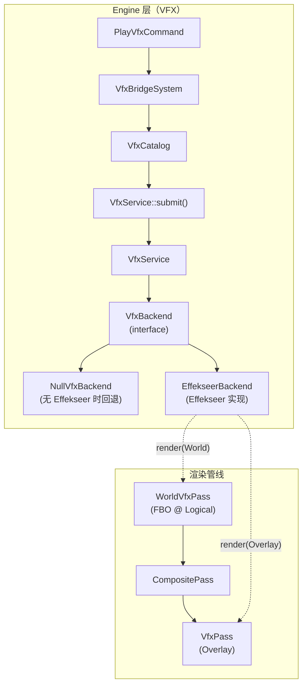

核心设计原则：
- **引擎层不依赖具体特效库**：`VfxBackend` 是纯抽象接口，Effekseer 头文件仅出现在 `effekseer_backend.h/.cpp` 中
- **编译开关隔离**：CMake `ENABLE_EFFEKSEER` 控制是否配置 / 链接 Effekseer，并通过 `TF_ENABLE_EFFEKSEER` 宏保护后端实现；关闭时仍保留 factory + `NullVfxBackend` 回退路径
- **游戏逻辑与渲染解耦**：游戏侧通过 `PlayVfxCommand` 事件触发，不直接操作渲染后端

### 类关系

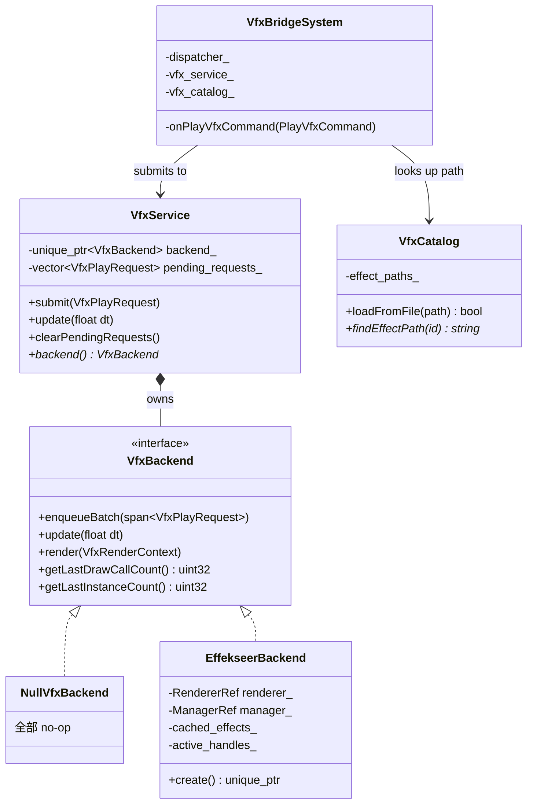

---

## 2) 核心数据类型

线索：`src/engine/vfx/vfx_types.h`

### VfxChannel

```cpp
enum class VfxChannel : std::uint8_t {
    World   = 0,   // 参与世界场景合成，走相机 VP；当前不参与 bloom
    Overlay = 1    // 合成之后直接画到屏幕，不受后处理影响
};
```

### VfxPlayRequest

播放一个特效所需的全部参数：

| 字段 | 说明 |
|---|---|
| `effect_id` | 特效标识（`entt::id_type`），用于缓存查找 |
| `effect_path` | `.efkefc` 文件路径，首次加载时使用 |
| `world_position` | 世界坐标（Y-down，与游戏一致） |
| `z` | Z 轴偏移（用于 3D 特效的深度） |
| `scale` | 缩放倍数 |
| `loop` | 循环标记（当前预留，不覆盖资源内设置） |
| `channel` | 渲染通道（World / Overlay） |

### VfxRenderContext

渲染时传入的上下文，每个通道构造不同的 context：

| 字段 | World 通道 | Overlay 通道 |
|---|---|---|
| `view_projection` | 相机 VP 矩阵 | 单位矩阵（屏幕空间） |
| `logical_size` | 逻辑分辨率 | 逻辑分辨率 |
| `viewport_pixels` | 逻辑分辨率区域 | letterbox viewport 区域 |
| `channel` | `VfxChannel::World` | `VfxChannel::Overlay` |

---

## 3) VfxBackend 抽象接口

线索：`src/engine/vfx/vfx_backend.h`

```cpp
class VfxBackend {
public:
    virtual void enqueueBatch(std::span<const VfxPlayRequest> requests) = 0;
    virtual void update(float delta_time_seconds) = 0;
    virtual void render(const VfxRenderContext& context) = 0;
    virtual std::uint32_t getLastDrawCallCount() const = 0;
    virtual std::uint32_t getLastInstanceCount() const = 0;
};
```

三个生命周期方法的调用时序：

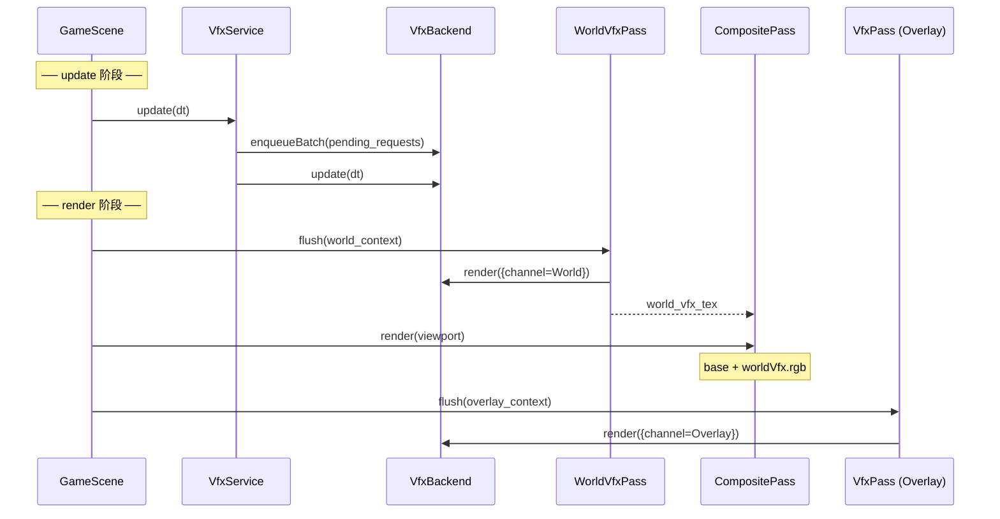

统计接口 `getLastDrawCallCount` / `getLastInstanceCount` 用于调试面板显示。

---

## 4) VfxService：请求队列与帧同步

线索：`src/engine/vfx/vfx_service.h/.cpp`

`VfxService` 是游戏逻辑与后端之间的中间层：

- **所有权**：持有 `std::unique_ptr<VfxBackend>`；构造时传入 `nullptr` 则自动回退到 `NullVfxBackend`
- **请求队列**：`submit()` 将请求暂存到 `pending_requests_`，不会立即执行
- **帧同步**：`update(dt)` 时一次性 flush 队列（`enqueueBatch`），然后推进后端模拟（`update`）

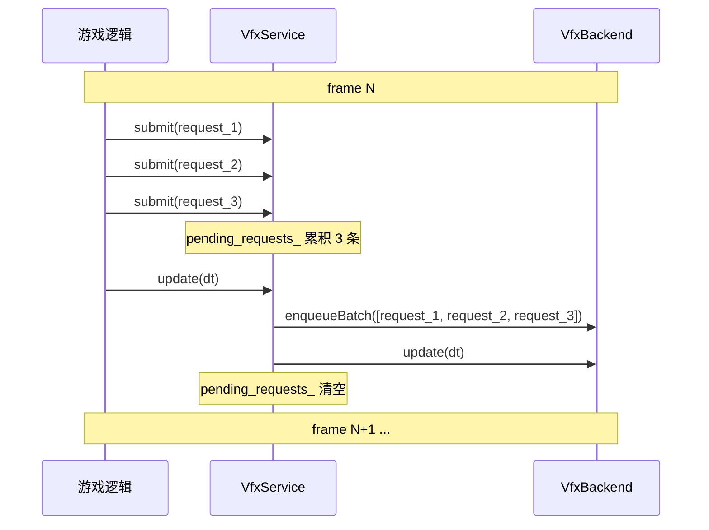

调用时机：`GameScene::update(dt)` 和 `BattleScene::update(dt)` 都会调用 `services_->vfx_service->update(dt)`。如果某个请求在本次 update 的 `VfxService::update()` 之前提交，它会同一次 update 被 flush；如果提交点已经在本次 flush 之后，则等下一次 update。

---

## 5) Effekseer 后端实现

线索：`src/engine/vfx/effekseer_backend.h/.cpp`

### 5.1 初始化

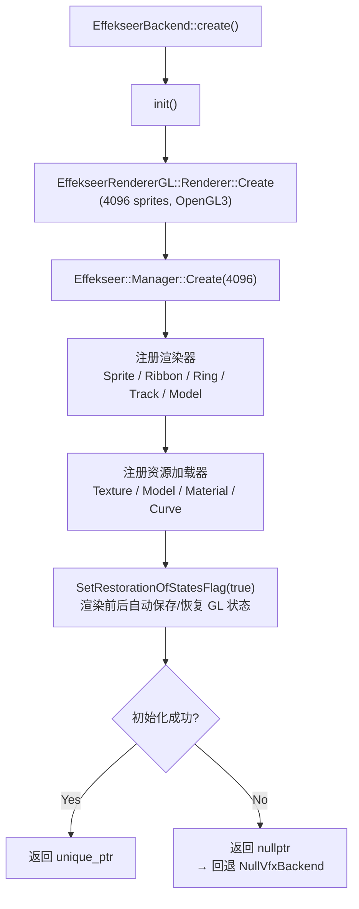

关键点：
- 最大粒子数 4096（`kMaxSpriteCount`），供渲染器和管理器共享
- `SetRestorationOfStatesFlag(true)`：Effekseer 在渲染前后自动保存/恢复 OpenGL 状态，避免干扰引擎其他 pass
- 使用工厂模式 `EffekseerBackendFactory`（`effekseer_backend_factory.h`）隔离 Effekseer 头文件，游戏层装配代码不需要 include Effekseer

### 5.2 坐标系适配

游戏使用 **Y-down** 坐标系（SDL/OpenGL 屏幕常规），Effekseer 编辑器使用 **Y-up** 坐标系。适配方式：


1. **播放位置 Y 翻转**：`manager_->Play(effect, x, -y, z)` — 直接取反 Y 坐标
2. **VP 矩阵 Y 翻转**：`toEffekseerViewProjection(vp)` 对 VP 矩阵右乘 `scale(1, -1, 1)`
3. **矩阵格式转换**：GLM 列主序 → Effekseer 行主序，通过 `toEffekseerMatrix()` 做数学转置

### 5.3 双通道路由（单 Manager 方案）

为了避免维护两个独立 Effekseer Manager 的开销，采用 **单 Manager + Layer** 的方案：

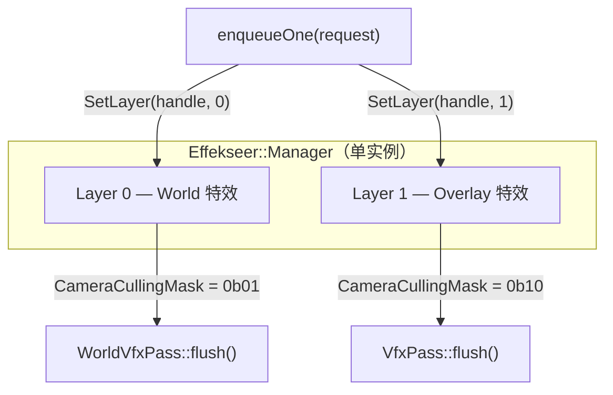

- **播放时**：`manager_->SetLayer(handle, layer)` — World 用 layer 0，Overlay 用 layer 1
- **渲染时**：`DrawParameter.CameraCullingMask = 1 << layer` — 每次 `render()` 只绘制目标通道的粒子

### 5.4 特效加载与缓存

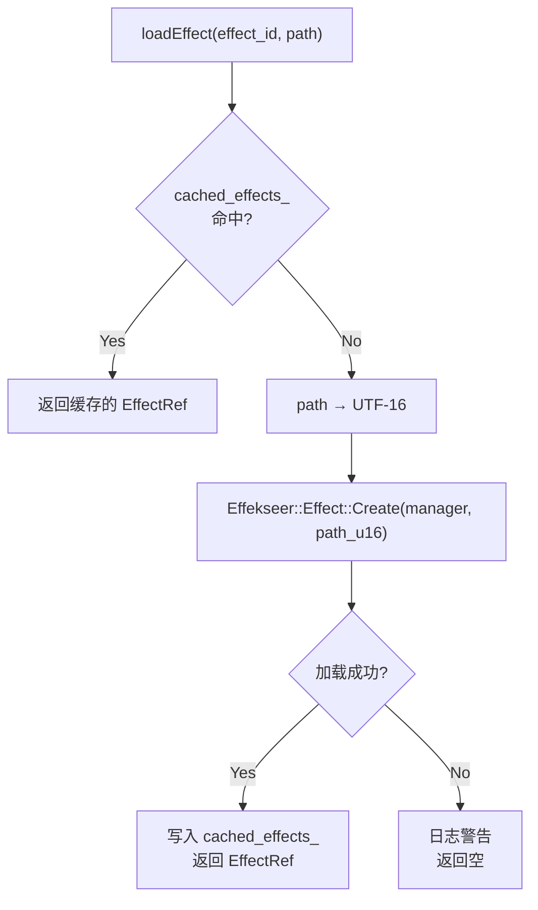

- `effect_id` 为 0（无效）时，自动对 `effect_path` 计算 `entt::hashed_string` 作为 key
- 文件路径通过 `std::filesystem::path::u16string()` 转为 UTF-16 传给 Effekseer API

### 5.5 帧同步

Effekseer 使用基于帧的时间推进（60fps 基准）：

```cpp
update_parameter.DeltaFrame = delta_time_seconds * 60.0f;
```

每次 `update` 后清理已结束的特效句柄：`std::erase_if(active_handles_, ...)`.

---

## 6) 渲染管线集成

### 6.1 完整 pass 顺序

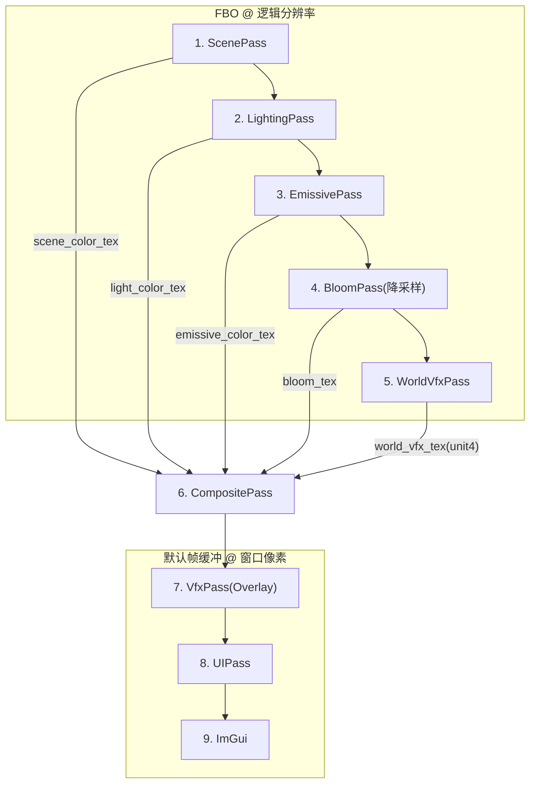

### 6.2 WorldVfxPass（世界通道）

线索：`src/engine/render/opengl/world_vfx_pass.h/.cpp`

- 拥有独立 FBO，颜色附件使用 `GL_RGBA8` + `GL_LINEAR` 过滤
- 每帧 `clear()` 时清除为透明黑 `(0,0,0,0)`
- `flush()` 时绑定 FBO，设置逻辑分辨率 viewport，启用混合后调用 `backend_->render()`
- 输出纹理 `color_tex_` 供 CompositePass 采样

混合函数配置：
```
RGB:   GL_SRC_ALPHA, GL_ONE_MINUS_SRC_ALPHA
Alpha: GL_ONE,       GL_ONE_MINUS_SRC_ALPHA
```

### 6.3 CompositePass 合成

线索：`assets/shaders/composite.frag`

World VFX 纹理绑定到 texture unit 4（`uWorldVfxTex`），使用**加色合成**：

```glsl
vec3 base = scene * light + emissive + bloom;
vec3 composed = clamp(base + worldVfx.rgb, vec3(0.0), vec3(1.0));
```

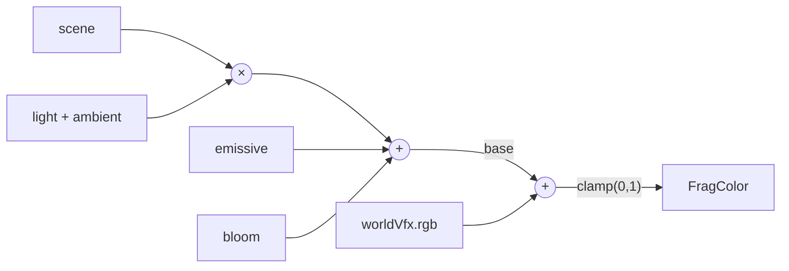

> 该策略适合 additive 类特效资源（火焰/光芒/能量波等）。alpha-blend 类资源应优先使用 Overlay 通道。

### 6.4 VfxPass（Overlay 通道）

线索：`src/engine/render/opengl/vfx_pass.h/.cpp`

- 直接绘制到默认帧缓冲（`glBindFramebuffer(GL_FRAMEBUFFER, 0)`）
- viewport 使用窗口像素空间的 letterbox 区域
- 在 CompositePass 之后、UIPass 之前执行
- 不受光照/bloom 影响，适合 UI 层特效（伤害数字闪光/技能图标光效等）

### 6.5 GLRenderer 中的连接

线索：`src/engine/render/opengl/gl_renderer.cpp`

- `initWorldVfxPass()`：创建 WorldVfxPass 并获取其颜色纹理句柄
- `initCompositePass()`：将 world vfx 纹理绑定到 CompositePass 的 `uWorldVfxTex`
- `setVfxBackend(backend)`：同时设置两个 pass 的后端指针
- `clear()`：每帧包含 `world_vfx_pass_->clear()`
- `present()`：为 World 和 Overlay 分别构造不同的 `VfxRenderContext` 并调用对应 pass
- `clean()`：清理并重置两个 pass

---

## 7) 事件驱动播放链路

### 7.1 PlayVfxCommand

线索：`src/engine/vfx/vfx_types.h`

```cpp
struct PlayVfxCommand {
    entt::id_type effect_id;
    glm::vec2 world_position;
    float z;
    float scale;
    bool loop;
    VfxChannel channel;    // 默认 Overlay
};
```

游戏逻辑通过 `entt::dispatcher` 触发此命令即可播放特效，不需要直接引用 VFX 模块。

### 7.2 VfxCatalog

线索：`src/engine/vfx/vfx_catalog.h/.cpp`、`assets/data/vfx_catalog.json`

从 JSON 加载特效 ID → 文件路径的映射：
```json
{ "effects": { "laser01": "assets/vfx/00_Basic/Laser01.efkefc" } }
```

键名通过 `entt::hashed_string` 哈希为 `entt::id_type`，查找 `O(1)`。

`loadFromFile()` 先解析到临时 `id -> path` map，确认 JSON shape 有效后才替换旧表；失败重载会保留既有映射，避免运行中把 catalog 清空。

### 7.3 VfxBridgeSystem

线索：`src/engine/vfx/vfx_bridge_system.h/.cpp`

连接 ECS 事件系统与 VFX 播放：

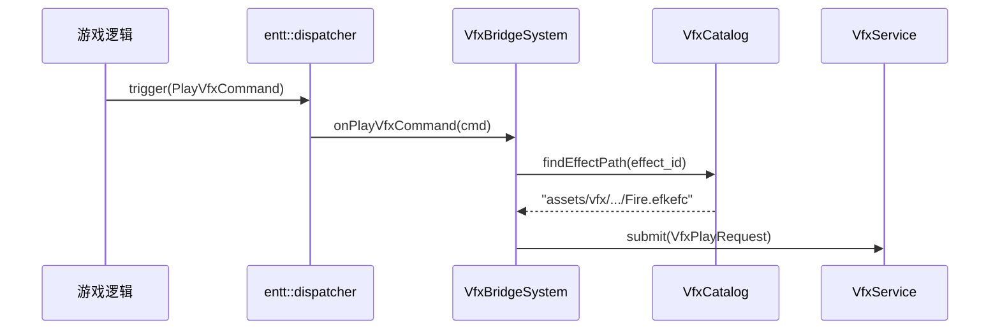

无效 effect_id 或 catalog 中未配置的特效会被安全忽略并记录警告日志。

当前 gameplay 内置触发点只有战斗表现层的 `TargetVfx` marker。调试面板会直接调用 `VfxService::submit()` 试播裸 `.efkefc` 文件，绕过 dispatcher / catalog；地图事件和 UI 复用 `PlayVfxCommand` 是开放扩展点，当前没有 Lua `tf.vfx` 绑定，也没有内置地图 / UI 发射点。

---

## 8) 一次特效播放的完整数据流

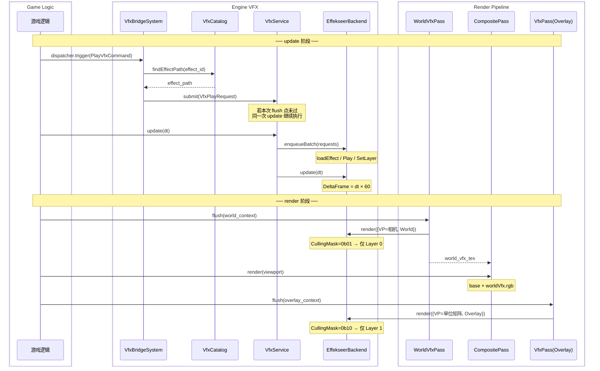

---

## 9) CMake 构建配置

### 编译开关

```cmake
option(ENABLE_EFFEKSEER "启用 Effekseer VFX 后端" ON)   # 默认开启
```

开启后：
- 调用 `cmake/EffekseerDependencies.cmake` 中的 `setup_effekseer_dependencies()`
- 为 `engine` 添加 PUBLIC `TF_ENABLE_EFFEKSEER` 编译定义，`game` 作为依赖方继承该定义
- 链接 `Effekseer` + `EffekseerRendererGL` 库
- 添加 Effekseer 头文件搜索路径
- 编译 `src/engine/vfx/effekseer_backend.cpp`

关闭后：
- 跳过 Effekseer 依赖配置、链接和头文件搜索路径
- 不编译 `effekseer_backend.cpp`
- 仍编译 `effekseer_backend_factory.cpp`，但 `createEffekseerBackend()` 返回 `nullptr`
- 运行时回退到 `NullVfxBackend`

### Effekseer 源码接入

线索：`cmake/EffekseerDependencies.cmake`

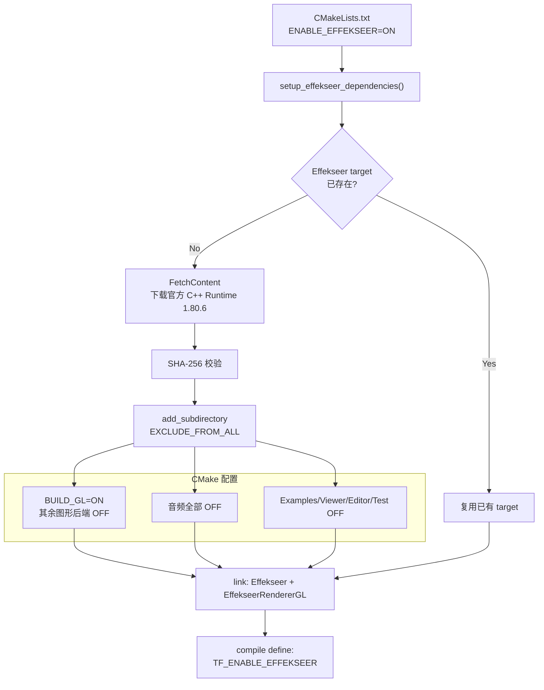

- 使用 Effekseer 官方 C++ Runtime 发布包（版本 1.80.6，tag `1806`）
- 下载 URL 与 SHA-256 固定在 `cmake/EffekseerDependencies.cmake`，校验失败时配置立即终止
- 源码解压和构建位于构建目录的 `_deps` 下，不写入仓库的 `external/` 目录
- macOS 上保存/恢复 `CMAKE_OSX_DEPLOYMENT_TARGET` 避免被 Effekseer CMake 覆盖

---

## 10) 调试与测试

### 调试面板

线索：`src/engine/debug/panels/vfx_debug_panel.h/.cpp`

运行时按 `F5` → `Engine Debug Panels` → `VFX` 面板，可以：
- 查看服务/后端状态
- 浏览 `assets/vfx/` 下所有 `.efkefc` 文件
- 选择通道（World/Overlay）、位置、缩放等参数
- 单次/批量/自动定时触发特效
- 查看统计：pending 请求数、draw calls、实例数、各 pass 分通道统计

### 测试覆盖

| 测试文件 | 覆盖内容 |
|---|---|
| `tests/engine/vfx/vfx_service_test.cpp` | VfxService 队列/flush/null 回退 |
| `tests/engine/render/vfx_pipeline_stage_test.cpp` | pass 顺序、present 执行序、clean/setBackend 委派 |
| `tests/engine/render/vfx_dual_channel_pipeline_test.cpp` | 双通道 FBO 清除、CompositePass 纹理绑定 |
| `tests/engine/vfx/vfx_bridge_system_test.cpp` | 命令→catalog→service 端到端、缺失 effect_id、null catalog、catalog 失败重载保留旧表 |
| `tests/engine/vfx/vfx_optional_backend_source_test.cpp` | Effekseer 可选构建开关、factory disabled fallback 源码护栏 |
| `tests/shared/recording_vfx_backend.h` | 测试替身，记录所有后端调用供断言 |

### Visual Tester

线索：`tools/visual_tester/visual_test_cases.h/.cpp`

`EffekseerVfxVisualTest` 提供独立于游戏运行时的交互式特效测试环境。

---

## 11) 已知限制与未来方向

1. **World 通道使用加色合成**：适合 additive 类资源（火焰/光芒），alpha-blend 类资源建议走 Overlay 通道。未来可升级为预乘 alpha over 合成。
2. **World VFX 不参与 Bloom**：World VFX FBO 在 Bloom pass 之后渲染，其内容不会被泛光处理。如需世界特效参与泛光，需让 bloom 链路采样 world-vfx 纹理。
3. **Loop 参数当前为预留**：`VfxPlayRequest.loop` 不覆盖 Effekseer 资源内的生命周期配置。
4. **音频未接入**：Effekseer 的音频后端全部关闭，特效音效需通过游戏自身音频系统处理。
