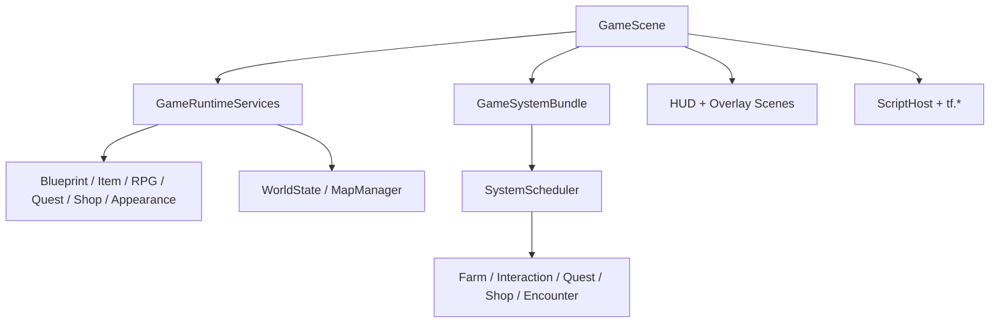

# Game 文档索引

`src/game` 在 engine 基础设施上组合 TinyFarmRPG 的具体玩法。这里的文档重点解释 GameScene、地图、世界状态、系统调度、交互、农场、背包、存档和运行时装配。

## 推荐顺序

1. [GameScene](game_scene.md)
2. [系统调度器](system_scheduler.md)
3. [运行时装配](runtime-assembly.md)
4. [数据 Catalog 总览](data-catalogs.md)
5. [地图数据管线](map_data_pipeline.md)
6. [MapManager](map_manager.md)
7. [WorldState](world_state.md)
8. [交互与对话](interaction_and_dialogue.md)
9. [背包与快捷栏](inventory_hotbar.md)
10. [存档与流程](save_and_flow.md)

## 文档地图

| 文档 | 适合什么时候读 |
|------|----------------|
| [game_scene.md](game_scene.md) | 想知道探索主场景如何装配服务、系统、UI、Lua |
| [runtime-assembly.md](runtime-assembly.md) | 查 GameRuntimeServices、GameSystemBundle、catalog/service/system 装配 |
| [data-catalogs.md](data-catalogs.md) | 查 `assets/data`、RPG manifest、catalog 加载和引用校验 |
| [system_scheduler.md](system_scheduler.md) | 想知道 gameplay systems 的固定步顺序与并行调度边界 |
| [player_control.md](player_control.md) | 查移动输入、目标格、相机跟随 |
| [map_data_pipeline.md](map_data_pipeline.md) | 新增 Tiled object、NPC、商人、任务、招募、战斗、脚本区域时 |
| [map_manager.md](map_manager.md) | 查切图事务、异步预加载、快照恢复、离线推进 |
| [world_state.md](world_state.md) | 查 world 文件、地图图谱、地图持久状态 |
| [async_preload_pipeline.md](async_preload_pipeline.md) | 查地图预加载状态机和 worker/main thread 分工 |
| [interaction_and_dialogue.md](interaction_and_dialogue.md) | 查交互优先级、Dialogue channel、Lua 独占交互 |
| [farm_loop.md](farm_loop.md) | 查锄地、播种、浇水、收获、库存闭环 |
| [inventory_hotbar.md](inventory_hotbar.md) | 查背包、快捷栏绑定、拖拽和同步 |
| [ui-scenes.md](ui-scenes.md) | 查 RmlUi Scene、Inventory tabs、generated images |
| [localization.md](localization.md) | 查 `assets/i18n`、RML 本地化、语言切换 |
| [blueprints.md](blueprints.md) | 查 actor/animal/crop 蓝图配置 |
| [time_and_lighting.md](time_and_lighting.md) | 查 GameTime、DayNight、LightSystem 和 emissive 可见性 |
| [save_and_flow.md](save_and_flow.md) | 查 SaveService、SaveData、schema、Scene 流程 |

## 运行时关系

