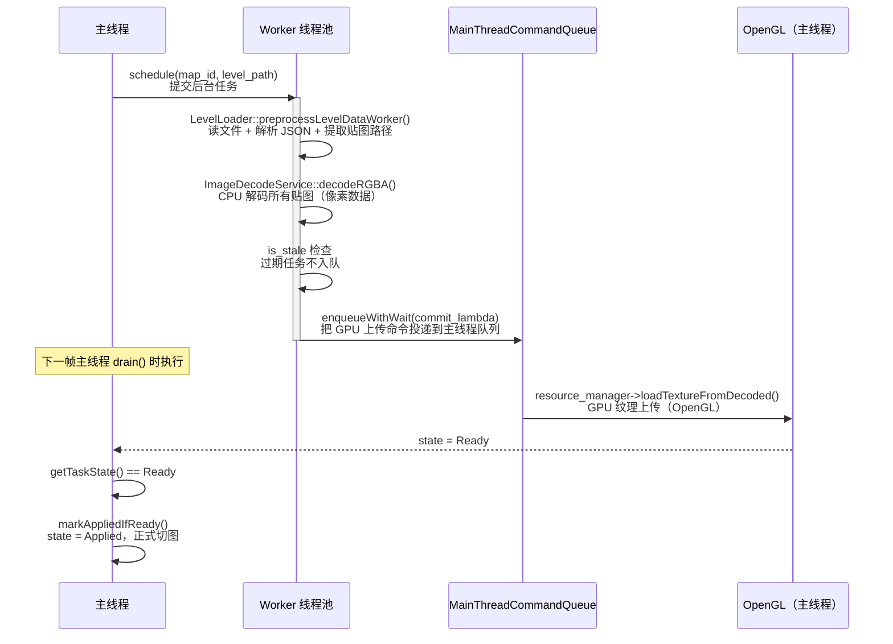
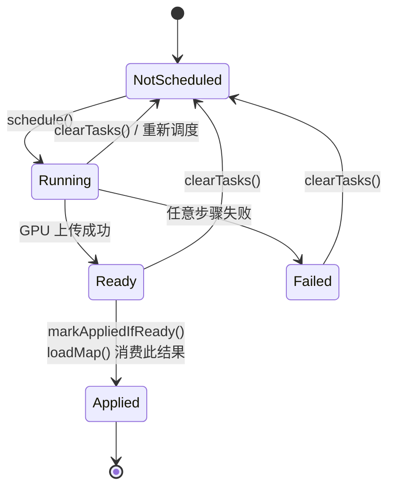
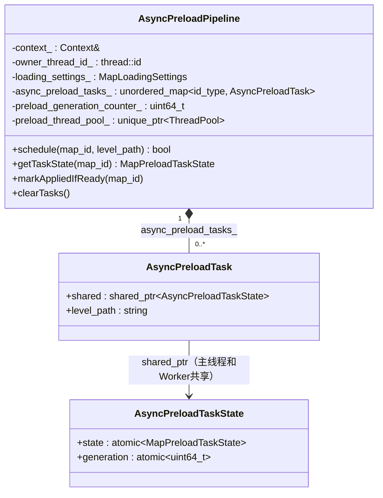
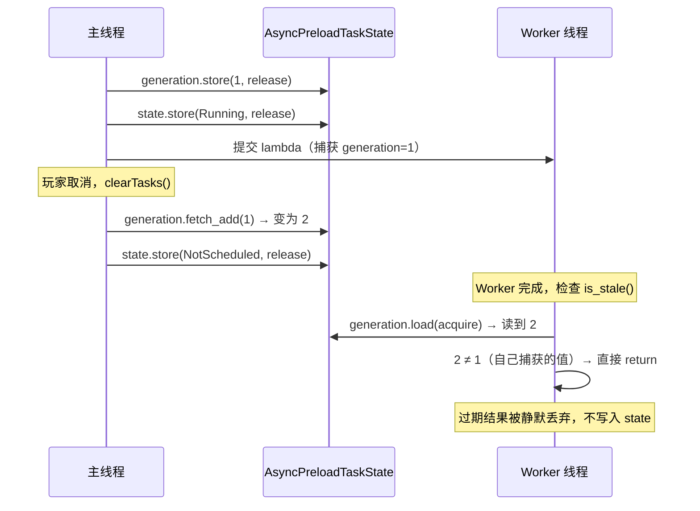
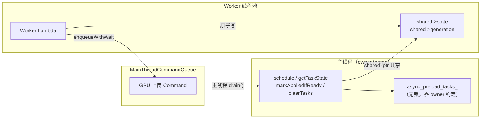
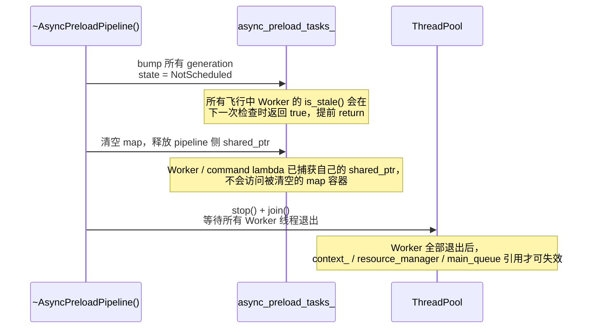

# AsyncPreloadPipeline：异步地图预加载流水线

> **核心目标**：在玩家切换地图之前，提前在后台完成 I/O 与 CPU 解码，让实际切图时的延迟接近于零。

---

## 1. 为什么需要它？

切换地图主要包含三类耗时操作：

| 操作 | 耗时原因 | 能否在后台线程完成？ |
|------|----------|---------------------|
| 文件 I/O + JSON 解析 | 磁盘读取与大量字符串处理 | ✅ 可以 |
| 图像解码（CPU）| 像素格式转换，纯内存密集 | ✅ 可以 |
| GPU 纹理上传 | 需要持有 OpenGL Context | ❌ 必须主线程 |

如果把这些操作全放在切图时同步执行，玩家会感受到明显的冻帧卡顿。`AsyncPreloadPipeline` 的思路是：**把前两步提前到后台做，第三步压缩到主线程的最短窗口内完成**。

---

## 2. 整体架构：两段式流水线

---

## 3. 任务状态机

| 状态 | 含义 |
|------|------|
| `NotScheduled` | 未调度，或已被 clearTasks() 重置 |
| `Running` | Worker 执行中，或 GPU 上传命令已入队但未执行完 |
| `Ready` | GPU 纹理上传完毕，可以安全切图 |
| `Failed` | I/O、解码或 GPU 上传任意一步失败 |
| `Applied` | loadMap() 已消费结果，地图已切换 |

---

## 4. 关键数据结构

`AsyncPreloadTaskState` 通过 `shared_ptr` 跨线程共享，但**主线程的 map 容器本身不加锁**——依赖"所有公共 API 必须在 owner thread 调用"的契约来保证安全。

---

## 5. Generation 版本号：防止过期结果污染

这是整个设计中最关键的安全机制。

**问题场景**：
- t=0：调度地图 A（generation=1）
- t=1：玩家取消，clearTasks()（generation bump 到 2，状态重置为 NotScheduled）
- t=2：Worker 完成，尝试写入 state=Ready —— **这会污染新状态！**

**Generation 的解法**：

Worker lambda 捕获的 `generation` 值是**值拷贝**，与当前 `shared->generation` 比对，不一致则静默退出。当前实现会在预处理后、每张贴图解码前、解码循环结束且准备入队前，以及主线程 command 执行前后检查 generation；过期 worker 不会再把无效 command 塞进主线程队列。

---

## 6. 线程安全设计总览

| 机制 | 保护的内容 |
|------|-----------|
| `ensureOwnerThread()` | 保证 `async_preload_tasks_` 的增删改只在主线程发生，无需加锁 |
| `std::atomic<state>` | Worker 写 / 主线程读，无锁状态同步 |
| `std::atomic<generation>` | 防止 ABA 问题，过期 worker 结果自动失效 |
| `shared_ptr<AsyncPreloadTaskState>` | 即使主线程 `clearTasks()` 删掉了 map 条目，Worker 的 shared_ptr 仍持有控制块，generation 不匹配后安全退出 |

---

## 7. 析构安全顺序

**顺序约束**：必须先 bump generation，让飞行中的 worker 尽快短路；之后必须在 `Context` 子系统析构前 stop + join workers。pipeline 侧 map 条目可以在 join 前清空，因为 worker / command lambda 持有自己的 `shared_ptr<AsyncPreloadTaskState>`；真正不能提前销毁的是 worker 捕获的 `resource_manager` 与 `main_thread_queue` 所属的 `Context` 子系统。

---

## 8. 配置入口

配置文件：`assets/data/map_loading_config.json`

| 字段 | 含义 | 默认影响 |
|------|------|---------|
| `preload.mode` | 预热策略：`off` / `neighbors` / `all` | 默认资产为 `all`，启动装配会预热全部已知地图 |
| `preload.async_enabled` | 是否启用异步预加载 | false → 不创建 ThreadPool，降级同步预热 |
| `preload.async_worker_count` | Worker 线程数 | 通常 1 即可（I/O 密集，且 `stb_image` 仍有全局锁） |
| `preload.async_queue_capacity` | 任务队列容量 | 防止无限堆积 |
| `preload.async_submit_wait_ms` | submit 入队超时（ms）| 队满时等待上限 |
| `preload.async_command_wait_ms` | 主线程 Command 入队超时（ms）| MQ 满时等待上限 |
| `preload.async_wait_budget_ms` | `loadMap` 等待异步结果的预算（ms） | 只轮询状态，不直接 drain 主线程命令队列 |
| `log_timings` | 打印各阶段计时 | 用于性能调优 |

配置读取由 [`MapLoadingSettings::loadFromFile`](../../src/game/world/map_loading_settings.cpp) 完成：它使用无异常 JSON parse 和 typed helper，坏 JSON / 类型不符保留默认值，超大无符号字段先 clamp 再转换。启动装配入口：[runtime_service_factory.cpp](../../src/game/runtime/runtime_service_factory.cpp) → `initMapManager()`；当 `preload.mode == all` 时会调用 `MapManager::preloadAllMaps()`。

---

## 9. 常见排错

### 预加载状态一直 Running，没有变成 Ready
- 检查主线程的 `MainThreadCommandQueue::drain()` 是否被调用（每帧必须 drain）
- 开启 `log_timings` 查看 Worker 是否真的执行完了（有无 "worker done" 日志）
- 注意 `MapManager::waitForAsyncPreloadReady()` 只轮询状态，不会直接 drain；如果同一帧才 schedule 又立刻 load，很可能超时降级同步。预热应提前几帧发生。

### 状态变成 Failed
- 查看 `spdlog::warn` 日志：`preprocess failed` / `worker decode failed` / `main-thread upload failed`
- 确认地图文件路径正确，纹理路径与 `.tsj` 中一致

### clearTasks() 后新调度的地图状态不对
- 确认 `schedule()` 成功返回 `true`（返回 `false` 说明 ThreadPool 未创建或提交失败）
- 检查 `preload.async_enabled` 是否为 `true`

### 启动后没有看到全量预热
- 检查 `assets/data/map_loading_config.json` 的 `preload.mode` 是否仍为 `all`
- 跑 `MapLoadingSettingsTest.LoadsCheckedDefaultsFromRuntimeAssetConfig`，确认默认资产配置没有漂移
