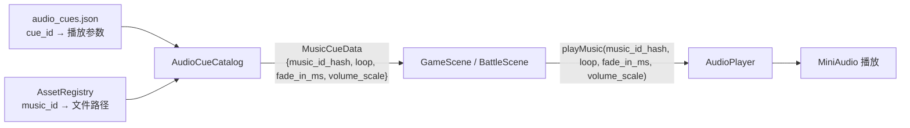
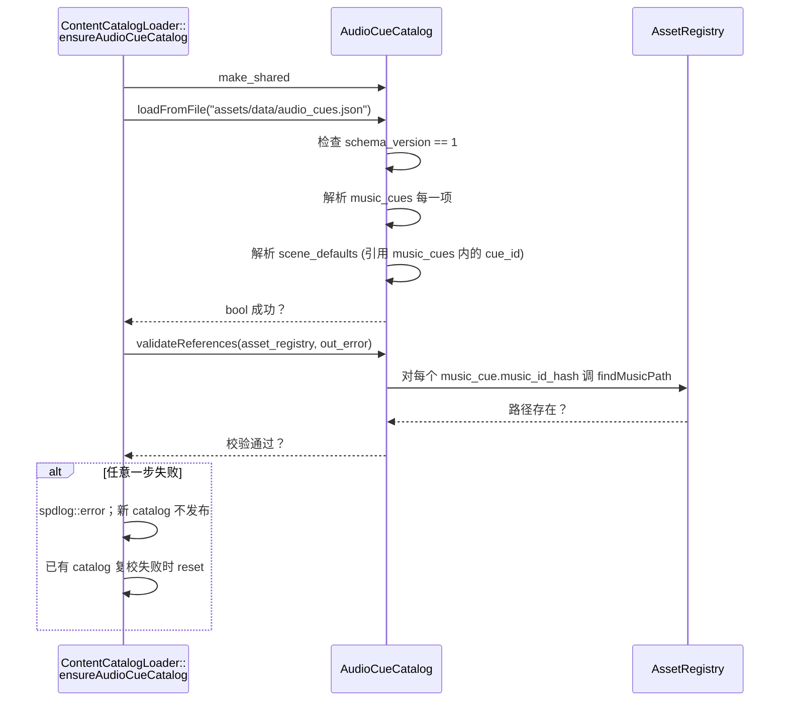
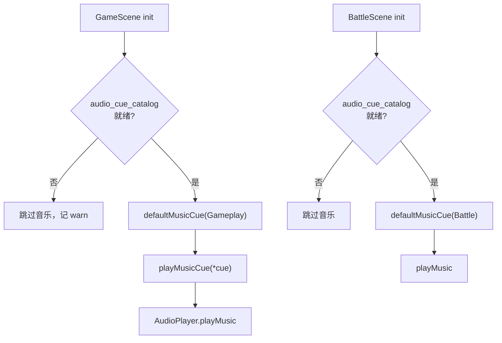
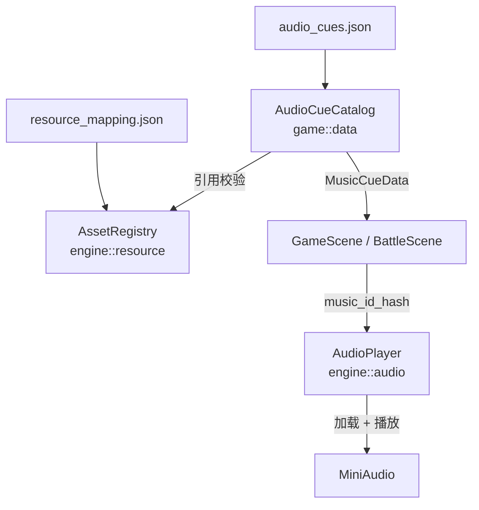

# AudioCueCatalog — 数据驱动音频

> 用途：解释"为什么 TinyFarmRPG 不直接调 `playMusic("battle.ogg")`，而要中间夹一层 cue catalog"。是课程 L09 的核心阅读材料。
>
> 与 [engine/audio_system.md](../engine/audio_system.md) 的分工：底层 `engine::audio::AudioPlayer` 负责"按 music_id 真的播放一段音频"，本篇讲游戏层把"播放策略 / 默认值 / 引用校验"独立到 `AudioCueCatalog` 这一层。

## 一、动机

如果直接在 game scene 里写 `audio_player.playMusic(hash("battle.ogg"), true, 250)`：

- **硬编码**：换音乐要改代码
- **拷贝**：进战斗、进暂停、调试器里都要写一份
- **难校验**：引用了不存在的 music_id 时只能在运行时听见安静
- **难调试**：策划想试 `volume_scale = 0.6F` 要改代码 + 重编译

`AudioCueCatalog` 在 engine 层 `AudioPlayer` 之上加了一层**命名 + 默认值表**：



关键边界：
- **engine 层只懂 music_id**（一个 `entt::id_type` hash，最终映射到 `assets/audio/*.ogg`）
- **game 层用 cue_id**（"cue.music.battle.default" 等业务命名），cue → music + 播放参数的映射在 catalog 里
- **scene_defaults** 让 game scene 不必硬编码 cue_id：直接问 catalog 要"探索默认音乐"或"战斗默认音乐"

## 二、源文件

| 文件 | 内容 |
|------|------|
| `src/game/data/audio_cue_catalog.h` | `MusicCueData` POD + `AudioCueCatalog` 类签名 |
| `src/game/data/audio_cue_catalog.cpp` | JSON 解析 + 引用校验 + 查询实现 |
| `src/game/runtime/content_catalog_loader.cpp` 的 `ensureAudioCueCatalog` | 加载 + AssetRegistry 引用校验入口 |
| `src/game/runtime/game_content_manifest.h` | `GameContentManifest::AudioCues = "assets/data/audio_cues.json"` |
| `assets/data/audio_cues.json` | 数据文件（schema_version=1） |
| `src/game/scene/game_scene.cpp` | 调用 `defaultMusicCue` / `playMusicCue` |
| `src/engine/audio/audio_player.h` | `playMusic(music_id, loop, fade_in_ms, volume_scale)` 底层接口 |

## 三、JSON Schema

`assets/data/audio_cues.json` 当前样例：

```json
{
    "schema_version": 1,
    "music_cues": {
        "cue.music.gameplay.default": {
            "music_id": "scene-bg-music",
            "loop": true,
            "fade_in_ms": 200,
            "volume_scale": 1.0
        },
        "cue.music.battle.default": {
            "music_id": "music.battle.boss_2",
            "loop": true,
            "fade_in_ms": 250,
            "volume_scale": 1.0
        }
    },
    "sfx_cues": {},
    "scene_defaults": {
        "gameplay": "cue.music.gameplay.default",
        "battle":   "cue.music.battle.default"
    }
}
```

### 顶层字段

| 字段 | 必填 | 含义 |
|------|------|------|
| `schema_version` | 是 | 必须等于 `1`（`kSupportedSchemaVersion`）。未来 schema 变化会强制升级 |
| `music_cues` | 是 | 非空 object，键是 cue_id，值是 cue 配置对象 |
| `sfx_cues` | 否 | object（可为空）；当前**仅占位**，加载时只校验类型，不解析内容 |
| `scene_defaults` | 是 | object，必须包含 `gameplay` 与 `battle` 两个 cue_id 字符串 |

### Music cue 字段

| 字段 | 必填 | 类型 | 含义 |
|------|------|------|------|
| `music_id` | 是 | string | 在 `resource_mapping.json`（AssetRegistry）注册的音乐 id |
| `loop` | 否（默认 true） | boolean | 是否循环播放 |
| `fade_in_ms` | 否（默认 0） | int >= 0 | 起播淡入时长 |
| `volume_scale` | 否（默认 1.0） | float ∈ [0, 1] | 音量缩放，叠加在全局音乐音量之上 |

### cue_id 命名约定

代码里没强制，但项目惯例：

```
cue.<category>.<context>.<variant>
```

例：`cue.music.gameplay.default`、`cue.music.battle.default`、`cue.music.town.morning`。这种点号分段方便日后做"cue_id 树状浏览"调试面板。

ID 通过 `AudioCueCatalog::hashId`（即 `entt::hashed_string`）算 hash，**重复 hash 不被允许**（加载时检查，重复直接拒载）。

## 四、加载与引用校验

加载链路：



两层校验的目的：

1. `loadFromFile` 内部校验：cue 之间的引用（`scene_defaults` 引用的 cue_id 必须在 `music_cues` 里）。
2. `validateReferences` 外部校验：cue 引用的 `music_id` 必须在 AssetRegistry 中存在（即 `resource_mapping.json` 注册过）。

> 第二层校验放在 catalog **加载完之后** 单独执行，是因为 catalog 本身可以独立单元测试（不依赖 AssetRegistry）。

加载失败的兜底：新 catalog 不会发布到 `GameRuntimeServices`；如果已有 catalog 后续复校失败，则会 reset 为空指针。游戏仍能跑，但 `GameScene::resolveAndPlayGameplayMusic` 等会早退（"无 catalog → 不播放音乐"），便于通过日志直接定位问题。

## 五、运行时使用

`GameRuntimeServices::audio_cue_catalog` 是 `std::shared_ptr<AudioCueCatalog>`。常见调用形态：

```cpp
// 由 default cue 启动音乐
if (services_ && services_->audio_cue_catalog) {
    const auto* cue = services_->audio_cue_catalog->defaultMusicCue(SceneAudioContext::Gameplay);
    if (cue) {
        playMusicCue(*cue);
    }
}

// GameScene::playMusicCue
context_.getAudioPlayer().playMusic(
    cue.music_id_hash_, cue.loop_, cue.fade_in_ms_, cue.volume_scale_);
```

进入战斗时同样的模式，只是把 `Gameplay` 换成 `Battle`。具体的"什么时候切换"是 scene 流程的事情（见 [GameScene](game_scene.md)），catalog 不知道有"战斗"这种概念，只提供"按上下文取默认 cue"的能力。



## 六、查询 API

| 方法 | 用途 |
|------|------|
| `findMusicCue(entt::id_type)` / `findMusicCue(std::string_view)` | 按 hash 或字符串 id 查 cue；找不到返回 `nullptr` |
| `defaultMusicCue(SceneAudioContext)` | 按 `Gameplay` / `Battle` 取场景默认 cue |
| `listMusicCues()` | 列出所有 cue（按 id_ 字典序排序），供调试 UI 浏览 |
| `schemaVersion()` | 已加载文件的 schema_version，调试展示用 |

注意：所有查询返回的是 `const MusicCueData*`，调用方**不能**改写 cue 数据。

## 七、新增 / 修改 cue 的步骤

> 场景：你要给"夜晚的村庄"加一段单独的 BGM。

1. **登记 music 资源**：在 `assets/textures/resource_mapping.json` 或 `assets/audio/audio_mapping.json`（看实际 AssetRegistry 加载点）登记 `music_id` → 文件路径。
2. **加 cue**：编辑 `assets/data/audio_cues.json`：
    ```json
    "music_cues": {
        "cue.music.town.night": {
            "music_id": "music.town.night",
            "loop": true,
            "fade_in_ms": 500,
            "volume_scale": 0.7
        }
    }
    ```
3. **决定触发方式**：
   - 如果是"夜晚整张图换 BGM"，可以在 `LightToggleSystem` / `DayNightSystem` 里按时段调 `findMusicCue("cue.music.town.night")` 然后 `playMusicCue`
   - 如果是脚本剧情触发，可以在 Lua 内容脚本里通过 `tf.audio` 系列 API（如有）调用
   - 如果它应该是某个 scene 的默认，更新 `scene_defaults`
4. **重新启动游戏**：catalog 在 `GameRuntimeServices` 初始化时加载一次，不支持运行时热重载（可作为后续工程化改进项）。
5. **如果加载失败**：看 spdlog 输出，常见原因是 `music_id` 未在 AssetRegistry 注册（reference 校验失败）或 schema_version 写错。

## 八、设计要点

1. **catalog 和资源注册解耦**：catalog 只引用 `music_id` 字符串，不知道文件路径。AssetRegistry 决定 `music.battle.boss_2` 真正映射到哪个 `.ogg`，便于做"开发用低质量音频 / 发布用 OGG/MP3"切换。
2. **shared_ptr**：catalog 是只读资源，多处可同时持有（GameScene、BattleScene、调试面板）。
3. **失败优雅降级**：catalog 加载失败 → 重置为空指针；调用方都做 `if (catalog)` 检查；游戏可以静音继续跑。
4. **场景默认值集中在 JSON**：避免把"探索 / 战斗用哪段音乐"散落在多个 C++ 文件里。
5. **sfx_cues 占位**：当前 schema 接受 `sfx_cues` 但不解析内容。后续如需"播放音效"也走 cue 化（例如 cue.sfx.ui.confirm），按同样模式扩展，不必再改 schema_version。

## 九、与音频系统的关系



- catalog 和 AudioPlayer **不直接交互**，只通过 `MusicCueData` 转手数据。
- catalog 的"引用校验"步骤是把 `music_id_hash` 拿到 AssetRegistry 查路径，确认音频文件已经登记；校验通过不等于文件存在（那是 AssetRegistry 自己的事）。

## 十、推荐代码阅读路径

按这个顺序 20 分钟读完：

1. `assets/data/audio_cues.json` — 看真实数据形态。
2. `src/game/data/audio_cue_catalog.h` — 看类签名（`MusicCueData` + `AudioCueCatalog`）。
3. `src/game/data/audio_cue_catalog.cpp` 的 `loadFromFile` 与 `validateReferences` — 看加载与校验。
4. `src/game/runtime/content_catalog_loader.cpp` 的 `ensureAudioCueCatalog` — 看 catalog 在 service 装配里的位置。
5. `src/game/scene/game_scene.cpp` 的 `playMusicCue` / `defaultMusicCue` 调用处 — 看运行时使用。
6. `src/engine/audio/audio_player.h` 的 `playMusic` — 看底层播放接口（差异：底层只接 music_id 不接 cue_id）。

## 相关文档

- [音频系统](../engine/audio_system.md) — `engine::audio::AudioPlayer` / `AudioManager` 底层接口
- [资源系统](../engine/resources.md) — AssetRegistry 与 `resource_mapping.json` 的 music_id 注册
- [运行时装配](runtime-assembly.md) — `ContentCatalogLoader::ensureAudioCueCatalog` 在装配中的位置
- [数据 Catalog 总览](data-catalogs.md) — 项目内多个数据 catalog 的全景
- [GameScene](game_scene.md) — 场景如何切换音乐
