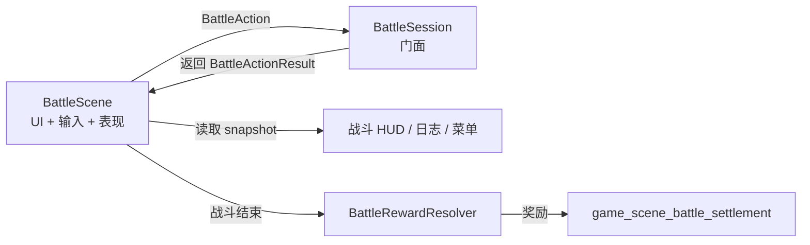
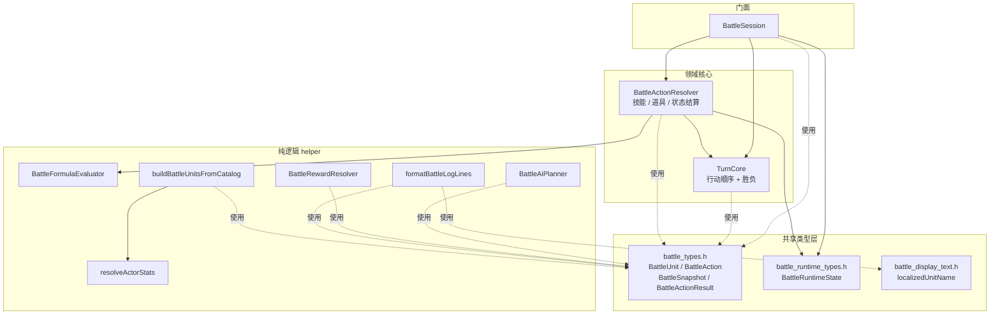
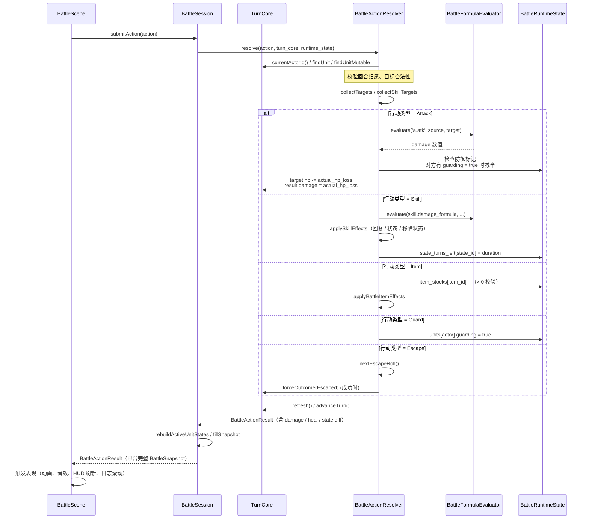
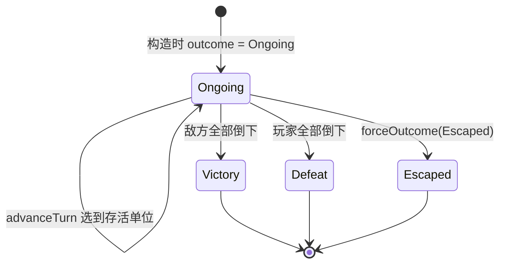
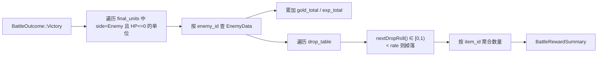
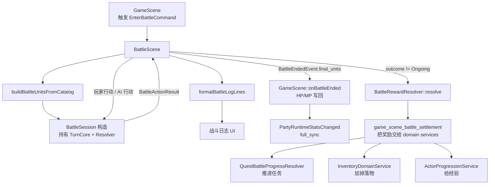

# 战斗系统内部（Battle Internals）

> 用途：解释 `src/game/battle/` 这一层 21 个文件的**内部结构**——每个文件做什么、模块之间的数据流、一次 `submitAction` 走过的真实路径、怎么扩展。
>
> 与 [gameplay/turn-based-battle.md](../gameplay/turn-based-battle.md) 的分工：那篇讲**玩家可见**的回合闭环（菜单、目标、奖励、AI 表现），本篇讲**实现者关心**的领域核心。两者交叉阅读。

## 一、为什么独立成一层

战斗逻辑（伤害公式、回合推进、AI、奖励聚合）的特点是：

- 必须**可测试**：单元测试需要不开窗口、不放音效、不创建 Scene 就能跑通胜负判定与公式。
- 必须**与 UI 解耦**：BattleScene / 战斗 HUD 是消费者，不应反过来被领域代码依赖。
- 必须**确定性**：随机源可注入（测试常用固定 mt19937 或显式回调），便于重现 bug。

因此 `src/game/battle/` 是一组**纯逻辑**模块：不持有任何 sprite / RmlUi / audio / dispatcher 引用，输入是数据，输出也是数据。BattleScene 只负责把玩家意图打包成 `BattleAction` 提交、根据返回的 `BattleSnapshot` 刷新 UI。

## 二、21 个文件分类速览

按"门面 / 核心 / 工具 / 类型"四类分布：

| 类别 | 文件 | 关键类型 / 函数 | 职责 |
|------|------|-----------------|------|
| **门面** | `battle_session.{h,cpp}` | `BattleSession` | 表现层与领域核心的唯一入口；持有 `TurnCore` + `BattleActionResolver` + `BattleRuntimeState` |
| **回合核心** | `turn_core.{h,cpp}` | `TurnCore` | 行动顺序、轮次推进、胜负判定；不知道"技能 / 道具"是什么 |
| **动作结算** | `battle_action_resolver.{h,cpp}` | `BattleActionResolver` | 校验 `BattleAction` 合法性、目录查表、公式求值、状态/库存扣减 |
| **公式求值** | `battle_formula_evaluator.{h,cpp}` | `BattleFormulaEvaluator` | 用一个独立 sol::state 计算 `a.atk` 或技能配置里的 Lua 公式表达式 |
| **AI 规划** | `battle_ai_planner.{h,cpp}` | `BattleAiPlanner::planEnemyAction` / `planFallbackAction` | 敌方按 `EnemyData.actions` 表挑技能；fallback 普攻 |
| **奖励聚合** | `battle_reward_resolver.{h,cpp}` | `BattleRewardResolver::resolve` | 战斗结束后把金币 / 经验 / 物品掉落聚合成 `BattleRewardSummary` |
| **单位工厂** | `battle_unit_factory.{h,cpp}` | `buildBattleUnitsFromCatalog` | 从 `RpgCatalog` 的 actor / class / enemy / troop 数据构建 `BattleUnit` 列表 |
| **属性解算** | `actor_stats_resolver.{h,cpp}` | `resolveActorStats` | 给定 actor + 等级 + 装备，算出最终 8 项 RPG 属性 |
| **日志格式化** | `battle_log_formatter.{h,cpp}` | `formatBattleLogLines` | 把 `BattleActionResult` 翻译成多行可显示日志（含本地化 + tone） |
| **显示文本** | `battle_display_text.h`（仅头文件） | `localizedUnitName` | "Slime #1" 这类显示名生成 |
| **领域类型** | `battle_types.h` | `BattleUnit`、`BattleAction`、`BattleSnapshot`、`BattleActionResult` 等 | 跨模块共享的 POD 数据结构 |
| **运行时类型** | `battle_runtime_types.h` | `BattleRuntimeState` | BattleSession 内部的临时状态（防御标记、状态回合数、道具库存） |

> 注意：**不包含 BattleScene / 战斗 UI / VFX 触发**——那些在 `src/game/scene/battle_scene.cpp` 和 `src/game/ui/`。领域层不知道有窗口。

## 三、内部依赖图

依赖方向只指向类型层和上游 helper，**没有环**。意味着任何一个 helper 都可以独立单元测试。

## 四、核心数据类型

`battle_types.h` 定义了贯穿整个层的 POD 类型，理解它们就理解了一半的代码：

| 类型 | 角色 |
|------|------|
| `BattleUnitId = uint32_t` | 战斗内单位身份证；和 `entt::entity` 无关 |
| `BattleSide` | `Player / Enemy` |
| `BattleActionType` | `Attack / Skill / Item / Guard / Escape / EndTurn` |
| `BattleOutcome` | `Ongoing / Victory / Defeat / Escaped` |
| `BattleActionStatus` | `Applied / Rejected`，给 UI 看动作有没有被接受 |
| `BattleUnit` | 一个战斗单位的全部静态+动态数据：阵营、HP/MP、属性、技能列表、speed、portrait、来源 id |
| `BattleAction` | 玩家或 AI 提交的行动意图：`actor / type / target / skill_id / item_id` |
| `BattleSnapshot` | 当前战斗的全量只读视图：units、turn_order、current_actor、round、outcome、HUD 状态快照 |
| `BattleActionResult` | submitAction 的返回值：status、damage/recovery、状态变化、失败原因、snapshot |
| `BattleStateSnapshot` / `BattleUnitStateSnapshot` | 状态 buff / debuff 的轻量视图（HUD 头顶图标用） |

设计要点：**所有跨模块传递的数据都是普通结构体**，没有继承、没有虚函数、不持有资源。这让单元测试构造场景变得平凡——直接 `BattleUnit{...}` 字面量即可。

## 五、一次 submitAction 的完整 trace

理解最重要的一条调用链：玩家按"攻击 → 选目标 → 确定"，到 BattleSession 返回。

关键细节：
- **校验失败不修改状态**：`resolve` 在任何步骤失败都把 `result.status = BattleActionStatus::Rejected` 并直接返回。`TurnCore` 不会推进，玩家可以重选。
- **伤害结果汇报实际扣血**：HP 伤害的 `result.damage` 按目标 HP 实际减少量填写；普通攻击 overkill 时不会把超过剩余 HP 的理论值交给 UI。
- **公式 Lua 状态隔离**：`BattleFormulaEvaluator` 自己开一个最小 `sol::state`，与 `ScriptHost` 完全无关。每次求值前刷新 `a` / `b` 表，避免污染。
- **道具库存独立副本**：进入战斗时 `BattleSessionOptions::item_stocks` 复制一份玩家背包的可用道具数量，战斗中扣减只改这个副本；战斗结束后 `GameScene` 会按 `remaining_item_stocks` 写回消耗差额，胜利时再额外落地金币、掉落、经验和任务进度。
- **rebuildActiveUnitStates**：每次 submitAction 之后重建一份"存活单位 + 状态列表"快照，HUD 头顶图标按它绘制，避免直接读运行时状态。

## 六、TurnCore — 回合机制的纯领域

`TurnCore` 是整层中最容易单测的：构造时按 `speed` 降序稳定排序，`advanceTurn()` 跳过倒下单位，必要时跨轮。

- `round_index_` 从 1 开始（在选到首个可行动单位后）；`RoundHook on_round_begin / on_round_end` 回调用于刷新"防御标记清除"、"状态回合 -1"这类回合边界规则。
- `evaluateOutcome` 由 `refresh()` / `advanceTurn()` 触发，**不**在每次 HP 变化时自动评估——更便于测试 setup（直接 `findUnitMutable(id)->hp = 0` 后调 `refresh()`）。
- `Escaped` 不由存活集合推导，而是通过 `forceOutcome(Escaped)` 强制写入。`forced_outcome_` 会保持该终局，避免后续 `refresh()` / `advanceTurn()` 因双方仍存活而重算回 `Ongoing`。
- 没有 dispatcher，没有 entt 引用。100% 可单元测试。

## 七、Resolver — 规则真相

`BattleActionResolver` 是规则集中地：

- 持有 `Dependencies{rpg_catalog, item_catalog}` 只读指针（不强制要求；测试可用空目录的 Attack 行动）。
- 持有 `BattleFormulaEvaluator` 实例（Resolver 拥有它，不被外部共享）。
- 持有 `std::mt19937 random_engine_`，可用 `EscapeRollFunc` 覆盖（测试常注入 `[]{return 1;}` 强制成功逃跑）。

关键方法：

| 方法 | 用途 |
|------|------|
| `resolve(action, turn_core, runtime_state)` | 入口，分派到具体 action 类型 |
| `collectTargets / collectSkillTargets` | 把"自身 / 单体敌 / 我方全体"等 `Scope` 转成具体 BattleUnit\* 列表 |
| `applySkillEffects` | 技能的非伤害效果：HP/MP 回复、加状态、移除状态 |
| `applyBattleItemEffects` | 物品的回复 HP / 回复 MP 等效果 |
| `nextPercentRoll` / `nextEscapeRoll` | 百分比判定的随机源（命中、逃跑） |

> 公式求值器为什么单独成类？是因为 `BattleFormulaEvaluator` 每次 evaluate 之前要刷新 Lua 表 `a` 和 `b`，把整个流程封装起来比直接在 Resolver 里用 sol 更易读，也方便单测公式不依赖整个 Resolver。

## 八、AI — 极简但够用

`BattleAiPlanner` 只有两个静态方法：

- `planEnemyAction(actor, enemy_data, units, catalog, random_engine)`：从 `EnemyData.actions` 表里挑一条（按权重 / 条件），如果是治疗类挑最缺血的队友，否则单体攻击随机选活着的敌方。
- `planFallbackAction(actor, units, random_engine)`：没目录数据或没有可用 action 时的兜底——一次普通攻击。

设计要点：
- 输入是只读数据，输出是 `BattleAction` 结构。**不修改任何状态**，也不直接调 `BattleSession::submitAction`——BattleScene 拿到 action 再决定何时提交（通常让动画播完再交）。
- 测试很简单：构造几个 `BattleUnit` 和一个 `EnemyData`，调 `planEnemyAction`，断言返回的 action target 在存活集合中。

## 九、奖励聚合

`BattleRewardResolver::resolve(outcome, final_units, rpg_catalog)` 在战斗结算时调用：

- **掉落判定**走 `DropRollFn`（可注入），测试用固定回调验证边界（`return 0.0f` / `return 0.99f`）。
- **Victory 以外不发奖励**：Defeat / Escaped 调用同函数返回 `empty()` 摘要。
- 后续由 `GameScene::onBattleEnded()` 先写回玩家 HP/MP，再由 `game_scene_battle_settlement.cpp` 把奖励摘要交给 `InventoryDomainService::addItem` / `ActorProgressionService::grantExperience` 等真正写回。

## 十、单位 / 属性的构造

战斗开始前必须从 catalog 数据构建 `BattleUnit` 列表，这是 `battle_unit_factory.{h,cpp}` 的职责：

- `buildBattleUnitsFromCatalog(catalog, options, out_units, out_error)`
- options 决定玩家 actor 子集（`actor_ids`）、敌方 troop（`troop_id`）、装备 / 运行时状态等。
- 内部对每个 actor 调用 `actor_stats_resolver::resolveActorStats`（按 actor + class + 装备 + 等级算出最终 8 项 `ParamArray` 属性：MHP/MMP/ATK/DEF/MAT/MDF/AGI/LUK），对每个 enemy 直接用 `EnemyData.params`。
- 失败原因通过 `out_error` 字符串返回，BattleScene 据此弹错误。

`actor_stats_resolver` 是一组**静态自由函数**，没有类——它是纯算法，没有任何外部依赖。

## 十一、日志格式化

`battle_log_formatter` 把 `BattleActionResult` 翻译成 `vector<BattleLogLine>`：

- `BattleLogLine { text, tone }`：tone 用于 UI 着色（Damage 红、Recovery 绿、System 灰等）。
- 接受 `BattleLogFormatterContext { rpg_catalog, item_catalog, localization }`——所有数据都是只读指针，formatter 本身无状态。
- 名字本地化走 `battle_display_text.h::localizedUnitName`（自带 ordinal 后缀，区分"Slime #1"和"Slime #2"）。

为什么把日志单独拉出来？战斗 UI 想要更灵活地控制显示，比如分段动画、合并同帧多条日志、改用滚动 toast 等。`BattleActionResult` 携带的信息是"行动发生了什么"，formatter 决定"怎么呈现"。

## 十二、与外层的接缝

`BattleScene` 不直接读 `TurnCore`，所有访问都通过 `BattleSession` 转发。战斗结束后，`GameScene::onBattleEnded()` 先按 `final_units.source_actor_id` 写回玩家 HP/MP，并在变化时触发 `PartyRuntimeStatsChanged{full_sync=true}`；Victory 奖励再由 `game_scene_battle_settlement.cpp` 调 domain service 落地（见 [领域服务](domain-services.md)）。

## 十三、扩展点

### 新增一个技能效果（如"溅射伤害"）

1. 在 `data/rpg/skills.json` 加技能数据 + 标记新效果。
2. 在 `BattleActionResolver::applySkillEffects` 增加分支：根据 skill 数据调 `collectSkillTargets` 二次抽取，重新调公式。
3. 写测试：构造 `BattleUnit` 数组，让 actor 释放新技能，断言主目标和溅射目标的 HP 变化都符合预期。**不需要起 BattleScene**。

### 新增一种敌方 AI 模式

1. `BattleAiPlanner` 增加 `planXxx` 静态方法（或在 `planEnemyAction` 里增加分支）。
2. 在 `EnemyData.actions` 加配置（aggressive / defensive / mixed），驱动新分支。
3. 测试：注入固定 `mt19937` seed，断言敌方在不同 HP 比例下做出不同 action。

### 新增一种奖励类型（如"装备掉落"）

1. `BattleRewardSummary` 新增字段（如 `equipment_drops`）。
2. `BattleRewardResolver::resolve` 增加聚合分支。
3. `game_scene_battle_settlement.cpp` 把新字段交给 `EquipmentDomainService::equipItem` 之类。

### 调试战斗

- 用 `tools/battle_tester/`（见 [调试与验证工具](../testing/tools.md)），无需进 GameScene 即可直接搭一场战斗跑通公式 / AI。
- 单元测试在 `tests/game/battle/` 下（按文件对应单测）。

## 十四、关键约束

1. **领域层不发 dispatcher 事件**：所有"战斗里发生了 X"的信息通过 `BattleActionResult` 返回。BattleScene 决定要不要派发事件。
2. **领域层不依赖 Scene / UI / Audio**：编译这一层的 .cpp 不应该 include `engine/render`、`engine/ui`、`engine/audio`。
3. **随机源可注入**：`BattleActionResolver`、`BattleRewardResolver`、`BattleAiPlanner` 都接受 callback / random_engine 参数。生产代码用默认 `mt19937{random_device{}()}`，测试用固定 seed 或显式回调。
4. **战斗内库存与背包隔离**：战斗内消耗道具改 `BattleRuntimeState::item_stocks`，不直接改背包 `InventoryComponent`。差额由结算阶段写回。
5. **快照是只读视图**：`BattleSnapshot` 给 UI 看，不应被 UI 改回再 submit。所有写入都走 `submitAction`。
6. **探索态刷新事件在外层发**：HP/MP 写回后的 `PartyRuntimeStatsChanged` 由 `GameScene` 触发，不进入 battle 领域层。

## 十五、推荐代码阅读路径

按这个顺序在 1.5-2 小时内能完整理解：

1. `src/game/battle/battle_types.h` — 看 POD 类型签名（10 分钟）。
2. `src/game/battle/turn_core.{h,cpp}` — 看纯回合机制（15 分钟）。
3. `src/game/battle/battle_session.{h,cpp}` — 看门面如何串起 TurnCore + Resolver（15 分钟）。
4. `src/game/battle/battle_action_resolver.{h,cpp}` — 看规则真相（30 分钟，**最重要**）。
5. `src/game/battle/battle_formula_evaluator.{h,cpp}` — 看 Lua 公式求值（10 分钟）。
6. `src/game/battle/battle_ai_planner.{h,cpp}` — 看 AI 选择（10 分钟）。
7. `src/game/battle/battle_reward_resolver.{h,cpp}` — 看奖励聚合（10 分钟）。
8. `src/game/battle/battle_unit_factory.{h,cpp}` + `actor_stats_resolver.{h,cpp}` — 看 catalog → BattleUnit（15 分钟）。
9. `src/game/scene/battle_scene.{h,cpp}` 的 `submitAction` 调用处、`src/game/scene/game_scene.cpp` 的 `onBattleEnded`，以及 `game_scene_battle_settlement.cpp` — 看结果如何回到主世界（20 分钟）。

## 相关文档

- [回合制战斗](../gameplay/turn-based-battle.md) — 玩家侧闭环：菜单、目标选择、表现、AI、本地化
- [领域服务](domain-services.md) — 结算时调用的 `InventoryDomainService` / `ActorProgressionService` / `QuestBattleProgressResolver`
- [系统调度器](system_scheduler.md) — `GameMode::Battle` profile 的极简执行，以及当前探索↔战斗仍由场景栈驱动的边界
- [数据 Catalog 总览](data-catalogs.md) — `rpg_catalog` / `item_catalog` 的来源与字段
- [调试与验证工具](../testing/tools.md) — `battle_tester` 工具的使用
