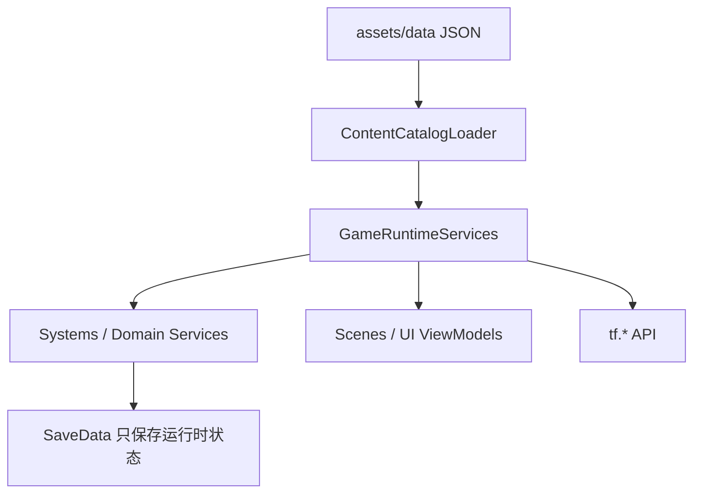

# 数据 Catalog 总览

TinyFarmRPG 把大量静态规则放在 JSON 中，再由 C++ catalog 加载成只读查询结构。玩法系统、UI、Lua 和存档都应引用同一份 catalog，避免出现“脚本里一套规则、C++ 里另一套规则”的分裂。

## 总体关系

静态 catalog 不进存档。存档只保存运行时状态，例如背包槽位、任务进度、队伍成员、装备、角色 HP/MP/经验和 Lua `tf.state`。

## Catalog 清单

| Catalog / 配置 | 源文件 | 加载者 | 主要消费者 |
|----------------|--------|--------|------------|
| Actor / Animal / Crop blueprint | `actor_blueprint.json`、`animal_blueprint.json`、`crop_config.json` | `BlueprintManager` | `EntityFactory`、地图加载、预加载 |
| Item + Icon | `item_config.json`、`icon_config.json` | `ItemCatalog` | 背包、快捷栏、商店、战斗物品、UI 图标 |
| Appearance | `appearance_catalog.json` | `AppearanceCatalog` | `AppearanceSystem`、角色自定义、头像生成 |
| RPG | `assets/data/rpg/manifest.json` 和同目录 JSON | `RpgCatalog` | 队伍、装备、战斗、任务引用、招募 |
| Quest | `quests.json` | `QuestCatalog` | 任务系统、任务 UI、Lua 任务脚本 |
| Shop | `shops.json` | `ShopCatalog` | 商店交互、交易服务、商店 UI、Lua 商人脚本 |
| Audio cue | `audio_cues.json` | `AudioCueCatalog` | 场景默认音乐、音频 cue 校验 |
| VFX | `vfx_catalog.json` | `VfxCatalog` | `PlayVfxCommand`、战斗技能表现 |
| Time / Light | `game_time_config.json`、`light_config.json` | `GameTime` / light config loader | 时间推进、日夜光照、emissive 可见性 |
| Map loading | `map_loading_config.json` | `MapLoadingSettings` | `MapManager` 异步预加载策略 |
| I18n | `assets/i18n/languages.json` | `LocalizationService` | RmlUi、本地化文本、Lua `tf.i18n` |

## RPG 目录

RPG 数据通过 `assets/data/rpg/manifest.json` 间接加载。manifest 必须提供：

- `classes`
- `actors`
- `skills`
- `states`
- `equipment`
- `enemies`
- `troops`

`RpgCatalogLoader` 会按 manifest 中的文件名从 `assets/data/rpg` 解析，并在最后调用 `RpgCatalog::validateReferences(...)`。装备还会结合 `ItemCatalog` 校验，因为装备数据和普通物品显示、库存堆叠、商店买卖共享 item id。

加载提交边界也在这里收紧：`loadRpgCatalogFromManifest()` 先写入临时 `RpgCatalog`，完整加载 classes / actors / skills / states / equipment / enemies / troops 并通过引用校验后，才替换调用方传入的 catalog。各 RPG 子文件 loader 和 `ItemCatalog` 也先解析到临时 map，失败时保留旧数据；重复 item id / icon id 会直接拒载。

## 引用校验

几个 catalog 会在加载后做引用校验：

- `QuestCatalog::validateReferences(RpgCatalog*, ItemCatalog*)`
  - 检查任务 objective 引用的敌人、奖励引用的物品等。
- `ShopCatalog::validateReferences(ItemCatalog*)`
  - 检查买入条目和卖出规则引用的物品。
- `RpgCatalog::validateReferences(..., ItemCatalog*)`
  - 检查 actor/class/skill/state/equipment/enemy/troop 之间的引用。
- `AudioCueCatalog::validateReferences(AssetRegistry)`
  - 检查 cue 引用的 music/sfx 是否已在资源注册表中。

这也是为什么 `RuntimeServiceFactory` 先加载 Item/RPG，再加载 Quest/Shop。

`ContentCatalogLoader` 发布 service 指针时同样遵循"成功后提交"：Item、RPG、Quest、Shop 等 catalog 会先在局部对象中完成加载和引用校验，成功后才写入 `GameRuntimeServices`。VFX 与 AudioCue 属于可降级内容：加载失败会记录日志并保持对应指针为空，调用方看到空 catalog 后跳过 catalog 驱动播放。

## 资源预加载

Catalog 加载后，`AssetPreloadRegistrar` 会把部分资源路径注册到 `AssetRegistry`：

- blueprint sprite 和动画贴图
- item icon 图片
- 默认 appearance profile 的部分外观贴图
- world 文件中所有地图和 tileset 引用的纹理

随后 `ResourceManager::preloadRegisteredResources()` 统一预加载。地图运行时仍可以按需加载，但启动时注册过的资源能减少第一帧和初始切图缺口。

## 新增静态数据的选择

| 新内容 | 推荐位置 |
|--------|----------|
| 新物品、战斗可用物品、图标 | `item_config.json` + `icon_config.json` |
| 新 NPC / 动物 / 作物实体模板 | blueprint JSON |
| 新任务目标和奖励 | `quests.json` |
| 新商店库存或卖出规则 | `shops.json` |
| 新 actor / class / skill / state / enemy / troop | `assets/data/rpg/*.json` |
| 新剧情对白、任务分支、商店选择 | `scripts/` Lua |
| 新一次性地图状态 | Lua `tf.state`，存入 save `script_state` |

规则：JSON 表达静态真相，Lua 表达内容编排，domain service 表达原子写入。

## 相关文件

| 文件 | 说明 |
|------|------|
| `src/game/runtime/game_content_manifest.h` | 所有运行时内容路径常量 |
| `src/game/runtime/content_catalog_loader.cpp` | catalog 加载顺序 |
| `src/game/runtime/rpg_catalog_loader.cpp` | RPG manifest 加载 |
| `src/game/runtime/asset_preload_registrar.cpp` | 从 catalog 收集资源 |
| `src/game/data/*_catalog.*` | 各 catalog 的解析与查询 |
| `assets/data/` | 玩法静态数据 |
| `assets/data/rpg/` | JRPG 静态数据 |
