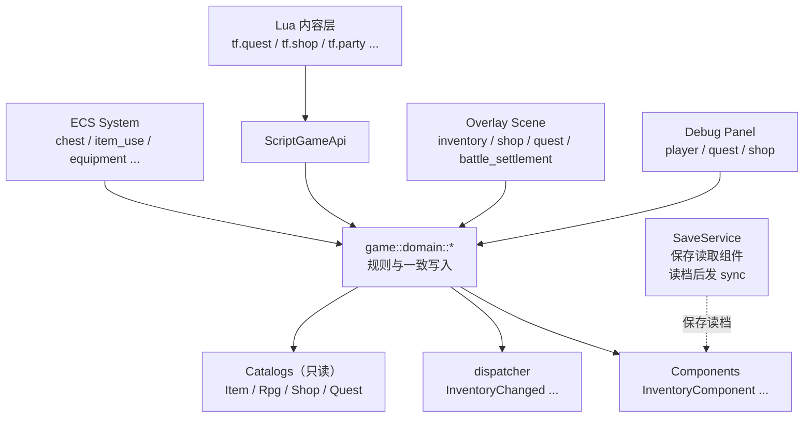
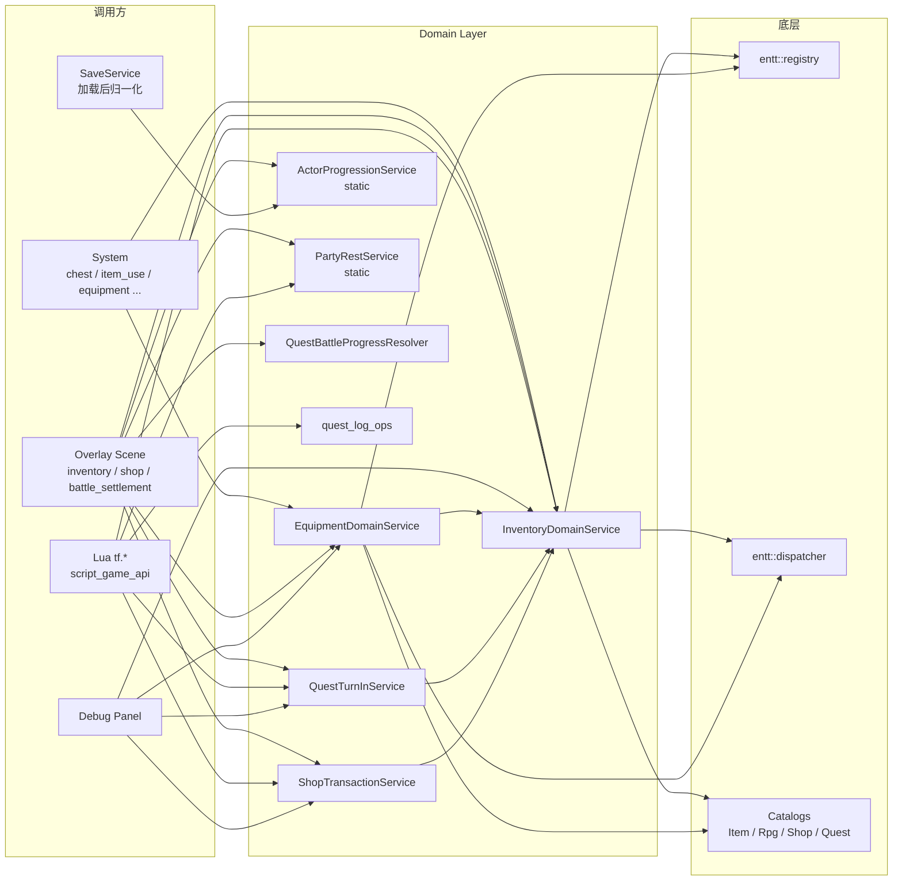

# 领域服务（Domain Services）

> 用途：解释 `src/game/domain/` 这一层"做什么、为什么独立成层、谁调它、怎么新增"。课程 L02 的核心阅读材料。

`src/game/domain/` 是 TinyFarmRPG 里专门用来 **集中规则与一致写入** 的一层。它处于 system / scene / Lua 调用入口和 catalog / component / WorldState 之间。所有"修改背包"、"穿装备"、"完成任务"、"买卖物品"等会改写多个组件并需要保持一致性的操作，都收敛到这里。



## 为什么独立成层

直接把"加物品 + 扣金币 + 发事件"写进 system 或 scene 看起来更直接，但项目里多处都需要做同一件事：

- `ChestSystem` 给玩家发奖励
- `ItemUseSystem` 收获作物
- `BattleScene` 战斗胜利后给奖励
- `ShopMenuScene` 玩家买东西
- `Lua tf.command.add_item` 通过 `ScriptGameApi` 发命令
- `QuestTurnInService` 自身要在交付任务时发物品奖励
- 调试面板要直接塞物品做测试

如果每个地方都自己写一遍"找到 InventoryComponent → 合并堆叠 → 触发空槽 → 失败回退 → 发事件"，规则会迅速漂移。领域服务通过几条硬约束消除这个风险：

1. **一致写入**：一次调用由 service 统一结算。`InventoryDomainService::addItem` 允许部分接收，但必须用 `accepted / rejected` 与事件把结果说清楚；`ShopTransactionService::commitBuy` 这种复合交易则必须全成功或回滚。
2. **统一事件**：所有写入都从同一处发 `InventoryChanged` / `EquipmentChangedEvent` 等，UI、Hotbar 与脚本桥只需要订阅一处。`SaveService` 保存时读取组件，读档后发 sync command，不订阅 `InventoryChanged`。
3. **唯一规则真相**：catalog（静态规则）+ component（运行时数据）+ domain service（写入逻辑）共同构成"系统真相"。Lua、UI、调试面板都只能通过 service 改写，不绕过。

## 八个文件总览

`src/game/domain/` 当前包含 8 个文件（不含 .cpp），按"形态"分三类：

| 类别 | 文件 | 关键类型 | 谁持有/谁创建 |
|------|------|----------|---------------|
| **有状态服务**（持有 registry / dispatcher / catalog 引用） | `inventory_domain_service.h` | `InventoryDomainService` | `GameRuntimeServices::inventory_domain_service` |
|  | `equipment_domain_service.h` | `EquipmentDomainService` | `GameRuntimeServices::equipment_domain_service` |
|  | `quest_turn_in_service.h` | `QuestTurnInService` | `GameRuntimeServices::quest_turn_in_service` |
|  | `shop_transaction_service.h` | `ShopTransactionService` | `GameRuntimeServices::shop_transaction_service` |
| **无状态算法类**（无成员；可能是 `static`，也可能临时构造后调用） | `actor_progression_service.h` | `ActorProgressionService` | 任何地方按需调用 |
|  | `party_rest_service.h` | `PartyRestService` | 任何地方按需调用 |
|  | `quest_battle_progress_resolver.h` | `QuestBattleProgressResolver` | 战斗结算时临时构造（无状态） |
| **自由函数命名空间** | `quest_log_ops.h` | `quest_log_ops::*` | 任何处理 `QuestLogComponent` 的位置 |

> 这种分类不是历史包袱，而是**有意区分**：长期持有外部依赖的（registry/dispatcher/catalog 引用）做成类成员便于注入；纯算法（经验曲线、HP/MP 恢复公式、战斗后任务推进）不进 `GameRuntimeServices`，避免不必要的对象生命周期；只操作单个组件的小工具用 namespace 函数最轻量。

## 各服务职责速览

### InventoryDomainService — 背包写入

玩法运行期唯一允许直接改 `InventoryComponent` 槽位语义的入口。

- `ensureInventory(entity)`：实体没有 `InventoryComponent` 就按 catalog 默认尺寸创建。
- `addItem(entity, item_id, count, preferred_slot=-1)`：先校验 `ItemCatalog`，再合并堆叠 / 占用空槽 / 回报未接收数量。
- `removeItem(entity, item_id, count, slot=-1)`：按槽或按总量扣减。
- `moveItem(entity, from_slot, to_slot, allow_merge=true)`：移动 / 交换 / 合并槽位，并在事件里标注 move 语义。
- `sortInventory(entity)`：按类别与 id 稳定排序，发 full sync，并携带 `slot_remap_old_to_new` 让 Hotbar 保持绑定。
- 任何成功的写入都通过 dispatcher 发 `InventoryChanged`（携带 `slots` diff 或 full sync），UI、Hotbar 与脚本桥据此刷新。

下游：`EquipmentDomainService` / `QuestTurnInService` / `ShopTransactionService` 都通过它写入物品，避免重复实现槽位逻辑。

### EquipmentDomainService — 装备穿脱

- `equipItem(player, actor_id, inventory_slot, target_slot)`：从背包取出装备，按 `ActorData.equip_types` 校验槽位与等级，旧装备回流背包。
- `unequipItem(player, actor_id, slot, preferred_inventory_slot=-1)`：摘下装备，进背包失败时整次操作回滚。
- 内部复用 `InventoryDomainService` 做物品迁移，自身只负责"哪个 slot 装什么"的规则与 `EquipmentChangedEvent` 发射。

### QuestTurnInService — 任务交付

- `turnIn(player, quest, quest_log)`：把任务从 `Active` 推进到 `Completed`，给金币、给物品、写 `QuestLogComponent`。
- 失败原因通过 `QuestTurnInStatus` 枚举回传（背包满、缺钱包组件、objective 未达成等），调用方据此弹提示。
- 任务接取分支（`tryAcceptQuest`）走 [quest_log_ops](#quest_log_ops--quest_log-自由函数)，不走 service。

### ShopTransactionService — 商店交易

- `previewBuy / previewSell`：纯查询，不改任何状态，给 UI 显示总价、剩余金币、能否提交。
- `commitBuy / commitSell`：真正写入。失败时通过 `ShopTradeFailureReason` 报告，已扣的金币 / 已加的物品保证回滚。
- 商品来源由 `ShopCatalog` 决定，价格与可售性由 `ItemCatalog` 决定。

### ActorProgressionService — 经验与等级（静态）

JRPG 经验曲线、等级推导、初始/归一化 `ActorRuntimeState`、队伍经验结算。

- `expForLevel / levelForExp / expToNextLevel`：纯数学，按 catalog 中 `ExpCurveData` 算。
- `initialState / normalizeState`：根据 actor + 装备生成"满血满蓝"的初始状态，或在加载存档后修正越界值。
- `previewExperience`：战斗胜利预演每个 actor 的经验/等级/HP/MP 增长，给奖励画面用。
- `grantExperience`：把预演结果真正写回 `PartyRuntimeStatsComponent`。

### PartyRestService — 休息恢复（静态）

- `previewActivePartyRecovery(registry, player, rpg_catalog, hours)`：算出休息 N 小时每个队员恢复多少 HP/MP，不改状态。
- `applyActivePartyRecovery`：真正写回。床/旅馆 / Lua `tf.party.rest` 都通过它。

### QuestBattleProgressResolver — 战斗→任务推进（无状态对象）

战斗胜利后，根据 `BattleOutcome` 和最终 `BattleUnit` 列表，遍历活跃任务的 objective，刷新 `QuestLogComponent.progress` 并标记 ready-to-turn-in。

- 在 `game_scene_battle_settlement.cpp` 临时 `QuestBattleProgressResolver resolver{};` 构造，无副作用就地调用。

### quest_log_ops — QuestLog 自由函数

`game::domain::quest_log_ops` 是一组针对 `QuestLogComponent` 的轻量工具：

- `isQuestActive / isQuestCompleted / isQuestReadyToTurnIn`：状态查询。
- `tryAcceptQuest`：玩家从 NPC 接取任务。
- `completeQuest / eraseQuestProgress`：任务收尾或撤销。

之所以不做成类，是因为它们没有外部依赖（不持有 registry、dispatcher 或 catalog 引用），生命周期不需要管理。

## 调用链路



## 组装位置

四个有状态服务在 `src/game/runtime/system_factory.cpp` 中按依赖顺序创建：

```
ItemCatalog / RpgCatalog / ShopCatalog 已加载
    └─ InventoryDomainService(registry, dispatcher, item_catalog)
        ├─ EquipmentDomainService(..., rpg_catalog, item_catalog, inventory_domain_service)
        ├─ QuestTurnInService(registry, item_catalog, inventory_domain_service)
        └─ ShopTransactionService(registry, item_catalog, shop_catalog, inventory_domain_service)
```

两个 static 算法类（`ActorProgressionService` / `PartyRestService`）不需要构造，直接调用静态方法即可。`QuestBattleProgressResolver` 在战斗结算时 `resolver{};` 临时构造。

## 关键约定

1. **Preview / Commit 二分**：所有可能"失败但已经改了一半"的操作都拆成 `previewX`（纯查询）和 `commitX`（真正写入）。UI 在玩家点确认前调 preview，避免在已经扣钱后才发现背包满。
2. **错误用枚举回报，不抛异常**：`ShopTradeFailureReason`、`QuestTurnInStatus`、`InventoryMutationResult.rejected` 等都用枚举或计数字段报告失败，调用方自己决定 UI 表达。
3. **写入必须发事件**：任何成功的玩法写入都要发对应的 `*Changed` 事件，UI、Hotbar 与脚本桥据此刷新。这是"绕过 service 直接改组件"会破坏的关键不变量。存档是另一条链路：保存时 capture 组件，读档后发 sync command。
4. **service 不读 UI / 不开 Scene**：domain 只写组件、返回结果或发必要事件。打开"任务交付完成"弹窗这种是 scene / system 层根据结果或事件决定的。
5. **catalog 只读**：service 持有的 catalog 引用使用只读语义（能 `const` 就 `const`），catalog 是规则真相，运行时不变。

## 怎么新增一个 domain service

> 场景：你想在课程后期加一个"钓鱼"系统，需要根据 fishing rod 等级 + 时间段决定能钓到什么，扣鱼饵、加鱼到背包、给经验。

按下面顺序做，能保持架构一致：

1. **判断要不要新建 service**：如果只是改一个 component 不涉及其他规则，直接写在 system 里即可。如果涉及"扣 A 加 B + 失败回滚 + 发事件"或"被多个调用方共享"，才升级为 service。
2. **决定形态**：需要持有 catalog/dispatcher/registry 引用就做成类（放进 `GameRuntimeServices`）；纯函数 / 仅算法做成无状态算法类；只操作一个 component 做成 namespace 函数。
3. **接口先 Preview / Commit 二分**：哪怕实现一开始全部塞 commit，把签名拆好，UI 接入更顺。
4. **复用已有 service**：钓鱼"加鱼到背包"应当调 `InventoryDomainService::addItem`，不要自己重写一遍。
5. **决定要不要发新事件**：如果有 UI 需要订阅（"钓到鱼时弹窗"），新增 `FishCaughtEvent` 在 `game/defs/events.h`；如果只是物品变化，复用 `InventoryChanged`。
6. **挂到 `GameRuntimeServices`** 并在 `system_factory.cpp` 按依赖顺序构造。
7. **暴露给 Lua（可选）**：在 `src/game/script/script_game_api.cpp` 注册 `tf.fishing.*`，让 Lua 内容层可以使用。

## 常见误区

- ❌ **从 system 里 `registry.get<InventoryComponent>(player).slots.push_back(...)` 直接改**：会绕过事件、绕过堆叠规则、绕过 catalog 校验。统一走 `InventoryDomainService::addItem`。
- ❌ **service 里直接打开 Scene 或写 UI**：会让 service 依赖 UI 层。改成发事件，让 scene 层订阅。
- ❌ **把需要全有全无的 commit 写成"尽力而为"**：商店购买、装备穿脱这类复合交易失败时一半成功一半失败，对玩家是致命体验。要么完整成功，要么完整回滚。
- ❌ **把规则校验放在 service 之外**：例如在 system 里手动 if 一遍"这个槽位接受不接受该装备类型"。规则应该集中在 service 内部，外面只看返回结果。

## 推荐代码阅读路径

按下面顺序读，能在 1 小时内建立完整心智模型：

1. `src/game/domain/inventory_domain_service.{h,cpp}` — 看 `addItem` 的 catalog preflight、合并堆叠、空槽分配、部分接收回报，以及 `moveItem / sortInventory` 的事件语义。
2. `src/game/domain/shop_transaction_service.cpp` — 看 preview / commit 的范式（依赖 InventoryDomainService）。
3. `src/game/runtime/system_factory.cpp:104-130` — 看 4 个 service 的构造顺序与依赖注入。
4. `src/game/system/chest_system.cpp` — 看 system 如何调用 `inventory_domain_service.addItem`。
5. `src/game/script/script_game_api.cpp` — 看 Lua 如何通过 `tf.shop`、`tf.quest` 触发 commit。
6. `src/game/domain/actor_progression_service.cpp` — 看静态服务的形态（无成员，纯算法 + 写回）。

## 相关文档

- [系统调度器](system_scheduler.md) — service 的写入大多发生在 system tick 中
- [背包与快捷栏](inventory_hotbar.md) — InventoryDomainService 的主要消费者
- [商店系统](../gameplay/shop-system.md) — ShopTransactionService 的玩家侧闭环
- [任务系统](../gameplay/quest-system.md) — QuestTurnInService / QuestBattleProgressResolver / quest_log_ops 的玩家侧闭环
- [队伍、装备、休息与招募](../gameplay/party-equipment-rest-recruitment.md) — Equipment / ActorProgression / PartyRest 的玩家侧闭环
- [Lua 内容编写指南](../tutorial/lua-content-authoring.md) — Lua 如何通过 `tf.*` 触发 domain service
