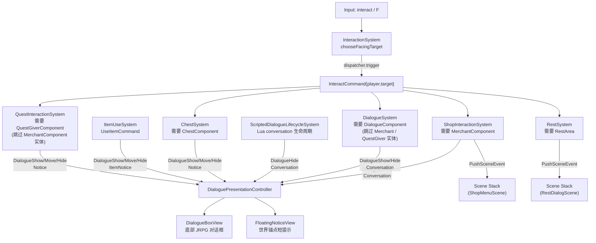

# 交互与对话：从空间查询到事件驱动 UI

> 用途：说明“按 `F` -> 选目标 -> 发命令 -> 各系统各司其职 -> UI/场景变化”的当前交互闭环。

## 1) 一张图：从输入到结果



核心思想：
- `InteractionSystem` 只做两件事：根据玩家朝向做一次空间 probe，挑出目标实体；然后发出 `InteractCommand`
- 具体玩法不写在 `InteractionSystem`：对话、开箱、休息分别由各自系统订阅 `InteractCommand` 并处理
- UI 是事件驱动：`DialoguePresentationController` 监听 `DialogueShow/Move/HideEvent`，并按 `DialogueChannel` 区分主对话与短提示，避免互相覆盖
- 脚本化实体的主对话由 `ScriptedDialogueLifecycleSystem` 负责走远自动关闭；Lua helper 收到 `dialogue_closed` 后清理自身状态

## 2) `InteractCommand`：总线式扩展点

当你想加一种新的可交互物（例如告示牌、钓鱼点、商店入口）：
1. 给实体加一个能识别它的 component
2. 新建一个系统订阅 `InteractCommand`
3. 在回调里判断 `event.target` 是否带该 component，然后处理并驱动 UI/Scene

这样做的收益是：
- `InteractionSystem` 保持稳定，不会随着玩法增加而越改越大
- 新交互等于新增订阅者，代码耦合更低

当前已有订阅者及目标优先级（`chooseFacingTarget` 中锁定）：

```
Merchant > QuestGiver > Dialogue NPC > Chest > Rest
```

**交互独占规则**：带 `QuestGiverComponent` 的 NPC 由 `QuestInteractionSystem` 独占处理任务交互；`DialogueSystem` 检测到目标带 `QuestGiverComponent` 时会显式跳过，保证同一次 `InteractCommand` 不被两个系统重复响应。同理，带 `MerchantComponent` 的实体由 `ShopSystem` 独占，`DialogueSystem` 和 `QuestInteractionSystem` 均跳过。

当前地图侧接线方式：

- `MerchantComponent` 来自 Tiled actor point object 的 `shop_id` string property
- `QuestGiverComponent` 来自 Tiled actor point object 的 `quest_offer_id` string property
- 目前还没有对应的 `BattleStarterComponent` 或 Tiled 战斗触发器；战斗仍主要通过 `EnterBattleCommand` / `BattleDebugPanel` 进入

## 3) Dialogue Presentation 的运行时结构

当前不是每个系统自己直接操作 UI 实例，而是：

- `GameSceneUiController` 在初始化时创建：
  - 1 个 `DialogueBoxView`
  - 2 个 `FloatingNoticeView`
  - 1 个 `DialoguePresentationController`
- `DialoguePresentationController` 订阅：
  - `DialogueShowEvent`
  - `DialogueMoveEvent`
  - `DialogueHideEvent`
- 再按 `DialogueChannel` 把事件路由到对应 view

布局约定：
- `Conversation` 走屏幕底部固定 `DialogueBoxView`，头像/speaker/body 分区由 RML/RCSS 负责
- `Notice` 与 `ItemNotice` 走 `FloatingNoticeView`，文本排版和尺寸由 RmlUi 自动完成
- 浮动通知的世界锚点位置会在 `GameScene::prepareUi(alpha)` 阶段刷新
- `DialogueMoveEvent` 对 `Conversation` 会被忽略，因为底部对话框不依赖世界坐标

脚本化对话补充约定：
- `tf.dialogue.show(..., target_handle)` 发出的 `Conversation` 如果目标带 `ScriptedInteractionComponent`，会被 `ScriptedDialogueLifecycleSystem` 记录为 Lua-owned conversation
- 玩家离开目标超过较近的像素风关闭阈值后，系统发 `DialogueHideEvent`；当前阈值为 `min(DialogueComponent::interact_distance_ * 0.75, 48px)`
- `lib.dialogue` 监听 `dialogue_closed`，把外部关闭视为 `interrupted = true`
- `tf.dialogue.choice` 发 `DialogueChoiceRequestedEvent`，由 `DialogueChoiceScene` 打开 RmlUi 选项弹窗；选择完成后发 `DialogueChoiceSelectedEvent`，再桥接回 Lua 的 `dialogue_choice_selected`

## 4) DialogueChannel 约定

项目里约定使用 3 个频道（见 `game/defs/events.h`）：
- `DialogueChannel::Conversation`：角色对话、商店 greeting、招募前对话，显示在底部对话框
- `DialogueChannel::Notice`：任务反馈、开箱、战斗结算等短提示，显示为世界锚点浮动通知
- `DialogueChannel::ItemNotice`：物品栏右键使用后的提示，显示为世界锚点浮动通知

因此，系统在发 `DialogueShow/Move/HideEvent` 时必须带上对应 `DialogueChannel`，才能路由到正确表现。`DialogueShowEvent::speaker_actor_id_hash` 是头像解析的主路径；如果缺失，controller 会按 `RecruitableComponent::actor_id_hash_` 和 `NameComponent::name_id_` 做 fallback。
