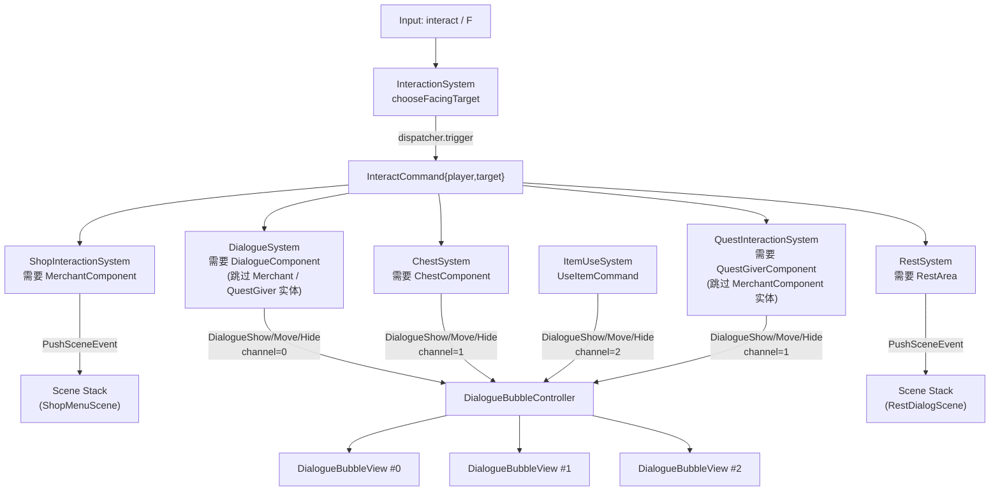

# 交互与对话：从空间查询到事件驱动 UI

> 用途：说明“按 `F` -> 选目标 -> 发命令 -> 各系统各司其职 -> UI/场景变化”的当前交互闭环。

## 1) 一张图：从输入到结果



核心思想：
- `InteractionSystem` 只做两件事：根据玩家朝向做一次空间 probe，挑出目标实体；然后发出 `InteractCommand`
- 具体玩法不写在 `InteractionSystem`：对话、开箱、休息分别由各自系统订阅 `InteractCommand` 并处理
- UI 是事件驱动：气泡只监听 `DialogueShow/Move/HideEvent`，并按 `channel` 区分不同用途，避免互相覆盖

## 2) `InteractCommand`：总线式扩展点

当你想加一种新的可交互物（例如告示牌、钓鱼点、商店入口）：
1. 给实体加一个能识别它的 component
2. 新建一个系统订阅 `InteractCommand`
3. 在回调里判断 `event.target` 是否带该 component，然后处理并驱动 UI/Scene

这样做的收益是：
- `InteractionSystem` 保持稳定，不会随着玩法增加而越改越大
- 新交互等于新增订阅者，代码耦合更低

当前已有订阅者及目标优先级（`chooseFacingTarget` 中锁定）：

```
Merchant > QuestGiver > Dialogue NPC > Chest > Rest
```

**交互独占规则**：带 `QuestGiverComponent` 的 NPC 由 `QuestInteractionSystem` 独占处理任务交互；`DialogueSystem` 检测到目标带 `QuestGiverComponent` 时会显式跳过，保证同一次 `InteractCommand` 不被两个系统重复响应。同理，带 `MerchantComponent` 的实体由 `ShopSystem` 独占，`DialogueSystem` 和 `QuestInteractionSystem` 均跳过。

当前地图侧接线方式：

- `MerchantComponent` 来自 Tiled actor point object 的 `shop_id` string property
- `QuestGiverComponent` 来自 Tiled actor point object 的 `quest_offer_id` string property
- 目前还没有对应的 `BattleStarterComponent` 或 Tiled 战斗触发器；战斗仍主要通过 `EnterBattleCommand` / `BattleDebugPanel` 进入

## 3) DialogueBubble 的运行时结构

当前不是每个系统自己直接操作一个气泡实例，而是：

- `GameSceneUiController` 在初始化时创建 3 个 `DialogueBubbleView`
- `DialogueBubbleController` 订阅：
  - `DialogueShowEvent`
  - `DialogueMoveEvent`
  - `DialogueHideEvent`
- 再按 `channel` 把事件路由到对应 `DialogueBubbleView`

布局约定：
- 气泡文本排版和尺寸由 RmlUi 自动完成
- `DialogueBubbleView` 只负责设置文本、显隐和 world-anchor 定位
- 世界锚点位置会在 `GameScene::prepareUi(alpha)` 阶段刷新

## 4) DialogueBubble 的 channel 约定

项目里约定使用 3 个频道（见 `GameSceneUiController::init`）：
- `0`：对话（NPC 说话）
- `1`：通知（例如拾取、开箱等短提示）
- `2`：物品提示（例如物品栏右键使用后的提示）

因此，系统在发 `DialogueShow/Move/HideEvent` 时必须带上对应 `channel`，才能路由到正确的气泡实例。
