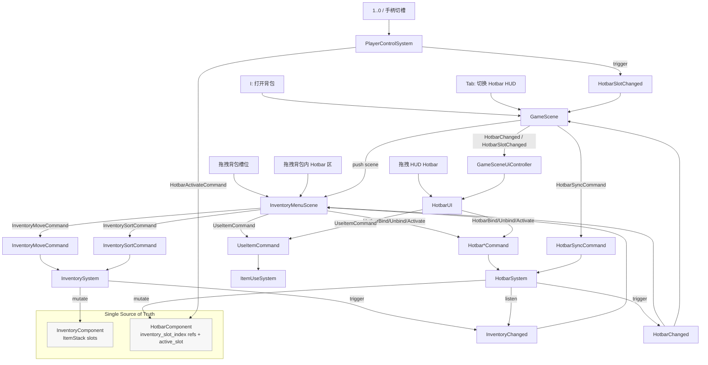

# 物品栏与快捷栏：命令流、UI 同步与槽位一致性

> 用途：说明当前 Inventory / Hotbar 的真实数据流。本文以现有实现为准：`InventoryMenuScene` 是独立覆盖 Scene，`HotbarUI` 是 `GameSceneUiController` 管理的常驻 HUD。

## 1) 一张图：从输入到 UI 更新

## 2) UI 结构：谁显示什么

### 2.1 `InventoryMenuScene`
- 入口：`src/game/scene/inventory_menu_scene.cpp`
- 角色：
  - 覆盖式菜单 Scene
  - 用 `RmlDocumentController` 管理背包文档
  - 维护本地 slot view model、detail panel、action menu、tooltip
- 特点：
  - 打开时直接从玩家组件做一次本地同步
  - 运行期监听 `InventoryChanged` / `HotbarChanged`
  - 拖拽规则最完整：背包内移动、背包到 hotbar、hotbar 内互换、右键 action menu

### 2.2 `HotbarUI`
- 入口：`src/game/ui/hotbar_ui.cpp`
- 角色：
  - gameplay HUD 的常驻快捷栏
  - 由 `GameSceneUiController` 创建和持有
- 特点：
  - 只显示 hotbar
  - 支持点击激活、右键使用、拖拽换绑、tooltip
  - 不直接监听 dispatcher，而是由 `GameScene` 把 `HotbarChanged` / `HotbarSlotChanged` 转投给它

### 2.3 `GameSceneUiController`
- 入口：`src/game/ui/game_scene_ui_controller.cpp`
- 角色：
  - gameplay HUD 的组合控制器
  - 持有 `HotbarUI`、`TimeClockHud`、tooltip、dialogue bubble、overlay prompt、screen fade

## 3) 核心不变量

1. Inventory 是唯一物品数据源
- `InventoryComponent` 持有真实 `ItemStack{item_id, count}`
- 加物品、扣物品、移动、排序都由 `InventorySystem` / `InventoryDomainService` 负责

2. Hotbar 只保存引用
- `HotbarComponent` 的槽位只保存 `inventory_slot_index_`
- Hotbar 本身不保存第二份 `ItemStack`

3. UI 只发命令，System 改模型后发事件
- UI 侧命令包括：
  - `InventoryMoveCommand`
  - `InventorySortCommand`
  - `UseItemCommand`
  - `HotbarBindCommand`
  - `HotbarUnbindCommand`
  - `HotbarActivateCommand`
- 模型变化后由 system 发：
  - `InventoryChanged`
  - `HotbarChanged`
  - `HotbarSlotChanged`

4. 一个 inventory slot 最多绑定到一个 hotbar slot
- `HotbarSystem::onBind()` 会先清除旧绑定，再建立新绑定

## 4) 一致性规则：Inventory 变化时 Hotbar 怎么跟随

当前项目的取舍是：

> Hotbar 尽量跟随物品，而不是跟随槽位。

因此当 Inventory 内发生 move / swap / merge / sort 时，`HotbarSystem` 会在监听 `InventoryChanged` 后同步调整 `inventory_slot_index_`。

### 4.1 MoveToEmpty
- 若 source 槽位被 hotbar 引用，则 hotbar 映射跟到目标槽位

### 4.2 Swap
- 两个 inventory 槽位互换时，对应 hotbar 映射也互换

### 4.3 Merge
- 若 source 合并后清空：
  - source 被 hotkey 引用、target 没被引用：hotkey 跟到 target
  - source 和 target 都被 hotkey 引用：保留 target 的 hotkey，清掉 source 的 hotkey

### 4.4 Sort
- 排序后会按 old->new 映射重写 `HotbarComponent`
- 随后触发 `HotbarSyncCommand{full_sync=true}`

## 5) 首帧与显隐同步

### 5.1 `GameScene`
- 初始化成功后，为玩家 enqueue：
  - `InventorySyncCommand`
  - `HotbarSyncCommand`

### 5.2 `InventoryMenuScene`
- 进入时直接从玩家组件读取当前快照
- 不是依赖外部先发 `InventorySyncCommand`

### 5.3 `HotbarUI`
- 显示时由 `GameSceneUiController::toggleHotbar()` 刷新当前 target
- 然后 enqueue `HotbarSyncCommand`

## 6) 阅读线索

- 数据模型：
  - `src/game/component/inventory_component.h`
  - `src/game/component/hotbar_component.h`
- 命令 / 事件：
  - `src/game/defs/commands.h`
  - `src/game/defs/events.h`
- System：
  - `src/game/system/inventory_system.cpp`
  - `src/game/system/hotbar_system.cpp`
  - `src/game/system/item_use_system.cpp`
  - `src/game/system/player_control_system.cpp`
- UI：
  - `src/game/scene/inventory_menu_scene.cpp`
  - `src/game/ui/hotbar_ui.cpp`
  - `src/game/ui/game_scene_ui_controller.cpp`
  - `src/game/ui/slot_grid_support.h/.cpp`

## 7) 推荐排错顺序

1. 先看组件状态：`InventoryComponent` / `HotbarComponent`
2. 再看命令是否正确发出
3. 再看 `InventoryChanged` / `HotbarChanged` 是否按预期触发
4. 最后再看 UI view model 是否同步、是否 `markDirty()`
