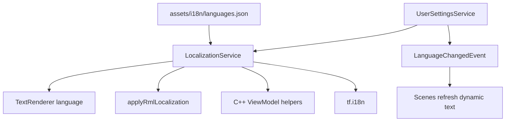

# 本地化系统

本地化系统负责把稳定文本 key 映射成当前语言文本，并让 RmlUi、C++ ViewModel 和 Lua 内容脚本使用同一套语言表。

## 数据文件

| 文件 | 作用 |
|------|------|
| `assets/i18n/languages.json` | 语言 manifest，声明 fallback 和语言文件 |
| `assets/i18n/en-US.json` | 英文文本表 |
| `assets/i18n/zh-Hans.json` | 简体中文文本表 |
| `config/user_settings.default.json` | 默认语言设置，当前为 `en-US` |

`languages.json` 的结构：

```json
{
  "fallback": "en-US",
  "languages": [
    {
      "tag": "en-US",
      "native_name": "English",
      "file": "assets/i18n/en-US.json"
    }
  ]
}
```

语言文件是 flat JSON object：key 是稳定文本 id，value 是文本。

## 运行时链路



装配顺序：

1. `RuntimeServiceFactory` 创建 `LocalizationService`。
2. `LocalizationService::loadLanguageIndex(...)` 加载 manifest 和 fallback 语言；fallback 语言文件加载失败时，本次 manifest 不提交，旧状态保持不变。
3. `UserSettingsService` 读取用户偏好或默认配置。
4. `UserSettingsService::applyLanguage()` 设置当前语言、更新 `TextRenderer` 默认语言，并对所有 RmlUi 文档应用本地化。
5. 用户切换语言时发 `LanguageChangedEvent`，各 Scene 刷新动态 ViewModel 文本。

## RmlUi 文档文本

RML 中的静态文本使用属性声明：

```xml
<button data-i18n="common.confirm">Confirm</button>
<div data-i18n-title="inventory.tab.map"></div>
```

`applyRmlLocalization(...)` 会：

- 查找 `[data-i18n]` 并替换 inner RML。
- 查找 `[data-i18n-title]` 并替换 `title` 属性。

注意：RML 里保留英文 fallback 文本是有价值的。文档刚加载、`applyRmlLocalization(...)` 还没运行，或本地化服务未接入时，文档仍能显示基本内容。一旦 applier 跑起来，缺失 key 会走 `LocalizationService` 的 fallback 链，最终显示 fallback 译文或 `!key!`。

## C++ 动态文本

动态文本不能只靠 `data-i18n`，因为它通常包含物品名、数量、actor 名或运行时数值。常用入口：

- `LocalizationService::tr(key)`
- `LocalizationService::format(key, args)`
- `game::ui::tryLocalize(...)`
- `game::ui::localizeTextOrFallback(...)`
- `game::ui::formatTextOrFallback(...)`

`format` 使用 `{name}` 形式占位。例如文本表中可以写：

```json
{
  "recruitment.joined_party": "{actor} joined the party."
}
```

C++ 传入 `{{"actor", display_name}}` 后得到最终文本。未替换的占位符会记录 warning。

## Lua 内容脚本

TinyFarm 脚本模块暴露了 `tf.i18n`：

- `tf.i18n.tr(key)`
- `tf.i18n.format(key, table)`

Lua 内容脚本可以直接使用同一套 key。剧情文本是否本地化取决于内容需求：临时教学脚本可以保留硬编码文本；准备给学生复用的正式示例建议放入 `assets/i18n`。

## 缺失 key 的表现

查找顺序：

1. 当前语言表。
2. fallback 语言表。
3. 返回 `!key!` 并记录一次 warning。

这让缺失文本在 UI 中很显眼，方便测试时发现。

## 新增语言

1. 新增 `assets/i18n/<tag>.json`。
2. 在 `assets/i18n/languages.json` 的 `languages` 数组中加入 `tag`、`native_name`、`file`。
3. 确保所有已有 key 都有翻译，或至少 fallback 可用。
4. 运行游戏，在 PauseMenu 的语言设置中切换验证。
5. 检查动态 Scene，例如 Inventory、Shop、QuestOffer、RecruitOffer、Battle。

## 新增文本 key

1. 选择稳定命名，例如 `shop.detail.price` 或 `inventory.map.empty`。
2. 同步加入所有语言文件。
3. 静态 RML 文本使用 `data-i18n` / `data-i18n-title`。
4. 动态文本通过 `LocalizationService` helper 生成。
5. 若 key 来自 item/quest/shop/rpg catalog，优先让 catalog 存 key，而不是存已经翻译好的展示文本。

## 相关文件

| 文件 | 说明 |
|------|------|
| `src/game/runtime/localization_service.*` | 语言 manifest、语言表、fallback 原子加载、format |
| `src/game/runtime/user_settings_service.*` | 语言偏好、应用语言、派发 `LanguageChangedEvent` |
| `src/game/ui/rml_localization_applier.*` | RML 静态文本替换 |
| `src/game/ui/localized_text.h` | C++ UI 文本 helper |
| `src/game/defs/options_events.h` | `LanguageChangedEvent` |
| `assets/i18n/` | 语言数据 |
