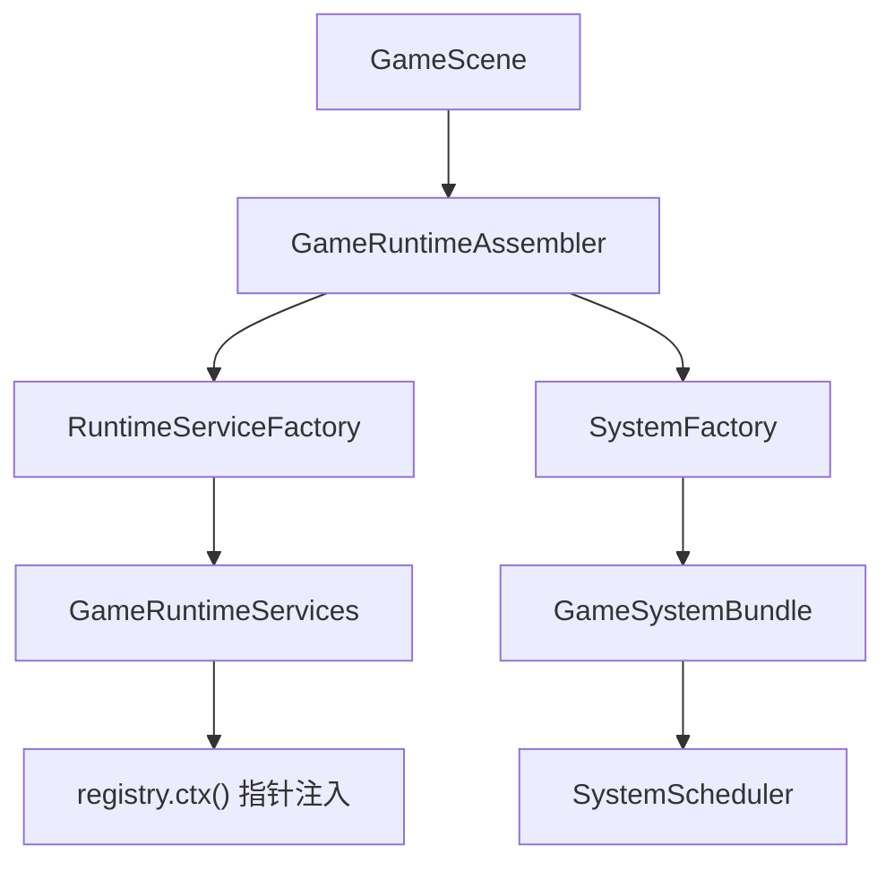
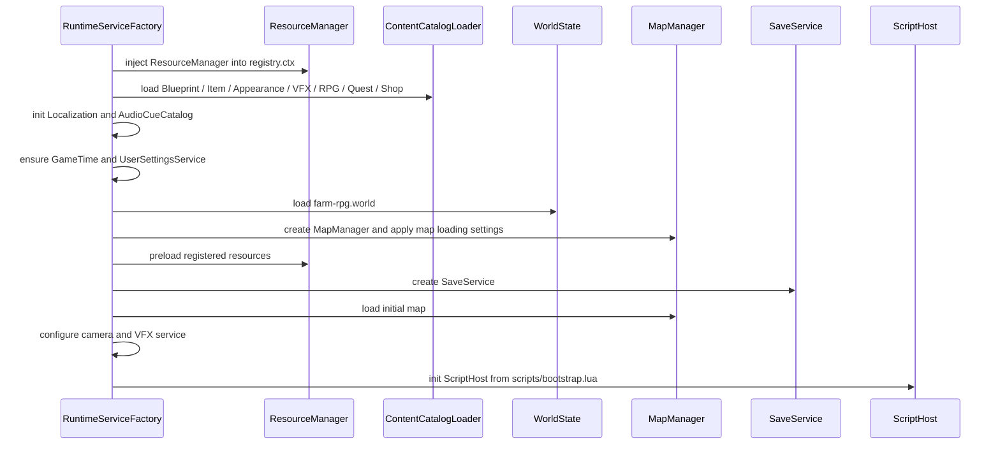
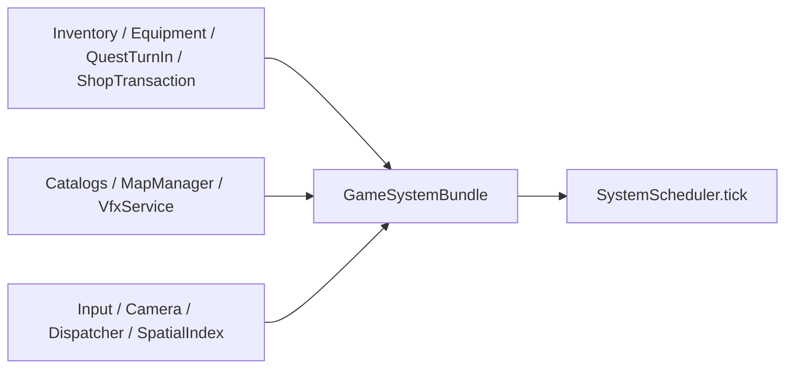

# 运行时装配：从 GameScene 到 Services / Systems

本文说明 `GameScene` 进入时如何把 catalog、domain service、MapManager、SaveService、Lua 宿主和 gameplay systems 装配起来。它适合在读完 [GameScene](game_scene.md) 与 [系统调度器](system_scheduler.md) 后阅读。

## 职责边界

- `GameRuntimeAssembler` 是外观入口，只把 service 装配和 system 装配委托出去。
- `RuntimeServiceFactory` 创建和加载长期服务，例如 catalog、WorldState、MapManager、SaveService、ScriptHost。
- `SystemFactory` 创建 ECS system，并保证 system 依赖的 domain service 已经存在。
- `GameRuntimeServices` 持有服务和 catalog；`GameSystemBundle` 持有 system 实例。
- `SystemScheduler` 不拥有 system，只在固定步中引用 `GameSystemBundle`。

## Service 装配顺序

`RuntimeServiceFactory::assemble` 的顺序很重要。它先准备数据，再准备世界，再加载地图，最后启动脚本。

关键点：

- Catalog 加载失败通常会中断装配，因为后续 system 依赖这些静态规则。
- `AssetPreloadRegistrar` 会从 blueprint、item icon、appearance、world map 中收集纹理资源并注册到 `AssetRegistry`。
- `resource_manager.preloadRegisteredResources()` 在初始地图加载前执行，减少第一张地图的资源缺口。
- `ScriptHost` 最后初始化，因为脚本 API 需要 catalog、WorldState、MapManager、domain service 等基础设施已经可用。

## Catalog 与 Manifest

集中路径定义在 `src/game/runtime/game_content_manifest.h`：

| 字段 | 路径 |
|------|------|
| `ActorBlueprints` | `assets/data/actor_blueprint.json` |
| `AnimalBlueprints` | `assets/data/animal_blueprint.json` |
| `CropBlueprints` | `assets/data/crop_config.json` |
| `Items` / `ItemIcons` | `assets/data/item_config.json` / `assets/data/icon_config.json` |
| `AppearanceCatalog` | `assets/data/appearance_catalog.json` |
| `RpgManifest` / `RpgRoot` | `assets/data/rpg/manifest.json` / `assets/data/rpg` |
| `Quests` / `Shops` | `assets/data/quests.json` / `assets/data/shops.json` |
| `AudioCues` / `VfxCatalog` | `assets/data/audio_cues.json` / `assets/data/vfx_catalog.json` |
| `World` / `MapLoadingConfig` | `assets/maps/farm-rpg.world` / `assets/data/map_loading_config.json` |
| `I18nLanguages` | `assets/i18n/languages.json` |
| `ScriptBootstrap` | `scripts/bootstrap.lua` |

## registry.ctx 注入

有些系统或 UI 需要从 registry 找到运行时服务。装配时会把常用指针注入 `registry.ctx()`：

- `ResourceManager*`
- `WorldState*`
- `RpgCatalog*`
- `QuestCatalog*`
- `ShopCatalog*`
- `LocalizationService*`
- `GameTime`

读代码时要注意：`registry.ctx()` 只表达“这个 Scene 生命周期内可访问的共享服务”，不表示所有权。所有权仍在 `GameRuntimeServices` 或 engine `Context`。

## System 装配

`SystemFactory::assemble` 会先补齐 domain service，再创建 system：

几个典型依赖：

- `InventorySystem` 通过 `InventoryDomainService` 写背包。
- `EquipmentSystem` 通过 `EquipmentDomainService` 写装备；service 在背包槽位副本中预演后一次提交背包与 loadout。
- `ShopInteractionSystem` 读 `ShopCatalog`，交易由 `ShopTransactionService` 执行。
- `QuestInteractionSystem` 读 `QuestCatalog`，交付由 `QuestTurnInService` 写奖励和状态。
- `AppearanceSystem` 读 `AppearanceCatalog`，把 game 层外观写入 engine 层 `LayeredSpriteComponent`。
- `ScriptEventBridge` 把 C++ 事件转成 Lua payload。
- `VfxBridgeSystem` 把 `PlayVfxCommand` 转给 `VfxService`。

## 新增服务或系统时

1. 如果是静态内容目录，先加到 `GameContentManifest`，再在 `ContentCatalogLoader` 中加载。
2. 如果需要跨系统复用，放进 `GameRuntimeServices`，必要时注入 `registry.ctx()`。
3. 如果是原子写入规则，优先新增 domain service，再让 system 或 Lua API 调用它。
4. 如果是每帧行为，放进 `GameSystemBundle`，在 `SystemFactory` 创建，并在 `SystemScheduler` 声明顺序和并行依赖。
5. 如果会影响脚本内容，确认 `ScriptRuntimeFactory` 或 `tinyfarm_script_module` 是否需要暴露查询或请求 API。

## 相关文件

| 文件 | 说明 |
|------|------|
| `src/game/runtime/game_runtime_assembler.h/.cpp` | 运行时装配 facade |
| `src/game/runtime/runtime_service_factory.h/.cpp` | service 装配 |
| `src/game/runtime/system_factory.h/.cpp` | system 装配 |
| `src/game/runtime/system_bundle.h/.cpp` | service/system 所有权结构 |
| `src/game/runtime/content_catalog_loader.h/.cpp` | catalog 加载与引用校验 |
| `src/game/runtime/asset_preload_registrar.h/.cpp` | 预加载资源收集 |
| `src/game/runtime/script_runtime_factory.h/.cpp` | ScriptHost 初始化 |
| `src/game/runtime/game_content_manifest.h` | 运行时内容路径清单 |
