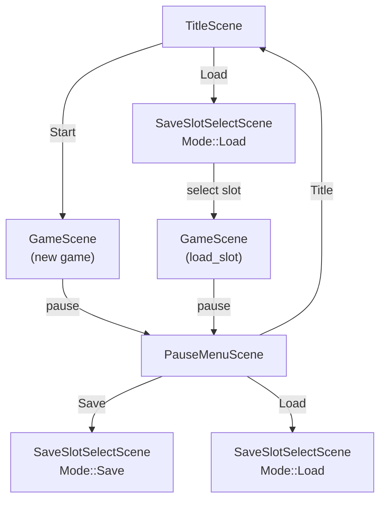
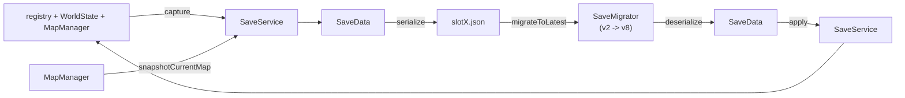

# 存档与流程（Save + Flow）总览

> 用途：说明"流程场景怎么串起来"和"存档数据怎么闭环"，并明确三类职责边界：`SaveService`（边界/入口）、`SaveData`（格式）、`MapManager snapshot`（地图持久化）。

## 1) 流程闭环：Scene 栈如何把 Save/Load 串起来

读图要点：
- `SaveSlotSelectScene` 是一个“可复用的 slot 选择 UI”，通过 `Mode::{Save,Load}` 适配两条路径。
- Scene 的职责是“组织流程与交互”，不直接操纵世界细节（例如不在 UI 里自己拼 JSON）。

## 2) 数据闭环：SaveService / SaveData / Snapshot 的关系

读图要点：
- `SaveService`：流程层唯一入口（保存/加载），内部做 `capture/apply + 文件读写`。
- `SaveMigrator`：读档前置迁移入口，负责把旧版本 JSON 规范化到当前版本（当前为 `v2 -> v8`）。
- `SaveData`：只关心“格式与版本”，不关心 ECS/系统/地图加载细节。
- `MapManager::snapshotCurrentMap()`：把“当前地图的动态实体”写回持久层（否则存档可能漏掉当前地图状态）。
- `schema v8` 当前字段：`quest_state`、`skill_state`、`appearance_state`、`party_state`、`equipment_state`、`party_runtime_state`、`combat_state`、`script_state`。
- `party_state` 保存 `recruited_actor_ids / active_actor_ids / max_active_members`；旧 schema 缺 `max_active_members` 时迁移默认补 4。
- `party_runtime_state.actor_states` 保存 actor 的 `current_hp / current_mp / level / total_exp`；读档应用时 `total_exp` 作为等级真源，`level` 会按 actor 曲线重新推导。
- `appearance_state` 保存 `profile_id / gender / slots`（slot -> variant，如 `hair: "Lyria/Brown"`）。
- `script_state` 保存 Lua `tf.state` 的 JSON 兼容基元，用于一次性地图事件、剧情 flag、脚本化宝箱等内容层状态。

## 3) 关键不变量：保存前必须 snapshot 当前地图

为什么不能省？
- 玩家当前所在地图的动态实体（作物/资源点/宝箱等）通常由运行时实体承载。
- 这些实体需要先写回 `WorldState::maps()[map_id].persistent.snapshot`（持久层），再由 `SaveService::capture` 统一抓取进 `SaveData`。
- 如果跳过 snapshot，存档可能只保存“玩家数据”，而丢失“当前地图刚发生的变化”。

## 4) 文件定位（读代码从这里入手）

- 存档入口：`src/game/save/save_service.h`, `src/game/save/save_service.cpp`
- 存档格式：`src/game/save/save_data.h`, `src/game/save/save_data.cpp`
- 存档迁移：`src/game/save/save_migrator.h`, `src/game/save/save_migrator.cpp`
- Slot 摘要读取：`src/game/save/save_slot_summary.h`, `src/game/save/save_slot_summary.cpp`
- 流程场景：`src/game/scene/title_scene.cpp`, `src/game/scene/save_slot_select_scene.cpp`, `src/game/scene/pause_menu_scene.cpp`, `src/game/scene/game_scene.cpp`
- 地图持久化：`src/game/world/map_manager.cpp`, `src/game/world/world_state.cpp`, `src/game/world/map_snapshot_serializer.cpp`

## 5) 快速排错 checklist（读档失败从哪看）

- 文件不存在 / 无法打开：检查 `saves/slotX.json` 路径与权限。
- JSON 解析失败：文件损坏/半写入（可优先看 SaveService 是否使用临时文件替换）。
- 存档迁移失败：检查 `schema_version` 与新增状态字段类型（容器应为 object/array，runtime `level / total_exp` 应为 int）。
- `schema_version` 不支持：新版本存档拒绝加载（避免误读导致更坏状态）。
- 地图加载失败：`player.map_name` 不存在或 world 文件不包含对应地图。
- UI 不同步：确认 `SaveService::apply` 是否触发了必要的 `InventorySyncCommand/HotbarSyncCommand/HotbarActivateCommand`。
- 外观未恢复：确认玩家实体存在 `AppearanceComponent + LayeredSpriteComponent`，并在 `apply` 后触发 `RefreshAppearanceCommand`。
