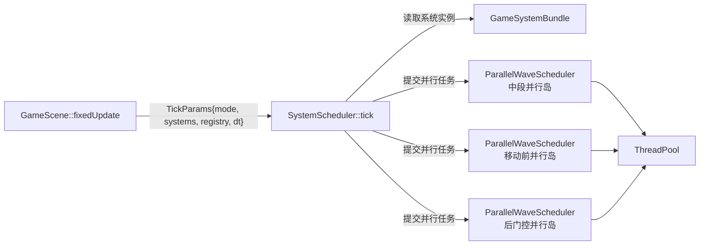
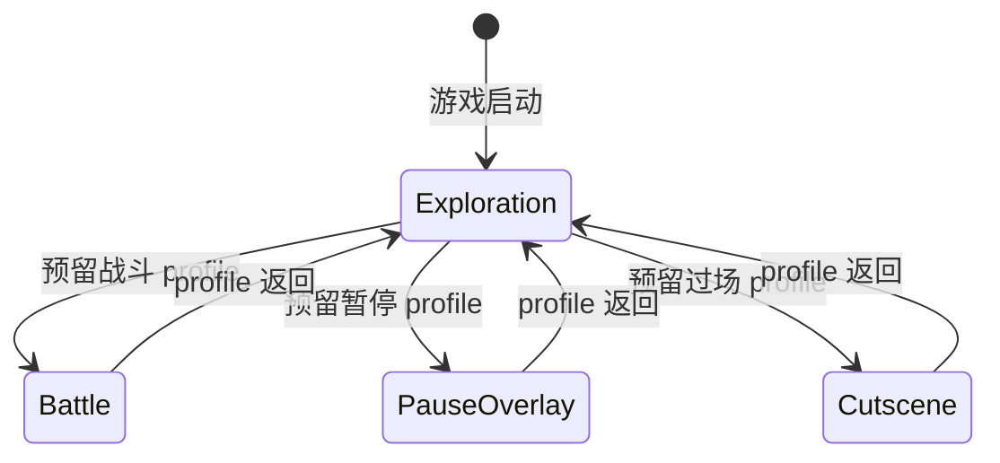
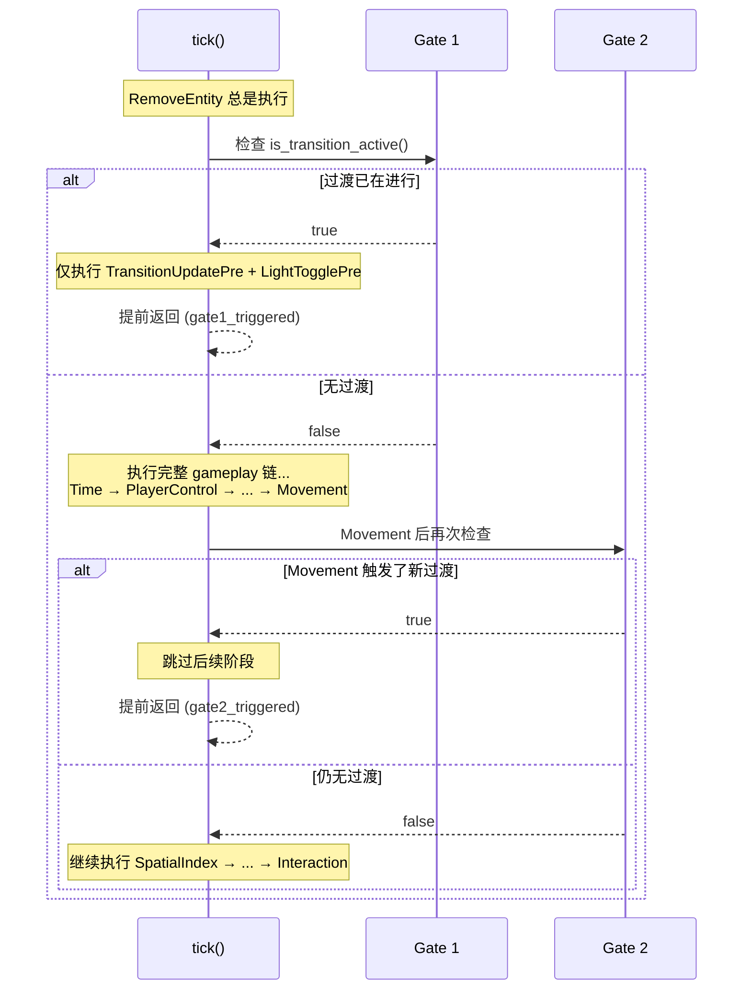
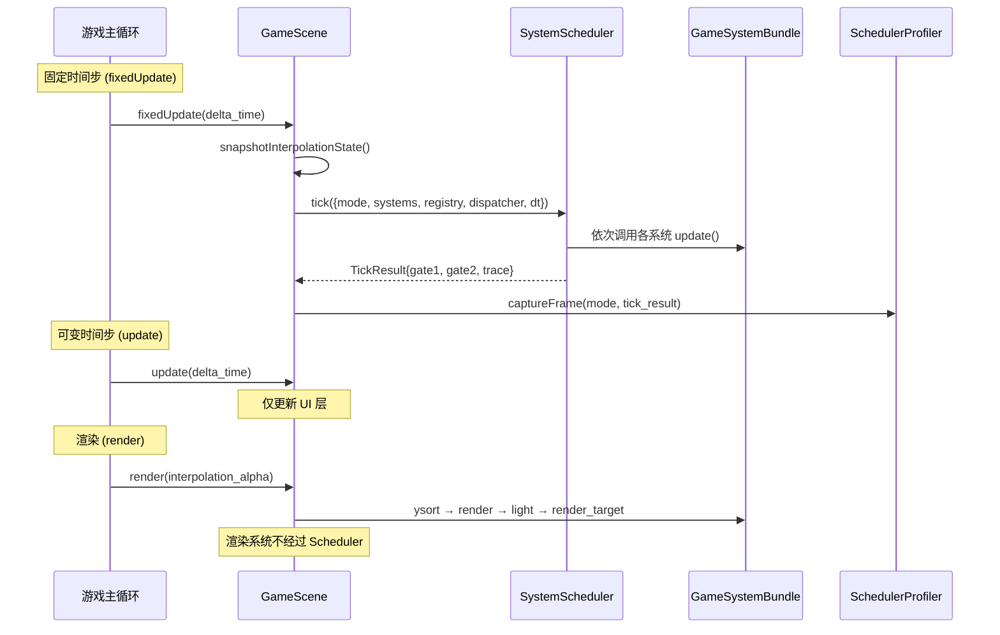

# SystemScheduler 详解

## 概述

`SystemScheduler` 是 TinyFarm 游戏逻辑层的**帧调度器**，负责在每个固定时间步（`fixedUpdate`）中按正确顺序执行所有 ECS 系统。它的核心职责包括：

1. **阶段排序** — 定义 26 个 `SchedulerStage`，确保系统之间的数据依赖和执行时序正确
2. **模式裁剪** — 根据传入的 `GameMode`（探索/战斗/暂停/过场）选择性跳过不需要的阶段
3. **并行岛** — 将无数据冲突的系统分组，通过 `ParallelWaveScheduler` + `ThreadPool` 并行执行
4. **过渡门控** — 在地图切换过渡期间，通过两道"门"(Gate) 提前终止 tick，避免无效逻辑运行

## 源文件位置

| 文件 | 路径 |
|------|------|
| 头文件 | `src/game/runtime/system_scheduler.h` |
| 实现 | `src/game/runtime/system_scheduler.cpp` |
| 游戏模式枚举 | `src/game/runtime/game_mode.h` |
| 系统容器 | `src/game/runtime/system_bundle.h` |
| 并行调度器 | `src/engine/system/parallel_wave_scheduler.h` |
| 任务声明 | `src/engine/system/system_task_decl.h` |

## 整体架构



**关键设计决策：** `SystemScheduler` 不拥有任何系统实例。所有系统由 `GameSystemBundle` 持有，通过 `TickParams` 引用传入。这使得调度器自身无状态（`tick()` 是 `const` 方法），只有并行基础设施通过 `mutable` 惰性初始化。

## GameMode — 执行模式

注意：这里的 `GameMode` 是 scheduler 支持的**执行 profile 词汇表**，不等于当前玩法流程一定会主动翻到对应 mode。当前 `GameScene::fixedUpdate()` 每帧把 `game_mode_` 传给 `SystemScheduler::tick()`，但 `GameScene::setGameMode()` 还没有生产调用者；探索↔战斗实际由 `GameScene::onEnterBattleCommand()` push 覆盖式 `BattleScene`、`BattleScene` 结束时 pop 自己来完成。`GameMode::Battle` profile 目前是预留的裁剪配置，完整联动留给后续调度器收口。



| 模式 | 说明 | 执行的阶段 |
|------|------|-----------|
| `Exploration` | 完整游戏循环 | 全部 26 阶段（受 Gate 裁剪） |
| `Battle` | 战斗模式 profile（当前战斗入口未切换到该 mode） | 仅 `RemoveEntity` |
| `PauseOverlay` | 暂停覆盖层 profile（当前菜单覆盖主要靠 Scene 栈） | 仅 `RemoveEntity` |
| `Cutscene` | 过场动画 | `RemoveEntity` → `Time` → `DayNight` → `TransitionUpdatePost` → `LightTogglePost` |

非 `Exploration` 模式直接顺序执行 `profileStages(mode)` 返回的阶段列表，不触发并行岛也不检查 Gate。

## Exploration 模式 tick 执行流程

这是 `SystemScheduler` 最核心的部分。以下流程图展示了一次完整 tick 的执行逻辑：

```mermaid
flowchart TD
    START([tick 开始]) --> REMOVE[RemoveEntity<br/>清理标记删除的实体]
    REMOVE --> GATE1{Gate 1<br/>地图过渡中?}

    GATE1 -->|是| TRANS_PRE[TransitionUpdatePre<br/>更新过渡动画]
    TRANS_PRE --> LIGHT_PRE[LightTogglePre<br/>更新灯光开关]
    LIGHT_PRE --> EARLY1([提前返回<br/>gate1_triggered = true])

    GATE1 -->|否| TIME[Time<br/>推进游戏时钟]
    TIME --> PLAYER[PlayerControl<br/>处理玩家输入]
    PLAYER --> ISLAND1

    subgraph ISLAND1 [并行岛 1 — 中段]
        direction LR
        DN[DayNight<br/>昼夜光照]
        NPC[NPCWander<br/>NPC 巡游]
        AB[AnimalBehavior<br/>动物行为]
    end

    ISLAND1 --> CHEST[Chest<br/>宝箱交互]
    CHEST --> ITEMUSE[ItemUse<br/>物品使用]
    ITEMUSE --> DIALOGUE[Dialogue<br/>对话推进]
    DIALOGUE --> QUESTI[QuestInteraction<br/>任务 NPC 交互]
    QUESTI --> AUTOTILE[AutoTile<br/>自动贴图]
    AUTOTILE --> ISLAND2

    subgraph ISLAND2 [并行岛 2 — 移动前]
        direction LR
        AS[ActionSound<br/>动作音效]
        ST[State<br/>状态同步]
    end

    ISLAND2 --> SCRIPTC[ScriptCommands<br/>排空 Lua deferred 命令]
    SCRIPTC --> MOVE[Movement<br/>物理移动]
    MOVE --> TRANS_POST[TransitionUpdatePost<br/>更新过渡动画]
    TRANS_POST --> LIGHT_POST[LightTogglePost<br/>更新灯光开关]
    LIGHT_POST --> GATE2{Gate 2<br/>地图过渡中?}

    GATE2 -->|是| EARLY2([提前返回<br/>gate2_triggered = true])

    GATE2 -->|否| ZONET[ZoneTrigger<br/>区域触发器]

    ZONET --> ISLAND3

    subgraph ISLAND3 [并行岛 3 — 后门控]
        direction LR
        SI[SpatialIndex<br/>空间索引重建]
        CF[CameraFollow<br/>相机跟随]
        AN[Animation<br/>动画帧推进]
    end

    ISLAND3 --> ENC[EnemyEncounter<br/>遭遇判定]
    ENC --> PICKUP[Pickup<br/>拾取检测]
    PICKUP --> INTERACT[Interaction<br/>交互判定]
    INTERACT --> FIN([tick 结束])

    style ISLAND1 fill:#e8f4fd,stroke:#4a90d9
    style ISLAND2 fill:#e8f4fd,stroke:#4a90d9
    style ISLAND3 fill:#e8f4fd,stroke:#4a90d9
    style GATE1 fill:#fff3cd,stroke:#ffc107
    style GATE2 fill:#fff3cd,stroke:#ffc107
    style EARLY1 fill:#f8d7da,stroke:#dc3545
    style EARLY2 fill:#f8d7da,stroke:#dc3545
```



## 阶段说明

下表按 `stage_declarations()` 的实际执行顺序排列（与 `enum SchedulerStage` 的声明顺序略有不同：调度器通过 `StageDecl` 数组定义运行顺序，而 enum 仅作为身份标识）。

| # | SchedulerStage | 对应系统 | 职责 |
|---|---------------|---------|------|
| 1 | `RemoveEntity` | `RemoveEntitySystem` | 清理上一帧标记了 `NeedRemoveTag` 的实体 |
| 2 | `TransitionUpdatePre` | `MapTransitionSystem` | 地图切换过渡动画更新（Gate 1 内） |
| 3 | `LightTogglePre` | `LightToggleSystem` | 过渡期间灯光状态更新（Gate 1 内） |
| 4 | `Time` | `TimeSystem` | 推进游戏内时钟（GameTime） |
| 5 | `PlayerControl` | `PlayerControlSystem` | 读取输入，设置玩家速度/方向/动作 |
| 6 | `DayNight` | `DayNightSystem` | 根据时间更新全局光照色调（**MidStage 并行岛**） |
| 7 | `NPCWander` | `NPCWanderSystem` | NPC 巡游 AI，含睡眠日程（**MidStage 并行岛**） |
| 8 | `AnimalBehavior` | `AnimalBehaviorSystem` | 动物行为 AI（**MidStage 并行岛**） |
| 9 | `Chest` | `ChestSystem` | 宝箱开关与物品交付 |
| 10 | `ItemUse` | `ItemUseSystem` | 种植/浇水/收获等物品使用逻辑 |
| 11 | `Dialogue` | `DialogueSystem` | 对话文本推进 |
| 12 | `QuestInteraction` | `QuestInteractionSystem` | 任务 NPC 接取 / 交付分支判定 |
| 13 | `AutoTile` | `AutoTileSystem` | 自动贴图连接规则 |
| 14 | `ActionSound` | `ActionSoundSystem` | 根据状态变化播放动作音效（**PreMovement 并行岛**） |
| 15 | `State` | `StateSystem` | 同步 `StateComponent` → 动画/渲染状态（**PreMovement 并行岛**） |
| 16 | `ScriptCommands` | `ScriptEventBridge::drainDeferredCommands` | 排空本帧 Lua 通过 `tf.*` 提交的延迟命令 |
| 17 | `Movement` | `MovementSystem` | 应用速度、碰撞检测、更新位置 |
| 18 | `TransitionUpdatePost` | `MapTransitionSystem` | Movement 触发后的过渡检查 |
| 19 | `LightTogglePost` | `LightToggleSystem` | 移动后灯光状态更新 |
| 20 | `ZoneTrigger` | `ZoneTriggerSystem` | 玩家位置驱动的区域触发器（含剧情 / 脚本 zone） |
| 21 | `SpatialIndex` | `SpatialIndexSystem` | 重建空间分区索引（**PostGate 并行岛**） |
| 22 | `CameraFollow` | `CameraFollowSystem` | 相机跟随玩家（**PostGate 并行岛**） |
| 23 | `Animation` | `AnimationSystem` | 动画帧推进与精灵切换（**PostGate 并行岛**） |
| 24 | `EnemyEncounter` | `EnemyEncounterSystem` | 遭遇判定与战斗入口（接 BattleScene） |
| 25 | `Pickup` | `PickupSystem` | 检测玩家与可拾取物品的碰撞 |
| 26 | `Interaction` | `InteractionSystem` | 检测玩家与交互对象的碰撞 |

> 4 个相对较新的阶段：`QuestInteraction`、`ScriptCommands`、`ZoneTrigger`、`EnemyEncounter`。它们大多是为承接 Lua 内容层和 JRPG 玩法新增的：`ScriptCommands` 把 Lua 在本帧产生的命令统一排空到主线程；`QuestInteraction`、`ZoneTrigger`、`EnemyEncounter` 把任务/区域/遭遇这些原本散落的小逻辑独立成阶段，便于在 SchedulerProfiler / DOT dump 里观察各自耗时。

## 两道门控 (Gate) 机制

地图切换过渡期间，大量 gameplay 逻辑不应执行（例如玩家移动、NPC AI、物品使用等），否则可能产生逻辑错误（在已卸载的地图上操作实体）。



**Gate 1** — tick 起始处检查：如果进入 tick 时过渡已经在进行（上一帧触发的），则只执行过渡动画和灯光更新，跳过所有 gameplay。

**Gate 2** — Movement 之后检查：如果玩家在本帧通过移动触发了地图切换，则跳过空间索引、相机、动画、拾取、交互等后续阶段。

## 并行岛详解

### 什么是并行岛？

并行岛是一组**数据无冲突**的系统，可以通过 `ParallelWaveScheduler` 在工作线程上并发执行。每个并行岛由以下部分组成：

1. **任务声明** (`SystemTaskDecl`) — 声明每个任务读写的资源
2. **依赖图构建** — `entt::flow` 根据资源冲突自动推导依赖关系
3. **波次提取** — 拓扑排序后分为若干波次 (Wave)，同一波次内的任务可并行
4. **执行** — 每个波次内，无冲突任务通过 `ThreadPool` 并发执行

### 三个并行岛

```mermaid
graph TD
    subgraph Island1 ["并行岛 1 — 中段 (Mid-Stage)"]
        direction TB
        D1_DN["DayNight<br/>RO: GAME_TIME, WORLD_STATE<br/>RW: GLOBAL_LIGHTING_STATE"]
        D1_NPC["NPCWander<br/>RW: NPC_WANDER_DOMAIN"]
        D1_AB["AnimalBehavior<br/>RW: ANIMAL_BEHAVIOR_DOMAIN"]
    end

    subgraph Island2 ["并行岛 2 — 移动前 (Pre-Movement)"]
        direction TB
        D2_AS["ActionSound<br/>RO: StateComp, AudioComp, TransformComp, NeedRemoveTag<br/>RW: ActionSoundComp"]
        D2_ST["State<br/>RO: StateComp, AnimationComp, NeedRemoveTag<br/>RW: StateDirtyTag"]
    end

    subgraph Island3 ["并行岛 3 — 后门控 (Post-Gate)"]
        direction TB
        D3_SI["SpatialIndex<br/>RO: TransformDirtyTag, TransformComp,<br/>AABBCollider, CircleCollider<br/>RW: SPATIAL_INDEX"]
        D3_CF["CameraFollow<br/>RO: PlayerTag, TransformComp, INPUT<br/>RW: CAMERA"]
        D3_AN["Animation<br/>RW: AnimationComp, SpriteComp"]
    end

    style Island1 fill:#e8f4fd,stroke:#4a90d9
    style Island2 fill:#e8f4fd,stroke:#4a90d9
    style Island3 fill:#e8f4fd,stroke:#4a90d9
```



每个并行岛内的任务资源声明没有写-写或读-写冲突，因此 `entt::flow` 推导出它们之间无依赖边，可以在同一波次并行执行。

### 并行安全保障

并行岛通过以下机制确保线程安全：

1. **Registry Storage 预热** — 每个并行岛执行前，主线程调用 `prepare_*_parallel_island_registry()` 强制初始化 EnTT 的惰性 component storage，避免工作线程触发隐式创建导致竞态
2. **DeferredCommands** — 工作线程不直接修改 registry，而是将变更操作（创建/删除实体、添加/移除组件）推入线程安全队列，波次结束后在主线程统一执行 `drain()`
3. **TaskEventBuffer** — 工作线程不直接触发 `entt::dispatcher` 事件，而是将事件推入线程安全缓冲区，波次结束后在主线程统一 `flushTo()`
4. **ParallelIslandContext** — 由于并行 lambda 必须可拷贝（`std::function`），不能直接捕获 `TickParams&`。调度器通过 `mutable` 成员 `parallel_island_context_` 传递上下文指针，执行完毕后立即清空

### 降级回退

如果 `ParallelWaveScheduler::valid()` 返回 `false`（图构建失败或无线程池），该并行岛内的所有任务自动降级为主线程顺序执行，功能不受影响。

## 与 GameScene 的集成



关键点：
- **Gameplay 逻辑**在 `fixedUpdate` 中通过 `SystemScheduler::tick()` 驱动
- **渲染系统**（YSort、Render、Light、RenderTarget）在 `render()` 中由 `GameScene` **直接调用**，不经过 Scheduler
- 相机位置在 `render()` 中按 `interpolation_alpha` 插值以实现平滑渲染

## 惰性初始化

`SystemScheduler` 的并行基础设施全部采用惰性初始化：

```
首次 tick() 调用
  ├─ 创建 ThreadPool ("SystemSchedulerParallel")
  ├─ 创建 midStageParallelIslandScheduler
  │   └─ 注册 3 个 SystemTaskDecl → buildGraph() → extractWaves()
  ├─ 创建 preMovementParallelIslandScheduler
  │   └─ 注册 2 个 SystemTaskDecl → buildGraph() → extractWaves()
  └─ 创建 postGateParallelIslandScheduler
      └─ 注册 3 个 SystemTaskDecl → buildGraph() → extractWaves()
```

后续 tick 复用已创建的实例。当前实现假设并行任务图在运行期静态不变。若未来需要在模式/场景切换后调整任务集合，需补充显式 `invalidate` 机制。

## 性能剖析

`SchedulerProfiler` 通过环形缓冲区收集每帧的 `TickTrace`（每个阶段的耗时），支持：
- 计算最近 N 帧的 avg/max 耗时
- 集成 `spdlog::trace` 输出
- 通过 `SchedulerDebugPanel`（ImGui 调试面板）实时可视化

## 注意事项

1. **不是所有系统都由 Scheduler 管理** — `RenderSystem`、`LightSystem`、`YSortSystem`、`AudioSystem`、`FarmSystem` 等系统不在 Scheduler 的 tick 中，它们由 `GameScene` 在其他生命周期阶段直接调用
2. **没有 System 基类** — 每个 System 是独立的具体类，无继承关系。Scheduler 通过 `stage_declarations()` 中每个 `StageDecl.run_main` 函数指针分发调用（`execute_stage_main_thread()` 根据 `find_stage_decl(stage)` 取到 decl 后直接调用其 `run_main`）
3. **每个系统都有空指针保护** — Scheduler 对每个系统调用前都检查 `if (systems.xxx_system)`，允许部分系统在某些配置下不存在
4. **tick() 是 const** — 所有可变状态（`ThreadPool`、`ParallelWaveScheduler`、`ParallelIslandContext`）通过 `mutable` 关键字标记
