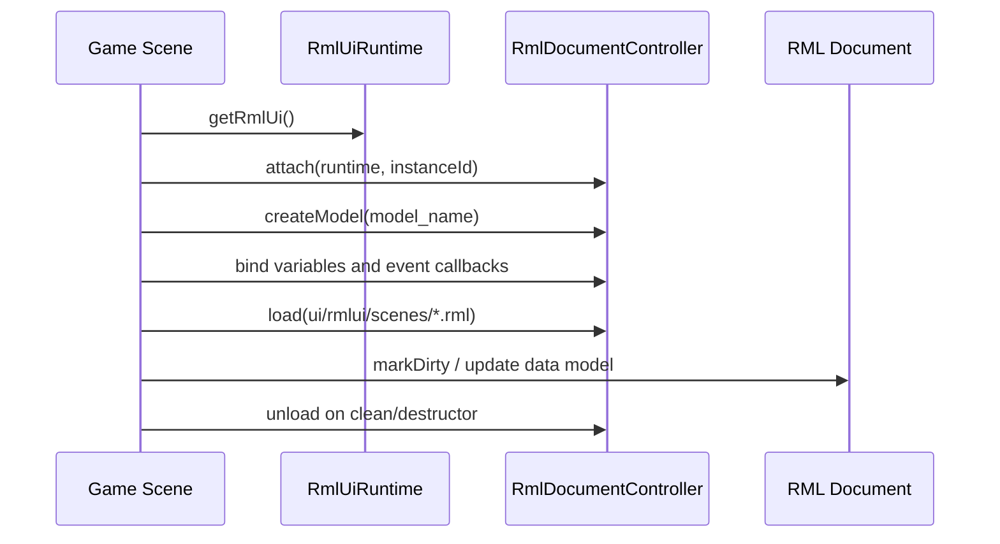
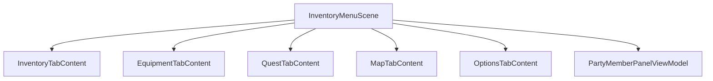
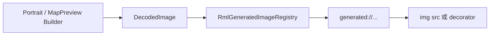

# Game UI Scenes 与 RmlUi 组合方式

本文解释游戏层 RmlUi UI 如何组织。底层 RmlUi runtime 见 [RmlUi 运行时](../engine/ui_framework.md)，布局边界见 [布局契约](../engine/layout-contract.md)。

## UI 资源目录

| 目录 | 用途 |
|------|------|
| `ui/rmlui/theme/` | 共享主题、按钮、slot、modal、spritesheet、portrait |
| `ui/rmlui/hud/` | GameScene 常驻 HUD：hotbar、tooltip、dialogue、notice、clock |
| `ui/rmlui/scenes/` | 覆盖式或主流程 Scene：title、pause、inventory、shop、battle 等 |
| `ui/rmlui/overlay/` | 全局 overlay，如 screen fade |
| `ui/rmlui/learn/` | RmlUi 学习示例 |
| `ui/rmlui/tests/` | rmlui_tester 用的静态测试文档 |

## Scene UI 基本模式

大多数 RmlUi Scene 遵循同一套生命周期：

典型文件：

- `src/game/scene/title_scene.cpp`
- `src/game/scene/pause_menu_scene.cpp`
- `src/game/scene/inventory_menu_scene.cpp`
- `src/game/scene/shop_menu_scene.cpp`
- `src/game/scene/battle_scene.cpp`

## 覆盖式 Scene

覆盖式 Scene 通过 `SceneManager` push 到 `GameScene` 上方。它们通常会：

- 把 `GameState` 切到 paused 或 title/menu 状态。
- push 输入上下文 `InputContextId::Menu`。
- 通过 `uiCoverage()` 声明是否覆盖底层 UI。
- 在 clean/destructor 中断开 dispatcher/input 监听并 unload RML 文档。

常见覆盖式 Scene：

| Scene | RML |
|-------|-----|
| `PauseMenuScene` | `ui/rmlui/scenes/pause_menu.rml` |
| `InventoryMenuScene` | `ui/rmlui/scenes/inventory_menu.rml` |
| `ShopMenuScene` | `ui/rmlui/scenes/shop_menu.rml` |
| `QuestOfferScene` | `ui/rmlui/scenes/quest_offer.rml` |
| `RecruitOfferScene` | `ui/rmlui/scenes/recruit_offer.rml` |
| `RestDialogScene` | `ui/rmlui/scenes/rest_dialog.rml` |
| `SaveSlotSelectScene` | `ui/rmlui/scenes/save_slot_select.rml` |
| `DialogueChoiceScene` | `ui/rmlui/scenes/dialogue_choice.rml` |
| `BattleScene` | `ui/rmlui/scenes/battle.rml` |

## InventoryMenu 的 tab 架构

`InventoryMenuScene` 是最完整的 UI 组合样例。Scene 持有 RML 文档和全局 party panel，各标签页实现 `IMenuTabContent`：

`IMenuTabContent` 负责：

- `bindModel(...)`：注册自身 data model 字段和事件。
- `onActivated()` / `onDeactivated()`：连接或断开运行时事件。
- `update(...)`：处理每帧 UI 状态。
- `onCancel()`：优先消费标签页内部取消行为。
- `onLanguageChanged()`：语言切换后刷新本地化字段。

## Generated Images

RmlUi 原生图片通常来自文件路径；但项目里有些图片是运行时生成的，例如玩家头像和地图预览。

相关类：

- `RmlGeneratedImageRegistry`：保存 CPU-side 临时图片，并向 RmlUi render interface 提供查询。
- `PlayerPortraitService`：根据当前外观生成玩家头像，服务于 HUD、背包、战斗等 UI。
- `MapPreviewBuilder`：根据 Tiled 地图生成 Map tab 预览图。

生成图的注册对象使用 RAII。Scene 或 service 销毁时，注册会自动释放，避免 RmlUi 继续引用过期图片。

## 本地化

RML 可以使用：

- `data-i18n="key"` 替换元素文本。
- `data-i18n-title="key"` 替换 title 属性。

`UserSettingsService` 在文档加载和语言切换时调用 `applyRmlLocalization(...)`。需要动态拼接的文本则通常在 C++ ViewModel 中通过 `LocalizationService` 或 `localized_text` helper 生成。

## 新增一个 RmlUi Scene

1. 在 `ui/rmlui/scenes/` 添加 `.rml` 和 `.rcss`。
2. 在 Scene C++ 中使用 `RmlDocumentController` 创建 data model。
3. 注册所有 RmlUi struct / array 类型。
4. 绑定 ViewModel 字段和 `data-event-*` 回调。
5. 加载文档后做一次完整 sync，并 `markAllDirty()`。
6. 处理 input context、dispatcher listener、language change、clean/unload。
7. 补 smoke test 或 rmlui_tester 手动验证。

## 相关文件

| 文件 | 说明 |
|------|------|
| `src/engine/ui/rmlui/rml_document_controller.*` | 文档与 data model 生命周期 |
| `src/engine/ui/rmlui/rml_generated_image_registry.*` | 运行时生成图片 |
| `src/game/scene/inventory_menu_scene.*` | 复杂 tab UI 样例 |
| `src/game/ui/menu_tab_content.h` | InventoryMenu tab 接口 |
| `src/game/ui/*_tab_content.*` | 各标签页控制器 |
| `src/game/ui/player_portrait_service.*` | 玩家头像生成与注册 |
| `src/game/ui/map_preview_builder.*` | 地图预览生成 |
| `src/game/ui/rml_localization_applier.*` | RML 本地化应用 |
