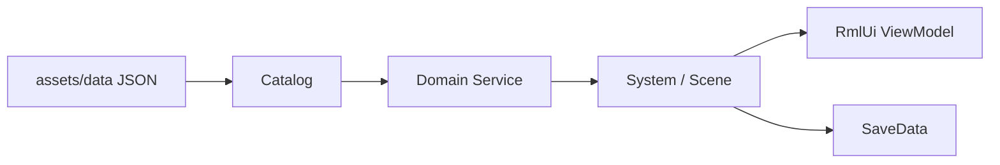

# Gameplay 文档索引

`docs/gameplay` 记录玩家可感知的 RPG 玩法闭环。它们通常横跨 `src/game/data`、`src/game/domain`、`src/game/system`、`src/game/scene`、`ui/rmlui` 和 `assets/data`。

## 推荐顺序

1. [任务系统](quest-system.md)
2. [商店系统](shop-system.md)
3. [队伍、装备、休息与招募](party-equipment-rest-recruitment.md)
4. [分层角色外观](layered-appearance.md)
5. [偏好设置](options-and-user-settings.md)
6. [回合制战斗](turn-based-battle.md)

## 文档地图

| 文档 | 适合什么时候读 |
|------|----------------|
| [quest-system.md](quest-system.md) | 新增任务、理解 objective/reward、战斗结算推进任务 |
| [shop-system.md](shop-system.md) | 新增商店、买卖规则、交易服务、商店 UI |
| [party-equipment-rest-recruitment.md](party-equipment-rest-recruitment.md) | 理解队伍成员、装备、经验、休息恢复、招募 |
| [layered-appearance.md](layered-appearance.md) | 理解角色分层外观、外观 catalog、头像与渲染层桥接 |
| [options-and-user-settings.md](options-and-user-settings.md) | 查全局偏好、Pause 设置、Inventory Options 标签 |
| [turn-based-battle.md](turn-based-battle.md) | 理解 JRPG 回合、技能、物品、AI、表现、奖励写回 |

## 读法建议

玩法文档通常按这个模式组织：

新增玩法时，先判断它属于静态规则、运行时状态、流程 UI 还是脚本编排。静态规则优先放 JSON，原子写入优先放 domain service，剧情分支优先放 Lua。
