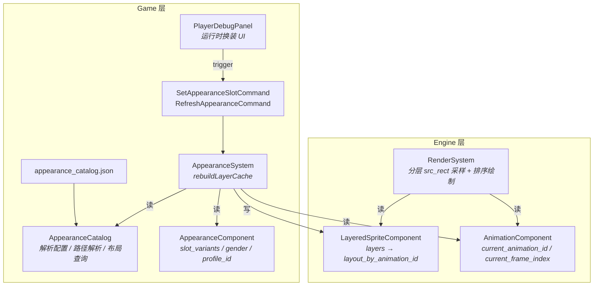
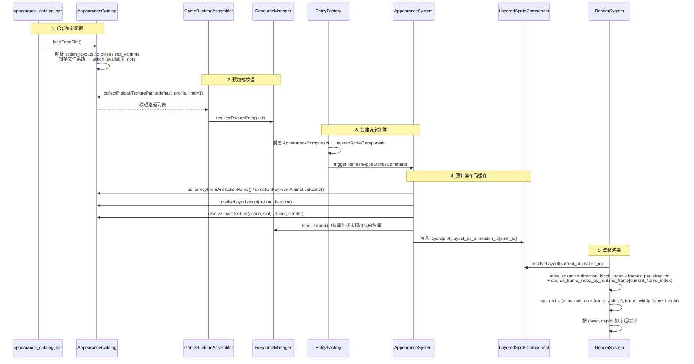
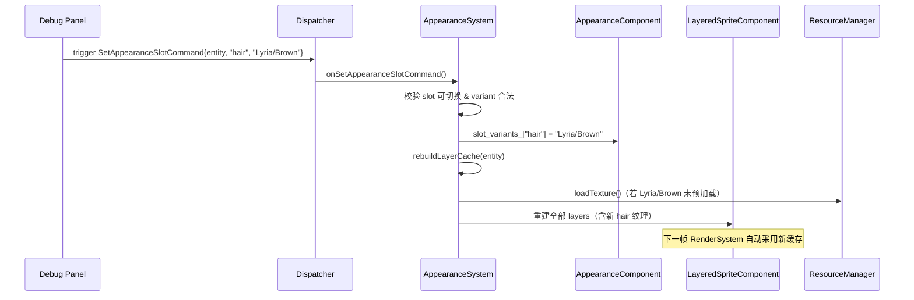
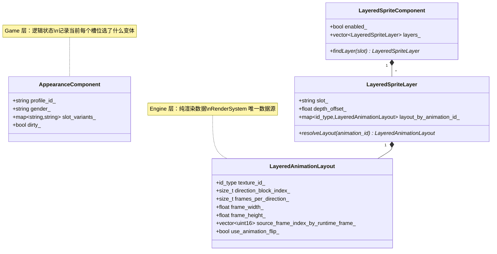
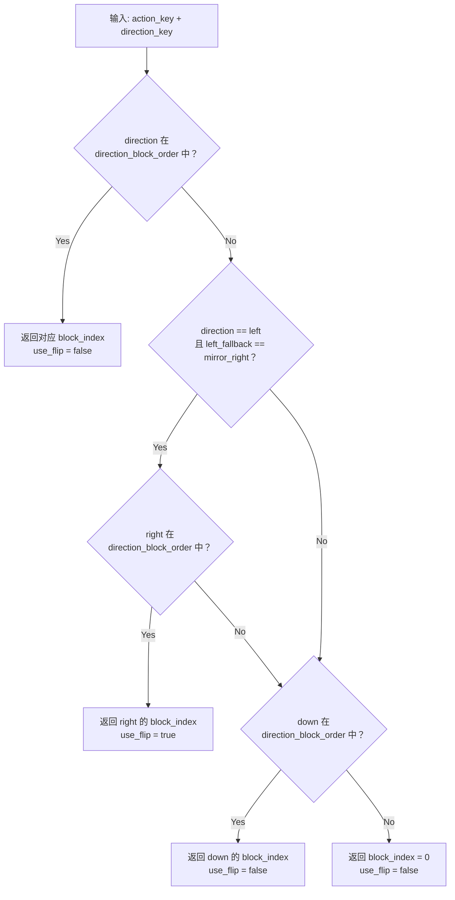
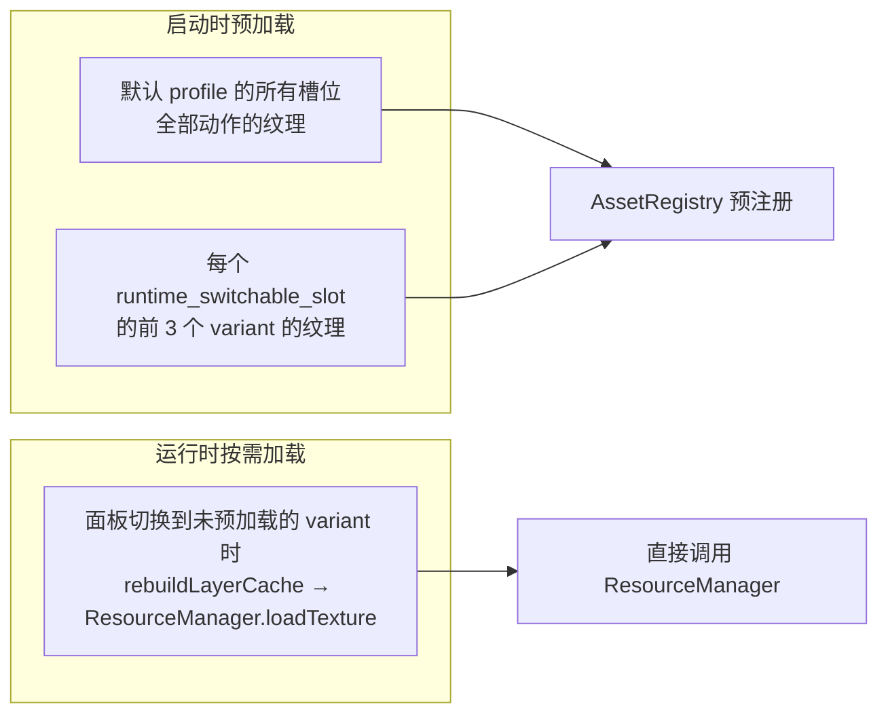

# 角色分层外观系统

## 概述

分层外观系统将角色的视觉表现从"单一 Sprite"升级为"多层可组合"模型，使皮肤、眼睛、服装、发型、饰品、武器等部件可以独立管理和运行时切换。

核心设计原则：
- **预计算优先** — 所有布局信息在外观变更时一次性计算，渲染帧内只做纯数学采样。
- **engine/game 分层** — 引擎层只理解纹理 ID 与帧布局，不依赖外观目录或游戏数据。
- **按需加载** — 启动期仅预加载默认 profile 和少量候选变体，其余在切换时按需加载。

## 层级架构



**关键边界**：`AppearanceSystem` 是唯一跨越 game/engine 边界的桥梁。它读取 game 层数据（`AppearanceCatalog` + `AppearanceComponent`），将结果写入 engine 层组件（`LayeredSpriteComponent`）。`RenderSystem` 对 game 层完全无感。

## 图集布局模型

分层素材以**单行图集**组织，所有方向的帧水平排列在同一行：

```
┌──────────────────────────────────────────────────────────────────────┐
│  block 0 (down)  │  block 1 (up)    │  block 2 (right)  │  block 3 (left)   │
│  frame 0..N-1    │  frame 0..N-1    │  frame 0..N-1     │  frame 0..N-1     │
└──────────────────────────────────────────────────────────────────────┘
 ← atlas_column = direction_block_index × frames_per_direction + source_frame_index →
```

- **direction_block_order** — 配置方向在图集中的排列顺序（默认 `["down", "up", "right", "left"]`）。
- **frames_per_direction** — 每个方向占用的帧数（由 `action_layouts` 显式配置）。
- **Y 坐标恒为 0** — 分层纹理是单行图集，与主角三行 Pre-made 图不同。

## 数据流

### 启动 → 渲染 全链路



### 运行时换装



## 关键数据结构

### appearance_catalog.json 结构

```json
{
  "texture_root": "assets/farm-rpg/.../PNG",
  "default_profile": "player_default",
  "layer_order": ["skin", "eyes", "clothes", "hair", "acc", "weapon"],
  "runtime_switchable_slots": ["skin", "eyes", "clothes", "hair", "acc"],
  "slot_dirs": { "skin": "Skins", "eyes": "Eyes", ... },
  "action_dirs": { "idle": "1. Idle", "walk": "2. Walk", ... },
  "action_layouts": {
    "idle": {
      "frames_per_direction": 4,
      "direction_block_order": ["down", "up", "right", "left"],
      "left_fallback": "none"
    }
  },
  "weapon_action_variants": { "hoe": "Hoe/1", ... },
  "profiles": {
    "player_default": {
      "gender": "male",
      "slots": { "skin": "1", "eyes": "Blue", "hair": "Standard/Brown", ... }
    }
  },
  "slot_variants": {
    "hair": ["Standard/Brown", "Standard/Black", "Lyria/Brown", ...]
  }
}
```

| 字段 | 用途 |
|---|---|
| `layer_order` | 渲染层序（靠前 = 在下方） |
| `runtime_switchable_slots` | 允许运行时切换的槽位（`weapon` 由动作自动决定，不可手动切换） |
| `action_layouts` | 每个动作的图集布局元数据 |
| `left_fallback` | `"mirror_right"` = 缺左方向块时镜像右；`"none"` = 要求左方向块独立存在 |
| `profiles` | 命名外观预设（默认 profile 用于启动初始化和 Reset 功能） |

### 组件关系



## 方向解析策略

`AppearanceCatalog::resolveLayerLayout(action_key, direction_key)` 按以下优先级查找方向块：



当前项目所有动作均有独立的 `left` 方向块，`left_fallback` 配置为 `"none"`。镜像回退策略作为兜底保留，供未来素材缺少左方向块的情况使用。

## 帧索引映射

### 为什么需要映射

主角动画（Pre-made 三行图）的帧序列可能是**非连续**或**重排**的。例如 idle 动画的 4 帧运行时序列可能取自源图的第 0、2、3、0 列。分层素材的帧则是连续排列的。`source_frame_index_by_runtime_frame_` 负责将运行时帧号翻译为分层图集中的源帧号。

### 计算方法

在 `AppearanceSystem::rebuildLayerCache` 中：

```
对于每个 animation_frame：
  relative_x = frame.src_rect.pos.x − min_source_x
  source_frame_index = round(relative_x / frame_width)
  clamp 到 [0, frames_per_direction − 1]
```

### 渲染时使用

```
source_frame_index = source_frame_index_by_runtime_frame[current_frame_index]
atlas_column = direction_block_index × frames_per_direction + source_frame_index
src_rect.x = atlas_column × frame_width
src_rect.y = 0
```

## 预加载策略



`kRuntimeVariantPreloadLimitPerSlot = 3` 控制每个可切换槽位的启动预加载上限，防止大量变体导致启动时间线性膨胀。

## 涉及文件

| 文件 | 层 | 职责 |
|---|---|---|
| `assets/data/appearance_catalog.json` | 数据 | 外观配置：层序、槽位目录、动作布局、profile、变体列表 |
| `src/game/data/appearance_catalog.h/.cpp` | Game | 解析配置、路径解析、布局查询、预加载路径收集 |
| `src/game/component/appearance_component.h` | Game | 逻辑状态：当前 profile、gender、slot_variants |
| `src/game/system/appearance_system.h/.cpp` | Game | 桥梁：监听 command → 预计算布局 → 写入 engine 组件 |
| `src/game/defs/commands.h` | Game | `SetAppearanceSlotCommand` / `RefreshAppearanceCommand` |
| `src/game/debug/player_debug_panel.cpp` | Game | 调试面板：多槽位切换、Reset、Refresh |
| `src/game/runtime/game_runtime_assembler.cpp` | Game | 启动装配：预加载纹理、注入 ResourceManager 到 registry context |
| `src/engine/component/layered_sprite_component.h` | Engine | 渲染数据：`LayeredAnimationLayout` / `LayeredSpriteLayer` |
| `src/engine/system/render_system.cpp` | Engine | 分层渲染：布局驱动 src_rect 计算、深度排序绘制 |
