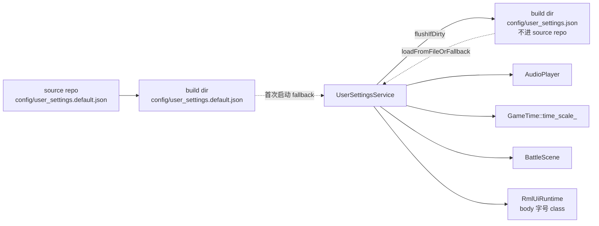
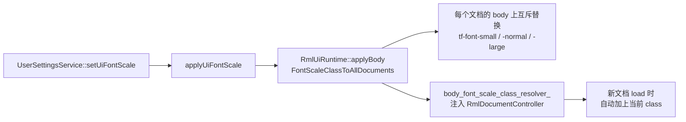

# Options 偏好设置

## 概要

游戏内有两套菜单承担"调整设置"的职能：

- **PauseMenuScene**（系统级）：Resume / Save / Load / Title、全局倍速、BGM 音量、SFX 音量。
- **InventoryMenuScene → Options 标签**（玩家体验偏好）：战斗动画速度、伤害飘字、敌方 HP 条、光标记忆。UI 字号固定为 Normal，不在 Options 标签中暴露。

两套菜单共同使用 `game::runtime::UserSettingsService` 作为偏好设置的**唯一真源**；用户改动立即生效，菜单关闭时一次性落盘。

## 持久化策略

关键约束：
- `config/user_settings.default.json` 是出厂模板，进 source repo；`CopyConfig.cmake` 会自动复制到 build 目录。
- `config/user_settings.json` 由 runtime 写入，**不**进 source repo（已加入 `.gitignore`）。
- `CopyConfig.cmake` 无需修改：source 中不存在用户文件，复制脚本不会覆盖玩家修改。
- 重新构建后，build 目录的 `user_settings.json` MD5 保持不变。

## 四项 Options 偏好

| 配置项 | 默认值 | 取值 | 作用点 |
|--------|--------|------|--------|
| Battle Speed | 1.0 | 1.0 / 1.5 / 2.0 / 3.0 | `BattleScene::animationConfigForPlan` 中按倍率缩放所有 `*_seconds` 字段 |
| Damage Popups | On | On / Off | `BattleDamagePopupController::setEnabled`；禁用时 spawn 早返回，已在播 popup 自然消亡 |
| Enemy HP Bar | On | On / Off | `BattleEnemyHpBarController::setEnabled`；禁用时 reveal 不写 alpha，已显示血条按 fade_seconds 淡出 |
| Cursor Memory | On | On / Off | `BattleScene` 在 `populateActorCommands` 时用 `resolveCursorMemoryDefaultIndex` 解析默认下标 |

## 字号 Normal 固定策略

Inventory Options 标签激活时会把 `UserSettingsService` 中的 UI 字号恢复为 `UiFontScale::Normal`。底层仍保留 body 字号 class 管线，方便未来如果要重新开放字号选项时复用。

- 所有正式 `.rcss`（scenes / theme / hud）的 `font-size: Xdp` 已批量迁移到 `font-size: (X/16)rem`，确保字号随 body 联动。
- `learn/` 与 `tests/` 子目录下的演示 rcss 保持原样，不参与字号联动。

## 与存档系统的关系

Options 偏好**不**入存档（save schema v4 没有相关字段）；偏好是 global 的，跨 save slot 共享。

## 代码入口

| 文件 | 内容 |
|------|------|
| `src/game/runtime/user_settings.h` | `UserSettings` POD + clamp / 序列化 helper |
| `src/game/runtime/user_settings.cpp` | JSON parse / serialize 实现 |
| `src/game/runtime/user_settings_service.{h,cpp}` | service：load/save、apply、setter、事件派发 |
| `src/game/defs/options_events.h` | Options / UI 偏好相关 `*ChangedEvent` |
| `src/game/ui/options_tab_content.{h,cpp}` | Options 标签 UI 逻辑 |
| `src/game/scene/battle_cursor_memory.h` | `resolveCursorMemoryDefaultIndex` 纯函数 |
| `ui/rmlui/scenes/inventory_menu.rml` / `.rcss` | Options 表单与样式 |
| `ui/rmlui/theme/base.rcss` | `body.tf-font-*` 三档字号规则 |
