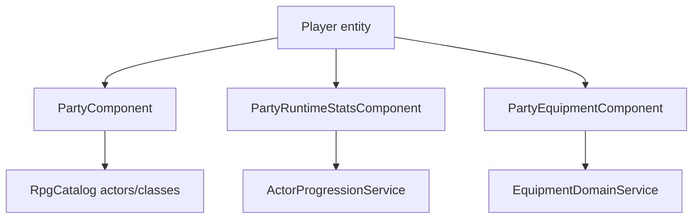
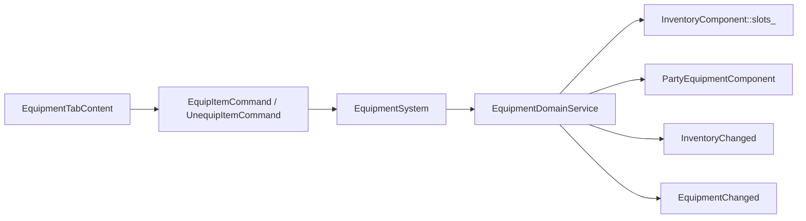
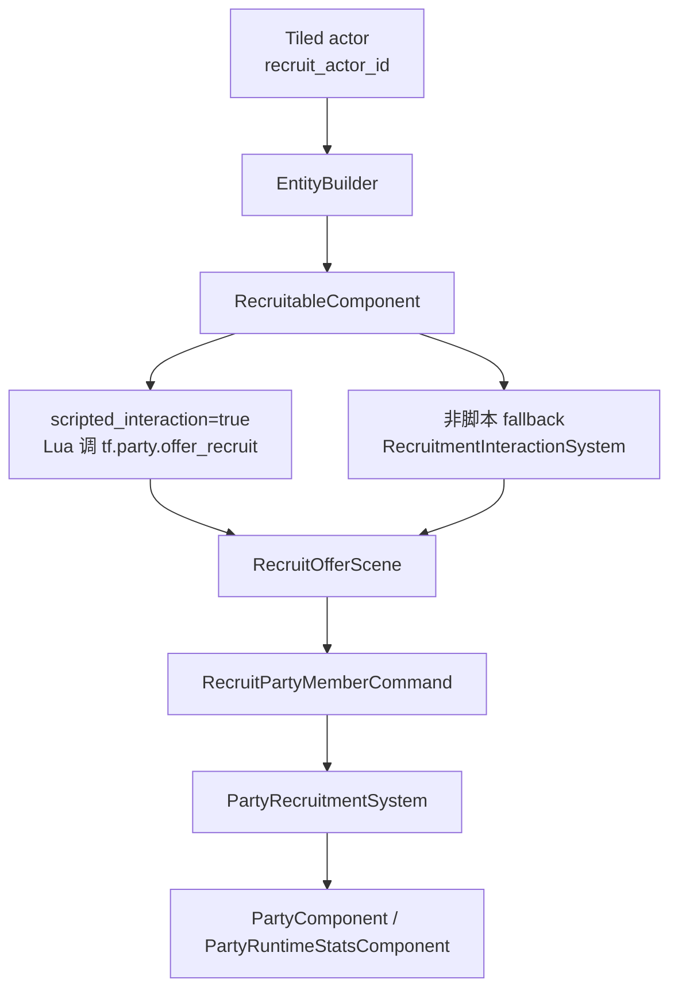
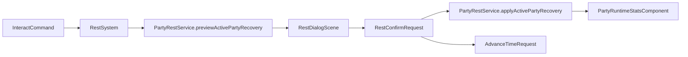

# 队伍、装备、休息与招募

本文把几个分散在代码中的 JRPG 队伍系统串起来：谁在队伍中、每个 actor 的运行时状态如何保存、装备如何改变能力、招募如何入队、休息如何恢复 HP/MP。

## 核心状态

这些状态都挂在玩家实体上，因为队友不一定在当前地图中有独立实体。

| 组件 | 作用 |
|------|------|
| `PartyComponent` | 已招募 actor 列表、当前 active party、最大参战人数（新建默认来自 `kDefaultMaxActivePartyMembers`，当前为 4） |
| `PartyRuntimeStatsComponent` | 按 actor id 保存 `current_hp / current_mp / level / total_exp` |
| `PartyEquipmentComponent` | 按 actor id 保存装备槽位到 item id 的映射 |
| `RecruitableComponent` | 标记地图 actor 可被招募，记录 `actor_id` |

`PartyComponent::max_active_members_` 是运行时字段，不是编译期常量。`SaveService` 会把它写入 `party_state.max_active_members` 并在读档时恢复；旧存档缺这个字段时，`SaveMigrator` 会补默认 4。读档 normalize 会保证上限至少为 1，并按该上限裁剪 active party。

## 角色成长

`ActorProgressionService` 负责 RPG actor 的经验曲线、等级推导和 HP/MP 上限规范化：

- `initialState(...)`：按 actor 初始等级、class、装备计算初始运行时状态。
- `normalizeState(...)`：根据当前总经验重新推导等级，并把 HP/MP clamp 到当前上限内。
- `previewExperience(...)`：预览一笔经验奖励对队伍成员的影响。
- `grantExperience(...)`：战斗胜利后写回 `PartyRuntimeStatsComponent`。

重要约定：`total_exp` 是等级真源，`level` 是缓存。读档和结算时都应按经验重新推导等级。

## 装备

装备写入集中在 `EquipmentDomainService`：

装备服务会处理：

- 目标 actor 是否在 `PartyComponent` 中。
- 物品是否来自有效背包槽位。
- item 是否在 `RpgCatalog` 中有装备数据。
- 装备槽位、职业限制、actor 限制是否匹配。
- 替换下来的旧装备是否能安全回到背包。
- 替换或卸下的旧装备是否仍在 `ItemCatalog` 中有合法物品定义。

`EquipmentDomainService` 会先在背包槽位副本中模拟最终形态：装备时移出新装备、把旧装备放回背包；卸装时把当前装备放回背包。全部校验通过后，才一次写回 `InventoryComponent::slots_` 和 `PartyEquipmentComponent::loadouts_by_actor_id_`，再派发 `InventoryChanged` / `EquipmentChanged`。这样 UI 在任一事件中刷新时，都能看到已经一致的背包与 loadout。

UI 入口在 `InventoryMenuScene` 的 Equipment 标签页。该标签页由 `EquipmentTabContent` 维护装备槽、候选装备、详情文本和点击事件；顶部角色摘要读取 `PartyRuntimeStatsComponent.total_exp`，通过 `ActorProgressionService::normalizeState` 得到当前等级后再调用 `resolveActorStats`，不会固定显示 actor 的初始等级。

## 招募

招募可以走 Lua 正式内容路径，也保留 C++ fallback。

正式 NPC 推荐设置：

- Tiled actor 有 `recruit_actor_id="actor.xxx"`。
- 同时设置 `scripted_interaction=true`。
- Lua 负责对白分支，在合适时机调用 `tf.party.offer_recruit(actor_id, evt.target)`。
- 玩家在 `RecruitOfferScene` 中确认后，才由 `PartyRecruitmentSystem` 写入队伍。

`PartyRecruitmentSystem` 写入时会：

- 确保默认玩家 actor 存在。
- 防止重复招募。
- 把新 actor 加入 `recruited_actor_ids_`。
- 如果 active party 未满 `max_active_members_`，加入 `active_actor_ids_`；满员时只入花名册。
- 为新 actor 创建初始 `ActorRuntimeState`。
- 从当前地图移除 recruiter 实体。

地图加载时，如果 `recruit_actor_id` 已在玩家花名册中，`EntityBuilder` 会跳过该 recruitable actor 的实体生成，避免已招募 NPC 在地图上重复出现。

## 休息

地图上的 `type="rest"` 矩形 object 会生成 `RestArea`。玩家交互时，`RestSystem` 打开 `RestDialogScene`，并预览不同休息小时数的恢复结果。

`PartyRestService` 读取 active party、RPG actor/class、装备和当前运行时 HP/MP，计算恢复预览。确认后由 `RestSystem` 调 `applyActivePartyRecovery` 写回 HP/MP；若运行时状态变化，`RestSystem` 再发 `PartyRuntimeStatsChanged` 让 UI 或其他系统同步。

## 存档关系

| Save 字段 | 来源 |
|-----------|------|
| `party_state.recruited_actor_ids` | `PartyComponent::recruited_actor_ids_` |
| `party_state.active_actor_ids` | `PartyComponent::active_actor_ids_` |
| `party_state.max_active_members` | `PartyComponent::max_active_members_` |
| `party_runtime_state.actor_states` | `PartyRuntimeStatsComponent::states_by_actor_id_` |
| `equipment_state.loadouts` | `PartyEquipmentComponent::loadouts_by_actor_id_` |

这些字段与 catalog 分离。存档保存 actor id、item id 和队伍上限，读档时再用当前 `RpgCatalog` / `ItemCatalog` 恢复语义。当前保存格式为 schema v8；v7 及更早存档迁移到最新版本时会补 `party_state.max_active_members = 4`。

## 新增一个可招募角色

1. 在 `assets/data/rpg/actors.json` 中定义 actor。
2. 确认 class、初始等级、战斗视觉和头像引用有效。
3. 在 Tiled actor 上配置 `recruit_actor_id`。
4. 写 Lua 对话脚本，使用 `tf.party.offer_recruit` 或 `lib.recruit_npc`。
5. 在 `scripts/bootstrap.lua` 中 require 新脚本。
6. 若要让角色有初始装备，补 `equipment` 和初始配置对应逻辑。

## 相关文件

| 文件 | 说明 |
|------|------|
| `src/game/component/party_component.h` | 队伍成员状态 |
| `src/game/component/party_runtime_stats_component.h` | HP/MP/等级/经验 |
| `src/game/component/party_equipment_component.h` | 装备 loadout |
| `src/game/domain/actor_progression_service.*` | 经验和等级 |
| `src/game/domain/equipment_domain_service.*` | 装备原子写入 |
| `src/game/domain/party_rest_service.*` | 休息预览与恢复 |
| `src/game/system/recruitment_interaction_system.*` | 非脚本招募 fallback |
| `src/game/system/party_recruitment_system.*` | 入队写入 |
| `src/game/system/rest_system.*` | 休息交互 |
| `src/game/ui/equipment_tab_content.*` | 装备标签页 |
| `src/game/scene/recruit_offer_scene.*` | 招募确认 Scene |
| `src/game/scene/rest_dialog_scene.*` | 休息确认 Scene |
