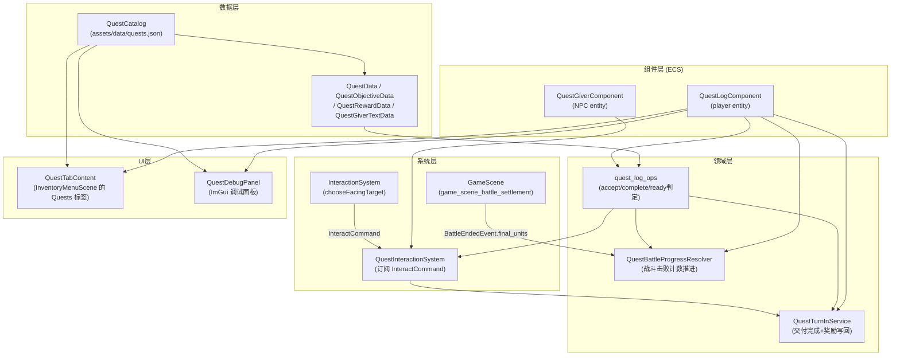
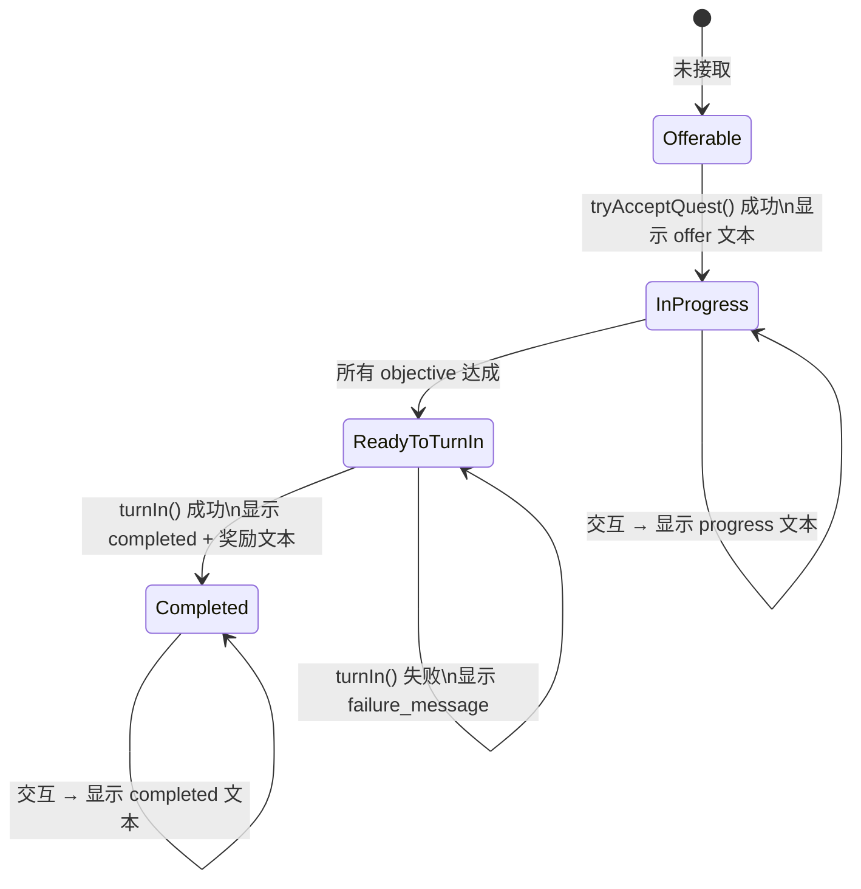
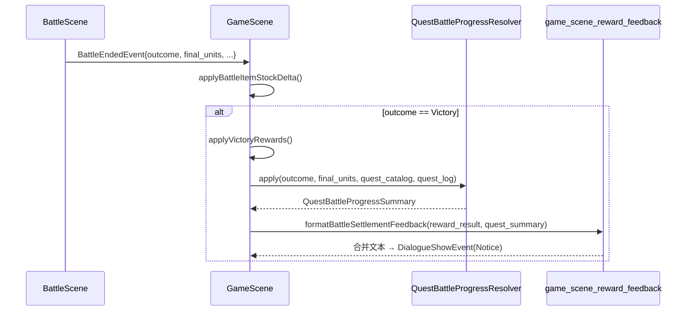

# JRPG 任务系统（Quest System）

## 概述

任务系统实现了"接任务 → 杀怪计数 → 回 NPC 交付"的最小 JRPG 闭环。当前只支持 `DefeatEnemyCount` 类型目标；系统设计为可扩展，后续可以新增采集、交物、探索触发等 objective 类型。

核心原则：

- **静态目录与运行时真相分离**：`QuestCatalog` 只持有静态配置，运行时状态由玩家实体上的 `QuestLogComponent` 独占持有。
- **不污染现有系统边界**：任务逻辑通过独立系统 `QuestInteractionSystem` 订阅 `InteractCommand`，不修改 `DialogueSystem` 或 `BattleScene`。
- **稳定的 progress key**：objective 进度使用 `quest_id::objective_id` 复合 key，避免 id 排序或文案变化导致进度丢失。
- **存档闭环**：`QuestLogComponent` 与 `SaveData::quest_state` 完整双向映射，支持 save/load roundtrip。

## 架构分层



## 数据模型

### 静态数据（`quest_data.h`）

| 类型 | 关键字段 |
|---|---|
| `QuestData` | `id_ / id_hash_ / title_ / description_ / objectives_ / rewards_ / giver_text_` |
| `QuestObjectiveData` | `id_ / kind_(DefeatEnemyCount) / enemy_id_ / enemy_id_hash_ / required_count_` |
| `QuestRewardData` | `gold_ / items_` |
| `QuestRewardItemData` | `item_id_ / item_id_hash_ / count_` |
| `QuestGiverTextData` | `offer_ / progress_ / ready_to_turn_in_ / completed_` |

当前 `QuestObjectiveKind` 只有 `DefeatEnemyCount = 0`，后续可扩展为 tagged union。

### Objective Progress Key 规则

progress key 由统一 helper 生成，规则为：

```
key = quest_id + "::" + objective_id
```

例如 `quest.village.goblin_cleanup::kill_slimes`。

禁止业务代码手写字符串拼接，必须通过 `game::data::makeQuestObjectiveProgressKey(quest_id, objective_id)` 生成。

## QuestCatalog

`QuestCatalog` 是任务静态目录，独立于 `RpgCatalog`，从 `assets/data/quests.json` 加载。

### JSON 格式

```json
{
  "schema_version": 1,
  "quests": [
    {
      "id": "quest.village.goblin_cleanup",
      "title": "Slime Cleanup",
      "description": "Defeat slimes near the village.",
      "objectives": [
        {
          "id": "kill_slimes",
          "kind": "defeat_enemy_count",
          "enemy_id": "enemy.slime",
          "required_count": 3
        }
      ],
      "rewards": {
        "gold": 50,
        "items": [{ "item_id": "potion", "count": 2 }]
      },
      "giver_text": {
        "offer": "Can you help us drive away the slimes?",
        "progress": "We still need more help.",
        "ready_to_turn_in": "You did it? That's a relief.",
        "completed": "Thank you again."
      }
    }
  ]
}
```

### 主要 API

```cpp
const QuestData* findQuest(entt::id_type id_hash) const;
const QuestData* findQuest(std::string_view id) const;
std::vector<const QuestData*> listQuests() const;
bool validateReferences(const RpgCatalog*, const ItemCatalog*, std::string& out_error) const;
```

`validateReferences()` 会检查所有 quest 中引用的 `enemy_id` 和 `item_id` 是否存在于对应目录中。

## 运行时真相：QuestLogComponent

玩家实体上的 `QuestLogComponent` 是任务运行时的唯一真相持有者：

```cpp
struct QuestLogComponent {
    std::vector<std::string> active_quests{};      // 进行中的任务 id 列表
    std::vector<std::string> completed_quests{};   // 已完成的任务 id 列表
    std::unordered_map<std::string, int> objective_progress{}; // progress key -> 当前计数
};
```

`active_quests` 和 `completed_quests` 中存储的是字符串 id（而不是 hash），方便存档序列化和调试。

## 领域操作

### quest_log_ops

无状态工具函数集（`game/domain/quest_log_ops.h`），负责 `QuestLogComponent` 的所有状态变更：

| 函数 | 作用 |
|---|---|
| `isQuestActive(quest_log, quest_id_hash)` | 判断任务是否进行中 |
| `isQuestCompleted(quest_log, quest_id_hash)` | 判断任务是否已完成 |
| `isQuestReadyToTurnIn(quest_log, quest)` | 判断所有 objective 是否满足 |
| `tryAcceptQuest(quest_log, quest)` | 接取任务并初始化 progress；重复接取返回 false |
| `completeQuest(quest_log, quest_id)` | 将任务从 active 移到 completed |
| `eraseQuestProgress(quest_log, quest_id)` | 清理该任务对应的所有 progress 条目 |

### QuestBattleProgressResolver

负责从战斗结果推进 `DefeatEnemyCount` 类型目标。

```cpp
QuestBattleProgressSummary apply(
    BattleOutcome outcome,
    const std::vector<BattleUnit>& final_units,
    const QuestCatalog& quest_catalog,
    QuestLogComponent& quest_log) const;
```

规则：

- 只在 `BattleOutcome::Victory` 下推进；`Escape / Defeat` 不计任务进度
- 统计 `final_units` 中 `side == Enemy && hp <= 0 && source_enemy_id.has_value()` 的单位数量
- `source_enemy_id` 缺失时显式跳过，不从名字反推
- 只推进 active quest，completed quest 不重复计数
- 返回 `QuestBattleProgressSummary`，包含 `updated_quests` 和 `became_ready_to_turn_in_quests` 两个列表，供反馈格式化使用

### QuestTurnInService

负责任务交付完成与可选奖励写回：

```cpp
QuestTurnInResult turnIn(entt::entity player,
                         const QuestData& quest,
                         QuestLogComponent& quest_log) const;
```

执行顺序：

1. 检查 `isQuestReadyToTurnIn()`，未满足则返回 `NotReady`
2. 对奖励做 preflight：
   检查是否缺少 `PlayerWalletComponent` / `InventoryComponent`
   若存在 item reward，则先复制一份背包槽位并执行 `simulateAdd()`，确认整笔奖励都能放下
3. 若 preflight 通过，再写入 `PlayerWalletComponent`
4. 若存在 item reward，通过 `InventoryDomainService::addItem()` 写入
5. 调用 `completeQuest()` → 移出 active，加入 completed
6. 调用 `eraseQuestProgress()` → 清理 progress map
7. 返回 `QuestTurnInResult{status, gold_reward, item_rewards}`

当前约束：

- 背包满、缺少钱包、缺少背包组件这类 **preflight 失败** 会直接返回 `failure_message`
- 若 preflight 通过后仍出现异常的部分写入，当前实现会写 `warn log`，但不会回滚已完成的交付

## 交互流程

### 目标优先级

`InteractionSystem::chooseFacingTarget()` 的交互对象优先级：

```
Merchant > QuestGiver > Dialogue NPC > Chest > Rest
```

带 `QuestGiverComponent` 的实体优先于普通对话 NPC，且 `DialogueSystem` 会在检测到 `QuestGiverComponent` 时显式跳过，避免同一次 `InteractCommand` 被两个系统同时处理。

### QuestInteractionSystem 状态机

`QuestInteractionSystem` 订阅 `InteractCommand`，根据玩家任务状态做出对应响应：



交互反馈走 `DialogueChannel::Notice`，由 `FloatingNoticeView` 显示为短提示，不占用底部主对话框。

### QuestGiverComponent 配置

Quest giver 通过地图对象属性（`quest_offer_id`）实例级配置，不写死到全局 actor blueprint。当前实现由 `EntityBuilder` 在地图 actor 实例构建时附加 `QuestGiverComponent`。

若同一 actor object 同时声明了 `quest_offer_id` 与 `shop_id`：

- loader 会给出 warn
- 本阶段按 **merchant 优先** 处理
- 该实体最终不会挂上 `QuestGiverComponent`

## 战斗结算集成

战斗结束后，`game_scene_battle_settlement.cpp` 中的 `processBattleEndedForGameScene()` 统一编排所有写回逻辑：



若同一场 Victory 既有奖励反馈又有任务推进反馈，两者合并为同一条通知文本，避免同帧覆盖 `DialogueChannel::Notice`。

### 当前项目配置

当前项目自带一条最小任务配置（`assets/data/quests.json`）：

- quest id：`quest.village.goblin_cleanup`
- objective：击败 `enemy.slime` 3 次
- reward：`50 gold + potion x2`
- giver text：已配置 `offer / progress / ready_to_turn_in / completed` 四组文本

## 存档与恢复

`QuestLogComponent` 与 `SaveData::quest_state` 完整双向映射：

| 存档字段 | 对应运行时字段 |
|---|---|
| `quest_state.active_quests` | `QuestLogComponent::active_quests` |
| `quest_state.completed_quests` | `QuestLogComponent::completed_quests` |
| `quest_state.objective_progress` | `QuestLogComponent::objective_progress` |

- **capture**（存档时）：`SaveService` 从玩家实体的 `QuestLogComponent` 拷贝到 `QuestStateSaveData`
- **apply**（读档时）：`SaveService` 将 `QuestStateSaveData` 还原回 `QuestLogComponent`
- 若旧存档缺少 `quest_state` 节点，`SaveMigrator` 会自动补全空数组/空对象，保证向前兼容

## Quest UI

`QuestTabContent`（`src/game/ui/quest_tab_content.h/.cpp`）嵌入在 `InventoryMenuScene` 的 `Quests` 标签页中，遵循现有 `RmlDocumentController + IMenuTabContent` 模式。

### ViewModel

```cpp
struct QuestEntryViewModel {
    Rml::String title{};
    Rml::String description{};
    Rml::String progress_summary{};  // 例如 "1 / 3"
    Rml::String status_label{};      // "进行中" / "可交付" / "已完成"
    bool has_description{false};
    bool has_progress_summary{false};
};

struct QuestTabViewState {
    std::vector<QuestEntryViewModel> active_quest_entries{};
    std::vector<QuestEntryViewModel> completed_quest_entries{};
    bool has_active_quests{false};
    bool has_completed_quests{false};
};
```

- 激活标签页（`onActivated()`）时调用 `syncViewState()` 刷新数据
- active quest 展示 `title + description + progress_summary + status_label`
- completed quest 展示 `title + status_label`

## 调试面板（QuestDebugPanel）

`QuestDebugPanel` 是独立的 ImGui 调试面板，提供以下操作：

- **Accept**：直接接取选中任务
- **Progress**：对选中任务的指定 objective 增加指定步长进度
- **Fill**：一次性将所有 objective 填满（达到 `required_count`）
- **Turn In**：直接执行交付（需要先满足条件）
- **Clear**：清空任务状态（从 active/completed 及 progress 中移除）

配合 `BattleDebugPanel` 可验证完整链路：选择 troop → 发起战斗 → 确认 kill count 推进 → 回 NPC 交付。

## 测试覆盖

| 测试文件 | 覆盖内容 |
|---|---|
| `tests/game/quest_catalog_test.cpp` | 目录加载、id 查找、`validateReferences` |
| `tests/game/quest_interaction_system_test.cpp` | 接任务 / 进度提示 / 交付 / 重复接取保护 |
| `tests/game/quest_battle_progress_resolver_test.cpp` | Victory kill count 推进、非 Victory 不推进、多任务同步推进 |
| `tests/game/quest_turn_in_service_test.cpp` | 交付完成、gold/item 奖励写回、未满足条件返回 NotReady |
| `tests/game/quest_save_roundtrip_test.cpp` | active/completed/progress 存档与恢复 roundtrip |
| `tests/game/quest_tab_content_test.cpp` | QuestTabContent 的 RmlUi data model 绑定与视图状态 |
| `tests/game/quest_debug_panel_helpers_test.cpp` | 调试面板 helpers 的操作正确性 |
| `tests/game/quest_debug_panel_registration_test.cpp` | QuestDebugPanel 注册与初始化 |

## 涉及文件

| 文件 | 层 | 职责 |
|---|---|---|
| `src/game/data/quest_data.h` | 数据 | 任务静态数据类型定义与 progress key helper |
| `src/game/data/quest_catalog.h/.cpp` | 数据 | 任务目录加载与查询 |
| `src/game/component/quest_log_component.h` | 组件 | 玩家任务运行时真相 |
| `src/game/component/quest_giver_component.h` | 组件 | NPC 任务给予者配置（实例级） |
| `src/game/domain/quest_log_ops.h/.cpp` | 领域 | 无状态任务日志操作函数集 |
| `src/game/domain/quest_battle_progress_resolver.h/.cpp` | 领域 | 战斗 Victory 击败计数推进 |
| `src/game/domain/quest_turn_in_service.h/.cpp` | 领域 | 任务交付完成与奖励写回 |
| `src/game/system/quest_interaction_system.h/.cpp` | 系统 | 订阅 InteractCommand，驱动任务交互状态机 |
| `src/game/ui/quest_tab_content.h/.cpp` | UI | InventoryMenuScene 任务标签页 |
| `src/game/debug/quest_debug_panel.h/.cpp` | 调试 | ImGui 任务调试面板 |
| `src/game/debug/quest_debug_panel_helpers.h/.cpp` | 调试 | 调试面板操作 helpers |
| `src/game/scene/game_scene_battle_settlement.h/.cpp` | 场景 | 战斗结束统一结算（含任务推进步骤） |
| `src/game/scene/game_scene_reward_feedback.h/.cpp` | 场景 | 奖励与任务推进摘要合并通知 |
| `src/game/save/save_data.h` | 存档 | `QuestStateSaveData` schema |
| `assets/data/quests.json` | 资源 | 任务静态配置 |

## 扩展指南

| 方向 | 当前状态 | 后续扩展方式 |
|---|---|---|
| 新 objective 类型 | 只有 `DefeatEnemyCount` | 在 `QuestObjectiveKind` 中新增枚举，扩展 `QuestBattleProgressResolver` 或新增对应 resolver |
| 多类型目标（同一 quest） | 支持（objectives 是数组） | 直接在 JSON 中添加多个 objective 条目 |
| 任务链 / 前置依赖 | 未支持 | 在 `QuestData` 中新增 `prerequisite_quest_id` 字段，在 `tryAcceptQuest` 前检查 |
| 分支对话 | 未支持 | 引入独立对话脚本，不要复用当前 `DialogueComponent` 路径 |
| 地图标记 / 追踪箭头 | 未支持 | 在 `QuestTabContent` 或 HUD 层新增独立追踪组件 |
| 可重复任务 | 未支持 | 扩展 `QuestData` 加 `repeatable` 标志，`tryAcceptQuest` 对 completed 任务也允许重新接取 |
