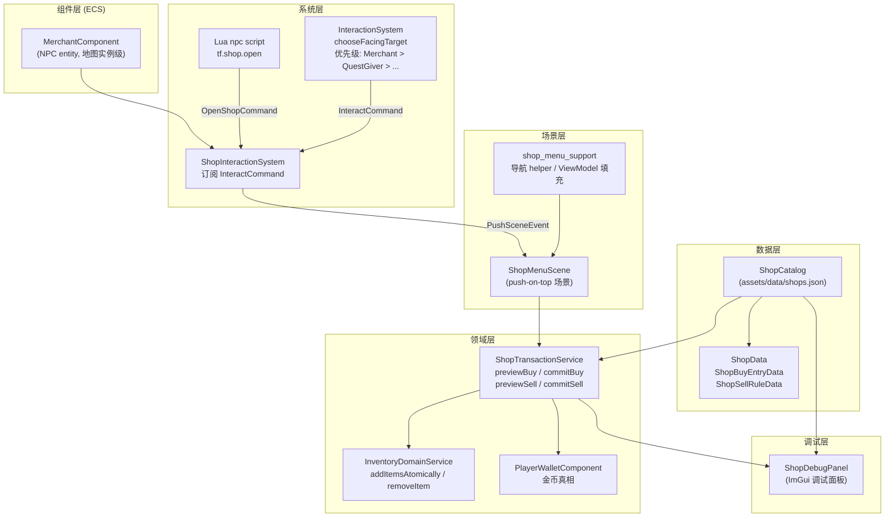
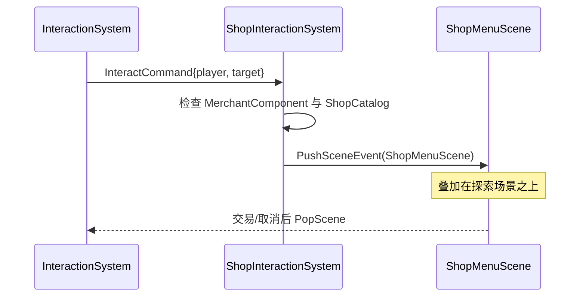
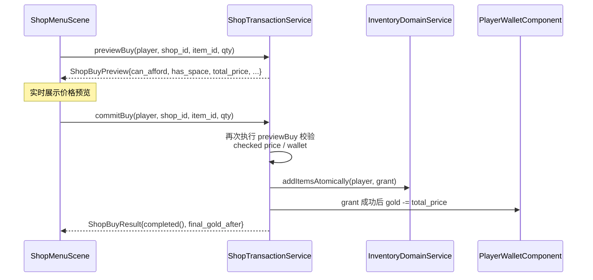
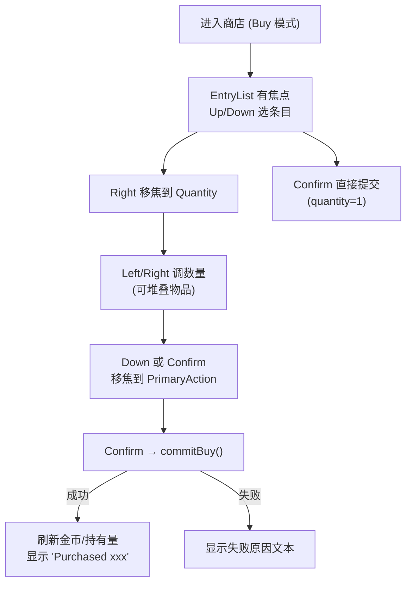

# JRPG 商店系统（Shop System）

## 概述

商店系统实现了"与 NPC 商人交互 → 进入买卖场景 → 原子交易 → 背包/金币更新"的最小 JRPG 商店闭环。脚本化商人可以先由 Lua 播放 greeting，再按时间或任务状态选择一个静态 `shop_id` 预设交给 C++ 打开。核心设计原则：

- **覆盖式场景**：商店作为独立的 `ShopMenuScene` 叠加在探索场景之上，交易完成或取消后 pop 回探索。
- **原子交易**：每笔交易都先 preview（不修改状态），commit 会重新 preview；金额计算溢出会被拒绝，背包写入和金币写入保持全有全无。
- **目录分离**：买入目录（`buy_entries`）按商店隔离；卖出规则（`sell_rules`）全局共享，任何商店都适用同一套规则。
- **不引入新存档 schema**：商店交易的所有状态改变（背包、金币）直接复用现有 `InventoryComponent` 与 `PlayerWalletComponent` 存档路径。

## 架构分层



## 数据模型

### 静态数据（`shop_data.h`）

| 类型 | 关键字段 |
|---|---|
| `ShopData` | `id_ / id_hash_ / title_ / greeting_ / buy_entries_` |
| `ShopBuyEntryData` | `item_id_ / item_id_hash_ / buy_price_ / stock_`（stock 为可选） |
| `ShopSellRuleData` | `item_id_ / item_id_hash_ / sell_price_` |

**关键区别**：`buy_entries_` 属于单个 `ShopData`（每家店卖什么、卖多少钱各自独立），`ShopSellRuleData` 是全局规则（存在 `ShopCatalog` 的独立 map 里），与具体商店无关——只要物品在 sell_rules 中有记录，进入任何商店都可以卖出。

关于 `stock_` 的当前状态：

- `ShopCatalog` 会解析并保留 `ShopBuyEntryData::stock_`
- 但当前 `ShopTransactionService` 和 `ShopMenuScene` **还不会消费、扣减或持久化 merchant stock**
- 因此本阶段运行时语义仍是“静态无限库存”；`stock_` 更接近为后续限量库存功能预留的 schema 字段

## ShopCatalog

`ShopCatalog` 是商店静态目录，从 `assets/data/shops.json` 加载。

### JSON 格式

```json
{
  "schema_version": 1,
  "shops": [
    {
      "id": "shop.village.general",
      "title": "Village General Store",
      "greeting": "Take a look.",
      "buy_entries": [
        { "item_id": "potion",          "buy_price": 30 },
        { "item_id": "strawberry_seed", "buy_price": 12 }
      ]
    }
  ],
  "sell_rules": [
    { "item_id": "potion",          "sell_price": 15 },
    { "item_id": "material_timber", "sell_price": 5  },
    { "item_id": "strawberry_item", "sell_price": 4  }
  ]
}
```

`sell_rules` 是顶层数组，不挂在任何一家商店下面。

### 当前项目配置

当前项目自带一份最小可玩的商店配置：

- 基础 fallback：`shop.village.general`，由地图上的 `MerchantComponent` 引用，供非脚本路径、地图标记和调试复用
- Lua 商人 Josh 的静态预设：`shop.village.general.day`、`shop.village.general.night`、`shop.village.general.post_slime_cleanup`
- 当前可通过 Josh 正常交互看到的日/夜预设会合起来覆盖全部装备；`shop.village.general` 不参与脚本化商人的日夜库存分摊
- `scripts/npcs/merchant.lua` 根据 `lib.time.is_night()` 与 `tf.quest.status("quest.village.goblin_cleanup")` 选择预设，然后调用 `tf.shop.open`
- sell rules：覆盖 `potion`、`material_timber`、作物与木制 / 铁制装备的卖出价

### 主要 API

```cpp
const ShopData*         findShop(entt::id_type id_hash) const;
const ShopData*         findShop(std::string_view id) const;
const ShopBuyEntryData* findBuyEntry(entt::id_type shop_id_hash, entt::id_type item_id_hash) const;
const ShopSellRuleData* findSellRule(entt::id_type item_id_hash) const;
bool                    validateReferences(const ItemCatalog*, std::string& out_error) const;
```

## MerchantComponent

商人 NPC 的实例级配置，由地图对象属性（`shop_id`）附加到 NPC 实体上：

```cpp
struct MerchantComponent {
    std::string shop_id_{};
    entt::id_type shop_id_hash_{entt::null};
};
```

`shop_id` 对应 `ShopCatalog` 中的某个商店定义。同一个 blueprint NPC 在不同地图实例上可以绑定不同的 `shop_id`，实现同类 NPC 卖不同商品。

实际挂载路径在地图 actor 实例构建阶段（`EntityBuilder`）。若同一 actor object 同时声明了 `shop_id` 与 `quest_offer_id`，loader 会给出 warn，并按 **merchant 优先** 处理，只附加 `MerchantComponent`。

## 交互流程

玩家按 `F`（interact）时，`InteractionSystem::chooseFacingTarget()` 按优先级选择目标：

```
Merchant > QuestGiver > Dialogue NPC > Chest > Rest
```

`ShopInteractionSystem` 订阅 `InteractCommand`：



`DialogueSystem` 检测到目标带 `MerchantComponent` 时会显式跳过，不会同时触发普通对话。

## ShopTransactionService

所有交易逻辑的唯一入口，采用 **preview → commit** 两步原子模式。

### Preview / Commit 模式



Sell 方向同样是 `previewSell / commitSell`：提交时重新 preview 精确槽位，`removeItem` 成功后才 `gold += total_price`。买卖双方的 `unit_price * quantity` 与钱包加减都使用 checked arithmetic；溢出统一返回 `InvalidQuantity`，背包和金币不变。

### Buy 校验顺序

1. player 有效、有 `PlayerWalletComponent` + `InventoryComponent`
2. quantity > 0
3. shop_id 在 `ShopCatalog` 中存在
4. item_id 在 `ItemCatalog` 中存在，且不可堆叠物品不能一次买多个
5. buy_entry 在该商店的条目列表中存在（`ItemNotSoldHere`）
6. `unit_price * quantity` 可安全计算（`InvalidQuantity`）
7. `wallet.gold_ >= total_price`（`InsufficientGold`）
8. `wallet.gold_ - total_price` 可安全计算（`InvalidQuantity`）
9. 模拟背包写入后有空间（`InventoryFull`）

### Sell 校验顺序

1. player 有效、有 `PlayerWalletComponent` + `InventoryComponent`
2. quantity > 0
3. item_id 在 `ItemCatalog` 中存在
4. item_id 在全局 `sell_rules` 中有记录（`ItemNotSellable`）
5. slot_index 有效且该槽确实持有 item_id（`SlotMismatch`）
6. slot 中的数量 >= requested_quantity（`InsufficientItemCount`）
7. `unit_price * quantity` 与 `wallet.gold_ + total_price` 可安全计算（`InvalidQuantity`）

### 失败原因枚举

| `ShopTradeFailureReason` | 含义 |
|---|---|
| `None` | 成功 |
| `InvalidPlayer` | 玩家实体无效或缺少组件 |
| `InvalidShop` | shop_id 不存在 |
| `InvalidItem` | item_id 不存在 |
| `InvalidQuantity` | 数量 ≤ 0、不可堆叠物品一次买多个，或价格 / 钱包计算溢出 |
| `ItemNotSoldHere` | 该物品不在此商店出售 |
| `ItemNotSellable` | 该物品没有卖出规则 |
| `InsufficientGold` | 金币不足 |
| `InventoryFull` | 背包空间不足 |
| `SlotMismatch` | 指定槽位物品与预期不符 |
| `InsufficientItemCount` | 槽位中物品数量不足 |

## ShopMenuScene：UI 与输入状态机

`ShopMenuScene` 是覆盖式场景，用 `PushSceneEvent` 叠加在 `GameScene` 之上。UI 文件为 `ui/rmlui/scenes/shop_menu.rml`，data model 名称为 `shop_menu`。

### 模式与焦点区域

```
ShopMenuMode:   Buy  /  Sell

ShopMenuFocusArea:
  ModeToggle    — Buy / Sell 切换控件
  CategoryTabs   — 类别分页标签
  EntryList     — 商品列表（买入条目或背包槽位）
  Quantity      — 数量调节区
  PrimaryAction — 确认买入 / 卖出按钮
```

### 输入路径

商店场景采用"场景级输入状态机"方案：

- 键盘 / 手柄：走 `menu_up/down/left/right/confirm/cancel` 动作，由 `ShopMenuScene` 拦截后计算 `ShopMenuNavigationDecision`
- 鼠标点击：走 RML `data-event-click`

`ShopMenuNavigationDecision` 由无状态 helper `resolveShopMenuNavigation()` 计算，输出 `next_focus_area / switch_mode / entry_delta / quantity_delta / confirm_trade`。

### Buy 模式操作流



### Sell 模式操作流

Sell 列表来源是**真实背包**中的所有非空槽位：

- 若某槽位物品在 `sell_rules` 中有记录，则该条目可卖
- 若没有 sell rule，则该条目仍会显示在列表中，但会以 disabled 状态呈现，价格显示为 `--`
- commit 时使用 `slot_index` 精确回写，调用 `commitSell(player, item_id, qty, slot_index)`

操作流与 Buy 模式整体对称，但当前实现不会把不可卖物品从主商店列表中过滤掉。

### 导航状态提示

| 当前焦点 | 状态栏提示 |
|---|---|
| `ModeToggle` | "Left / Right switches Buy and Sell. Down enters the list." |
| `EntryList` | "Up / Down selects. Right opens quantity. Confirm goes to Buy/Sell." |
| `Quantity` (可调) | "Left / Right changes quantity. Down or Confirm goes to Buy/Sell." |
| `Quantity` (固定) | "Quantity is fixed at x1. Down or Confirm goes to Buy/Sell." |
| `PrimaryAction` | "Confirm to buy/sell. Left returns to the list." |

`menu_cancel` 在任意焦点区域均触发 `onClose()`，pop 回探索场景。

数量输入还有一个当前实现细节：

- Buy 模式的 UI 上限只根据物品 `stack_limit_`（并夹到 `1..99`）决定
- 它**不会**提前根据金币、背包空间或 `stock_` 缩小数量上限
- 真正能否提交仍以 `previewBuy()` / `commitBuy()` 的结果为准

### ViewModel 结构

Buy 列表条目：

```cpp
struct ShopBuyEntryViewModel {
    int index{};
    entt::id_type item_id_hash{};
    Rml::String icon_decorator{};   // RML decorator 名称，用于物品图标
    Rml::String item_name{};
    Rml::String price_text{};       // 例如 "30 G"
    Rml::String owned_text{};       // 例如 "Owned: 2"
    bool is_selected{};
    bool is_disabled{};
};
```

Sell 列表条目：

```cpp
struct ShopSellEntryViewModel {
    int index{};
    int slot_index{};               // 背包真实槽位索引，commit 时使用
    entt::id_type item_id_hash{};
    Rml::String icon_decorator{};
    Rml::String item_name{};
    Rml::String count_text{};       // 例如 "x5"
    Rml::String price_text{};       // 例如 "15 G"
    bool is_selected{};
    bool is_disabled{};
};
```

`slot_index` 在 sell commit 时直接传入 `commitSell()`，保证"预览时的槽位"和"提交时的槽位"一致；若槽位在两次调用之间发生变化，resolver 会检测到 `SlotMismatch` 并拒绝。

## 存档集成

商店交易不引入专用存档字段：

- 买入物品写入 `InventoryComponent` → 通过现有 `SaveService::capture()` 存档
- 卖出物品从 `InventoryComponent` 移除 → 同上
- 金币变更写入 `PlayerWalletComponent` → 通过现有钱包存档路径
- `InventoryChanged` 事件触发 `HotbarSystem` 同步，无需额外处理

## 调试面板（ShopDebugPanel）

`ShopDebugPanel` 是独立的 ImGui 调试面板，提供以下操作：

- **选商店**：下拉选择 `ShopCatalog` 中的所有商店
- **直接 Buy**：选条目 + 输入数量 → 调用 `commitBuy()`，展示结果
- **直接 Sell**：选背包槽 + 输入数量 → 调用 `commitSell()`，展示结果
- **Gold Seed**：按指定步长增加玩家金币（测试用）
- **显示 / 隐藏不可卖槽**：切换是否在 sell 列表中展示 disabled 条目

## 测试覆盖

| 测试文件 | 覆盖内容 |
|---|---|
| `tests/game/shop_catalog_test.cpp` | 目录加载、shop/entry/sell_rule 查找、`validateReferences` |
| `tests/game/shop_transaction_service_test.cpp` | previewBuy/Sell 各失败路径、commitBuy/Sell 原子性、金额溢出拒绝、金币与背包状态 |
| `tests/game/shop_interaction_system_test.cpp` | `InteractCommand` → `PushSceneEvent` 触发、merchant 缺失/无效时静默跳过 |
| `tests/game/shop_menu_navigation_test.cpp` | `resolveShopMenuNavigation()` 各焦点区域的导航决策 |
| `tests/game/shop_menu_buy_flow_test.cpp` | Buy 模式选条目 → 调整数量 → 提交完整 UI 流程 |
| `tests/game/shop_menu_sell_flow_test.cpp` | Sell 模式背包列表 → 选条目 → 提交完整 UI 流程 |
| `tests/game/shop_menu_scene_smoke_test.cpp` | `ShopMenuScene` 初始化、data model 绑定、RML/RCSS 关键约束 |
| `tests/game/shop_save_roundtrip_test.cpp` | 商店交易后背包+金币 save/load roundtrip |
| `tests/game/shop_debug_panel_helpers_test.cpp` | 调试面板 helper 操作正确性 |
| `tests/game/shop_debug_panel_registration_test.cpp` | ShopDebugPanel 注册与初始化 |

## 涉及文件

| 文件 | 层 | 职责 |
|---|---|---|
| `src/game/data/shop_data.h` | 数据 | 商店静态数据类型（`ShopData / ShopBuyEntryData / ShopSellRuleData`） |
| `src/game/data/shop_catalog.h/.cpp` | 数据 | 商店目录加载、buy_entry / sell_rule 查询 |
| `src/game/component/merchant_component.h` | 组件 | NPC 商人实例绑定（`shop_id_`） |
| `src/game/domain/inventory_domain_service.h/.cpp` | 领域 | `addItemsAtomically` / `removeItem` 提供交易背包写入语义 |
| `src/game/domain/shop_transaction_service.h/.cpp` | 领域 | preview/commit 原子交易逻辑 |
| `src/game/system/shop_interaction_system.h/.cpp` | 系统 | 订阅 `InteractCommand`，push `ShopMenuScene` |
| `src/game/scene/shop_menu_scene.h/.cpp` | 场景 | 商店 UI 场景、模式切换、输入状态机 |
| `src/game/ui/shop_menu_support.h/.cpp` | UI 支撑 | 导航决策 helper、ViewModel 填充函数 |
| `src/game/debug/shop_debug_panel.h/.cpp` | 调试 | ImGui 商店调试面板 |
| `src/game/debug/shop_debug_panel_helpers.h/.cpp` | 调试 | 调试面板操作 helpers |
| `ui/rmlui/scenes/shop_menu.rml` | UI | 商店菜单 RML 结构 |
| `ui/rmlui/scenes/shop_menu.rcss` | UI | 商店菜单样式 |
| `assets/data/shops.json` | 资源 | 商店与卖出规则静态配置 |

## 扩展指南

| 方向 | 当前状态 | 后续扩展方式 |
|---|---|---|
| 商店限量库存 | `ShopBuyEntryData::stock_` 已预留（optional） | 补充 runtime stock 跟踪与存档路径 |
| 动态定价 | 未支持 | 在 `previewBuy/Sell` 中引入定价 hook，基于任务状态/声誉动态计算 |
| 多货币 | 未支持 | 扩展 `PlayerWalletComponent` 或引入独立货币组件 |
| 商店专用卖出规则 | 当前卖出规则全局共享 | 在 `ShopData` 中新增 `sell_entries_`，`findSellRule` 优先查 shop-specific 规则 |
| 分页/搜索 | 未支持 | 在 `ShopMenuScene` 中增加页码或过滤状态，`ShopMenuFocusArea` 新增 `SearchBar` |
| 购买确认弹窗 | 未支持 | 在 `PrimaryAction` confirm 前插入一个新的 `FocusArea::ConfirmDialog` 子状态 |
