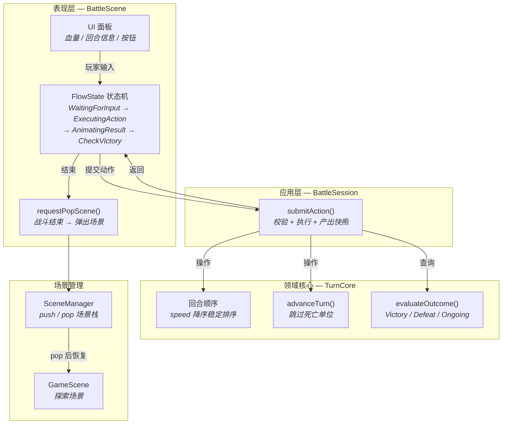
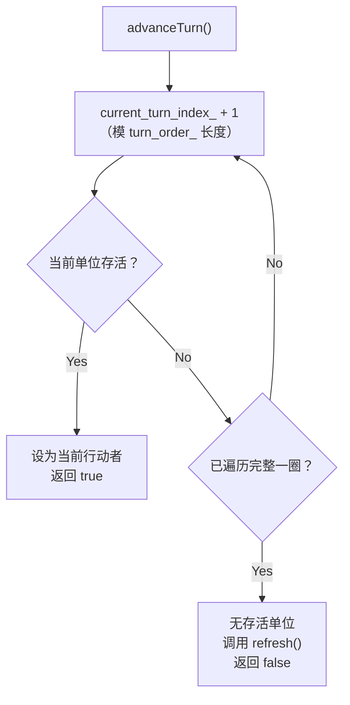
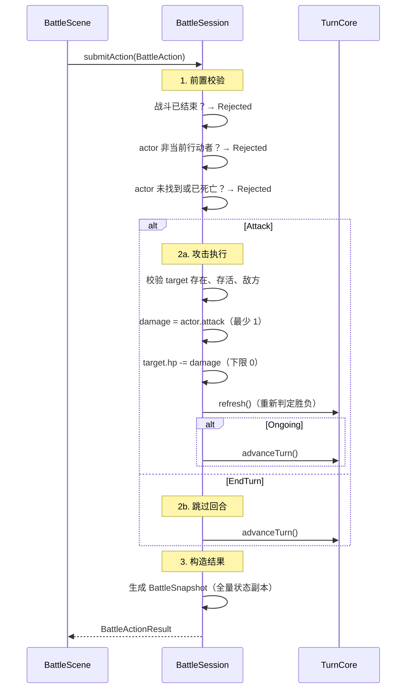
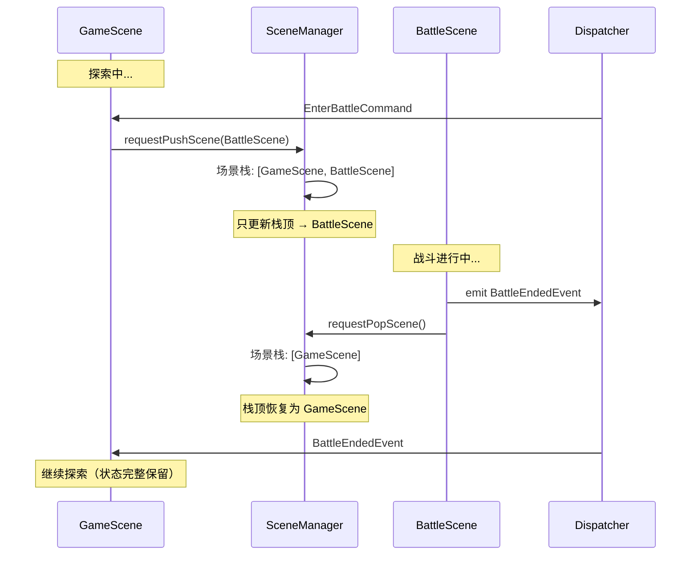
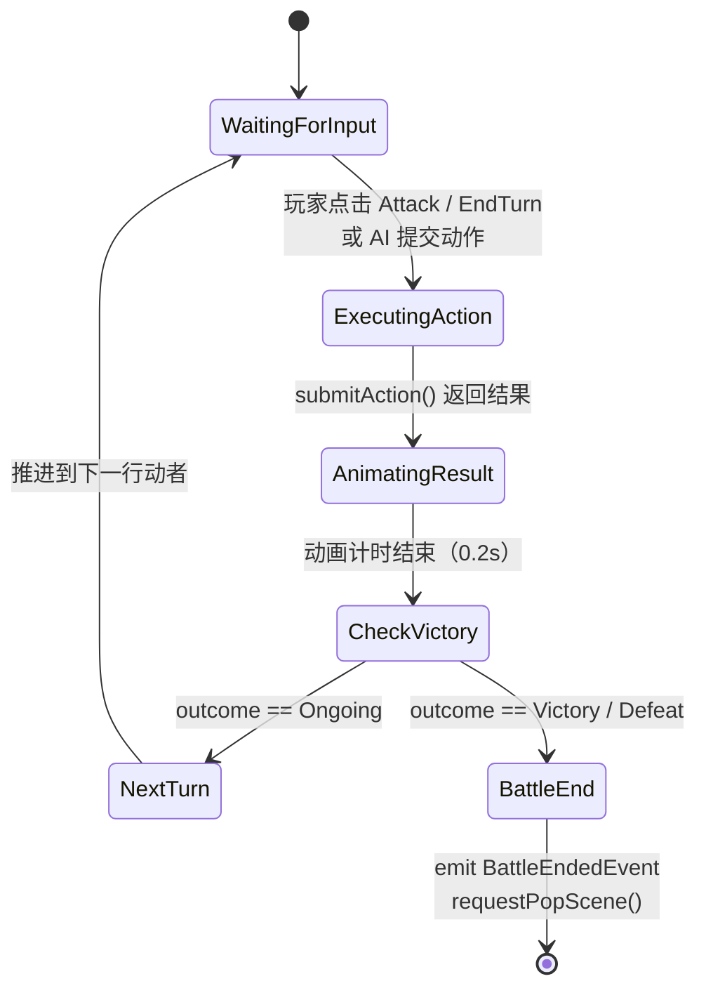
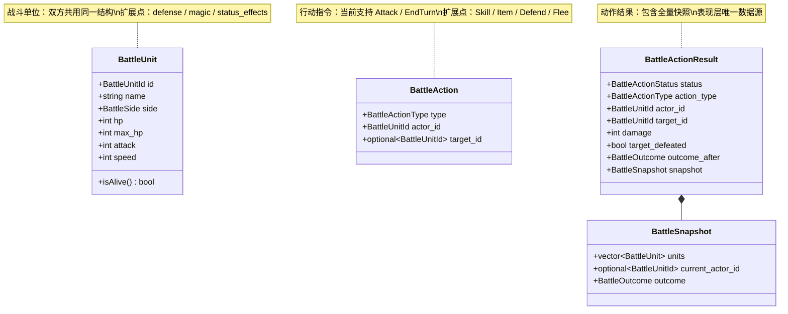
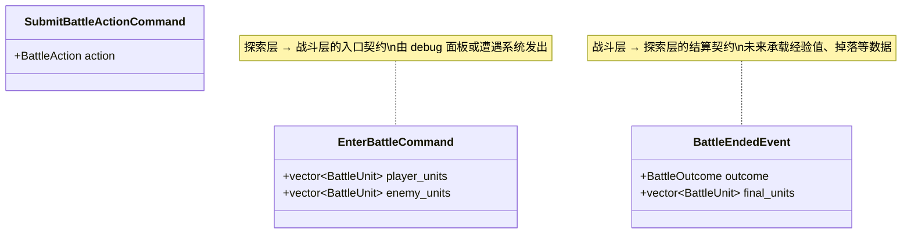
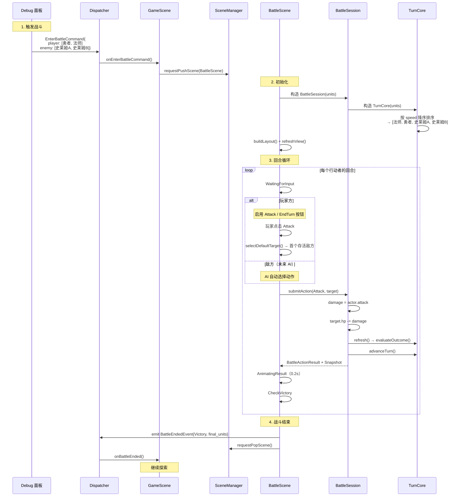

# JRPG 回合制战斗系统

## 概述

回合制战斗系统将游戏从"实时探索"切换到"策略回合"模式，玩家与敌方单位按速度顺序交替行动，直至一方全灭。本系统的设计参考经典 JRPG（如 RPG Maker 系列、最终幻想早期作品）的回合驱动模型。

核心设计原则：
- **领域逻辑与表现分离** — `TurnCore` / `BattleSession` 不依赖 ECS、dispatcher、UI，可纯逻辑单测。
- **场景栈切换** — 战斗以 push/pop 叠加在探索场景之上，返回时探索状态零成本恢复。
- **状态机驱动** — `BattleScene` 内部以有限状态机编排回合流转，逻辑清晰且易扩展。

## 架构分层



**关键边界**：`BattleSession` 是表现层与领域核心之间的唯一桥梁。`BattleScene` 通过 `submitAction()` 与领域交互，从不直接操作 `TurnCore`；`TurnCore` 对 UI 和事件系统完全无感。

## 回合驱动原理

### 为什么用回合制而非实时

实时战斗需要逐帧处理所有单位的 AI 决策、碰撞检测与动画同步，复杂度高且难以调试。回合制将"谁行动、做什么、结果如何"拆解为离散步骤，每一步都可以暂停等待输入，适合策略型 RPG 且天然可测试。

### 回合顺序：Speed 降序稳定排序

每场战斗开始时，`TurnCore` 根据所有存活单位的 `speed` 属性进行**降序稳定排序**，生成行动队列 `turn_order_`。速度高的单位先行动；速度相同时，保持初始加入顺序（稳定排序保证）。

```
单位:   勇者(spd=12)  史莱姆A(spd=8)  法师(spd=15)  史莱姆B(spd=8)
排序后: 法师(15) → 勇者(12) → 史莱姆A(8) → 史莱姆B(8)
                                ↑ 同速保持原序
```

### 行动推进与死亡跳过

`advanceTurn()` 沿 `turn_order_` 循环推进，遇到已死亡单位（`hp <= 0`）自动跳过。若完整遍历一圈都没有存活单位，说明战斗已结束。



### 胜负判定

每次动作执行后，`evaluateOutcome()` 扫描全部单位：

| 存活玩家 | 存活敌人 | 判定 |
|---|---|---|
| > 0 | > 0 | `Ongoing` — 战斗继续 |
| > 0 | = 0 | `Victory` — 玩家胜利 |
| = 0 | >= 0 | `Defeat` — 玩家失败 |

判定结果存储在 `outcome_` 中，`BattleSession` 读取后附加到 `BattleActionResult` 返回给表现层。

## 动作执行链路

`BattleSession::submitAction()` 是整个战斗的核心处理节点，负责校验、执行、状态更新、结果快照的完整链路。



### 为什么用全量快照

`BattleActionResult` 中嵌入完整的 `BattleSnapshot`（所有单位当前状态 + 当前行动者 + 战斗结果），而非增量 diff。原因：

1. **UI 刷新简单** — 表现层直接从快照重建界面，无需维护本地状态副本。
2. **可测试性** — 测试只需断言快照内容，不依赖 UI 状态。
3. **未来回放** — 序列化快照序列即可实现战斗回放。

## 场景切换协议

### Push/Pop 模型

战斗场景以 **push** 方式叠加在探索场景之上，而非 **replace**。这意味着 `GameScene` 在战斗期间仍保留在场景栈中，只是不接收 `update()` / `fixedUpdate()` 调用（`SceneManager` 只更新栈顶场景）。



### 为什么选 Push/Pop 而非 Replace

| 方案 | 优点 | 缺点 |
|---|---|---|
| **push/pop** | 返回时状态零成本恢复；与 PauseMenuScene 架构一致 | 战斗期间 GameScene 占用内存 |
| **replace** | 释放探索场景内存 | 返回需重建 GameScene（地图、NPC、玩家位置等），成本高且易出 bug |

对于 JRPG 来说，战斗频繁且短暂，push/pop 是最优选择。

## BattleScene 状态机

`BattleScene` 内部以有限状态机（FSM）驱动回合流转，每帧在 `update()` 中调用 `runStateMachine()`。



### 各状态职责

| 状态 | 职责 |
|---|---|
| `WaitingForInput` | 等待当前行动者的输入。玩家方启用按钮；敌方（未来）由 AI 自动提交。 |
| `ExecutingAction` | 调用 `session_.submitAction()`，获取 `BattleActionResult`。同步执行，无帧延迟。 |
| `AnimatingResult` | 展示动作结果（伤害数值、击败提示）。首版以 0.2s 延时占位，未来替换为动画系统。 |
| `CheckVictory` | 读取 `outcome`，决定继续还是结束。 |
| `NextTurn` | 刷新 UI 显示新的当前行动者，回到 `WaitingForInput`。 |
| `BattleEnd` | 发送 `BattleEndedEvent`，调用 `requestPopScene()` 退出战斗。 |

### 状态机为什么是同步循环

`runStateMachine()` 在单帧内**持续循环**直到遇到需要等待的状态（`WaitingForInput` 或 `BattleEnd`）。这意味着 `ExecutingAction → AnimatingResult` 的过渡不需要跨帧，减少了状态管理的复杂度。只有 `AnimatingResult` 的计时需要跨帧等待。

## 数据结构

### 核心类型



### 命令与事件



## 完整战斗流程

以 2v2 战斗为例（勇者 + 法师 vs 史莱姆A + 史莱姆B），展示从触发到结算的完整流程：



## 扩展指南

当前实现是最小骨架，以下是各方向的扩展点：

| 扩展方向 | 当前状态 | 扩展方式 |
|---|---|---|
| **技能系统** | 仅 Attack / EndTurn | 在 `BattleActionType` 增加 `Skill`，`BattleAction` 增加 `skill_id`，`BattleSession` 增加技能查表与效果计算 |
| **状态异常** | 无 | `BattleUnit` 增加 `status_effects` 列表，`TurnCore` 在回合开始/结束时触发效果（中毒扣血、眩晕跳过等） |
| **AI 系统** | 敌方无 AI | `BattleScene` 在敌方回合调用 `AIStrategy::decide(snapshot)` 生成 `BattleAction`，无需修改领域层 |
| **多目标技能** | 单目标 | `BattleAction` 的 `target_id` 改为 `vector<BattleUnitId>`，`BattleSession` 循环处理 |
| **速度变动** | 排序仅在初始化时 | 每轮开始调用 `TurnCore::rebuildTurnOrder()`，支持减速/加速 buff |
| **战斗动画** | 0.2s 占位延时 | `AnimatingResult` 状态接入动画系统，播放攻击/受击/倒地序列帧 |
| **经验与掉落** | 仅 log | `BattleEndedEvent` 扩展 `exp_gained` / `loot_items`，`GameScene` 在 `onBattleEnded()` 中处理 |
| **逃跑/防御** | 无 | `BattleActionType` 增加 `Flee` / `Defend`，对应逻辑在 `BattleSession` 中实现 |

## 测试策略

分层测试确保各层独立可验证：

| 测试文件 | 测试目标 | 测试方式 |
|---|---|---|
| `turn_core_test.cpp` | 速度排序、死亡跳过、胜负判定 | 纯逻辑单测，无外部依赖 |
| `battle_session_test.cpp` | 动作校验、伤害计算、回合推进 | 纯逻辑单测，通过快照断言 |
| `battle_scene_smoke_test.cpp` | 状态机完整性、pop 退出路径 | 接线级验证，不 mock Context |
| `game_scene_battle_entry_test.cpp` | EnterBattleCommand 监听、push 调用 | 接线级验证 |

领域核心（`TurnCore` + `BattleSession`）的测试是最高优先级：它们运行快、无副作用、覆盖了战斗的全部规则。表现层测试以 smoke 形式验证接线正确性，不追求 UI 细节覆盖。

## 涉及文件

| 文件 | 层 | 职责 |
|---|---|---|
| `src/game/battle/battle_types.h` | 领域 | 战斗数据类型：BattleUnit / BattleAction / BattleSnapshot / BattleActionResult |
| `src/game/battle/turn_core.h/.cpp` | 领域 | 回合顺序管理、行动推进、胜负判定 |
| `src/game/battle/battle_session.h/.cpp` | 应用 | 动作校验与执行、状态快照生成 |
| `src/game/scene/battle_scene.h/.cpp` | 表现 | UI 构建、状态机驱动、玩家输入处理 |
| `src/game/scene/game_scene.h/.cpp` | 表现 | 战斗入口（sink EnterBattleCommand）与结算处理 |
| `src/game/defs/commands.h` | 契约 | `EnterBattleCommand` / `SubmitBattleActionCommand` |
| `src/game/defs/events.h` | 契约 | `BattleEndedEvent` |
| `src/game/debug/player_debug_panel.cpp` | 调试 | `Start Test Battle (2v2)` 按钮 |
