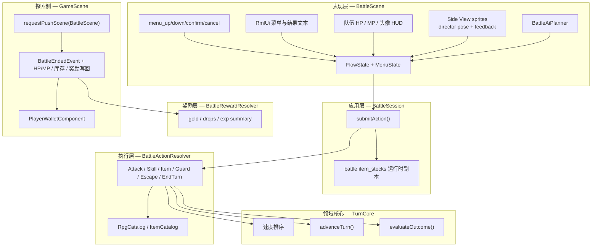
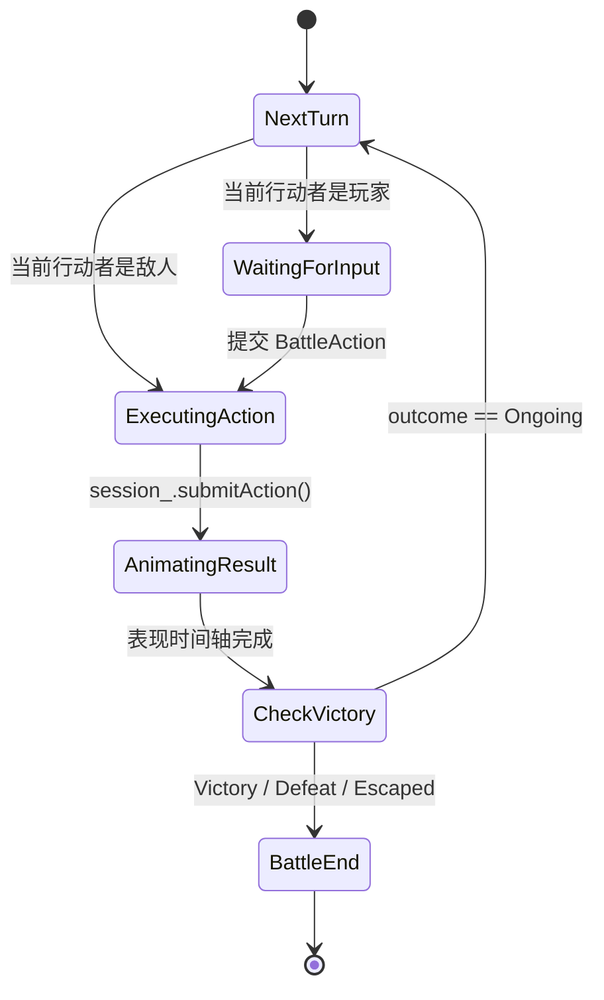
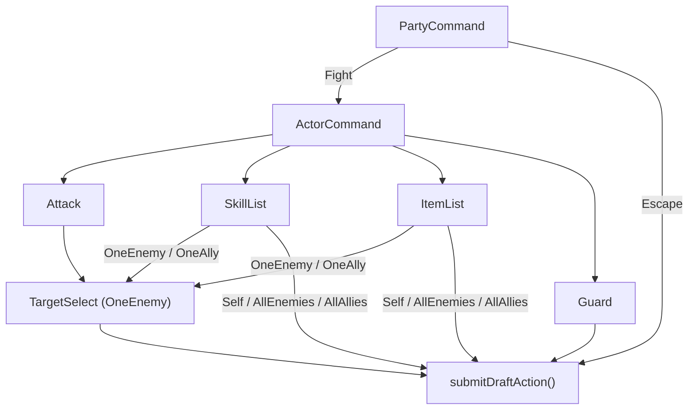
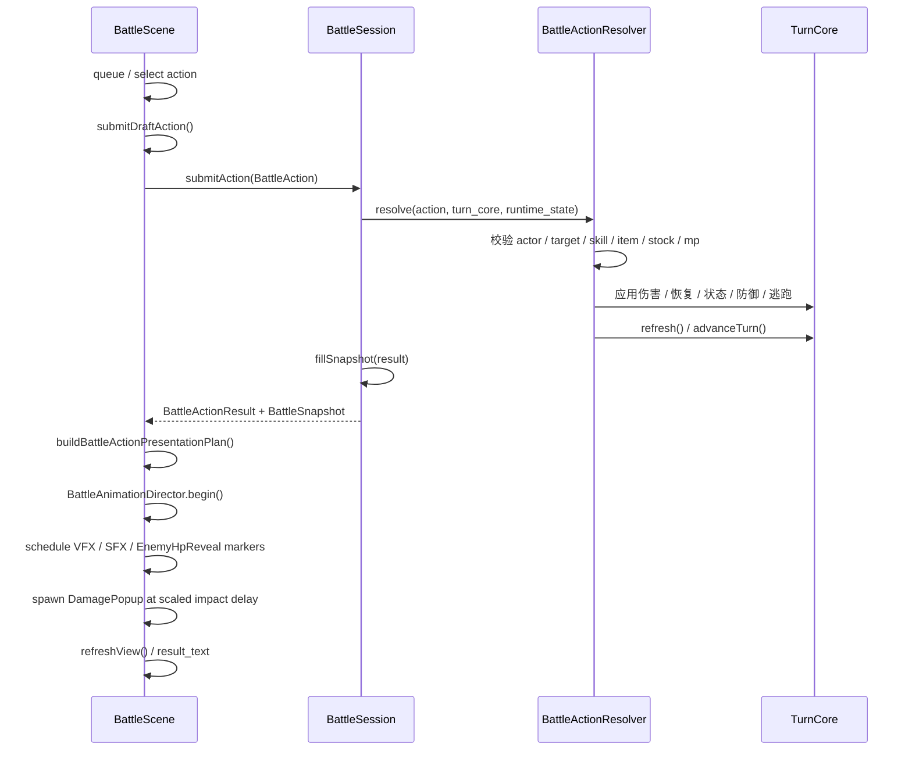
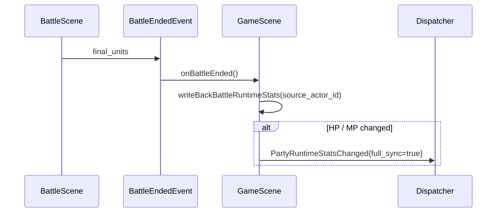
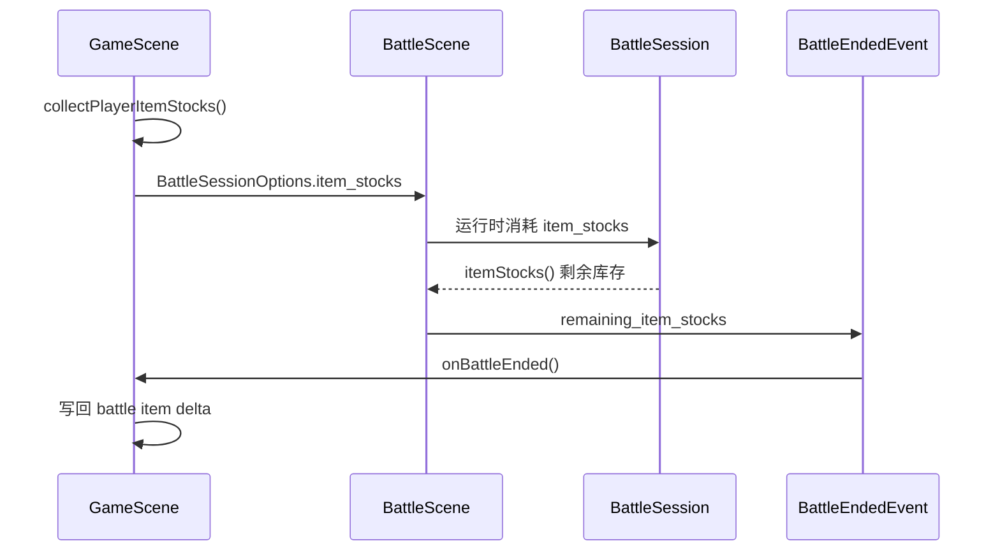
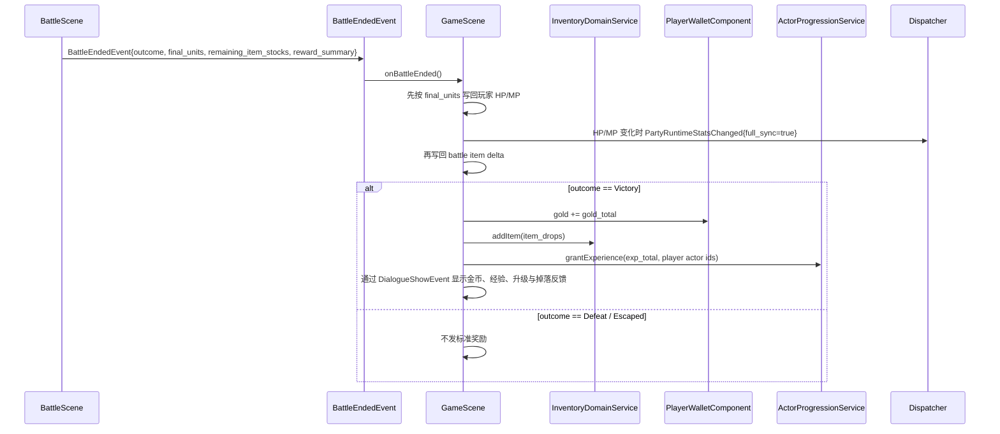

# JRPG 回合制战斗系统

## 概述

回合制战斗系统会把游戏从“实时探索”切换到“策略回合”模式，玩家与敌方单位按速度顺序交替行动，直到一方全灭或玩家成功逃跑。当前实现已经不再是最初的 Attack 原型，而是具备完整战斗菜单闭环的最小 JRPG 战斗骨架：

- `BattleScene` 负责 RmlUi 菜单、输入和表现层状态机
- `BattleScene` 同时拥有战斗专用 ECS registry，用 Side View 精灵和表现时间轴绘制动作、飘字与敌方 HP 条反馈
- `BattleAiPlanner` 负责敌方回合的最小自动行动规划
- `BattleSession` 负责接收行动并返回全量结果快照
- `BattleActionResolver` 负责技能、物品、防御、逃跑等具体结算
- `BattleRewardResolver` 负责胜利后的金币、掉落与经验汇总
- `TurnCore` 负责行动顺序推进与胜负判定
- `GameScene` 负责战斗入口、防止嵌套战斗、场景 push/pop、玩家 HP/MP 出场写回、战斗库存写回与胜利奖励落地

核心设计原则：

- **领域逻辑与表现分离**：`TurnCore` / `BattleSession` / `BattleActionResolver` 不依赖 ECS UI。
- **场景栈切换**：战斗通过 push/pop 叠加在探索场景之上，结束后直接恢复探索；当前入口不通过翻 `GameMode::Battle` 驱动切换。
- **表现快照独立于领域数据**：角色外观快照通过 `BattleSpriteSeed` 传给战斗表现层，不写入 `BattleUnit` / `BattleSessionOptions`。
- **子状态机驱动菜单**：`BattleScene` 在 `FlowState::WaitingForInput` 内部再维护 `MenuState`。
- **目录驱动动作**：技能从 `RpgCatalog` 读取，战斗物品从 `ItemCatalog::battle_use` 读取。

## 架构分层

关键边界：

- `BattleScene` 不直接操作 `TurnCore`
- `BattleSession` 是表现层进入战斗逻辑的唯一入口
- `BattleActionResolver` 是动作规则真相来源，UI 只做前置筛选
- `BattleAiPlanner` 只生成敌方行动，不直接修改回合状态
- `BattleRewardResolver` 只生成奖励摘要，不直接写探索态真相
- `GameScene` 保持对真实背包、金币和探索流程的所有权

## 回合驱动原理

### 速度排序

`TurnCore` 在战斗开始时按 `speed` 降序稳定排序，速度高者先行动；同速时保持原始加入顺序。

### 行动推进与死亡跳过

`advanceTurn()` 会在行动队列中循环推进，并自动跳过 `hp <= 0` 的单位。若一整圈都没有存活单位，战斗会进入终局判定。

### 胜负结果

当前结果枚举为：

| 结果 | 含义 |
|---|---|
| `Ongoing` | 战斗继续 |
| `Victory` | 玩家方胜利 |
| `Defeat` | 玩家方失败 |
| `Escaped` | 玩家方成功逃跑 |

`Victory` / `Defeat` 来自双方存活状态；`Escaped` 不由 `evaluateOutcome()` 推导，而是在逃跑行动成功时由 resolver 调 `TurnCore::forceOutcome(BattleOutcome::Escaped)`。该强制终局会被 `TurnCore` 保持住，后续 `refresh()` / `advanceTurn()` 不会因为双方仍有存活单位而把结果重算回 `Ongoing`。

## BattleScene 菜单与输入

当前 `BattleScene` 不再是“两个按钮直接提交”的原型，而是如下结构：

### 顶层状态机

### 输入期子菜单状态

`FlowState::WaitingForInput` 内再维护 `MenuState`：

- `PartyCommand`
- `ActorCommand`
- `SkillList`
- `ItemList`
- `TargetSelect`

说明：

- `WaitingForInput` 的语义已经收紧为“等待玩家输入”
- 敌方回合不会进入玩家菜单，而是在 `NextTurn` 阶段直接通过 `BattleAiPlanner` 生成并提交动作

### 输入路径

当前 Battle 菜单采用“场景级输入 + RML 点击”的双路径：

- 鼠标点击：走 RML `data-event-click`
- 键盘 / 手柄：走 `menu_up/down/left/right/confirm/cancel`
- `BattleScene` 自己维护菜单光标，并程序化 `Focus(true)` 同步 RmlUi 焦点

这点很重要：Battle 输入上下文会抑制原生菜单方向键事件转发给 RmlUi，所以当前实现**不依赖** RmlUi 原生方向键导航。

### 队伍命令与角色命令

每轮玩家方第一次行动先显示 `PartyCommand`，后续同轮玩家行动者直接进入 `ActorCommand`：

- `PartyCommand`：`Fight` / `Escape`
- `ActorCommand`：`Attack` / `Skill` / `Guard` / `Item`

### 技能 / 物品 / 目标流

### 候选来源

| 菜单 | 当前来源 |
|---|---|
| `SkillList` | `BattleUnit::skill_ids` + `RpgCatalog` |
| `ItemList` | `BattleSession::itemStocks()` + `ItemCatalog::battle_use_` |
| `TargetSelect` | 当前 actor side + `session_.units()` + action scope |

### Scope 规则

| 动作 | scope 处理 |
|---|---|
| `Attack` | 固定为 `OneEnemy`，必须显式选目标 |
| `Skill` / `Item` `OneEnemy` / `OneAlly` | 进入 `TargetSelect` |
| `Skill` / `Item` `Self` / `AllEnemies` / `AllAllies` | 不弹目标菜单，直接提交 |
| `Scope::None` | 在列表里 disabled，不应进入提交路径 |

### Cancel / Back 规则

| 当前菜单 | `menu_cancel` 行为 |
|---|---|
| `TargetSelect` | 回到动作来源菜单，并保留技能/物品列表 |
| `SkillList` / `ItemList` | 回到 `ActorCommand` |
| `ActorCommand` | 如果本次是从 `PartyCommand` 的 `Fight` 进入，则回到 `PartyCommand`；否则吃掉输入 |
| `PartyCommand` | 吃掉输入，不退出战斗 |

## Side View 表现与 HUD

当前战斗场景已经从居中原型面板改为 RPG Maker 风格的 Side View：

- `BattleScene::render()` 会先绘制全屏战斗底色和站位地面线，遮住底层探索地图，避免场景栈透出。
- 玩家方站在右侧，默认播放 `idle_left`；玩家角色蓝图只有 `idle_right` 资源时，`BlueprintManager` 会自动镜像生成 `idle_left`。
- 玩家方与敌方都使用 `battle_visual` 指定 actor blueprint、idle 动画与战斗精灵缩放；默认资源中的 `actor.player` / `actor.lyria` / `actor.tori` 和 `enemy.goblin` / `enemy.gnome` / `enemy.slime` 都有显式配置。
- `BattleScene` 为战斗表现维护独立 `battle_registry_`，并通过 `RenderSystem::renderPrepared()` 在不重置 GameScene 相机的前提下追加战斗精灵绘制。
- 战斗中 SceneManager 只更新栈顶 scene，因此底层 `GameScene` 的探索 update 会冻结；`GameScene` 在 push `BattleScene` 前同步采集玩家外观快照。
- 行动结算后，`buildBattleActionPresentationPlan()` 会把 `BattleActionResult` 转成 motion / marker 时间轴；普通 Attack 可复用 `assets/data/rpg/skills.json` 的 `skill.attack.presentation`。
- `BattleAnimationDirector` 只负责按 motion_style 生成逐单位 pose；VFX、SFX 与 EnemyHpReveal 由 plan marker 调度，伤害飘字按同一 impact 时刻延迟出现。
- Battle Speed 通过 `scaledAnimationSeconds()` / `scaleAnimationTimeline()` 同步缩放导演时间轴、marker fire time 与飘字 impact delay；它不缩放 resolver、TurnCore 或领域 `dt`。
- 敌方 HP 条先 `stageSnapshot()` 暂存结果快照，到 EnemyHpReveal marker 时 `applyStagedSnapshotAndReveal()`；staged snapshot 使用 0 延迟同步，避免视觉命中后又等第二段 `change_delay_seconds`。

HUD 位于屏幕下方 130dp：

- 左侧为队伍状态卡，显示头像、姓名、HP / MP 文本和纯 RCSS div 血条/魔法条。
- 右侧为行动菜单、技能/物品列表、目标列表和结果文本。
- 按钮使用朴素文字按钮 `.battle-text-button`，不引用 `tf-button-primary` / `tf-button-secondary`，也不使用九宫格按钮图片。
- HP / MP 条使用嵌套 div + `data-style-width`，不使用 `<progress>` 依赖。

玩家外观层复用 `AppearanceLayerCacheBuilder` 这个无状态构建器；战斗场景不会实例化第二套 `AppearanceSystem`，因此不会重复订阅全局 dispatcher。

## 敌方 AI 行动规划

敌方回合由 `BattleAiPlanner` 完成，`BattleScene` 在 `FlowState::NextTurn` 阶段根据当前行动者阵营分支：玩家方进入 `WaitingForInput`，敌方直接调用 planner 并将结果送入提交流程。

### 选技算法

`planEnemyAction()` 遍历 `EnemyData::actions_` 选出最高 `rating_` 且当前可执行的技能。候选筛选阶段只做无随机的合法性预检；最终确认选中的 skill 后，才构造 `BattleAction` 并消耗随机源：

1. 跳过 `skill_id` 为空或 `RpgCatalog` 中不存在的条目
2. 跳过 MP 不足的技能
3. 针对该技能的 scope 做合法目标 / 恢复缺口预检，若没有合法对象则跳过
4. 在所有可执行候选中取 `rating_` 最高者；并列时保留先出现的候选
5. 对最终候选调用 `buildSkillAction()` 生成目标；`OneEnemy` 在这里随机选存活对手
6. 若无任何可用技能，调用 `planFallbackAction()`：Attack 随机指向存活对手，若无存活对手则 EndTurn

### 目标选择规则（按 scope）

| scope | 目标策略 |
|---|---|
| `OneEnemy` | 在存活对手中随机抽取目标 |
| `AllEnemies` | 无需选单体，要求对手侧至少有存活单位 |
| `OneAlly` | 恢复类技能选"资源缺口最大的友军"；其他技能选 HP% 最低的友军 |
| `AllAllies` | 恢复类技能额外要求友军侧至少有资源缺口，避免对满血/满 MP 全体浪费 |
| `Self` | 恢复类技能要求行动者自身存在资源缺口，否则跳过 |

### 恢复意图检测

AI 在选 `OneAlly` / `AllAllies` / `Self` 技能时会通过 `detectRecoveryIntent()` 检查技能是否具有 HP/MP 恢复效果（`DamageType::HpRecover` / `MpRecover`，或 `effects_` 中含 `RecoverHp` / `RecoverMp`），确保恢复技能不浪费在满血/满 MP 目标上。

## 动作执行链路

当前动作提交流程如下：

当前支持的行动类型：

- `Attack`
- `Skill`
- `Item`
- `Guard`
- `Escape`
- `EndTurn`

### UI 与执行层的分工

`BattleScene` 会尽量在 UI 层阻止无效选择，但 `BattleActionResolver` 仍保留最终保护：

- `OneEnemy` / `OneAlly` 在脚本或测试直接提交时，resolver 仍会校验 target
- `Skill` / `Item` 在 `OneEnemy` / `OneAlly` scope 下若缺少 target，resolver 仍保留 fallback 语义
- `Attack` 仍要求显式 target；缺少 target 会直接 rejected
- 若 MP、库存、目标状态在提交瞬间失效，resolver 会拒绝并返回失败原因

### 公式与效果来源

`BattleActionResolver` 当前已经是数据驱动结算，而不是纯硬编码分支：

- 普通攻击也会走 `BattleFormulaEvaluator`，当前默认公式是 `a.atk`；若 Lua 公式求值失败，则回退到 `actor.attack`
- Skill 主效果由 `SkillData::damage_` 驱动，支持 `HpDamage / MpDamage / HpRecover / MpRecover / HpDrain / MpDrain / None`
- Skill 附加效果当前支持 `RecoverHp / RecoverMp / AddState / RemoveState`
- Battle item 目前只支持 `battle_use.effects` 中的 `RecoverHp / RecoverMp`；没有 `battle_use` 或 `scope == None` 的物品会在列表中被禁用或在 resolver 中被拒绝

### 结果反馈

当前 `BattleScene::refreshView()` 会根据 `BattleActionResult` 生成最小可读文案：

- Attack：伤害与 KO
- Skill：miss / damage / HP 恢复 / MP 恢复 / 首个 added state
- Item：HP 恢复 / MP 恢复，或 `"Item used"`
- Escape：成功 / 失败
- Guard / EndTurn：短文本反馈

对于 HP 伤害类反馈，`BattleActionResult::damage` 表示目标实际失去的 HP。普通攻击打出过量伤害时，返回值会按目标当前 HP 截断，而不是汇报理论公式值。

### 战斗结算通知反馈

战斗结束后，`game_scene_reward_feedback` 模块负责将写回结果格式化为可见文本：

- `formatRewardFeedback()`：将金币与掉落写回结果转成单段文本（逐条列出掉落物、金币；如有 `rejected` 量则追加提示）
- `formatBattleSettlementFeedback()`：将奖励写回结果与任务推进摘要（`QuestBattleProgressSummary`）合并为一条完整的战斗结算通知文本，通过现有 `DialogueShowEvent` 渠道显示给玩家
- 若本场 Victory 没有金币、掉落或任务推进，反馈会回退为单行 `战斗胜利`

## 战斗库存与结算协议

### HP / MP 出场写回

战斗中的 `BattleUnit` 是入场快照，不会在每次扣血时直接写探索态。战斗结束后，`BattleEndedEvent.final_units` 会回到 `GameScene::onBattleEnded()`，由 `writeBackBattleRuntimeStats()` 按 `source_actor_id` 找回玩家 actor 的 runtime state：

敌方单位没有 `source_actor_id`，因此不会写回任何持久 runtime state。这个写回与奖励无关：`Victory`、`Defeat`、`Escaped` 都会保留战斗结束时玩家 HP/MP 的最终值。

### 战斗物品库存

战斗物品不是直接读写真实背包，而是“进入战斗复制，战斗结束写回”：

这保证了：

- 战斗层不直接依赖探索库存组件
- 物品消耗不会在战斗结束后丢失
- `GameScene` 仍保有真实背包同步的最终控制权

### Victory 奖励写回

标准奖励只在 `Victory` 时生效：

当前规则：

- `BattleEndedEvent.final_units` 会先按玩家单位的 `source_actor_id` 写回当前 HP/MP；如有变化，触发 `PartyRuntimeStatsChanged{full_sync=true}`
- `Victory`：写回金币、掉落与参战 actor 经验，并显示奖励与升级反馈
- `Defeat`：不发金币/掉落/经验，但保留战斗中已发生的物品消耗
- `Escaped`：不发金币/掉落/经验，但同样保留战斗中已发生的物品消耗
- 金币真相位于 player entity 的 `PlayerWalletComponent`
- 经验真相位于 player entity 的 `PartyRuntimeStatsComponent`：`total_exp` 是累计经验，`level` 由累计经验推导并缓存
- 满级 actor 的 `total_exp` 会截断在 `expForLevel(max_level)`，不会继续隐藏累计

## 数据结构

### 核心类型

| 类型 | 当前关键字段 |
|---|---|
| `BattleUnit` | `id / name / side / hp / max_hp / mp / max_mp / attack / defense / magic_attack / magic_defense / speed / luck / skill_ids / source_actor_id / source_enemy_id` |
| `BattleAction` | `type / actor_id / target_id / skill_id / item_id` |
| `BattleActionResult` | `status / action_type / damage / hp_recovered / mp_recovered / mp_spent / missed / critical / target_guarded / target_defeated / escape_succeeded / states_added / states_removed / failure_reason / outcome_after / snapshot` |
| `BattleSnapshot` | `units / current_actor_id / round_index / outcome` |
| `BattleSessionOptions` | `rpg_catalog / item_catalog / item_stocks` |
| `BattleScenePresentationOptions` | `sprite_seeds / blueprint_manager / appearance_catalog / actor_runtime_states / actor_equipment` |

`BattleActionResult::damage` 对 HP 伤害表示实际扣掉的 HP。若公式值超过目标剩余 HP，结果字段按剩余 HP 截断，便于 UI、日志和测试对齐同一套可见事实。

### 关键辅助类型

| 类型 | 当前职责 |
|---|---|
| `BattleRuntimeState` | 单次 `BattleSession` 拥有的运行时可变状态：`item_stocks`、单位防御/状态剩余回合、逃跑尝试计数。刻意与快照类型分离，不出现在命令/事件负载中 |
| `BattleRewardItemDrop` | 奖励掉落聚合条目：`item_id`（原始字符串 id）、`item_id_hash`（库存写回用稳定 hash）、`count`（聚合数量） |
| `BattleRewardSummary` | 胜利后的 `gold_total / exp_total / item_drops` 聚合结果；`empty()` 可快速判断是否有奖励 |
| `BattleRewardWritebackItemResult` | 单个掉落条目的实际写回结果：原始 `drop`、`accepted`（成功入包数量）、`rejected`（背包满等原因拒绝数量） |
| `BattleRewardWritebackResult` | 完整写回摘要：`gold_written_back` + `item_results` 列表；`empty()` 可判断是否有任何写回 |
| `ActorExperienceGrant` | 单个 actor 的经验结算结果：`gained_exp / old_level / new_level / total_exp / exp_to_next / hp_max_delta / mp_max_delta` |
| `PartyExperienceGrantResult` | 队伍经验写回摘要：`exp_reward` + actor 结果列表，供 Victory overlay 与探索通知展示 |
| `BattleVisualData` | 战斗精灵配置：`sprite_blueprint_id / idle_animation / sprite_scale`，属于表现数据，不参与战斗结算 |
| `BattleSpriteSeed` | `GameScene` 进入战斗前生成的表现种子，携带 unit id、来源 id 和可选玩家外观快照 |
| `PlayerWalletComponent` | 探索态金币真相 |
| `PartyRuntimeStatsComponent` | 队伍成员运行时真相：当前 HP/MP、等级缓存、累计经验 |

### 命令与事件

| 契约 | 当前形态 |
|---|---|
| `EnterBattleCommand` | 可携带 `actor_ids / troop_id`，也可直接携带预构建 `player_units / enemy_units`；地图遭遇会额外携带 `encounter_context` |
| `BattleStartedEvent` | `troop_id / battle_background_id / actor_ids / from_encounter / encounter_id`；`actor_ids` 是实际参战玩家 actor ids |
| `BattleEndedEvent` | `outcome / final_units / remaining_item_stocks / reward_summary` |
| `PartyRuntimeStatsChanged` | HP/MP、等级或经验等队伍 runtime state 变化后的刷新事件；战后 HP/MP 写回使用 `full_sync=true` |
| `SubmitBattleActionCommand` | 目前保留为通用契约类型；当前 `BattleScene` 自己直接调 `BattleSession::submitAction()`，不经 dispatcher |

## 完整战斗流程

以当前测试战斗入口为例：

```mermaid
sequenceDiagram
    participant DBG as Debug 面板
    participant D as Dispatcher
    participant GS as GameScene
    participant BUF as BattleUnitFactory
    participant BS as BattleScene
    participant SE as BattleSession

    DBG->>D: EnterBattleCommand{}
    D->>GS: onEnterBattleCommand()
    GS->>GS: 检查 battle_in_progress_
    GS->>GS: collectPlayerItemStocks()
    GS->>BUF: buildBattleUnitsFromCatalog(...)
    GS->>D: BattleStartedEvent{actor_ids, troop_id}
    GS->>GS: requestPushScene(BattleScene)

    loop 每个行动者回合
        alt 当前行动者是玩家
            BS->>BS: PartyCommand / ActorCommand / SkillList / ItemList / TargetSelect
            BS->>SE: submitAction(BattleAction)
        else 当前行动者是敌人
            BS->>BS: BattleAiPlanner 生成动作
            BS->>SE: submitAction(BattleAction)
        end
        SE-->>BS: BattleActionResult + Snapshot
        BS->>BS: AnimatingResult(导演 pose + markers + 飘字 / HP 条)
    end

    BS->>D: BattleEndedEvent{outcome, final_units, remaining_item_stocks}
    BS->>GS: requestPopScene()
    D->>GS: onBattleEnded()
    GS->>GS: 按 final_units 写回玩家 HP/MP
    GS->>D: HP/MP 变化时 PartyRuntimeStatsChanged{full_sync=true}
    GS->>GS: 写回 battle item delta
    GS->>GS: Victory 时写回金币/掉落/经验
```

## 扩展指南

| 方向 | 当前状态 | 后续扩展方式 |
|---|---|---|
| 技能系统 | 已接入目录与 scope | 扩展学习/成长/技能详情 UI |
| 战斗物品 | 已接入 `battle_use` 与库存写回 | 扩展状态类、伤害类 battle item 效果 |
| 状态异常 | 已有 runtime state 与 added state 基础 | 扩展回合开始/结束 hook 与更多状态表现 |
| AI | 已有最小敌方自动行动 | 继续扩展评分规则、目标偏好、条件分支 |
| 全体 / 自身动作 | 已通过 scope 直接提交支持 | 后续可补更丰富的结果展示 |
| 目标 UI | 已支持单体敌/友选择 | 后续可补头像、弱点、预览、复活目标规则 |
| 战斗日志 | 当前只有简短 `result_text` | 后续可拆独立 log/popup 系统 |
| 战斗动作表现 | 已有 `BattleActionPresentationPlan` + `BattleAnimationDirector`，支持普攻 / 法术 presentation timing、VFX/SFX marker、飘字和敌方 HP 条 impact 对齐 | 后续可扩更多 motion style、状态表现与更完整战斗日志 |
| 奖励结算 | 已完成 Victory 金币/掉落/经验写回与升级反馈 | 后续可扩任务推进表现、独立结算界面 |

## 测试策略

当前测试已经覆盖到“领域规则 + 场景接线 + RML/RCSS 静态约束”三层：

| 测试文件 | 覆盖内容 |
|---|---|
| `tests/game/battle/turn_core_test.cpp` | 速度排序、死亡跳过、胜负判定、强制逃跑终局保持 |
| `tests/game/battle/battle_action_resolver_test.cpp` | Attack / Skill / Item / Guard / Escape 的规则与 scope；普通攻击 overkill 时汇报实际扣血 |
| `tests/game/battle/battle_unit_factory_test.cpp` | `BattleUnit` 来源信息与 catalog 构建路径 |
| `tests/game/battle/battle_ai_planner_test.cpp` | 敌方最小 AI 选技与目标选择 |
| `tests/game/battle/battle_reward_resolver_test.cpp` | Victory 奖励汇总、掉落合并、非 Victory 空摘要 |
| `tests/game/battle/battle_action_presentation_plan_test.cpp` | 领域结果到 motion / marker 时间轴的转换，含普攻默认 `skill.attack.presentation` |
| `tests/game/battle/battle_animation_director_test.cpp` | 导演 pose 时间轴、动作偏移和命中反馈 |
| `tests/game/battle/battle_animation_speed_test.cpp` | Battle Speed 对导演、marker 与飘字 impact delay 的同步缩放 |
| `tests/game/battle/battle_damage_popup_controller_test.cpp` | 飘字生成、impact 延迟、关闭语义与生命周期 |
| `tests/game/battle/battle_enemy_hp_bar_controller_test.cpp` | 敌方 HP 条 staged snapshot、0 延迟 reveal、淡出与 target/display ratio 分离 |
| `tests/game/battle/battle_victory_flow_controller_test.cpp` | Victory overlay 阶段机、奖励 count-up 与确认流程 |
| `tests/game/actor_progression_service_test.cpp` | RPG Maker 风格经验曲线、等级推导、满级截断、升级 HP/MP 上限增量 |
| `tests/game/battle/battle_session_test.cpp` | 会话级提交、快照、回合推进 |
| `tests/game/battle/battle_scene_smoke_test.cpp` | `BattleScene` 状态机、菜单接线、RML/RCSS 关键绑定 |
| `tests/game/rmlui_architecture_regression_test.cpp` | Battle RML 不引用素材按钮 class、不使用 `<progress>` |
| `tests/game/blueprint_manager_smoke_test.cpp` | Side View 所需 goblin / gnome / slime 蓝图与镜像方向 |
| `tests/game/game_scene_battle_entry_test.cpp` | `EnterBattleCommand` 入口、push、catalog fallback、防嵌套、实际 actor ids，以及战后 HP/MP 写回触发队伍统计刷新事件的源码护栏 |
| `tests/game/game_scene_battle_reward_writeback_test.cpp` | `Victory / Defeat / Escaped` 的库存、奖励、经验与升级写回 |
| `tests/game/save_service_async_test.cpp` | 钱包金币、装备与队伍 runtime state 的 roundtrip 恢复 |
| `tests/game/ui_layout_integration_test.cpp` | InventoryMenuScene 的真实金币展示 |
| `tests/game/rml_menu_navigation_style_test.cpp` | 共享导航样式与 focus/hover 规范 |

当前没有为 BattleScene 建完整 RmlUi runtime 交互测试；该层仍以 smoke 方式验证接线和静态约束为主。

## 涉及文件

| 文件 | 层 | 职责 |
|---|---|---|
| `src/game/battle/battle_types.h` | 领域 | 战斗数据类型定义（`BattleUnit` / `BattleAction` / `BattleActionResult` / `BattleSnapshot` 等） |
| `src/game/battle/battle_runtime_types.h` | 领域 | 单次会话运行时可变状态（`BattleRuntimeState`，含 `item_stocks` / 单位防御标记 / 状态回合计数） |
| `src/game/battle/battle_formula_evaluator.h/.cpp` | 执行 | Lua 战斗公式求值器，将 `a`/`b` 绑定为施法者/目标属性表并返回整型计算结果 |
| `src/game/battle/turn_core.h/.cpp` | 领域 | 回合顺序与胜负判定 |
| `src/game/battle/battle_ai_planner.h/.cpp` | 领域 | 敌方最小自动行动规划 |
| `src/game/battle/battle_action_resolver.h/.cpp` | 执行 | 技能、物品、防御、逃跑等动作结算 |
| `src/game/battle/battle_reward_resolver.h/.cpp` | 应用 | Victory 奖励汇总 |
| `src/game/battle/battle_session.h/.cpp` | 应用 | 组织 resolver、runtime_state 与 snapshot |
| `src/game/battle/battle_unit_factory.cpp` | 应用 | 由 actor/troop/catalog 构建战斗单位 |
| `src/game/scene/battle_scene.h/.cpp` | 表现 | RmlUi 菜单、输入、Side View 战斗精灵、FlowState / MenuState 编排 |
| `src/game/scene/battle_action_presentation_plan.h/.cpp` | 表现 | 从 `BattleActionResult` 与 skill presentation 数据生成 motion / marker 时间轴 |
| `src/game/scene/battle_animation_director.h/.cpp` | 表现 | 按 motion style 生成逐单位 pose，并提供 Battle Speed 时间缩放 helper |
| `src/game/scene/battle_damage_popup_controller.h/.cpp` | 表现 | 伤害 / 恢复 / miss 飘字的 impact 延迟、生命周期与关闭语义 |
| `src/game/scene/battle_enemy_hp_bar_controller.h/.cpp` | 表现 | 敌方 HP 条 staged snapshot、impact reveal、target/display ratio 平滑与淡出 |
| `src/game/scene/battle_victory_flow_controller.h/.cpp` | 表现 | Victory overlay 阶段机和奖励 count-up |
| `src/game/scene/battle_scene_types.h` | 表现 | 战斗表现选项、sprite seed 与外观快照结构 |
| `src/game/system/appearance_layer_cache_builder.h/.cpp` | 表现 | 无状态构建分层外观缓存，供 `AppearanceSystem` 与战斗表现复用 |
| `ui/rmlui/scenes/battle.rml` | UI | 战斗菜单 RML 结构 |
| `ui/rmlui/scenes/battle.rcss` | UI | 战斗菜单样式与 target/list 状态表现 |
| `ui/rmlui/theme/portrait.rcss` | UI | Battle / Recruit 共享头像 spritesheet 和 portrait class |
| `src/game/scene/game_scene.h/.cpp` | 表现 | 战斗入口、push/pop 与战后结算入口 |
| `src/game/scene/game_scene_battle_settlement.h/.cpp` | 表现 | 战斗结束统一入口：物品库存写回 → Victory 奖励写回 → 任务推进 → 触发通知 |
| `src/game/scene/game_scene_reward_feedback.h/.cpp` | 表现 | 奖励写回结果格式化（`BattleRewardWritebackResult`）与战斗结算合并通知（含任务推进摘要） |
| `src/game/component/player_wallet_component.h` | 探索态 | 金币真相 |
| `src/game/data/rpg_catalog.*` | 数据 | 技能、状态、actor、enemy、troop 查表；解析 actor / enemy `battle_visual` |
| `src/game/data/item_catalog.*` | 数据 | `battle_use` 物品效果查表 |
| `src/game/defs/commands.h` | 契约 | `EnterBattleCommand` / `SubmitBattleActionCommand` |
| `src/game/defs/events.h` | 契约 | `BattleEndedEvent` |
| `src/game/debug/player_debug_panel.cpp` | 调试 | 测试战斗入口 |
