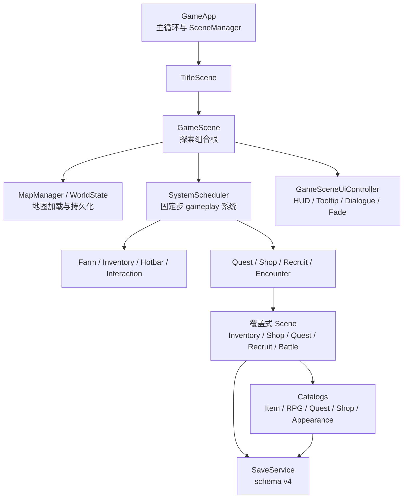

# 项目设计文档: TinyFarmRPG (教学演示项目)

## 项目简介

TinyFarmRPG 是一款从 2D 农场经营演示逐步扩展为日式 RPG Demo 的教学项目。项目仍保留农场、背包、快捷栏、地图切换、昼夜、存档等基础玩法，同时已经接入 Lua 脚本、分层角色外观、Effekseer 特效、RmlUi 生产 UI，并开始形成任务、商店、队伍、装备、招募与回合制战斗等 JRPG 核心闭环。

本项目的核心目的不是上线完整商业游戏，而是以教学和重构实践为导向，展示如何使用现代 C++、ECS、数据驱动资源和清晰的 engine/game 分层来构建可扩展的小型游戏工程。

## 当前玩法扩展状态

- 基础农场循环仍可用：地图切换、耕地/浇水/作物、资源点、宝箱、休息、昼夜光照、背包、快捷栏、HUD、存档与读档。
- Lua + Sol2 已落地：`engine::script::ScriptHost` 提供 Lua VM、安全边界、实体句柄与模块安装；game 层通过 `tinyfarm_script_module` 暴露 `tf.time/player/command/dialogue` 等绑定。
- 分层外观已落地：`AppearanceCatalog` + `AppearanceComponent` + `LayeredSpriteComponent` 支持皮肤、眼睛、衣服、头发、饰品、武器等部件组合，运行时换装由 `AppearanceSystem` 重建缓存。
- VFX 已落地：`VfxService` 通过 `VfxBackend` 抽象接入 `EffekseerBackend`，渲染管线区分 world-vfx 与 overlay-vfx 双通道。
- Quest MVP 已落地：支持 `QuestCatalog`、地图实例 `quest_offer_id`、接任务、战斗击败计数推进、回 NPC 交付，以及存档 roundtrip。
- Shop MVP 已落地：支持 `ShopCatalog`、地图实例 `shop_id` merchant、`ShopTransactionService` preview/commit 原子交易、`ShopMenuScene` 的 buy / sell 双模式，以及 `InventoryChanged -> HotbarSystem` 同步。
- 队伍与招募已落地：`PartyComponent` 记录已招募和参战成员；地图实例 `recruit_actor_id` 会进入 `RecruitOfferScene` 并由 `PartyRecruitmentSystem` 写入队伍。
- 装备 MVP 已落地：`ItemCategory::Equipment`、`assets/data/rpg/equipment.json`、`PartyEquipmentComponent`、`EquipmentDomainService`、`EquipmentSystem` 与 `EquipmentTabContent` 已接通；战斗单位构建会读取装备加成。
- 回合制战斗已不再是原型骨架：`BattleScene` 已具备 RmlUi 菜单、队伍指令、`Attack / Skill / Item / Guard / Escape / End Turn`、`SkillList / ItemList / TargetSelect`、敌方 AI、Side View 战斗精灵、伤害弹字、敌方 HP 条、胜利奖励与战斗物品写回。
- 存档当前 schema 为 v4：除基础世界状态外，还包含 `quest_state`、`skill_state`、`appearance_state`、`party_state`、`equipment_state`、`party_runtime_state` 与 `combat_state`。
- 下一阶段更适合聚焦在内容和规则深度：等级/经验/成长曲线、状态/技能效果扩展、装备词条与限制深化、商店限量库存、更多任务目标类型，以及战斗表现打磨。

## 高层运行链路



## 技术栈

- **构建系统**: CMake 3.13+
- **语言标准**: C++20
- **窗口与输入**: SDL3（CMake 依赖链路也接入 SDL3_image）
- **ECS 框架**: EnTT 3.16.0
- **图形渲染**: OpenGL + GLAD
- **UI 框架**: RmlUi 6.2（生产 UI） + ImGui（调试 UI）
- **图像解码**: stb_image.h（纹理加载与 RmlUi 图片加载主路径）
- **字体渲染**: FreeType 2.14.1 + HarfBuzz 12.1.0
- **音频**: MiniAudio
- **数学库**: GLM 1.0.1
- **日志**: spdlog 1.15.3
- **JSON 解析**: nlohmann-json 3.12.0
- **脚本宿主**: Lua 5.4.8 + Sol2 v3.5.0（project version 4.0.0）
- **粒子特效**: Effekseer 1.7.3.0 + EffekseerRendererGL（通过 `engine::vfx::VfxBackend` 接口接入）
- **测试框架**: GoogleTest 1.17.0
- **地图编辑**: Tiled（生成 .tmj/.tsj/.world 资源）

## 目录结构

> 仅列出目录级结构与模块职责。具体文件请使用 Glob/Grep 工具查询。

```
TinyFarmRPG/
├── src/
│   ├── engine/                  # 可复用游戏引擎层
│   │   ├── async/               #   多线程基础设施（WorkQueue/ThreadPool/MainThreadCommandQueue）
│   │   ├── audio/               #   音频播放（MiniAudio）
│   │   ├── component/           #   引擎层 ECS 组件（transform/sprite/collider/light 等）
│   │   ├── core/                #   应用生命周期、全局上下文 Context、配置、游戏状态（含主线程命令提交点）
│   │   ├── debug/               #   ImGui 调试面板框架与内置面板
│   │   ├── input/               #   输入映射与动作事件
│   │   ├── loader/              #   Tiled 地图/关卡加载器（含 LevelPreprocessService 异步预处理）
│   │   ├── render/              #   Renderer facade 与 OpenGL 多通道渲染管线（scene/light/emissive/bloom/vfx/ui）
│   │   ├── resource/            #   纹理/音频/字体统一资源管理（含 ImageDecode/FontPreprocess）
│   │   ├── scene/               #   场景基类 Scene 与场景管理器 SceneManager
│   │   ├── script/              #   脚本宿主内核（可选，Lua VM/安全边界/句柄校验/模块安装）
│   │   ├── spatial/             #   碰撞检测与空间分区（静态网格/动态网格）
│   │   ├── system/              #   引擎层 ECS 系统（动画/移动/渲染/Y排序/光照）
│   │   ├── ui/                  #   RmlUi 运行时与共享 UI 基础设施（runtime/data bridge/document controller/fade/layout helpers）
│   │   ├── utils/               #   工具函数（数学/对齐/事件定义）
│   │   └── vfx/                 #   特效服务与后端抽象（VfxService/VfxBackend/EffekseerBackend）
│   ├── game/                    # 游戏特定逻辑层
│   │   ├── battle/              #   回合制战斗领域层（TurnCore/BattleSession/ActionResolver/AI/Reward）
│   │   ├── component/           #   游戏组件（作物/库存/快捷栏/NPC/队伍/装备/任务/遭遇等）
│   │   ├── data/                #   游戏数据目录（GameTime/Item/Appearance/RPG/Quest/Shop/AudioCue catalog）
│   │   ├── debug/               #   游戏层 ImGui 调试面板（battle/quest/shop/inventory/map/save 等）
│   │   ├── defs/                #   Command / Event / 常量 / 作物 / 音频ID 定义
│   │   ├── domain/              #   领域服务（Inventory/Equipment/Quest/Shop 等原子写入与规则入口）
│   │   ├── factory/             #   实体蓝图 Blueprint 与工厂 EntityFactory
│   │   ├── loader/              #   游戏实体构建器（Tiled 约定扩展）
│   │   ├── runtime/             #   运行时装配 GameRuntimeAssembler 与系统调度 SystemScheduler
│   │   ├── save/                #   存档系统（序列化/schema 迁移/槽位管理）
│   │   ├── scene/               #   游戏场景（Title/GameScene/Pause/Save/Inventory/Shop/Quest/Recruit/Battle 等）
│   │   ├── script/              #   TinyFarm 脚本扩展模块（tf.time/player/command/dialogue 绑定）
│   │   ├── system/              #   游戏 ECS 系统（农场/交互/NPC/招募/遭遇/装备/地图切换/物品使用等）
│   │   ├── ui/                  #   游戏 UI 组合层（HUD/快捷栏/菜单 tab/装备页/商店 helper/slot grid 等）
│   │   └── world/               #   世界地图系统（MapManager 异步预加载状态机/WorldState/快照序列化）
│   └── main.cpp                 # 可执行入口薄壳
├── assets/                      # 运行时资源
│   ├── audio/                   #   音频文件 (.wav/.ogg)
│   ├── data/                    #   JSON 配置（蓝图/作物/物品/对话/光照/地图加载/任务/商店/RPG 数据等）
│   │   └── rpg/                 #   JRPG 数据（actors/classes/skills/states/equipment/enemies/troops）
│   ├── fonts/                   #   字体文件 (.ttf)
│   ├── maps/                    #   Tiled 地图与图块集 (.tmj/.tsj/.world)
│   ├── shaders/                 #   GLSL 着色器 (.vert/.frag)
│   ├── textures/                #   纹理资源 (.png/.gif/.json)
│   └── vfx/                     #   Effekseer 特效资源 (.efkefc/.efk)
├── ui/                          # UI 资源（RmlUi 文档/样式/主题；场景、HUD、overlay 分层）
├── scripts/                     # Lua 脚本
├── config/                      # 引擎配置（窗口/输入/渲染/音频/文本）
├── cmake/                       # CMake 构建模块（依赖管理/编译器设置/RmlUi 与 ImGui 集成等）
├── external/                    # 第三方库源码（SDL/EnTT/RmlUi/ImGui/Lua/Sol2/Effekseer 等）
├── tests/                       # Google Test（engine/game/shared/data/scripts 分层测试）
├── tools/                       # 调试与验证工具（visual_tester/ui_tester/rmlui_tester/battle_tester/scheduler_dot_dump/rpg_importer）
├── plans/                       # 开发计划文档与归档方案
├── docs/                        # 项目文档（引擎/玩法/测试/教程）
└── for_agent/                   # AI Agent 编码规范
```
