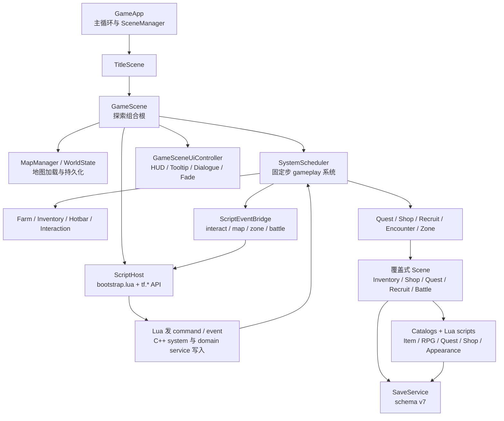
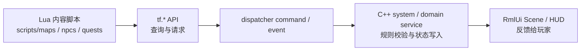

# 项目设计文档: TinyFarmRPG (教学演示项目)

## 项目简介

TinyFarmRPG 是一款从 2D 农场经营演示逐步扩展为日式 RPG Demo 的教学项目。项目仍保留农场、背包、快捷栏、地图切换、昼夜、存档等基础玩法，同时已经接入 Lua 脚本、分层角色外观、Effekseer 特效、RmlUi 生产 UI，并完成任务、商店、队伍、装备、招募与回合制战斗等 JRPG 核心闭环。

本项目的核心目的不是上线完整商业游戏，而是以教学和重构实践为导向，展示如何使用现代 C++、ECS、数据驱动资源和清晰的 engine/game 分层来构建可扩展的小型游戏工程。

## 核心架构原则

- **engine / game 分层**：`src/engine` 提供与具体玩法无关的可复用基础设施（渲染、输入、资源、ECS 系统、脚本宿主、VFX、UI 运行时等），`src/game` 在其之上组合出 TinyFarmRPG 的具体玩法、组件、系统、数据目录与场景。
- **ECS（EnTT）**：组件描述数据，系统在固定步 `SystemScheduler` 中推进；跨模块通信经由 `entt::dispatcher` 的命令 / 事件而非直接耦合，便于脚本与 UI 介入。
- **数据驱动 + 脚本内容层**：物品、作物、外观、任务规则、商店预设、JRPG（actors / classes / skills / states / equipment / enemies / troops）等静态规则数据落到 `assets/data` 下的 JSON 目录；NPC 对话、任务分支、招募对白、商店选择、地图 / 区域触发和战斗观察回调优先放在 `scripts/` Lua 内容层。
- **领域服务**：背包、装备、任务、商店等关键写入操作集中到 `game::domain::*Service`，命令与脚本桥接全部经其入口，确保一致性与原子性。
- **覆盖式场景**：常驻 `GameScene` 之上由 `SceneManager` 叠加 Inventory / Shop / Quest / Recruit / Battle / Pause / Save 等 RmlUi 弹出场景，所有 UI 资源走 `ui/rmlui/` 共享主题。

## 高层运行链路



## Lua 内容层约定

Lua 现在是项目的“剧本式内容层”。后续新增或修改 NPC 对话、任务 NPC 分支、招募对白、商人开场与静态 `shop_id` 选择、一次性地图事件、区域触发、剧情传送、剧情战入口或战斗观察回调时，优先在 `scripts/` 下实现，并在 `scripts/bootstrap.lua` 中注册模块；除非需要新增底层规则、性能热路径或原子写入能力，否则不要先改 C++ 系统。



边界规则：

- **Lua 负责内容编排**：条件判断、对白顺序、选项、一次性 flag、按时间 / 任务状态选择商店预设、触发 `tf.quest` / `tf.party` / `tf.shop` / `tf.battle` / `tf.map` 请求。
- **C++ 负责规则真相**：背包写入、任务接受与交付、招募入队、商店交易、地图切换、战斗解算、存档迁移等仍由 system 或 `game::domain::*Service` 完成。
- **脚本化交互要独占**：Tiled / blueprint 上设置 `scripted_interaction=true` 后，默认 C++ 对话、任务、招募、商店、宝箱、休息和衣柜交互会早退；Lua 脚本需要使用稳定身份字段（如 `actor_id`、`script_event`、`zone_id`）认领事件。
- **持久脚本状态走 `tf.state`**：一次性宝箱、首次进图、剧情 flag 等使用 `tf.state` 或 `lib.once`，不要只依赖 Lua module-local 变量；读档或重进 `GameScene` 会重新加载 `bootstrap.lua`。
- **静态规则数据仍写 JSON**：任务 objective / reward、商店库存预设、RPG actor / class / skill / enemy / troop 等仍是 catalog 数据；Lua 只选择和触发，不临时伪造第二套规则。

具体 API、Tiled 字段、脚本目录和常用配方见 [Lua 内容编写指南](tutorial/lua-content-authoring.md)；C++ 绑定实现细节见 [Lua 绑定教程](tutorial/lua-binding-guide.md)。

## 技术栈

- **构建系统**: CMake 3.13+
- **语言标准**: C++20
- **窗口与输入**: SDL3（CMake 依赖链路也接入 SDL3_image）
- **ECS 框架**: EnTT 3.16.0
- **图形渲染**: OpenGL + GLAD
- **UI 框架**: RmlUi 6.2（生产 UI） + ImGui（调试 UI）
- **图像解码**: stb_image.h（纹理加载与 RmlUi 图片加载主路径）
- **字体渲染**: FreeType 2.14.1 + HarfBuzz 12.1.0
- **音频**: MiniAudio
- **数学库**: GLM 1.0.1
- **日志**: spdlog 1.15.3
- **JSON 解析**: nlohmann-json 3.12.0
- **脚本宿主**: Lua 5.4.8 + Sol2 v3.5.0（project version 4.0.0）
- **粒子特效**: Effekseer 1.7.3.0 + EffekseerRendererGL（通过 `engine::vfx::VfxBackend` 接口接入）
- **测试框架**: GoogleTest 1.17.0
- **地图编辑**: Tiled（生成 .tmj/.tsj/.world 资源）

## 目录结构

> 仅列出目录级结构与模块职责。具体文件请使用 Glob/Grep 工具查询。

```
TinyFarmRPG/
├── src/
│   ├── engine/                  # 可复用游戏引擎层
│   │   ├── async/               #   多线程基础设施（WorkQueue/ThreadPool/MainThreadCommandQueue）
│   │   ├── audio/               #   音频播放（MiniAudio）
│   │   ├── component/           #   引擎层 ECS 组件（transform/sprite/collider/light 等）
│   │   ├── core/                #   应用生命周期、全局上下文 Context、配置、游戏状态（含主线程命令提交点）
│   │   ├── debug/               #   ImGui 调试面板框架与内置面板
│   │   ├── input/               #   输入映射与动作事件
│   │   ├── loader/              #   Tiled 地图/关卡加载器（含 LevelPreprocessService 异步预处理）
│   │   ├── render/              #   Renderer facade 与 OpenGL 多通道渲染管线（scene/light/emissive/bloom/vfx/ui）
│   │   ├── resource/            #   纹理/音频/字体统一资源管理（含 ImageDecode/FontPreprocess）
│   │   ├── scene/               #   场景基类 Scene 与场景管理器 SceneManager
│   │   ├── script/              #   脚本宿主内核（可选，Lua VM/安全边界/句柄校验/模块安装）
│   │   ├── spatial/             #   碰撞检测与空间分区（静态网格/动态网格）
│   │   ├── system/              #   引擎层 ECS 系统（动画/移动/渲染/Y排序/光照）
│   │   ├── ui/                  #   RmlUi 运行时与共享 UI 基础设施（runtime/data bridge/document controller/fade/layout helpers）
│   │   ├── utils/               #   工具函数（数学/对齐/事件定义）
│   │   └── vfx/                 #   特效服务与后端抽象（VfxService/VfxBackend/EffekseerBackend）
│   ├── game/                    # 游戏特定逻辑层
│   │   ├── battle/              #   回合制战斗领域层（TurnCore/BattleSession/ActionResolver/AI/Reward）
│   │   ├── component/           #   游戏组件（作物/库存/快捷栏/NPC/队伍/装备/任务/遭遇等）
│   │   ├── data/                #   游戏数据目录（GameTime/Item/Appearance/RPG/Quest/Shop/AudioCue catalog）
│   │   ├── debug/               #   游戏层 ImGui 调试面板（battle/quest/shop/inventory/map/save 等）
│   │   ├── defs/                #   Command / Event / 常量 / 作物 / 音频ID 定义
│   │   ├── domain/              #   领域服务（Inventory/Equipment/Quest/Shop 等原子写入与规则入口）
│   │   ├── factory/             #   实体蓝图 Blueprint 与工厂 EntityFactory
│   │   ├── loader/              #   游戏实体构建器（Tiled 约定扩展）
│   │   ├── runtime/             #   运行时装配（catalog/service/system/script factories）与声明式 SystemScheduler
│   │   ├── save/                #   存档系统（序列化/schema 迁移/槽位管理）
│   │   ├── scene/               #   游戏场景（Title/GameScene/Pause/Save/Inventory/Shop/Quest/Recruit/Battle 等）
│   │   ├── script/              #   TinyFarm 脚本扩展模块（tf.time/entity/quest/party/shop/battle/map/command/dialogue/event/state）
│   │   ├── system/              #   游戏 ECS 系统（农场/交互/NPC/招募/遭遇/装备/地图切换/物品使用等）
│   │   ├── ui/                  #   游戏 UI 组合层（HUD/快捷栏/菜单 tab/装备页/商店 helper/slot grid 等）
│   │   └── world/               #   世界地图系统（MapManager 异步预加载状态机/WorldState/快照序列化）
│   └── main.cpp                 # 可执行入口薄壳
├── assets/                      # 运行时资源与素材源
│   ├── audio/                   #   音频文件 (.wav/.ogg)
│   ├── data/                    #   JSON 配置（蓝图/作物/物品/对话/光照/地图加载/任务/商店/RPG 数据等）
│   │   └── rpg/                 #   JRPG 数据（actors/classes/skills/states/equipment/enemies/troops）
│   ├── farm-rpg/                #   第三方/原始素材包与拆分素材
│   ├── fonts/                   #   字体文件 (.ttf)
│   ├── maps/                    #   Tiled 地图与图块集 (.tmj/.tsj/.world)
│   ├── ref/                     #   参考素材
│   ├── shaders/                 #   GLSL 着色器 (.vert/.frag)
│   ├── tests/                   #   测试资源
│   ├── textures/                #   纹理资源 (.png/.gif/.json)
│   └── vfx/                     #   Effekseer 特效资源 (.efkefc/.efk)
├── ui/                          # UI 资源（RmlUi 文档/样式/主题；场景、HUD、overlay 分层）
├── scripts/                     # Lua 内容脚本（bootstrap/lib/maps/npcs/quests）
├── config/                      # 引擎配置（窗口/输入/渲染/音频/文本）
├── cmake/                       # CMake 构建模块（依赖管理/编译器设置/RmlUi 与 ImGui 集成等）
├── external/                    # 第三方库源码（SDL/EnTT/RmlUi/ImGui/Lua/Sol2/Effekseer 等）
├── tests/                       # Google Test（engine/game/shared/data/scripts 分层测试）
├── tools/                       # 调试与验证工具（visual_tester/rmlui_tester/battle_tester/scheduler_dot_dump/rpg_importer）
├── plans/                       # 开发计划文档与归档方案
├── docs/                        # 项目文档（引擎/玩法/测试/教程）
└── for_agent/                   # AI Agent 编码规范
```
