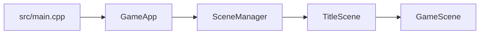

# 学习路线

这条路线面向第一次阅读 TinyFarmRPG 的学生。它按“先看整体，再看运行链路，最后深入模块”的顺序组织，不要求一开始就读完所有文档。

## 第 0 阶段：知道项目是什么

目标：建立大图，不急着看细节。

1. [项目总览](../overview.md)
2. [文档入口](../README.md)

读完后你应该能回答：

- `src/engine` 和 `src/game` 的边界是什么？
- 哪些内容放在 JSON，哪些内容放在 Lua？
- 游戏为什么采用 Scene 栈和 ECS？

## 第 1 阶段：从启动读到第一帧

目标：理解程序如何从 `main` 进入游戏循环。

1. [启动到第一帧](../engine/entry_to_first_frame.md)
2. [场景系统](../engine/scenes.md)
3. [逻辑循环 / 渲染循环契约](../engine/loop_timing_contract.md)
4. [事件分发约定](../engine/events.md)

建议读代码路线：

## 第 2 阶段：理解 ECS 和系统调度

目标：理解“数据在组件里，行为在系统里，顺序在调度器里”。

1. [ECS 约定](../engine/ecs.md)
2. [Game 系统调度器](../game/system_scheduler.md)
3. [移动与碰撞](../engine/movement_and_collision.md)
4. [空间索引](../engine/spatial_index.md)

读完后再看 `src/game/runtime/system_scheduler.cpp`，会更容易理解为什么系统顺序本身就是依赖表。

## 第 3 阶段：读 GameScene 与探索玩法

目标：把玩家移动、地图、交互、农场、背包串成一个闭环。

1. [GameScene](../game/game_scene.md)
2. [玩家控制](../game/player_control.md)
3. [地图数据管线](../game/map_data_pipeline.md)
4. [MapManager](../game/map_manager.md)
5. [WorldState](../game/world_state.md)
6. [运行时装配](../game/runtime-assembly.md)
7. [领域服务](../game/domain-services.md)
8. [交互与对话](../game/interaction_and_dialogue.md)
9. [物品使用与农场循环](../game/farm_loop.md)
10. [背包与快捷栏](../game/inventory_hotbar.md)

推荐追踪一次完整链路：玩家按交互键，`InteractionSystem` 找目标，目标系统发 UI 或命令，最终状态写回组件或 WorldState。

## 第 4 阶段：理解数据驱动内容

目标：知道新增内容时应该改 JSON、Tiled、Lua 还是 C++。

1. [蓝图系统](../game/blueprints.md)
2. [数据 Catalog 总览](../game/data-catalogs.md)
3. [地图数据管线](../game/map_data_pipeline.md)
4. [任务系统](../gameplay/quest-system.md)
5. [商店系统](../gameplay/shop-system.md)
6. [分层角色外观](../gameplay/layered-appearance.md)
7. [昼夜与光照](../game/time_and_lighting.md)

这一阶段的重点不是背字段，而是理解 catalog、component、system、scene 之间的分工。

## 第 5 阶段：写 Lua 内容脚本

目标：能新增 NPC 对话、任务分支、商店选择、一次性事件和剧情战入口。

1. [Lua 内容编写指南](lua-content-authoring.md)
2. [C++ 绑定 Lua 教程](lua-binding-guide.md)
3. [ScriptHost 内核](../engine/script_host.md)
4. [交互与对话](../game/interaction_and_dialogue.md)
5. [地图数据管线](../game/map_data_pipeline.md)

推荐先读 `scripts/bootstrap.lua`，再读 `scripts/npcs/merchant.lua`、`scripts/quests/village_goblin_cleanup.lua` 和 `scripts/maps/home_exterior.lua`。

## 第 6 阶段：理解生产 UI

目标：看懂 RmlUi 文档、数据绑定、覆盖式场景和 HUD 如何协作。

1. [RmlUi 运行时](../engine/ui_framework.md)
2. [Game UI Scenes](../game/ui-scenes.md)
3. [本地化系统](../game/localization.md)
4. [RmlUi 布局契约](../engine/layout-contract.md)
5. [分辨率与视口](../engine/resolution_and_viewport.md)
6. [UI 回归检查](../testing/ui-regression-checklist.md)
7. [UI 布局回归检查](../testing/ui-layout-regression-checklist.md)

建议从 `ui/rmlui/scenes/inventory_menu.rml` 和 `src/game/scene/inventory_menu_scene.cpp` 开始读，因为它包含多个 tab、data model、图标、拖拽和快捷键。

## 第 7 阶段：深入 JRPG 系统

目标：理解任务、商店、队伍、装备、战斗如何形成 RPG 闭环。

1. [任务系统](../gameplay/quest-system.md)
2. [商店系统](../gameplay/shop-system.md)
3. [队伍、装备、休息与招募](../gameplay/party-equipment-rest-recruitment.md)
4. [回合制战斗](../gameplay/turn-based-battle.md)
5. [战斗内部](../game/battle-internals.md)
6. [存档与流程](../game/save_and_flow.md)

战斗文档较长，建议先读“架构分层”和“完整战斗流程”，再按需要回到菜单、AI、动作执行、奖励写回等章节。

## 第 8 阶段：调试、测试和多线程专题

目标：能定位问题，并理解项目中的异步加载、后台保存和并行调度。

1. [调试与崩溃定位](debugging.md)
2. [调试与验证工具](../testing/tools.md)
3. [多线程教程系列](multi-thread/README.md)
4. [异步预加载管线](../game/async_preload_pipeline.md)

多线程教程可以作为专题课阅读，不必在第一次理解玩法系统时全部读完。
