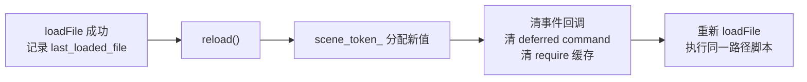

# C++ 绑定 Lua 教程：以 TinyFarm ScriptHost 为例

本文档以当前 TinyFarm 脚本宿主为素材，从零讲解 C++ 如何通过 Sol2 与 Lua 交互。

> 如果你的目标是“写游戏内容脚本”，例如新增 NPC 对话、任务分支、招募对白、商店预设、地图触发或战斗回调，请先读 [Lua 内容编写指南](lua-content-authoring.md)。本文更偏 C++ 绑定实现与测试策略。

---

## 目录

1. [三层关系：Lua、Sol2、你的代码](#1-三层关系lualib--sol2--你的代码)
2. [sol::state —— 一切的起点](#2-solstate--一切的起点)
3. [把 C++ 函数暴露给 Lua](#3-把-c-函数暴露给-lua)
4. [用 table 组织 API 命名空间](#4-用-table-组织-api-命名空间)
5. [Lambda 捕获与引用生命周期](#5-lambda-捕获与引用生命周期)
6. [可选参数：sol::optional](#6-可选参数soloptional)
7. [返回多值给 Lua：std::tuple](#7-返回多值给-luastdtuple)
8. [执行 Lua 代码的两种方式](#8-执行-lua-代码的两种方式)
9. [错误处理：不崩溃的秘诀](#9-错误处理不崩溃的秘诀)
10. [完整数据流：脚本如何驱动游戏](#10-完整数据流脚本如何驱动游戏)
11. [测试策略](#11-测试策略)

---

## 1. 三层关系：lua(lib) / Sol2 / 你的代码

```
┌─────────────────────────────────────────────┐
│  Lua 脚本  (bootstrap.lua)                   │   ← 用户/策划写的逻辑
├─────────────────────────────────────────────┤
│  Sol2      (sol/sol.hpp, header-only)        │   ← C++ ↔ Lua 的类型安全桥梁
├─────────────────────────────────────────────┤
│  Lua C库   (lua_static, 从 .c 编译)          │   ← Lua 虚拟机本体
├─────────────────────────────────────────────┤
│  你的 C++  (ScriptHost, TinyFarmScriptModule)│   ← 游戏逻辑
└─────────────────────────────────────────────┘
```

**Lua C 库**是一个用纯 C 写的虚拟机。它提供的 API 是栈式的（push/pop），用起来繁琐且容易出错。

**Sol2** 是一个 header-only 的 C++ 封装，把栈操作隐藏起来，让你可以像写普通 C++ 一样跟 Lua 交互。它在编译期做类型检查，运行时自动处理 C++ ↔ Lua 的类型转换。

**你的代码** 只需要和 Sol2 的类型打交道（`sol::state`、`sol::table`、`sol::function` 等），完全不需要碰 Lua 原生的 C API。

---

## 2. sol::state —— 一切的起点

`sol::state` 是对 `lua_State*` 的 RAII 封装。它在构造时创建 Lua 虚拟机，析构时销毁。

```cpp
// engine/script/script_host.h
class ScriptHost final {
    sol::state lua_;   // ← 拥有一个完整的 Lua 虚拟机
    // ...
};
```

### 初始化标准库

Lua 虚拟机刚创建时是"空白"的——连 `print`、`string.format` 都没有。需要手动加载标准库：

```cpp
// engine/script/script_host.cpp — init()
lua_.open_libraries(
    sol::lib::base,     // print, assert, type, pairs ...
    sol::lib::math,     // math.floor, math.random ...
    sol::lib::table,    // table.insert, table.sort ...
    sol::lib::string    // string.format, string.find ...
);
```

每个 `sol::lib` 对应 Lua 标准库的一个模块。你可以按需选择——不加载的库在脚本中就不可用（这也是安全沙箱的基础）。

> **项目选择**：没有加载 `sol::lib::io`（文件操作）、`sol::lib::os`（系统命令）和 `sol::lib::package`（Lua 原生 `require`）。脚本模块通过白名单式 `tf.script.require("module.name")` 加载，只能解析到 `scripts/` 下的 `.lua` 文件。
>
> `ScriptHost::hardenLuaGlobals()` 还会把 `dofile`、`loadfile`、`load`、`rawset`、`rawget`、`collectgarbage` 和 `string.dump` 设为 `nil`。标准库白名单解决"没有入口"，危险全局清理解决"base/string 库里仍残留可绕路入口"。

---

## 3. 把 C++ 函数暴露给 Lua

Sol2 最核心的能力是**让 Lua 可以调用 C++ 函数**。以最简单的例子开始：

```cpp
// 概念示例
lua_.set_function("greet", []() {
    return std::string("Hello from C++!");
});
```

之后在 Lua 中就可以：

```lua
print(greet())  -- 输出: Hello from C++!
```

Sol2 自动处理了这些事情：
1. 把 C++ lambda 包装成 Lua 可调用的 C function
2. 把 Lua 传入的参数从 Lua 栈取出并转换为 C++ 类型
3. 把 C++ 返回值转换为 Lua 值并压入栈

### 类型自动转换表

| C++ 类型 | Lua 类型 | 说明 |
|----------|----------|------|
| `int`, `float`, `double`, `std::uint32_t` | `number` | 数值自动互转 |
| `bool` | `boolean` | |
| `std::string`, `const char*` | `string` | Sol2 自动拷贝字符串 |
| `std::tuple<A, B>` | 多返回值 | Lua 支持函数返回多个值 |
| `sol::optional<T>` | `T` 或 `nil` | 用于可选参数 |
| `void` | 无返回值 | |

---

## 4. 用 table 组织 API 命名空间

如果所有函数都注册在全局空间，脚本会很混乱。Sol2 用 `sol::table` 来模拟命名空间：

```cpp
// game/script/tinyfarm_script_module.cpp — installTinyFarmScriptModule()

// 创建顶层命名空间 "tf"
sol::table tf_impl = lua.create_table();

// 创建子表 "time"
auto api = std::make_shared<game::script::ScriptGameApi>(host, registry, dispatcher);
sol::table time_impl = lua.create_table();
time_impl.set_function("day", [api]() -> std::uint32_t { return api->day(); });
time_impl.set_function("hour", [api]() -> float { return api->hour(); });

// 将子表挂到命名空间
tf_impl["time"] = engine::script::createReadOnlyProxy(lua, time_impl, "tf.time");
lua["tf"] = engine::script::createReadOnlyProxy(lua, tf_impl, "tf");
```

这样在 Lua 中就有了层次化的 API：

```lua
local day = tf.time.day()       -- 调用 C++ lambda
local hour = tf.time.hour()
print(tf.time.formatted())      -- "Day 3, 07:15"
```

### 项目中的 API 树

```
tf
├── i18n
│   ├── tr(key)                              → string
│   └── format(key, args)                    → string
├── time
│   ├── day()          → uint32
│   ├── hour()         → float
│   ├── minute()       → float
│   └── formatted()    → string
├── player
│   ├── exists()       → bool
│   ├── handle()       → ScriptEntityHandle | nil
│   ├── gold()         → int
│   └── position()     → float, float  (多返回值)
├── entity
│   ├── actor_id(handle)            → string | nil
│   ├── name(handle)                → string | nil
│   ├── position(handle)            → float, float
│   └── has_component(handle, kind) → bool
├── quest
│   ├── status(quest_id)                          → string
│   ├── progress(quest_id, objective_id)          → { current, required }
│   ├── is_available(quest_id)                    → bool
│   ├── offer(quest_id, giver_handle)             → { ok, reason }
│   ├── accept(quest_id, giver_handle)            → { ok, reason }
│   └── turn_in(quest_id, giver_handle)           → { ok, reason }
├── party
│   ├── members()                                 → { actor_id, ... }
│   ├── is_recruited(actor_id)                    → bool
│   ├── offer_recruit(actor_id [, handle])        → { ok, reason }
│   ├── request_recruit(actor_id [, handle])      → { ok, reason }
│   ├── level(actor_id)                           → int
│   └── initial_level(actor_id)                   → int
├── shop
│   └── open(shop_id [, merchant_handle])         → { ok, reason }
├── battle
│   ├── start(troop_id [, opts])                  → { ok, reason }
│   ├── on_turn_start(fn)                         → bool
│   ├── on_turn_end(fn)                           → bool
│   ├── on_unit_died(fn)                          → bool
│   └── on_skill_used(fn)                         → bool
├── map
│   ├── current()                                 → string
│   └── warp(map_id, x, y)                        → { ok, reason }
├── command
│   ├── add_item(item_id, count [, target_handle] [, slot])     → bool
│   ├── remove_item(item_id, count [, target_handle] [, slot])  → bool
│   ├── inventory_sync([target_handle])                         → bool
│   ├── hotbar_sync([target_handle] [, full_sync])              → bool
│   ├── interact(target_handle [, player_handle])               → bool
│   └── open_chest(chest_handle [, notice_text])                → { ok, reason }
├── dialogue
│   ├── CHANNEL_CONVERSATION / CHANNEL_NOTICE / CHANNEL_ITEM_NOTICE
│   ├── show(text [, speaker] [, channel] [, target_handle])    → bool
│   ├── hide([channel] [, target_handle])                       → bool
│   └── choice(prompt, choices [, opts])                        → request_id | 0
├── event
│   └── on(event_name, fn)                                      → bool
├── callbacks
│   ├── on_interact(fn)                                         → bool
│   ├── on_dialogue_choice_selected(fn)                         → bool
│   ├── on_day_changed(fn)                                      → bool
│   ├── on_battle_end(fn)                                       → bool
│   ├── on_battle_turn_start(fn)                                → bool
│   ├── on_battle_turn_end(fn)                                  → bool
│   ├── on_battle_unit_died(fn)                                 → bool
│   └── on_battle_skill_used(fn)                                → bool
├── script
│   └── require(module_name)                                    → table | bool | nil
└── state
    ├── get(key [, default])                                    → value | default | nil
    ├── get_int/get_number/get_bool/get_string(key [, default]) → typed value
    ├── set(key, value)                                         → bool
    ├── add(key [, amount])                                     → number | nil
    └── unset(key)                                              → bool
```

`[ ]` 表示可选参数，用 `sol::optional` 实现。

`tf.state` 的 key 推荐使用 `domain.object.field` 命名，例如 `quest.first_delivery.stage`、`npc.lyria.mood`。它只接受 JSON 兼容基元：`nil`、`boolean`、`number`、`string`；`table`、`function`、entity handle 等值会被拒绝并记录日志。Lua 的 `number` 在存档中统一保存为 JSON number，不区分 int/float，脚本侧用 `get_int` 或 `get_number` 表达读取意图。

`tf.quest.offer`、`tf.quest.accept`、`tf.quest.turn_in`、`tf.party.offer_recruit`、`tf.party.request_recruit`、`tf.shop.open`、`tf.battle.start`、`tf.map.warp`、`tf.command.open_chest` 返回 `{ ok, reason }`。这里的 `ok = true` 表示请求已通过脚本层校验并发出 command/event；真正的库存、奖励、招募、战斗装配、地图加载与安全落点修正等规则仍由对应 C++ system / domain service 决定。

脚本化任务 NPC 通常在 offerable 分支对白结束后调用 `tf.quest.offer(quest_id, evt.target)` 打开 C++ 任务确认弹窗；玩家确认后才由 `QuestOfferScene` 调用 `tf.quest.accept` 对应的底层 command。`tf.quest.accept` 只适合确认按钮或明确想跳过确认的脚本直接使用。

`tf.party.members()` 返回 `PartyComponent::recruited_actor_ids_` 原样，因此包含玩家本人（默认 `actor.player`）。`tf.party.level(actor_id)` 只表示已招募角色的当前等级；未招募或未知角色返回 `0`。如果脚本需要读取 catalog 中的初始等级，使用 `tf.party.initial_level(actor_id)`。

脚本化招募 NPC 通常在 Tiled 同时配置 `recruit_actor_id = "actor.lyria"` 与 `scripted_interaction = true`。Lua 负责对白分支，在对白结束回调里调用 `tf.party.offer_recruit(actor_id, evt.target)` 打开 C++ 入队确认；玩家确认后才会由 `PartyRecruitmentSystem` 校验 recruitable 实体、写入 `PartyComponent` / 运行时状态并移除地图上的招募 NPC。`tf.party.request_recruit` 是确认后的底层提交入口，只有明确想跳过确认时才应直接调用。未脚本化的 recruitable 只保留为 fallback，会直接触发 C++ 入队确认，正式内容优先使用 Lua。

重复的招募 NPC 样板放在 `lib.recruit_npc`：内容脚本只需传 `actor_id`、`intro_lines` 和 `recruited_line`，helper 会按 `evt.target_actor_id` 过滤目标、尊重 `evt.dialogue_handled`，并在对白结束后请求入队确认。

`tf.shop.open` 会直接打开指定商店，不播放 C++ 商人 greeting；脚本侧如果需要开店前对白，应先用 `tf.dialogue` 或 `lib.dialogue` 自行编排。动态商店首版采用"多个静态 `shop_id` 预设"模式：在 `assets/data/shops.json` 预先定义 day / night / post-quest 等商店，Lua 根据 `lib.time.is_night()`、`tf.quest.status(...)` 等条件选择其中一个传给 `tf.shop.open`。例如 `scripts/npcs/merchant.lua` 会让 Josh 在白天打开 `shop.village.general.day`，夜晚打开 `shop.village.general.night`，完成清理史莱姆任务后打开 `shop.village.general.post_slime_cleanup`。当前不要在 Lua 中临时生成库存或价格；交易 UI 与 `ShopTransactionService` 都读取同一份 `ShopCatalog`。

`tf.battle.start` 要求显式传入非空 `troop_id`；`opts` 当前支持 `actor_ids = {"actor.lyria"}` 与 `battle_background_id = "Grassland"`。`battle_started` payload 会包含 `troop_id`、`battle_background_id`、`actor_ids`、`from_encounter` 与 `encounter_id`；`battle_ended` payload 包含 `outcome` 与胜利奖励摘要。

`tf.map.warp(map_id, x, y)` 会发出 `WarpToMapCommand`，由 `MapTransitionSystem` 统一执行地图加载、fade、玩家锁定、安全落点搜索、相机吸附以及 `map_exit` / `map_enter` 事件。`map_id` 使用不带 `.tmj` 的地图名，例如 `"home_interior"`；`x` / `y` 是目标地图内的像素坐标。空 map id 返回 `invalid_map_id`，非有限坐标返回 `invalid_position`，缺少玩家或玩家 Transform 返回 `no_player`。跨地图 warp 会触发 map enter/exit；同地图 warp 只移动玩家，不重复发布地图切换事件。

脚本化宝箱应在发放 Lua 奖励前调用 `tf.command.open_chest(evt.target, notice_text)`。它不会读取 `ChestComponent.rewards_`，只负责复用 C++ 宝箱生命周期：播放 open 动画、标记 `ChestComponent.opened_`、写入当前地图的 `opened_chests` 存档，并用 `Notice` channel 显示一条会自动消失的短提示。常见失败 reason 包括 `invalid_chest`、`not_chest`、`not_scripted`、`already_opened`、`no_player`。

战斗回调首版只做观察，不允许 Lua 直接改写单位 HP、回合队列，或在战斗回调内调用 `tf.battle.start` 叠开新战斗；如果需要胜利后接下一场战斗，应在 `battle_ended` 后编排。`tf.battle.on_*` 与 `tf.callbacks.on_battle_*` 是同一组事件的两套注册入口，根据脚本风格选一种即可。

`tf.battle.on_turn_start(fn)` 对应 `battle_turn_started`，payload 含 `round_index`、`unit`、`unit_id`、`actor_id` / `enemy_id` 与 `unit_kind`；`on_turn_end(fn)` 对应 `battle_turn_ended`，额外含 `result`，其中 `action_type`、`status`、`skill_id`、`target_unit_id`、`damage`、`states_added` 等字段来自 C++ 行动结算结果；`on_unit_died(fn)` 对应 `battle_unit_died`，用于判断死亡单位身份和来源行动；`on_skill_used(fn)` 对应 `battle_skill_used`，用于剧情战阶段提示或统计特殊技能。`unit_kind` 优先根据 catalog 来源返回 `actor` / `enemy`；无来源 id 的临时单位会按阵营 fallback 为 `player` / `enemy`，此时 `actor_id` / `enemy_id` 为 `nil`。

成功行动的事件顺序固定为 `battle_turn_ended` → `battle_skill_used`（仅 Skill 行动）→ `battle_unit_died`（0 到多个）。如果行动者因自己的行动死亡，`battle_turn_ended.unit` 会已经是死亡后的行动者状态，随后同一单位还会收到 `battle_unit_died`；脚本应按需求选择监听其中一个事件。战斗内事件较密集，脚本应保持回调短小，并确保重复注册是幂等的。

任务内容脚本约定用 `scripts/quests/*.lua` 承载剧情分支，quest id 保持数据侧 dot 命名，例如 `quest.village.goblin_cleanup`；Lua module path 去掉 `quest.` 前缀后把余下的 `.` 压平成 `_`，例如 `quests.village_goblin_cleanup`。脚本侧使用 `lib.quest.module_for(quest_id)` 生成 module path，避免手写 require 路径：

```lua
local quest = tf.script.require("lib.quest")
tf.script.require(quest.module_for("quest.village.goblin_cleanup"))
```

`tf.event.on("interact", fn)` 的 payload 会提供稳定目标信息，脚本不需要反查 ECS 细节：

- `player` / `target`：`ScriptEntityHandle | nil`
- `target_actor_id`：来自 `ActorIdentityComponent`，例如 `actor.lyria` 或 `npc.manu`；Tiled actor 可用 `actor_id` 属性覆盖蓝图默认身份
- `target_name`：来自 `NameComponent`
- `target_kind`：`npc` / `merchant` / `quest_giver` / `recruitable` / `chest` / `unknown`
- `target_blueprint_id`：地图 actor 的蓝图 ID，如 `lyria` 或 `quest`
- `target_script_module` / `target_script_event` / `target_script_once_key`：来自 Tiled `script_*` 属性，用于脚本化宝箱、机关等地图事件；未配置时为 `nil`
- `map_id` / `map_id_hash`：当前地图名称与哈希字符串；无 `WorldState` 时为 `nil`

挂 `ScriptedInteractionComponent` 或 Tiled 属性 `scripted_interaction = true` 的实体由 Lua 独占交互，默认 C++ 对话、任务、招募、商店、宝箱、休息、衣柜系统都会早退。

`tf.event.on("map_enter", fn)` 和 `tf.event.on("map_exit", fn)` 用于地图级剧情触发：

- `map_enter` payload：`map_id` / `map_id_hash`，以及 `previous_map_id` / `previous_map_id_hash`
- `map_exit` payload：`map_id` / `map_id_hash`，以及 `next_map_id` / `next_map_id_hash`
- `map_id` 字段是地图名字符串，例如 `home_exterior`；`*_hash` 字段是字符串化哈希，避免 Lua number 精度问题

`tf.event.on("zone_enter", fn)` 和 `tf.event.on("zone_exit", fn)` 用于矩形区域触发。Tiled 中使用 `type="script_zone"` 的 rect object，并设置 `zone_id` 以及可选 `script_event` / `script_once_key`：

- `zone_enter` / `zone_exit` payload：`player` / `zone` handle、`map_id` / `map_id_hash`、`zone_id` / `zone_id_hash`
- `zone_script_module` / `zone_script_event` / `zone_script_once_key` 来自同一 object 的 `script_*` 属性；未配置时为 `nil`
- 事件只在边界变化时触发：进入区域触发一次，停留区域内不会每帧重放，离开区域再触发一次
- `tf.entity.has_component(evt.zone, "script_zone")` 可用于确认 handle 类型

一次性地图触发建议使用 `lib.once` 包装 `tf.state`，例如 `once.run("map.home_exterior.first_enter", function() ... end)`。它采用 at-most-once 语义：先写入完成标记再执行回调，因此回调失败也不会自动重试，适合避免读档或重复交互重发奖励。`scripts/maps/<map_id>.lua` 是地图专属脚本目录约定；`scripts/maps/home_exterior.lua` 展示了首次进入提示和脚本化宝箱。由于启动时初始地图会先于 Lua bootstrap 加载，地图脚本若要处理“当前已在本地图”的首次进入逻辑，应在注册 `map_enter` 后用 `tf.map.current()` 主动调用同一个 handler。

脚本化多行对话请先加载 `lib.dialogue`，再加载 NPC 模块。该 helper 使用 `Conversation` channel，并在 `require("lib.dialogue")` 时注册全局 `interact` 推进器；NPC 脚本应在它之后注册自己的 `interact` 回调，避免同一次交互里刚 `dialogue.start(...)` 就被推进到下一行。`scripts/bootstrap.lua` 已按这个顺序组织模块。

脚本化实体的 conversation 生命周期由 C++ 的 `ScriptedDialogueLifecycleSystem` 补齐：当玩家离开当前对话目标超过交互距离阈值时，系统会发出 `dialogue_closed`。`lib.dialogue` 会把这视为外部中断，清理内部 sequence，并以 `interrupted = true` 调用 `on_done`。

`tf.dialogue.choice(prompt, choices, opts)` 会请求打开一个 RmlUi 选项弹窗，并返回非零 `request_id`；失败时返回 `0`。`choices` 支持字符串数组或 `{ id = "...", label = "..." }` 条目，首版 UI 适合 2-4 个选项。`opts` 支持 `target`、`speaker`、`speaker_actor_id`、`allow_cancel`。玩家选择后会发 `dialogue_choice_selected`，payload 含 `request_id`、`target`、`cancelled`、1-based `choice_index`、0-based `choice_zero_index`、`choice_id` 与 `choice_label`。

常规内容脚本建议使用 `lib.dialogue.choice(target, prompt, choices, callback)`，helper 会自动按目标补 speaker / actor_id，并把 result table 路由回对应 callback：

```lua
dialogue.choice(evt.target, "Take a seed?", {
    { id = "potato", label = "Potato" },
    { id = "strawberry", label = "Strawberry" },
}, function(result)
    if result.cancelled then
        return
    end
    print("picked " .. tostring(result.id))
end)
```

`evt.dialogue_handled` 是 Lua 脚本之间约定的协调标志，不来自 C++ payload。`lib.dialogue` 在同一次按键推进或关闭当前对话时会把它设为 `true`；NPC/quest 脚本应在回调开头检查并尽早 `return`。脚本自己成功认领一次交互并调用 `dialogue.start(...)` 后，也可以把该字段设为 `true`，避免后续监听器再处理同一按键。

---

## 5. Lambda 捕获与引用生命周期

这是最重要也最容易出错的地方。看这行代码：

```cpp
time_api.set_function("day", [&registry]() -> std::uint32_t {
    const auto* game_time = registry.ctx().find<game::data::GameTime>();
    return game_time ? game_time->day_ : 0u;
});
```

Lambda 捕获了 `registry` 的**引用**。这意味着：

- Lambda 不拥有 registry，只是指向它
- 当 Lua 脚本调用 `tf.time.day()` 时，这个 lambda 被执行，它通过引用访问当时的 registry 状态
- **如果 registry 已经被销毁，这里就是悬垂引用（use-after-free）**

### 为什么用引用而不是拷贝？

`entt::registry` 是整个 ECS 世界的核心容器，不可能拷贝。所有 lambda 必须通过引用访问它。

### 安全保证

在本项目中，生命周期是安全的：

```
GameScene 拥有:
  ├── services_ (unique_ptr<GameRuntimeServices>)
  │     └── script_host (unique_ptr<ScriptHost>)   ← 持有 sol::state 和所有 lambda
  └── registry_ (entt::registry)                    ← lambda 引用的对象

GameScene 析构时:
  1. services_ 析构 → ScriptHost 析构 → sol::state 析构 → 所有 lambda 被销毁
  2. registry_ 析构
```

Lambda 总是比 registry 先销毁，所以引用始终有效。

---

## 6. 可选参数：sol::optional

Lua 是动态类型语言，函数参数可以省略（省略的参数值为 `nil`）。Sol2 用 `sol::optional<T>` 映射这个行为：

```cpp
command_api.set_function(
    "add_item",
    [api](
        const std::string& item_id,              // 必填
        int count,                                // 必填
        sol::optional<ScriptEntityHandle> target_handle, // 可选
        sol::optional<int> preferred_slot          // 可选
    ) -> bool {
        return api->addItem(
            item_id,
            count,
            toStdOptional(target_handle),
            preferred_slot.value_or(-1));
    });
```

Lua 调用时可以这样：

```lua
-- 只传必填参数（target 自动选 player，slot 自动选择）
tf.command.add_item("wheat_seed", 5)

-- 传全部参数
local player = tf.player.handle()
tf.command.add_item("wheat_seed", 5, player, 0)
```

这里的 `target_handle` 不是 raw entity id，而是 `ScriptEntityHandle`。绑定层先用 `toStdOptional` 把 Sol2 的可选值转换为 `std::optional<ScriptEntityHandle>`，再交给 `ScriptGameApi::addItem` 做默认玩家解析、scene token 校验和 `registry.valid` 校验。

### sol::optional vs std::optional

Sol2 有自己的 `sol::optional<T>`，它比 `std::optional<T>` 多做了一件事：自动与 Lua 的 `nil` 互转。当 Lua 传 `nil` 或不传参数时，`sol::optional` 的 `has_value()` 返回 false。

---

## 7. 返回多值给 Lua：std::tuple

Lua 原生支持函数返回多个值。Sol2 把 `std::tuple` 自动映射为多返回值：

```cpp
player_api.set_function("position", [&registry]() -> std::tuple<float, float> {
    const entt::entity player = game::system::helpers::getPlayerEntity(registry);
    if (player == entt::null) {
        return {0.0f, 0.0f};
    }
    const auto* transform = registry.try_get<engine::component::TransformComponent>(player);
    if (!transform) {
        return {0.0f, 0.0f};
    }
    return {transform->position_.x, transform->position_.y};
});
```

Lua 侧：

```lua
local x, y = tf.player.position()
print(string.format("Player at (%.1f, %.1f)", x, y))
```

---

## 8. 执行 Lua 代码的两种方式

ScriptHost 提供两个**互相独立**的公共方法来执行 Lua 代码，它们之间没有先后依赖关系：

### 方式 A：`loadFile` —— 从磁盘文件执行

参数是**文件路径**。内部调用 `lua_.load_file()` 读取文件内容并编译。

```cpp
bool ScriptHost::loadFile(std::string_view file_path) {
    const std::string path(file_path);

    // 第一步：编译。从磁盘读取文件，解析为字节码，得到一个可调用的 chunk
    sol::load_result chunk = lua_.load_file(path);
    if (!chunk.valid()) {
        // 语法错误在这里被捕获
        const sol::error err = chunk;
        spdlog::error("脚本加载失败: {}", err.what());
        return false;
    }

    // 第二步：执行。运行编译好的 chunk
    sol::protected_function fn = chunk;
    return runResult(fn(), path);   // fn() 触发执行
}
```

Lua 中一个文件的顶层代码本身就是一个匿名函数，编译后需要"调用"它才能让里面的语句生效。

调用示例：

```cpp
host.loadFile("scripts/bootstrap.lua");   // 参数是文件路径
```

### 方式 B：`exec` —— 直接执行代码字符串

参数是 **Lua 代码本身**（不是文件路径）。内部调用 `lua_.load()` 编译字符串。

```cpp
bool ScriptHost::exec(std::string_view script) {
    // 编译字符串为 chunk（不涉及磁盘 I/O）
    sol::load_result chunk = lua_.load(std::string(script), "ScriptHost::exec");
    if (!chunk.valid()) { /* 语法错误 */ }

    // 执行
    sol::protected_function fn = chunk;
    return runResult(fn(), "ScriptHost::exec");
}
```

`lua_.load(code, name)` 的第二个参数 `name` 不是文件路径，而是给这段代码起的**调试名称**，出错时会显示在错误信息中方便定位。

调用示例：

```cpp
// 参数是 Lua 代码字符串，不需要事先调用 loadFile
host.exec("print(tf.time.day())");
host.exec(R"(
    local x, y = tf.player.position()
    print(string.format("Player at %.1f, %.1f", x, y))
)");
```

### 对比

| | `loadFile` | `exec` |
|---|---|---|
| 参数含义 | 磁盘文件路径 | Lua 代码字符串 |
| 内部编译方式 | `lua_.load_file(path)` | `lua_.load(code, debug_name)` |
| 典型用途 | 加载 `bootstrap.lua` 等脚本文件 | 测试、REPL、动态生成的代码 |
| 是否需要先调用另一个 | 否，独立使用 | 否，独立使用 |
| 性能 | 有磁盘 I/O 开销 | 无 I/O |

### `reload`：同一个 VM 内重跑 bootstrap

`reload()` 只在已经成功 `loadFile()` 过脚本时可用。它不会销毁整个 `sol::state`，但会清理脚本运行时状态并推进句柄代际：



这正是暂停菜单"在同一 `GameScene` 内读档后重新加载 bootstrap"使用的路径。旧 Lua 全局变量不应该被当作持久化状态；需要跨读档保留的剧情状态应写进 `tf.state`，需要在 reload 后继续使用的 handle 必须重新从 C++ payload 或 `tf.player.handle()` 取得。

---

## 9. 错误处理：不崩溃的秘诀

Lua 脚本运行时出错（除以零、访问 nil 字段等）时，如果不处理，会导致 C++ 异常或程序崩溃。项目使用 `sol::protected_function` 和统一收口函数来防止这种情况：

```cpp
bool ScriptHost::runResult(sol::protected_function_result&& result, std::string_view source) {
    if (result.valid()) {
        return true;     // 脚本执行成功
    }
    // 脚本执行失败——记录日志，不抛异常，不崩溃
    const sol::error err = result;
    spdlog::error("ScriptHost: 脚本执行失败 [{}]: {}", source, err.what());
    return false;
}
```

### 关键概念

- **`sol::protected_function`** 是"安全调用"模式。调用它时，Lua 内部用 `pcall`（protected call）执行，任何错误都会被捕获而不是传播为 C++ 异常。
- **`sol::protected_function_result`** 持有调用结果。通过 `.valid()` 检查是否成功，失败时转为 `sol::error` 获取错误信息。

### 对比：安全 vs 不安全

```cpp
// 不安全：脚本出错会抛 C++ 异常
sol::function fn = lua_["some_function"];
fn();  // 如果 some_function 内部出错 → std::exception

// 安全：错误被捕获为返回值
sol::protected_function fn = lua_["some_function"];
auto result = fn();
if (!result.valid()) {
    // 处理错误，程序继续运行
}
```

项目全程使用安全模式，确保脚本 bug 永远不会让游戏崩溃。

---

## 10. 完整数据流：脚本如何驱动游戏

以"脚本给玩家添加物品"为例，跟踪完整的调用链：

```mermaid
flowchart LR
    L["Lua<br/>tf.command.add_item"] --> S["Sol2<br/>参数转换"]
    S --> B["绑定 lambda<br/>tinyfarm_script_module"]
    B --> A["ScriptGameApi::addItem"]
    A --> R["resolveTargetEntity<br/>默认玩家或校验 handle"]
    R --> T["triggerFromScript<br/>触发或延迟 command"]
    T --> I["InventorySystem"]
    I --> D["InventoryDomainService"]
    D --> E["InventoryChanged<br/>HotbarChanged"]
    E --> U["UI 刷新"]
```



绑定层的真实代码大致是：

```cpp
command_impl.set_function(
    "add_item",
    [api](const std::string& item_id,
          int count,
          sol::optional<ScriptEntityHandle> target_handle,
          sol::optional<int> preferred_slot) -> bool {
        return api->addItem(item_id, count, toStdOptional(target_handle), preferred_slot.value_or(-1));
    });
```

`ScriptGameApi::addItem` 继续做三件事：

```cpp
if (!resolveTargetEntity(target_handle, "tf.command.add_item", target, true)) {
    return false;
}

triggerFromScript(host_, dispatcher_, game::defs::AddItemCommand{
    target,
    hashId(item_id),
    count,
    preferred_slot});
return true;
```

### 关键设计决策

1. **脚本不直接修改 ECS 数据**。脚本通过 `ScriptGameApi` 发出 command，由已有的 C++ system / domain service 处理。这保证了数据一致性——所有修改都走统一的领域服务。

2. **trigger vs deferred trigger**。`triggerFromScript` 在普通脚本执行中直接 `dispatcher.trigger`；如果当前正在 Lua 回调里处理事件，则把 command 放进 `ScriptHost` 的 deferred queue，等回调结束后再触发，避免事件回调重入时改动 dispatcher / ECS 状态。

3. **字符串 → hash**。Lua 传递的物品名称是字符串 `"wheat_seed"`，但 ECS 系统使用 `entt::id_type`（整数 hash）标识物品。转换收口在 `script_game_api.cpp` 的 `hashId(item_id)` helper，Lua 不需要知道底层 hash 规则。

4. **handle 先校验再落到 entity**。如果脚本传了 `target_handle`，`resolveTargetEntity` 会通过 `ScriptHost::validateHandle` 检查 scene token 和 `registry.valid`；如果省略，则按 `require_default_player = true` 找当前玩家实体。

---

## 11. 测试策略

### Smoke 测试：验证绑定层正确连线

```cpp
TEST(ScriptHostSmokeTest, LoadAndRunInlineScriptWithoutCrash) {
    // 1. 构建最小环境
    entt::registry registry;
    entt::dispatcher dispatcher;

    auto& game_time = registry.ctx().emplace<game::data::GameTime>();
    game_time.day_ = 3;
    game_time.hour_ = 7.0f;

    const entt::entity player = registry.create();
    registry.emplace<game::component::PlayerTag>(player);
    registry.emplace<engine::component::TransformComponent>(player, glm::vec2{32.0f, 48.0f});
    auto& wallet = registry.emplace<game::component::PlayerWalletComponent>(player);
    wallet.gold_ = 300;

    // 2. 初始化 ScriptHost
    ScriptHost host(registry);
    ASSERT_TRUE(host.init(dispatcher, game::script::test::tinyFarmInstallers()));

    // 3. 用 Lua 的 assert 验证绑定返回值
    EXPECT_TRUE(host.exec(R"(
        assert(tf.player.exists() == true)
        assert(tf.player.gold() == 300)
        assert(tf.time.day() == 3)
        assert(tf.time.hour() == 7)
    )"));
}
```

测试的核心思路：在 C++ 侧准备好数据（设 day=3），然后从 Lua 侧读取并用 `assert` 验证。如果绑定有 bug（比如 `day()` 函数读错了字段），Lua `assert` 失败会导致 `exec` 返回 false，测试就 FAIL。

### 命令桥接测试：验证端到端链路

```cpp
TEST(ScriptHostCommandBridgeTest, ScriptCanEmitCommandAndProduceDomainEffect) {
    // 1. 构建带完整领域服务的环境
    entt::registry registry;
    entt::dispatcher dispatcher;
    game::data::ItemCatalog catalog;
    ASSERT_TRUE(catalog.loadItemConfig(itemConfigPath()));
    game::domain::InventoryDomainService domain(registry, dispatcher, catalog);
    game::system::InventorySystem inv_sys(registry, dispatcher, domain);

    // 2. 创建有背包的 player 实体
    const entt::entity player = registry.create();
    registry.emplace<game::component::PlayerTag>(player);
    registry.emplace<engine::component::TransformComponent>(player, glm::vec2{0.0f, 0.0f});
    registry.emplace<game::component::InventoryComponent>(player);

    // 3. 通过脚本添加物品
    ScriptHost host(registry);
    ASSERT_TRUE(host.init(dispatcher, game::script::test::tinyFarmInstallers()));
    ASSERT_TRUE(host.loadFile(commandScriptPath()));   // 加载 test_command.lua
    ASSERT_TRUE(host.exec("assert(issue_add_item('strawberry_seed', 2))"));

    // 4. 验证 ECS 数据确实被修改了
    const auto& inv = registry.get<game::component::InventoryComponent>(player);
    // ... 遍历 slot 检查 strawberry_seed 数量 == 2
    EXPECT_EQ(total_seed_count, 2);
}
```

这个测试验证了完整链路：**Lua 函数 → C++ lambda → `ScriptGameApi` → `triggerFromScript` → InventorySystem / domain service → InventoryComponent 更新**。

辅助的 `test_command.lua` 提供了一个薄包装函数：

```lua
function issue_add_item(item_id, count, target_handle)
    if target_handle == nil then
        return tf.command.add_item(item_id, count)
    end
    return tf.command.add_item(item_id, count, target_handle)
end
```

这个包装函数的存在也验证了 Lua 可以正常定义函数并调用绑定的 C++ API。

---

## 附录 A：Sol2 常用类型速查

| Sol2 类型 | 含义 | 常用方法 |
|-----------|------|----------|
| `sol::state` | 完整的 Lua 虚拟机（RAII） | `open_libraries`, `load`, `load_file`, `create_named_table`, `set_function` |
| `sol::table` | Lua table 的句柄 | `set_function`, `operator[]`, `create` |
| `sol::function` | Lua 函数的句柄（不安全调用） | `operator()` |
| `sol::protected_function` | Lua 函数的句柄（安全调用） | `operator()` → 返回 `protected_function_result` |
| `sol::protected_function_result` | 安全调用的返回值 | `.valid()`, 转为 `sol::error` |
| `sol::load_result` | 编译（加载）的结果 | `.valid()`, 转为 `sol::protected_function` |
| `sol::error` | 错误信息 | `.what()` |
| `sol::optional<T>` | 可选参数 | `.has_value()`, `.value()`, `.value_or(default)` |

## 附录 B：项目文件索引

| 文件 | 职责 |
|------|------|
| `cmake/ScriptingDependencies.cmake` | Lua/Sol2 依赖管理（构建 or 下载） |
| `src/engine/script/script_host.h` | `ScriptHost` 类声明、脚本句柄与模块加载入口 |
| `src/engine/script/script_host.cpp` | 虚拟机生命周期管理、脚本加载/执行、安全边界、事件回调与延迟命令 |
| `src/engine/script/script_entity_handle.h` | Lua 可持有的实体句柄与 scene token 校验 |
| `src/engine/script/script_module.h` | 可注入脚本模块的 installer 类型 |
| `src/game/script/tinyfarm_script_module.h/.cpp` | 安装 `tf.*` API、注册 `ScriptEntityHandle` usertype、创建只读 API proxy |
| `src/game/script/script_game_api.h/.cpp` | `tf.*` 背后的游戏查询、command/event 发起与参数校验 |
| `src/game/script/script_event_bridge.h/.cpp` | C++ 事件转 Lua payload，再发给 `tf.event` / `tf.callbacks` |
| `src/game/runtime/script_runtime_factory.h/.cpp` | 把 TinyFarm 脚本模块 installer 注入 `ScriptHost` |
| `scripts/bootstrap.lua` | 运行时启动脚本示例 |
| `tests/engine/script/script_host_security_test.cpp` | ScriptHost 沙箱与指令上限测试 |
| `tests/engine/script/script_host_lifecycle_test.cpp` | shutdown / reload / handle 代际测试 |
| `tests/game/script_host_smoke_test.cpp` | 绑定正确性测试 |
| `tests/game/script_host_command_bridge_test.cpp` | 端到端链路测试 |
| `tests/game/script_module_require_test.cpp` | `tf.script.require` 白名单、缓存、循环 require 测试 |
| `tests/game/script_event_bridge_test.cpp` | C++ 事件桥接 Lua payload 的测试 |
| `tests/game/script_phase2_api_test.cpp` | 常用 `tf.*` API 行为测试 |
| `tests/scripts/test_command.lua` | 测试用 Lua 辅助脚本 |
