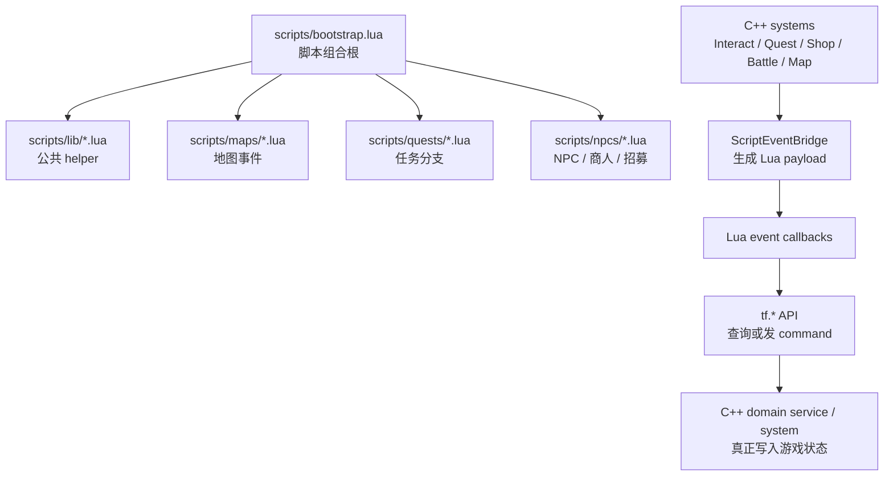

# Lua 内容编写指南

本文面向“想写游戏内容”的读者：如果你想新增 NPC 对话、任务分支、招募对白、动态商店预设、地图事件、区域触发或战斗观察回调，优先读这篇。

如果你想了解 C++ 如何用 Sol2 暴露这些 API，再读 [lua-binding-guide.md](lua-binding-guide.md)。

## 1. 当前 Lua 能做什么

Lua 现在主要承载“剧本式玩法”：它负责判断条件、组织对白、打开确认界面、选择商店预设、发起传送或监听事件；真正修改背包、任务、队伍、商店交易、地图加载和战斗结算的逻辑仍在 C++ system / domain service 里。

| 能力 | 常用 API / 配置 | 典型用途 |
| --- | --- | --- |
| 多行对话 | `lib.dialogue.start` / `tf.dialogue.show` | NPC 闲聊、任务提示、商人开场白 |
| 选项弹窗 | `lib.dialogue.choice` / `tf.dialogue.choice` | 是否接受、选择奖励、剧情分支 |
| 持久化脚本状态 | `tf.state` / `lib.once` | 一次性宝箱、首次进地图提示、剧情 flag |
| 查询实体信息 | `tf.entity.*` / interact payload | 判断目标 NPC、显示名字、读取位置 |
| 查询时间和玩家 | `tf.time.*` / `tf.player.*` / `lib.time` | 日夜商店、按时间分支 |
| 背包命令 | `tf.command.add_item/remove_item` | 发奖励、消耗道具、同步背包 UI |
| 任务流程 | `tf.quest.status/progress/offer/turn_in` | 脚本化任务 NPC、任务进度对白 |
| 招募流程 | `tf.party.offer_recruit` / `lib.recruit_npc` | 可入队角色对白后打开确认框 |
| 商店预设 | `tf.shop.open(shop_id)` | 按日夜/任务状态选择静态商店 |
| 地图事件 | `map_enter` / `map_exit` | 首次进入地图、切图提示 |
| 区域触发 | Tiled `type="script_zone"` + `zone_enter/zone_exit` | 走到某区域触发提示或剧情 |
| 脚本化交互物 | Tiled `scripted_interaction=true` | 宝箱、机关、特殊家具 |
| 传送 | `tf.map.warp(map_id, x, y)` | 剧情传送、机关传送 |
| 战斗启动 | `tf.battle.start(troop_id, opts)` | 剧情战、区域触发战斗 |
| 战斗观察 | `tf.battle.on_unit_died` / `tf.event.on("battle_ended", fn)` / `lib.event.on_battle_end` | 战斗提示、统计、胜利后剧情 |

暂时不建议用 Lua 做这些事：

- 直接改 ECS 组件或角色 HP、回合队列、商店交易结果。
- 直接改玩家钱包；`tf.player` 只提供查询和 `gold()` 读取，新游戏初始金币由 C++ 初始化。
- 在战斗回调里再次调用 `tf.battle.start` 叠开战斗。
- 在 Lua 中临时生成商店库存；当前商店仍使用 `assets/data/shops.json` 中的静态 `shop_id`。
- 写文件、访问系统命令或加载 `scripts/` 之外的 Lua 模块。

## 2. 运行模型

游戏进入 `GameScene` 后，先完成读档 apply 或新游戏默认状态初始化，然后加载 `scripts/bootstrap.lua`。`bootstrap.lua` 再用 `tf.script.require(...)` 加载 helper、地图脚本、任务脚本和 NPC 脚本。脚本通常在顶层注册事件回调，之后由 C++ 在交互、切图、区域边界、战斗、背包和任务变化时把事件派发给 Lua。暂停菜单在同一个 `GameScene` 内读档成功后，会让 `ScriptHost` reload，清掉旧回调和 module cache 后重新执行 bootstrap。



关键原则：

- **脚本顶层要幂等**：读档或重新进入 `GameScene` 会重新执行 bootstrap；持久剧情状态必须写入 `tf.state`，不要只存在 Lua 局部变量里。
- **脚本不直接写 ECS**：通过 `tf.quest.*`、`tf.party.*`、`tf.shop.*`、`tf.command.*`、`tf.map.warp` 等 API 发请求。
- **命令结果看 `{ ok, reason }`**：`ok=true` 表示脚本层请求已发出；实际规则仍由 C++ 校验。
- **交互对象用稳定 ID 判断**：优先用 `evt.target_actor_id`、`evt.target_script_event`、`evt.zone_id`，不要依赖显示名。

## 3. 脚本目录约定

```
scripts/
├── bootstrap.lua              # 组合根，GameScene 状态准备好后加载
├── lib/                       # 公共 helper
│   ├── dialogue.lua           # 多行对话、选项、远离关闭协调
│   ├── event.lua              # 事件注册快捷函数
│   ├── once.lua               # 一次性触发 helper
│   ├── quest.lua              # quest id 到 module path 的转换
│   ├── recruit_npc.lua        # 招募 NPC 模板
│   ├── state.lua              # tf.state 薄封装
│   └── time.lua               # 日夜判断
├── maps/                      # 地图专属脚本
├── npcs/                      # NPC / 商人 / 招募角色脚本
└── quests/                    # 任务脚本
```

新增脚本后，需要在 `scripts/bootstrap.lua` 中 require：

```lua
tf.script.require("maps.home_exterior")
tf.script.require("npcs.merchant")
tf.script.require("quests.village_goblin_cleanup")
```

模块路径不写 `.lua`，使用点号分隔目录。`tf.script.require("npcs.merchant")` 对应 `scripts/npcs/merchant.lua`。

`lib.dialogue` 必须先于 NPC / quest 脚本加载，因为它会注册全局 interact 推进器。现有 bootstrap 已按这个顺序组织。

## 4. Tiled 侧怎么接入 Lua

### 4.1 脚本化 NPC

在 actor object 上设置：

| property | 说明 |
| --- | --- |
| `actor_id` | 暴露给 Lua 的稳定身份，例如 `npc.josh`、`actor.lyria` |
| `scripted_interaction=true` | 让 Lua 独占交互，C++ 默认交互系统早退 |
| `quest_offer_id` | 可选，让实体成为任务 NPC |
| `shop_id` | 可选，让实体成为商人 |
| `recruit_actor_id` | 可选，让实体成为可招募角色 |
| `script_event` / `script_once_key` | 可选，进入 interact payload，供特殊交互过滤和一次性状态使用 |

脚本化 NPC 的 interact payload 会带上：

- `evt.player` / `evt.target`
- `evt.target_actor_id`
- `evt.target_name`
- `evt.target_kind`
- `evt.target_blueprint_id`
- `evt.target_script_module`
- `evt.target_script_event`
- `evt.target_script_once_key`
- `evt.map_id`

### 4.2 脚本化宝箱 / 机关

任意可交互 object 可以设置：

```json
{
  "properties": [
    { "name": "scripted_interaction", "type": "bool", "value": true },
    { "name": "script_event", "type": "string", "value": "home_exterior.seed_cache" },
    { "name": "script_once_key", "type": "string", "value": "map.home_exterior.seed_cache.opened" }
  ]
}
```

注意：一旦对象设置 `scripted_interaction=true`，默认 C++ 宝箱奖励、商店 greeting、任务提示等会让位给 Lua。脚本化宝箱的奖励内容应写在 Lua 中，避免 Tiled 属性和 Lua 双重表达。

### 4.3 脚本区域

矩形 object 使用 `type="script_zone"`：

```json
{
  "type": "script_zone",
  "x": 160,
  "y": 96,
  "width": 48,
  "height": 32,
  "properties": [
    { "name": "zone_id", "type": "string", "value": "zone.home.seed_hint" },
    { "name": "script_event", "type": "string", "value": "home_exterior.seed_hint" },
    { "name": "script_once_key", "type": "string", "value": "map.home_exterior.seed_hint" }
  ]
}
```

进入区域只触发一次 `zone_enter`，停留区域内不会每帧重放；离开时触发一次 `zone_exit`。

## 5. 常用配方

### 5.1 普通 NPC 多行对话

```lua
local dialogue = tf.script.require("lib.dialogue")

local npc = {
    actor_id = "npc.greeter",
}

tf.event.on("interact", function(evt)
    if evt.dialogue_handled or evt.target == nil or evt.target_actor_id ~= npc.actor_id then
        return
    end

    if dialogue.start(evt.target, {
        "Hi there.",
        "Nice weather for planting.",
    }) then
        evt.dialogue_handled = true
    end
end)

return npc
```

`evt.dialogue_handled` 是 Lua 脚本之间的协调标志。`lib.dialogue` 在同一次交互推进了已有对话时会设置它；你的脚本开头应先检查，成功认领本次交互后也应设置为 `true`。

### 5.2 带选项的对话

```lua
local dialogue = tf.script.require("lib.dialogue")

tf.event.on("interact", function(evt)
    if evt.dialogue_handled or evt.target_actor_id ~= "npc.tutorial" then
        return
    end

    if dialogue.choice(evt.target, "Choose a seed.", {
        {id = "potato", label = "Potato"},
        {id = "strawberry", label = "Strawberry"},
    }, function(result)
        if result.cancelled then
            return
        end
        if result.id == "potato" then
            tf.command.add_item("potato_seed", 1)
        else
            tf.command.add_item("strawberry_seed", 1)
        end
    end) then
        evt.dialogue_handled = true
    end
end)
```

首版选项 UI 适合 2-4 个选项。`result.index` 是 1-based，`result.zero_index` 是 0-based。

### 5.3 任务 NPC

任务数据仍写在 `assets/data/quests.json`，Lua 负责 NPC 对白和何时打开确认 / 交付。

```lua
local dialogue = tf.script.require("lib.dialogue")

local quest = {
    id = "quest.village.goblin_cleanup",
    giver_actor_id = "npc.manu",
    objective_id = "kill_slimes",
}

local function after_dialogue(action)
    return function(interrupted)
        if interrupted or action == nil then
            return
        end

        local result = action()
        if result ~= nil and result.ok ~= true then
            print("[tf] quest action failed: " .. tostring(result.reason))
        end
    end
end

tf.event.on("interact", function(evt)
    if evt.dialogue_handled or evt.target == nil or evt.target_actor_id ~= quest.giver_actor_id then
        return
    end

    local status = tf.quest.status(quest.id)
    if status == "offerable" and tf.quest.is_available(quest.id) then
        if dialogue.start(evt.target, {
            "Can you help us drive away the slimes?",
            "Three should be enough.",
        }, after_dialogue(function()
            return tf.quest.offer(quest.id, evt.target)
        end)) then
            evt.dialogue_handled = true
        end
    elseif status == "in_progress" then
        local progress = tf.quest.progress(quest.id, quest.objective_id)
        if dialogue.start(evt.target, {
            "Still seeing slimes out there. " .. progress.current .. "/" .. progress.required .. " cleared.",
        }) then
            evt.dialogue_handled = true
        end
    elseif status == "ready_to_turn_in" then
        if dialogue.start(evt.target, {
            "You did it? That's a relief.",
            "Here, take this for the trouble.",
        }, after_dialogue(function()
            return tf.quest.turn_in(quest.id, evt.target)
        end)) then
            evt.dialogue_handled = true
        end
    elseif status == "completed" then
        if dialogue.start(evt.target, {"Thank you again."}) then
            evt.dialogue_handled = true
        end
    end
end)

return quest
```

`tf.quest.offer` 会打开 C++ 任务确认弹窗；玩家确认后才真正 accept。不要用 `tf.quest.accept` 代替普通 NPC 的任务邀请，除非你明确想跳过确认。

### 5.4 招募 NPC

简单招募 NPC 推荐用 `lib.recruit_npc`：

```lua
local recruit_npc = tf.script.require("lib.recruit_npc")

return recruit_npc.register({
    actor_id = "actor.lyria",
    intro_lines = {
        "I can help on the road.",
        "Want me to join you?",
    },
    recruited_line = "I'll stay close.",
})
```

对应 Tiled actor 需要 `recruit_actor_id="actor.lyria"` 和 `scripted_interaction=true`。helper 会在对白结束后调用 `tf.party.offer_recruit` 打开入队确认；玩家确认后才真正入队。

### 5.5 日夜 / 任务后商店

商店库存写在 `assets/data/shops.json`，Lua 只负责选择哪个 `shop_id`。

```lua
local dialogue = tf.script.require("lib.dialogue")
local time = tf.script.require("lib.time")

local merchant = {
    actor_id = "npc.josh",
    quest_id = "quest.village.goblin_cleanup",
    day_shop_id = "shop.village.general.day",
    night_shop_id = "shop.village.general.night",
    post_quest_shop_id = "shop.village.general.post_slime_cleanup",
}

local function choose_shop()
    if tf.quest.status(merchant.quest_id) == "completed" then
        return merchant.post_quest_shop_id, "I've set aside better stock."
    end
    if time.is_night() then
        return merchant.night_shop_id, "Let me open the night shelf."
    end
    return merchant.day_shop_id, "Let me open the day shelf."
end

tf.event.on("interact", function(evt)
    if evt.dialogue_handled or evt.target_actor_id ~= merchant.actor_id then
        return
    end

    local shop_id, line = choose_shop()
    if dialogue.start(evt.target, {line}, function(interrupted)
        if interrupted then
            return
        end

        local result = tf.shop.open(shop_id, evt.target)
        if result ~= nil and result.ok ~= true then
            dialogue.show("Sorry, the shop is closed.", nil, tf.dialogue.CHANNEL_CONVERSATION, evt.target)
        end
    end) then
        evt.dialogue_handled = true
    end
end)

return merchant
```

`tf.shop.open` 直接打开商店，不播放 C++ greeting；脚本侧需要的开场白要自己写。

### 5.6 一次性宝箱 / 机关

```lua
local dialogue = tf.script.require("lib.dialogue")
local once = tf.script.require("lib.once")

local EVENT = "home_exterior.seed_cache"

tf.event.on("interact", function(evt)
    if evt.dialogue_handled or evt.target_script_event ~= EVENT then
        return
    end

    local once_key = evt.target_script_once_key or "map.home_exterior.seed_cache.opened"
    if once.is_done(once_key) then
        dialogue.show("The seed cache is empty.", nil, tf.dialogue.CHANNEL_NOTICE, evt.target)
        evt.dialogue_handled = true
        return
    end

    local result = tf.command.open_chest(evt.target, "You found a few starter seeds.")
    if result == nil or result.ok ~= true then
        dialogue.show("The seed cache is stuck.", nil, tf.dialogue.CHANNEL_NOTICE, evt.target)
        evt.dialogue_handled = true
        return
    end

    if once.run(once_key, function()
        tf.command.add_item("potato_seed", 2)
        tf.command.add_item("strawberry_seed", 3)
    end) then
        evt.dialogue_handled = true
        return
    end
end)
```

`tf.command.open_chest` 只负责宝箱表现和持久状态：播放 open 动画、标记 `ChestComponent.opened_`、写入地图 `opened_chests`，并显示会自动消失的短提示；奖励仍由 Lua 自己发。`lib.once.run` 采用 at-most-once 语义：先写入完成标记再执行回调，因此回调失败也不会自动重试。这适合奖励发放，能避免读档或重复触发导致重复领奖。

### 5.7 首次进入地图

```lua
local dialogue = tf.script.require("lib.dialogue")
local once = tf.script.require("lib.once")

local MAP_ID = "home_exterior"

local function on_map_enter(evt)
    if evt.map_id ~= MAP_ID then
        return
    end

    once.run("map.home_exterior.first_enter", function()
        dialogue.show("The farm road is quiet today.", nil, tf.dialogue.CHANNEL_NOTICE)
    end)
end

tf.event.on("map_enter", on_map_enter)

-- 初始地图加载早于 bootstrap，地图脚本需要主动处理“当前已在本地图”的情况。
on_map_enter({map_id = tf.map.current()})
```

跨地图切换会自动发 `map_exit` 和 `map_enter`；同地图 `tf.map.warp` 只移动玩家，不重复发地图切换事件。

### 5.8 区域进入 / 离开

```lua
local dialogue = tf.script.require("lib.dialogue")
local once = tf.script.require("lib.once")

tf.event.on("zone_enter", function(evt)
    if evt.zone_id ~= "zone.home.seed_hint" then
        return
    end

    once.run(evt.zone_script_once_key or "map.home_exterior.seed_hint", function()
        dialogue.show("The ground looks freshly tilled here.", nil, tf.dialogue.CHANNEL_NOTICE)
    end)
end)

tf.event.on("zone_exit", function(evt)
    if evt.zone_id == "zone.home.seed_hint" then
        print("[tf] left seed hint zone")
    end
end)
```

如果区域只是一次性提示，通常只订阅 `zone_enter` 即可。

### 5.9 剧情传送

```lua
local dialogue = tf.script.require("lib.dialogue")

tf.event.on("interact", function(evt)
    if evt.dialogue_handled or evt.target_script_event ~= "home_exterior.secret_warp" then
        return
    end

    local result = tf.map.warp("home_interior", 96, 128)
    if result ~= nil and result.ok ~= true then
        dialogue.show("Nothing happens.", nil, tf.dialogue.CHANNEL_NOTICE, evt.target)
    end
    evt.dialogue_handled = true
end)
```

`map_id` 不带 `.tmj` 后缀；坐标是目标地图内的像素坐标。地图加载、fade、玩家锁定、安全落点和相机吸附都由 C++ 处理。

### 5.10 战斗钩子

```lua
tf.battle.on_unit_died(function(evt)
    if evt.enemy_id == "enemy.slime" then
        print("[tf] slime defeated in round " .. tostring(evt.round_index))
    end
end)

tf.event.on("battle_ended", function(evt)
    if evt.outcome == "victory" then
        print("[tf] battle victory")
    end
end)
```

战斗回调是观察型：适合统计、提示、战斗后剧情衔接，不适合改写战斗结算。成功行动的事件顺序是 `battle_turn_ended` → `battle_skill_used`（仅技能）→ `battle_unit_died`。

## 6. 常用事件速查

| 事件名 | 何时触发 | 常用字段 |
| --- | --- | --- |
| `interact` | 玩家交互实体 | `target`、`target_actor_id`、`target_kind`、`target_script_event` |
| `dialogue_closed` | 对话被关闭或远离目标 | `target`、`channel` |
| `dialogue_choice_selected` | 玩家选择选项 | `request_id`、`cancelled`、`choice_id`、`choice_label` |
| `map_enter` | 进入新地图 | `map_id`、`previous_map_id` |
| `map_exit` | 离开当前地图 | `map_id`、`next_map_id` |
| `zone_enter` | 玩家进入脚本区域 | `zone`、`zone_id`、`zone_script_event` |
| `zone_exit` | 玩家离开脚本区域 | `zone`、`zone_id`、`zone_script_event` |
| `day_changed` | 游戏日期变化 | `day` |
| `inventory_changed` | 背包变化 | `owner`、`slots` |
| `quest_accepted` | 任务接受后 | `quest_id` |
| `quest_completed` | 任务完成后 | `quest_id` |
| `battle_started` | 战斗开始 | `troop_id`、`actor_ids` |
| `battle_ended` | 战斗结束 | `outcome`、`rewards` |
| `battle_turn_started` | 单位回合开始 | `round_index`、`unit`、`actor_id`、`enemy_id` |
| `battle_turn_ended` | 单位行动结算后 | `round_index`、`unit`、`result` |
| `battle_unit_died` | 单位因行动死亡 | `unit`、`actor_id`、`enemy_id` |
| `battle_skill_used` | 技能行动成功结算 | `skill_id`、`unit`、`target`、`result` |

`scripts/lib/event.lua` 为部分事件提供快捷函数，例如 `event.on_zone_enter(fn)`、`event.on_battle_end(fn)`。直接使用 `tf.event.on("event_name", fn)` 也可以。

## 7. 状态与命名约定

推荐 key 使用 `domain.object.field`：

```lua
tf.state.set("quest.village_goblin_cleanup.accepted", true)
tf.state.add("npc.josh.visit_count", 1)
local seen = tf.state.get_bool("map.home_exterior.first_enter", false)
```

`tf.state` 只保存 JSON 兼容基元：`nil`、`boolean`、`number`、`string`。不要把 table、function 或 entity handle 存进去。

常见命名：

| 类型 | 示例 |
| --- | --- |
| NPC actor id | `npc.josh`、`npc.manu` |
| 可入队 actor id | `actor.lyria` |
| quest id | `quest.village.goblin_cleanup` |
| shop id | `shop.village.general.day` |
| zone id | `zone.home.seed_hint` |
| script event | `home_exterior.seed_cache` |
| once key | `map.home_exterior.seed_cache.opened` |

## 8. 调试和回归建议

- 使用 `print("[tf] ...")` 打日志，保留足够上下文，例如 quest id、shop id、reason。
- 对返回 `{ ok, reason }` 的 API，失败时至少打印 reason；面向玩家的交互建议再显示一条兜底对白。
- 新增脚本后先确认 `scripts/bootstrap.lua` 已 require。
- NPC 不响应时，先查 Tiled 是否配置了 `scripted_interaction=true` 和正确的 `actor_id`。
- 宝箱或机关重复触发时，检查 `script_once_key` 和 `lib.once.run` 是否使用同一个 key。
- 多个 interact 回调冲突时，检查每个脚本是否开头检查 `evt.dialogue_handled`，成功处理后是否设置为 `true`。
- 任务或商店数据查不到时，先确认 JSON catalog 中的 id 和 Lua 字符串完全一致。

新增 Lua 功能时，推荐同时补一条 C++ 端到端测试：准备最小 registry / catalog / map entity，加载对应脚本，用 Lua `assert` 或观察 dispatcher 事件验证脚本行为。现有测试可参考 `tests/game/script_*_test.cpp`。
