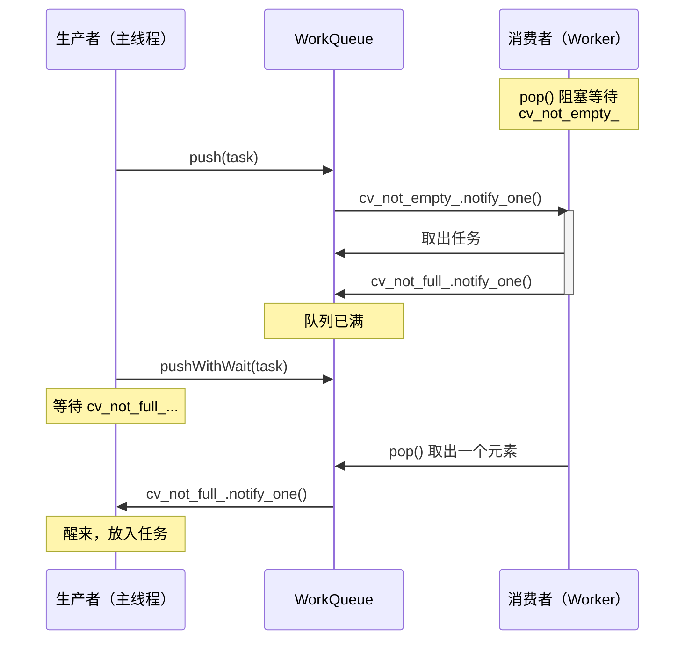
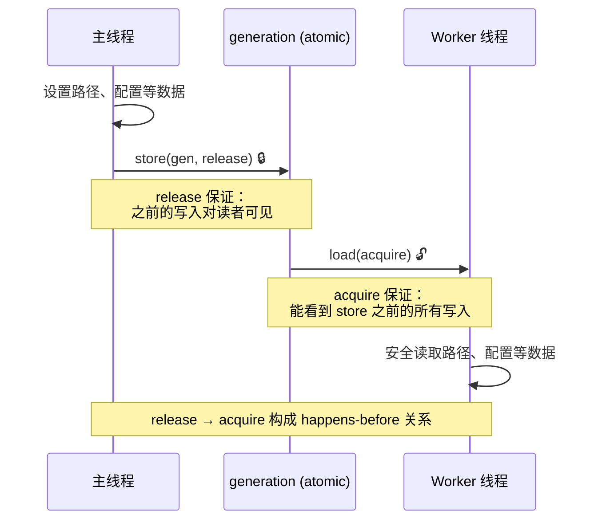
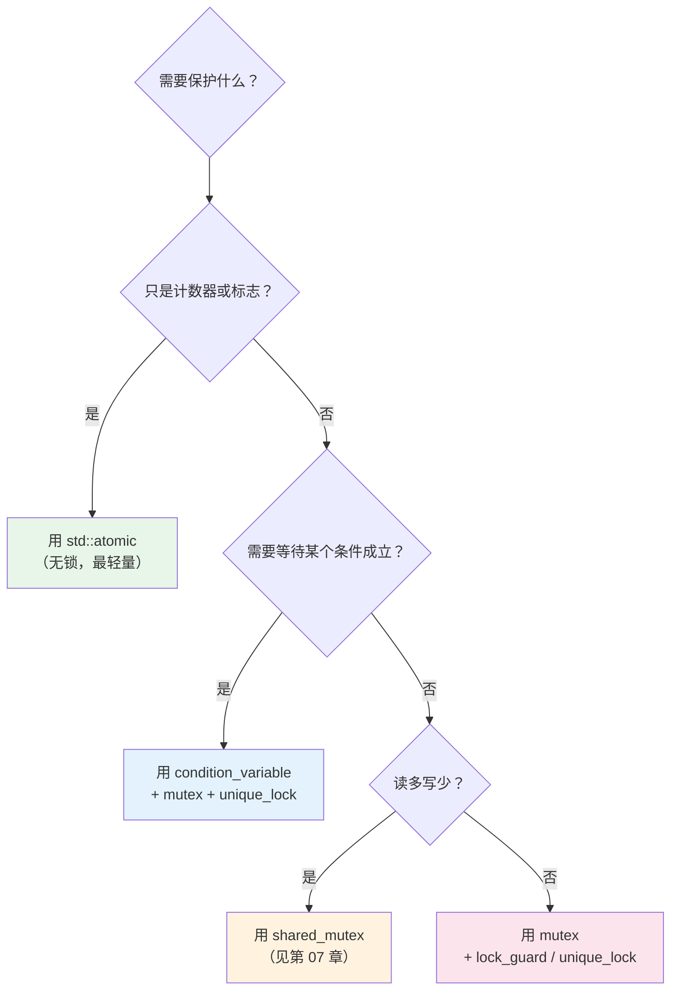

# 02 - 同步原语

当多个线程访问共享数据时，如果不加保护，就会产生**数据竞争（data race）**——一种未定义行为。本章介绍 C++ 提供的三类同步原语，以及它们在本项目中的使用。

---

## 1. 互斥量 `std::mutex`

互斥量是最基本的同步工具：同一时刻只有一个线程能持有锁。

### 基本用法

```cpp
#include <mutex>

std::mutex mtx;
int shared_counter = 0;

void increment() {
    std::lock_guard<std::mutex> lock(mtx);  // 构造时加锁，析构时解锁
    ++shared_counter;  // 临界区：只有持锁线程能执行
}
```

### `lock_guard` vs `unique_lock`

| 特性 | `lock_guard` | `unique_lock` |
|------|-------------|---------------|
| 灵活性 | 构造时锁，析构时解锁，不可中途操作 | 可手动 lock/unlock、延迟锁定、转移所有权 |
| 性能 | 零开销 | 略微多一个状态标志 |
| 配合 `condition_variable` | 不可以 | 可以（CV 需要在等待时临时解锁） |
| 使用场景 | 简单的临界区保护 | 需要条件变量或更精细控制时 |

### 在本项目中的使用

`MainThreadCommandQueue` 使用 `std::mutex` 保护命令队列：

```cpp
// src/engine/async/main_thread_command_queue.h

class MainThreadCommandQueue {
    mutable std::mutex mutex_;
    std::deque<Command> queue_;

    bool enqueue(Command command) {
        std::lock_guard lock(mutex_);       // 简单保护，用 lock_guard
        if (queue_.size() >= capacity_) return false;
        queue_.push_back(std::move(command));
        return true;
    }

    bool enqueueWithWait(Command command, int timeout_ms) {
        std::unique_lock lock(mutex_);      // 需要配合 CV，用 unique_lock
        // cv_not_full_.wait_for(lock, ...);
        // ...
    }
};
```

> **`mutable`**：即使通过 `const` 引用访问对象，也能对 `mutex_` 加锁。这在 `size()` 等 const 查询方法中是必要的。

---

## 2. 条件变量 `std::condition_variable`

互斥量解决了「互斥访问」，但有时线程需要**等待某个条件成立**。轮询（busy wait）会浪费 CPU，条件变量提供了高效的等待/通知机制。

### 核心操作

```
wait(lock, predicate)    — 释放锁，休眠，直到被通知且 predicate 为 true
notify_one()             — 唤醒一个等待线程
notify_all()             — 唤醒所有等待线程
```

### 为什么需要 predicate（谓词）？

```cpp
// 错误：裸 wait，可能虚假唤醒
cv.wait(lock);

// 正确：带谓词的 wait
cv.wait(lock, [this] { return !queue_.empty(); });
```

条件变量存在**虚假唤醒（spurious wakeup）**——线程可能在没有人调用 `notify` 的情况下醒来。带谓词的 `wait` 内部会在每次醒来时检查条件，如果不满足就继续睡。

### 在本项目中的应用：双条件变量模式

`WorkQueue` 使用两个条件变量管理有界队列：

```cpp
// src/engine/async/work_queue.h

template<typename T>
class WorkQueue {
    std::mutex mutex_;
    std::deque<T> queue_;
    std::size_t capacity_;
    bool closed_{false};

    std::condition_variable_any cv_not_empty_;  // 消费者等待：「队列非空」
    std::condition_variable_any cv_not_full_;   // 生产者等待：「队列未满」
};
```

**生产者（提交任务）**：

```cpp
bool pushWithWait(T value, int timeout_ms) {
    std::unique_lock lock(mutex_);

    // 等待队列有空间，最多等 timeout_ms 毫秒
    bool has_space = cv_not_full_.wait_for(lock,
        std::chrono::milliseconds(timeout_ms),
        [this] { return queue_.size() < capacity_ || closed_; });

    if (!has_space || closed_) return false;

    queue_.push_back(std::move(value));
    cv_not_empty_.notify_one();  // 通知消费者：有新任务了
    return true;
}
```

**消费者（取出任务）**：

```cpp
std::optional<T> pop(std::stop_token stop_token) {
    std::unique_lock lock(mutex_);

    // 等待队列非空 或 关闭 或 stop_requested
    bool signaled = cv_not_empty_.wait(lock, stop_token, [this] {
        return !queue_.empty() || closed_;
    });

    if (!signaled || queue_.empty()) return std::nullopt;

    T value = std::move(queue_.front());
    queue_.pop_front();
    cv_not_full_.notify_one();  // 通知生产者：有空间了
    return value;
}
```

**信号流图**：



### `condition_variable` vs `condition_variable_any`

| 特性 | `condition_variable` | `condition_variable_any` |
|------|---------------------|-------------------------|
| 锁类型 | 只能用 `std::unique_lock<std::mutex>` | 任意满足 BasicLockable 的锁 |
| `stop_token` 支持 | 不支持 | 支持（C++20） |
| 性能 | 可能更快（更少间接层） | 略有开销 |
| 本项目选择 | — | 选用此类，因为需要 `stop_token` 支持 |

---

## 3. 原子操作 `std::atomic`

对于简单的计数器和标志，`atomic` 提供无锁的线程安全操作，比 mutex 高效得多。

### 基本用法

```cpp
#include <atomic>

std::atomic<int> counter{0};

// 线程 A
counter.fetch_add(1, std::memory_order_relaxed);  // 原子递增

// 线程 B
int value = counter.load(std::memory_order_relaxed);  // 原子读取
```

### 内存序（Memory Ordering）

这是 `atomic` 最容易困惑的部分。简化理解：

| 内存序 | 含义 | 性能 | 使用场景 |
|--------|------|------|----------|
| `relaxed` | 只保证原子性，不保证顺序 | 最快 | 纯计数器 |
| `acquire` | 读操作后的代码不会被重排到读之前 | 中等 | 读取「发布」的数据 |
| `release` | 写操作前的代码不会被重排到写之后 | 中等 | 「发布」数据给其他线程 |
| `acq_rel` | acquire + release | 中等 | 读-修改-写操作 |
| `seq_cst` | 全局顺序一致（默认值） | 最慢 | 不确定时用这个 |

### 在本项目中的使用

**1. 任务活跃计数器**（`ThreadPool`）：

```cpp
// src/engine/async/thread_pool.h
std::atomic<std::size_t> active_tasks_{0};

// workerLoop 中
active_tasks_.fetch_add(1, std::memory_order_relaxed);  // 开始执行
(*task)();
active_tasks_.fetch_sub(1, std::memory_order_relaxed);  // 执行完毕
```

这里用 `relaxed` 是安全的，因为 `active_tasks_` 只用于统计和 `waitForIdle()` 判断——不需要与其他内存操作建立 happens-before 关系。

**2. 停止标志**（`ThreadPool`）：

```cpp
// src/engine/async/thread_pool.h
std::atomic<bool> stopping_{false};

bool submit(Task task) {
    if (stopping_.load(std::memory_order_relaxed)) {
        return false;  // 拒绝新任务
    }
    // ...
}
```

**3. 任务状态与 generation 计数器**（`MapManager`）：

```cpp
// src/game/world/map_manager.h
struct AsyncPreloadTaskState {
    std::atomic<MapPreloadTaskState> state{MapPreloadTaskState::NotScheduled};
    std::atomic<std::uint64_t> generation{0};
};
```

`generation` 使用 `acquire/release` 语义：

```cpp
// 写端（主线程调度时）
shared->generation.store(gen, std::memory_order_release);

// 读端（worker 线程检查时）
if (shared->generation.load(std::memory_order_acquire) != expected_gen) {
    return;  // 任务已过期，丢弃
}
```

`release` 保证：调度时设置的所有数据（路径、配置等）在 worker 读到 generation 时都可见。
`acquire` 保证：worker 读到 generation 后，能看到调度时写入的所有数据。



> 这对 `release-acquire` 构成了一个 **happens-before** 关系，是跨线程数据传递的最低开销方式。

---

## 选择指南：何时用什么？



---

## 常见陷阱

### 1. 死锁

```cpp
// 线程 A：先锁 mutex1，再锁 mutex2
std::lock_guard lock1(mutex1);
std::lock_guard lock2(mutex2);

// 线程 B：先锁 mutex2，再锁 mutex1
std::lock_guard lock2(mutex2);
std::lock_guard lock1(mutex1);
// → 死锁！
```

**解决方案**：始终以相同顺序加锁，或用 `std::scoped_lock(mutex1, mutex2)` 自动避免死锁。

### 2. 锁范围过大

```cpp
// 不好：持锁时做 IO
{
    std::lock_guard lock(mutex_);
    auto data = readFileFromDisk(path);  // 阻塞 IO！其他线程全部等待
    cache_[key] = data;
}

// 好：只在必要时持锁
auto data = readFileFromDisk(path);  // 无锁
{
    std::lock_guard lock(mutex_);
    cache_[key] = data;  // 只保护写入
}
```

本项目的 `MainThreadCommandQueue::drain()` 就遵循了这个原则——在锁内取出命令，在锁外执行命令（详见第 05 章）。

### 3. 忘记 notify

```cpp
void push(T value) {
    std::lock_guard lock(mutex_);
    queue_.push_back(std::move(value));
    // 忘了 cv_not_empty_.notify_one(); → 消费者永远等不到通知
}
```

---

## 本章要点

| 原语 | 用途 | 本项目使用位置 |
|------|------|---------------|
| `std::mutex` | 保护共享数据的互斥访问 | `MainThreadCommandQueue`、`WorkQueue` |
| `std::condition_variable_any` | 线程间等待/通知 | `WorkQueue` 的 `cv_not_empty_`/`cv_not_full_` |
| `std::atomic` | 无锁的简单数据操作 | `ThreadPool::active_tasks_`、`stopping_`；`MapManager::generation` |
| `std::lock_guard` | RAII 互斥锁（简单场景） | `enqueue()`、`size()` |
| `std::unique_lock` | 灵活互斥锁（配合 CV） | `pop()`、`pushWithWait()` |

## 下一篇

[03 - 有界队列](03-bounded-queue.md)：用本章的原语组合出一个线程安全的有界队列——本项目线程基础设施的核心组件。
