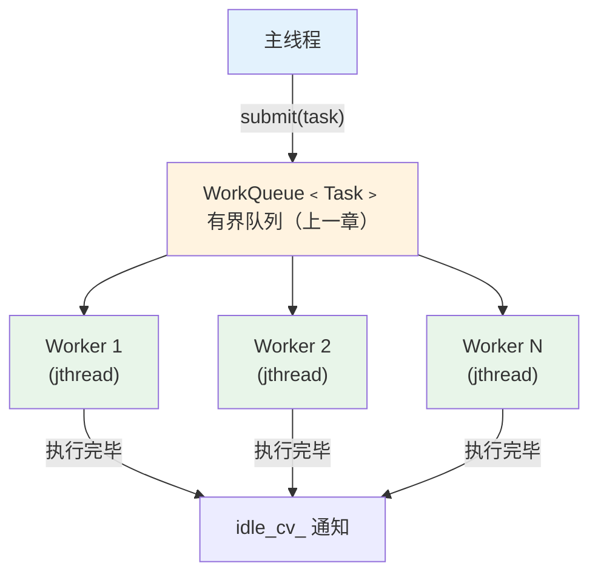
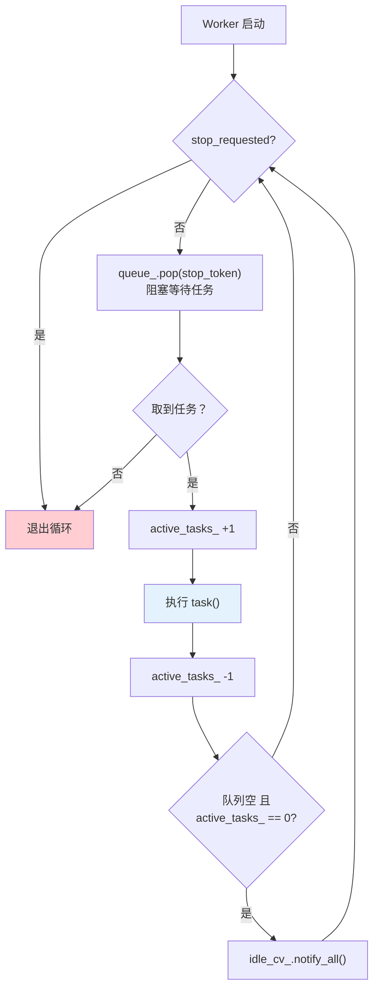
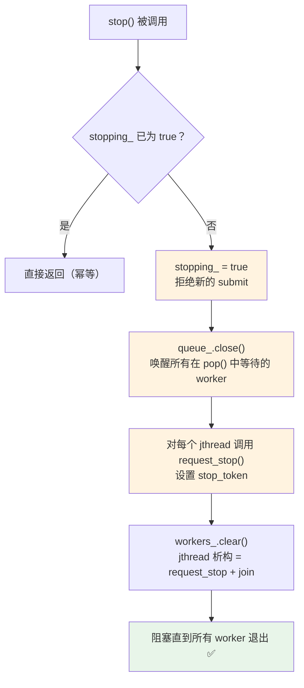

# 04 - 线程池

线程池是「创建一组固定数量的线程，反复从队列取任务执行」的模式。它避免了为每个任务创建/销毁线程的开销，是服务端和游戏引擎中最常见的并发基础设施。

> 源文件：`src/engine/async/thread_pool.h` / `thread_pool.cpp`

---

## 架构总览



---

## 配置与构造

```cpp
struct Options {
    std::size_t worker_count{0};      // 0 = 自动（硬件线程数 - 1）
    std::size_t queue_capacity{256};  // 工作队列容量
    std::string_view name{"ThreadPool"};
};
```

### Worker 数量的自动决策

```cpp
// src/engine/async/thread_pool.cpp
std::size_t resolveWorkerCount(std::size_t requested) {
    if (requested > 0) return requested;
    auto hw = std::max(1u, std::thread::hardware_concurrency());
    return hw > 1 ? hw - 1 : 1;  // 留一个核心给主线程
}
```

为什么 `hardware_concurrency() - 1`？主线程需要持续运行游戏循环（输入、更新、渲染），如果所有核心都被 worker 占满，主线程可能被频繁抢占，导致帧率不稳。

> 在本项目中，地图预加载的 `async_worker_count` 默认为 1。对于 IO 密集型预加载任务，1-2 个 worker 通常足够——瓶颈在磁盘 IO 而非 CPU。

---

## 任务提交

### 方式 1：`submit()` — 有界提交

```cpp
bool submit(Task task, std::chrono::milliseconds wait_timeout = 0ms);
```

```cpp
// 使用示例（来自 MapManager）
preload_thread_pool_->submit([this, path, shared_state, gen] {
    // 在 worker 线程中执行：
    auto result = LevelLoader::preprocessLevelDataWorker(path);
    // ... 解码图片 ...
    // ... 投递主线程命令 ...
}, std::chrono::milliseconds(submit_wait_ms));
```

返回值：
- `true`：任务已入队，将被某个 worker 执行。
- `false`：队列已满（超时后仍满）或线程池正在关闭。**返回 `false` 时任务被丢弃，调用方必须处理失败情况。**

> **与 "fire and forget" 的区别**：真正的 fire and forget 是"扔出去不管结果"。`submit()` 有明确的失败语义：本项目中 `AsyncPreloadPipeline` 在提交失败时将预加载状态置为 `Failed`，由状态机降级为同步加载——是「提交成功则异步执行，失败则通知调用方降级」。若任务失败会使游戏进入不一致状态（如传送动画已开始），必须在失败路径中提供回滚机制，不能仅依赖状态标记。

### 方式 2：`submitFuture()` — 获取返回值

```cpp
template<typename Fn, typename... Args>
auto submitFuture(Fn&& fn, Args&&... args) -> std::future<std::invoke_result_t<Fn, Args...>>;
```

```cpp
// 使用示例
auto future = pool.submitFuture([](int a, int b) { return a + b; }, 10, 32);
// ... 做其他事情 ...
int result = future.get();  // 阻塞直到 worker 完成计算，result == 42
```

**实现原理**：

```cpp
template<typename Fn, typename... Args>
auto submitFuture(Fn&& fn, Args&&... args) {
    using Result = std::invoke_result_t<Fn, Args...>;

    // 1. 创建 packaged_task（将函数包装为可获取 future 的形式）
    auto task = std::make_shared<std::packaged_task<Result()>>(
        [f = std::forward<Fn>(fn), ...a = std::forward<Args>(args)]() mutable {
            return std::invoke(std::move(f), std::move(a)...);
        }
    );

    // 2. 获取 future（结果的「取货凭证」）
    auto future = task->get_future();

    // 3. 提交到队列
    bool ok = submit([task]() { (*task)(); });

    if (!ok) return std::future<Result>{};  // 无效 future
    return future;
}
```

> **`std::packaged_task`** 是 `std::function` 的增强版：它不仅能包装可调用对象，还能通过关联的 `std::future` 获取执行结果。本质上是「函数 + promise」的打包。

**为什么用 `shared_ptr<packaged_task>`？** `packaged_task` 不可拷贝（因为它持有 `promise`），但 `std::function<void()>`（即 `Task` 类型）要求可拷贝。用 `shared_ptr` 包装后，lambda 捕获的是指针的拷贝，满足可拷贝要求。

---

## Worker 循环

```cpp
// src/engine/async/thread_pool.cpp
void ThreadPool::workerLoop(std::stop_token stop_token) {
    while (!stop_token.stop_requested()) {
        // 1. 从队列取任务（阻塞）
        auto task = queue_.pop(stop_token);
        if (!task) break;  // 队列关闭或线程被取消

        // 2. 标记：正在执行任务
        active_tasks_.fetch_add(1, std::memory_order_relaxed);

        // 3. 执行任务
        (*task)();

        // 4. 标记：执行完毕
        auto remaining = active_tasks_.fetch_sub(1, std::memory_order_relaxed) - 1;

        // 5. 如果队列也空了，通知 waitForIdle()
        if (remaining == 0 && queue_.empty()) {
            std::lock_guard lock(idle_mutex_);
            idle_cv_.notify_all();
        }
    }
}
```

Worker 循环的完整流程：



**为什么需要 `active_tasks_`？** 「队列为空」不等于「所有任务都完成了」——可能有任务已被取出但还在执行。`waitForIdle()` 需要同时检查队列为空 **且** 没有正在执行的任务。

---

## 优雅停机

```cpp
void ThreadPool::stop() {
    bool expected = false;
    if (!stopping_.compare_exchange_strong(expected, true)) {
        return;  // 已经在停了，幂等操作
    }

    queue_.close();  // 关闭队列，唤醒所有等待的 worker

    for (auto& w : workers_) {
        w.request_stop();  // 设置每个 worker 的 stop_token
    }

    workers_.clear();  // jthread 析构 → 自动 join → 等待 worker 退出
}
```

**停机流程图**：



**关键特性**：
1. **幂等**：多次调用 `stop()` 是安全的。
2. **不中断正在执行的任务**：当前正在执行的任务会完成，只是之后 worker 不会再取新任务。
3. **不丢弃队列中的任务**：已入队但未执行的任务会被放弃（`close()` 后 `pop` 返回空）。

---

## `waitForIdle()` 同步点

```cpp
void ThreadPool::waitForIdle() {
    std::unique_lock lock(idle_mutex_);
    idle_cv_.wait(lock, [this] {
        return (queue_.empty() && active_tasks_.load(std::memory_order_relaxed) == 0)
               || stopping_;
    });
}
```

使用场景：在测试中，提交一批任务后等待所有任务完成再断言结果。

```cpp
// tests/engine/async/thread_pool_test.cpp
TEST(ThreadPoolTest, ExecutesSubmittedTasks) {
    ThreadPool pool({.worker_count = 2, .queue_capacity = 64});
    std::atomic<int> counter{0};

    pool.submit([&] { counter.fetch_add(1); });
    pool.submit([&] { counter.fetch_add(1); });
    pool.submit([&] { counter.fetch_add(1); });

    pool.waitForIdle();  // 等待所有 3 个任务完成

    EXPECT_EQ(counter.load(), 3);
}
```

> 注意 `waitForIdle()` 不能用于生产代码的主循环——它会阻塞主线程。它主要用于测试和关闭流程。

---

## 错误处理策略

本项目的线程池**不处理任务中的异常**。这是有意的设计决策：

```cpp
// worker 中直接调用 (*task)()，没有 try-catch
active_tasks_.fetch_add(1, std::memory_order_relaxed);
(*task)();  // 如果抛出异常 → std::terminate
active_tasks_.fetch_sub(1, std::memory_order_relaxed);
```

**原因**：
1. 游戏引擎中的任务（IO、解码、解析）通常不抛异常，而是返回错误码或 `optional`。
2. 如果真的抛出了未预期的异常，说明有 bug，`terminate` 比静默吞掉更好（fail fast）。
3. 对于需要错误传播的场景，`submitFuture` 的 `future.get()` 会重新抛出任务中的异常。

---

## 与其他方案的对比

### 为什么不用 `std::async`？

```cpp
// std::async 的问题
auto f = std::async(std::launch::async, task);
// 1. 每次调用可能创建新线程（取决于实现）
// 2. future 析构时可能阻塞（如果是 async launch）
// 3. 没有队列容量控制
// 4. 没有统一的关闭机制
```

线程池的优势：线程复用、容量控制、统一生命周期管理。

### 为什么不用第三方库？

像 Intel TBB、Boost.Asio 等库提供了更完善的线程池，但：
- 项目已经有足够的依赖（SDL、EnTT、stb 等）。
- 需求明确（IO 预处理 + 主线程提交），不需要复杂的任务图/窃取调度。
- 自己实现能完全控制行为，且代码量不大（~150 行）。

---

## 本章要点

| 概念 | 说明 |
|------|------|
| 线程池 | 固定数量 worker + 共享队列，避免频繁创建/销毁线程 |
| `submit()` | 有界提交：成功入队返回 `true`，队满/关闭返回 `false`，调用方须处理失败 |
| `submitFuture()` | 提交有返回值任务，通过 `future` 获取结果 |
| `waitForIdle()` | 同步点：等待队列空且所有 worker 空闲 |
| `stop()` | 优雅停机：幂等、不中断当前任务、jthread RAII join |
| `active_tasks_` | 原子计数器，区分「队列空」与「所有任务完成」 |

## 下一篇

[05 - 主线程命令队列](05-main-thread-command-queue.md)：worker 线程产出了结果，如何安全地交给主线程执行？
