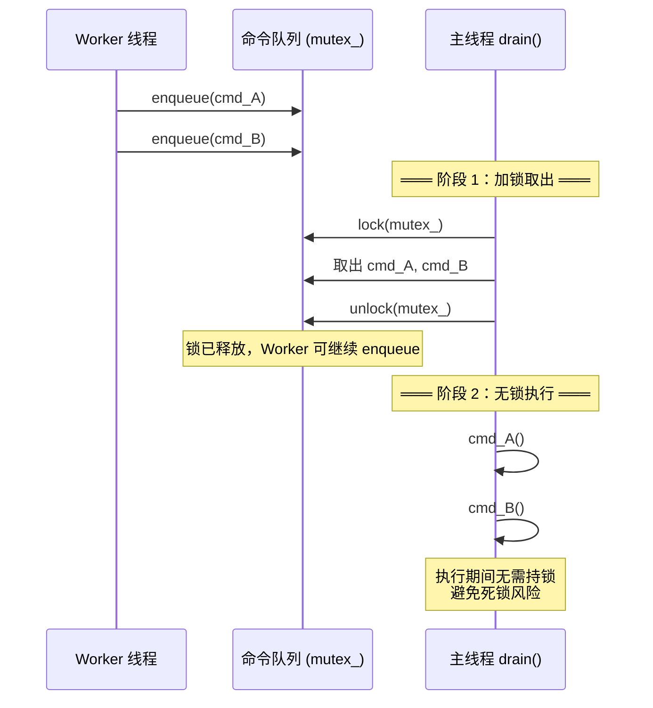
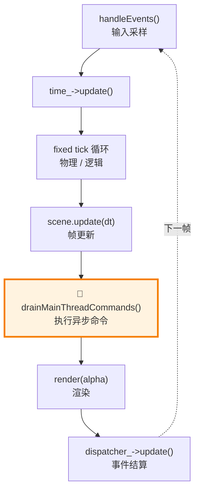
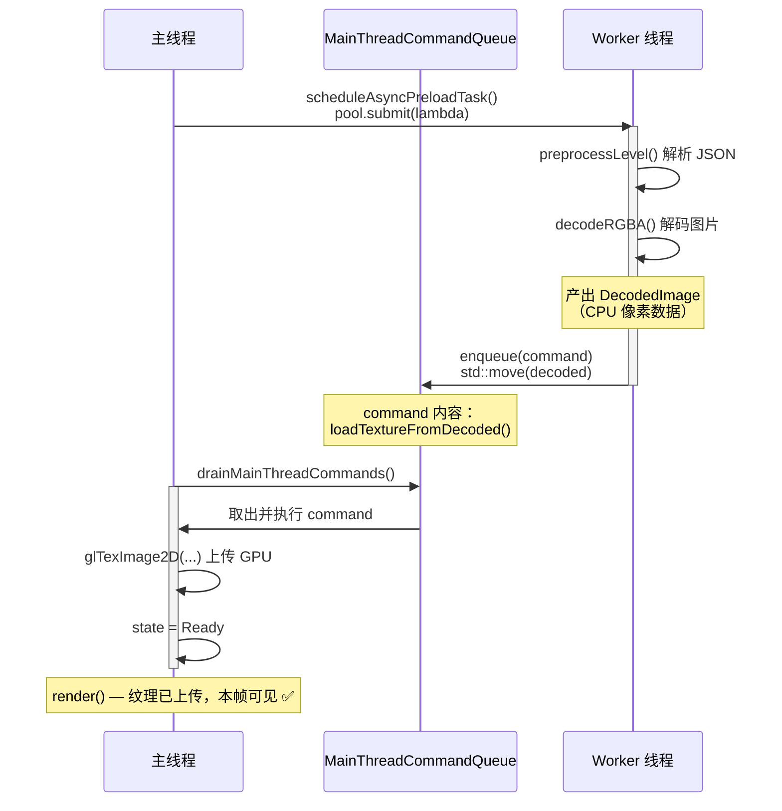

# 05 - 主线程命令队列

Worker 线程完成了 JSON 解析和图片解码，接下来需要把结果交给主线程做 GPU 上传。但 OpenGL 有线程亲和性——只有创建上下文的线程才能调用 GL API。怎么办？

答案是**主线程命令队列**：worker 把「要做的事」封装为命令投递到队列，主线程在每帧的固定时刻统一执行。

> 源文件：`src/engine/async/main_thread_command_queue.h` / `main_thread_command_queue.cpp`

---

## 设计动机

### 不能做什么

```cpp
// 错误！Worker 线程不能直接调用 GL
void workerTask() {
    auto pixels = decodeImage("texture.png");
    glGenTextures(1, &id);      // ← 崩溃或未定义行为
    glTexImage2D(..., pixels);   // ← GL 上下文不在这个线程
}
```

### 应该怎么做

```cpp
// 正确！Worker 产出数据，主线程做 GL 调用
void workerTask() {
    auto decoded = ImageDecodeService::decodeRGBA("texture.png");  // CPU 操作，OK

    // 封装为命令，投递到主线程队列
    main_queue->enqueue([decoded = std::move(*decoded)] {
        // 这个 lambda 会在主线程执行
        glGenTextures(1, &id);
        glTexImage2D(..., decoded.pixels.data());
    });
}
```

---

## 与 `WorkQueue` 的区别

| 特性 | `WorkQueue` | `MainThreadCommandQueue` |
|------|-------------|--------------------------|
| 消费者 | 多个 worker 线程（阻塞 pop） | 仅主线程（非阻塞 drain） |
| 消费方式 | 一次取一个 | 批量取出，批量执行 |
| 生产者等待 | 可选（pushWithWait） | 可选（enqueueWithWait） |
| 线程亲和性 | 无 | 有（owner_thread_id_） |

关键区别：**主线程不会阻塞等待命令**。它在每帧的固定时刻调用 `drain()`，有命令就执行，没有就跳过。这保证了主循环的流畅性。

---

## 线程所有权验证

```cpp
class MainThreadCommandQueue {
    const std::thread::id owner_thread_id_;  // 构造时记录

public:
    MainThreadCommandQueue()
        : owner_thread_id_(std::this_thread::get_id()) {}

    bool isOnOwnerThread() const noexcept {
        return std::this_thread::get_id() == owner_thread_id_;
    }
};
```

`drain()` 方法会检查调用者是否在 owner 线程上：

```cpp
std::size_t drain(std::size_t max_commands) {
    if (!isOnOwnerThread()) {
        spdlog::warn("drain() called from non-owner thread!");
        return 0;
    }
    // ...
}
```

这是一个**所有权护栏**：会在日志中留下警告，并且直接早退，不执行队列里的命令。如果你看到了这个警告，说明有代码在错误的线程调用了 `drain()`，需要修复到 owner 线程（通常是 `GameApp::drainMainThreadCommands()`）统一提交。

---

## 两阶段 drain：为什么要在锁外执行命令？

```cpp
std::size_t MainThreadCommandQueue::drain(std::size_t max_commands) {
    std::vector<Command> commands;

    // ═══ 阶段 1：加锁，取出命令 ═══
    {
        std::lock_guard lock(mutex_);
        std::size_t count = std::min(max_commands, queue_.size());
        commands.reserve(count);
        for (std::size_t i = 0; i < count; ++i) {
            commands.push_back(std::move(queue_.front()));
            queue_.pop_front();
        }
        cv_not_full_.notify_all();  // 通知等待空间的生产者
    }
    // ═══ 锁已释放 ═══

    // ═══ 阶段 2：无锁，执行命令 ═══
    std::size_t executed = 0;
    for (auto& cmd : commands) {
        cmd();
        ++executed;
    }
    return executed;
}
```

**为什么不在锁内执行？** 考虑以下场景：

```cpp
// 命令 A 的执行过程中，又往队列加了一条命令 B
main_queue->enqueue([&main_queue] {
    // 正在执行命令 A...
    main_queue->enqueue([] { /* 命令 B */ });  // enqueue 需要加锁！
});
```

如果 `drain()` 持锁执行命令 A，命令 A 中又试图 `enqueue` 命令 B——`enqueue` 需要同一把锁——**死锁**。

两阶段设计避免了这个问题：取出命令后释放锁，然后在无锁状态下执行。



---

## 在游戏循环中的位置



**为什么放在 update 和 render 之间？**

1. **在 update 之后**：保证本帧的游戏逻辑已经执行完毕。异步命令中创建的纹理不会影响本帧的逻辑判断。
2. **在 render 之前**：新上传的纹理在本帧就能被渲染出来，减少一帧的延迟。
3. **在 dispatcher.update() 之前**：如果异步命令中触发了事件，这些事件会在本帧的事件结算阶段被处理。

---

## 完整的跨线程数据流

以地图纹理预加载为例：



**数据传递方式**：`DecodedImage`（含像素数据的 vector）被 `std::move` 捕获到 lambda 中，从 worker 线程转移到主线程。没有共享——是**所有权转移**。

---

## 背压与超时

Worker 线程使用 `enqueueWithWait` 投递命令：

```cpp
// 来自 MapManager::scheduleAsyncPreloadTask()
bool ok = main_queue->enqueueWithWait(
    [decoded_textures = std::move(textures), ...] {
        // 上传纹理到 GPU
    },
    std::chrono::milliseconds(command_wait_ms)  // 默认 8ms
);
```

如果主线程太忙没来得及 `drain()`（比如一个特别复杂的帧），命令队列可能满了。`enqueueWithWait` 会让 worker 等最多 8ms。如果超时仍满，返回 false——worker 可以据此记录错误或重试。

---

## 测试验证

```cpp
// tests/engine/async/thread_pool_test.cpp
TEST(MainThreadCommandQueueTest, DrainExecutesCommands) {
    MainThreadCommandQueue queue(64);
    std::atomic<int> counter{0};

    queue.enqueue([&] { counter.fetch_add(1); });
    queue.enqueue([&] { counter.fetch_add(1); });
    queue.enqueue([&] { counter.fetch_add(1); });

    auto executed = queue.drain();

    EXPECT_EQ(executed, 3u);
    EXPECT_EQ(counter.load(), 3);
    EXPECT_TRUE(queue.empty());
}

TEST(MainThreadCommandQueueTest, CapacityLimitRejectsOverflow) {
    MainThreadCommandQueue queue(1);  // 容量为 1

    EXPECT_TRUE(queue.enqueue([] {}));   // 第一个成功
    EXPECT_FALSE(queue.enqueue([] {}));  // 第二个失败：满了

    queue.drain();  // 执行后腾出空间
}
```

---

## 设计模式总结

`MainThreadCommandQueue` 实现了 **命令模式（Command Pattern）** 与 **生产者-消费者模式** 的结合：

- **命令模式**：将操作封装为对象（`std::function<void()>`），推迟到特定时机执行。
- **生产者-消费者**：worker 生产命令，主线程消费命令，队列解耦两者。
- **单消费者优化**：只有主线程 drain，不需要消费者间的竞争。

这种模式在游戏引擎中非常常见：Unity 的 `UnityMainThreadDispatcher`、UE 的 `FRenderCommandFence`、以及大多数渲染引擎的 command buffer 都是类似思路。

---

## 本章要点

| 概念 | 说明 |
|------|------|
| 线程亲和性 | OpenGL/registry/dispatcher 只能在主线程操作 |
| 命令队列 | worker 投递命令，主线程批量执行 |
| 两阶段 drain | 锁内取出，锁外执行，防止死锁 |
| 所有权转移 | 通过 `std::move` 将数据从 worker 转移到命令 lambda |
| 非阻塞消费 | 主线程每帧 poll 式 drain，不阻塞渲染 |

## 下一篇

[06 - 异步管线实战](06-async-pipeline.md)：把前五章的组件组合起来，看完整的地图异步预加载是怎么工作的。
