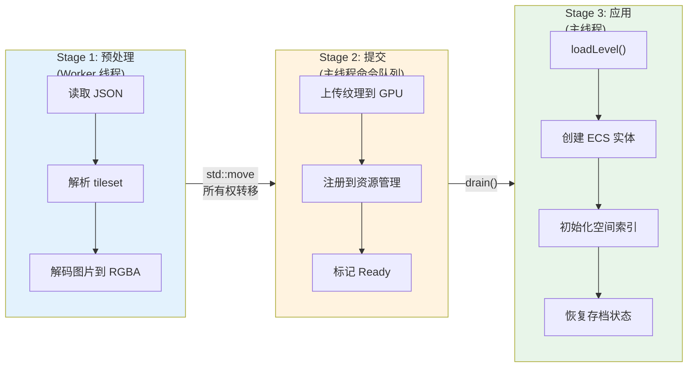
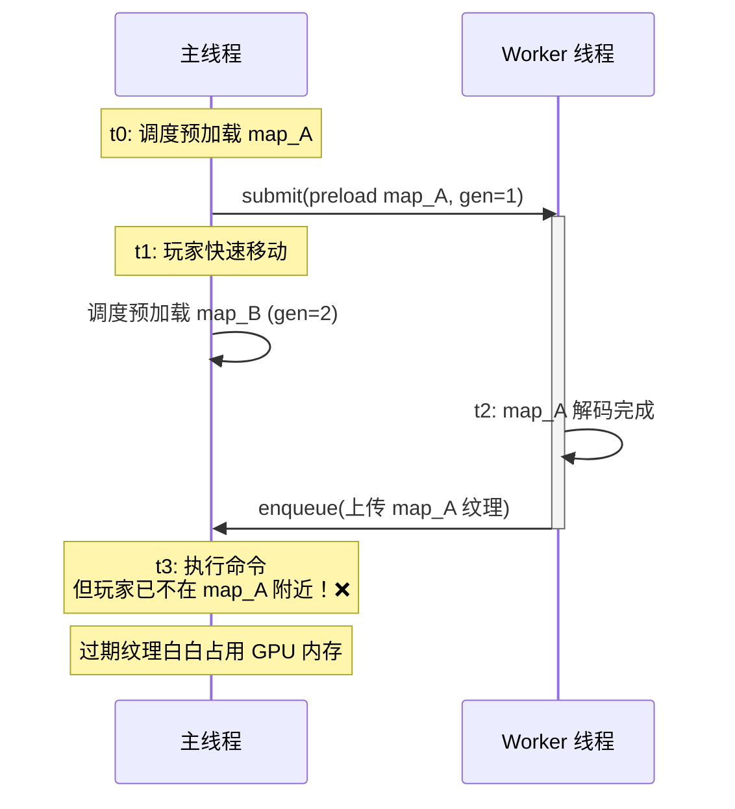
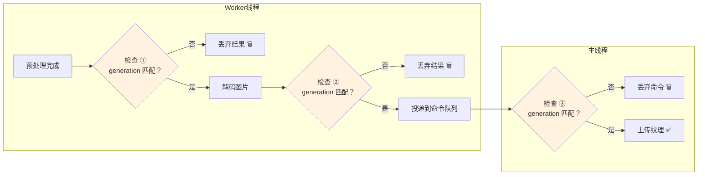
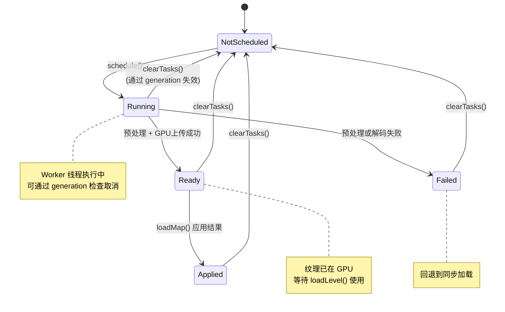
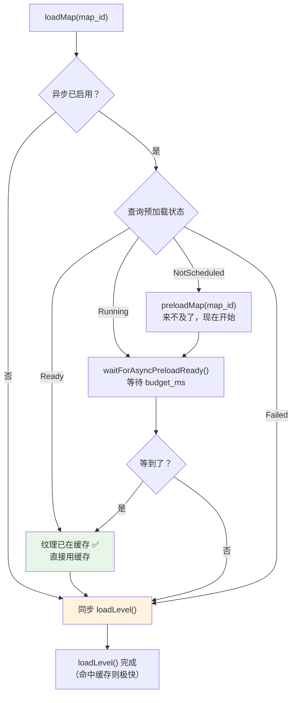
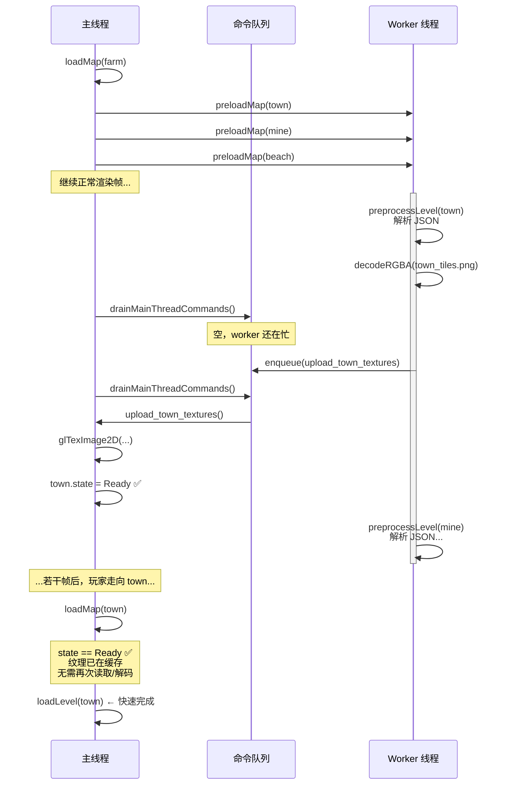

# 06 - 异步管线实战

前五章介绍了各个组件。本章把它们串起来，看地图预加载的完整异步管线如何工作。

> 核心文件：`src/game/world/map_manager.cpp`

---

## 问题：同步加载的痛点

原始的地图加载流程（同步）：

```
loadMap(map_id)
  ├─ 读取地图 JSON 文件           (~2ms，IO)
  ├─ 解析 JSON                   (~3ms，CPU)
  ├─ 读取 tileset JSON 文件      (~1ms × N，IO)
  ├─ 读取纹理图片                (~5ms × N，IO)
  ├─ 解码纹理到 RGBA 像素        (~10ms × N，CPU)
  ├─ 上传纹理到 GPU              (~1ms × N，GL)
  ├─ 创建 ECS 实体               (~2ms，registry)
  └─ 初始化空间索引              (~1ms，registry)
```

如果一张地图有 5 个纹理，总计 ~80ms。在 60fps 下一帧只有 16.6ms，这意味着**卡顿 5 帧**。

**解决方案**：把 IO 和 CPU 工作（读文件、解析、解码）提前搬到后台线程，玩家到达时只需做 GPU 上传和实体创建（~5ms）。

---

## 三层流水线



| 阶段 | 运行线程 | 允许的操作 | 禁止的操作 |
|------|---------|-----------|-----------|
| Stage 1 | Worker | CPU 计算、文件 IO | GL API、registry 写入、dispatcher |
| Stage 2 | 主线程（命令） | GPU 上传、资源注册 | 创建实体、修改游戏状态 |
| Stage 3 | 主线程（逻辑） | ECS 实体构建、游戏逻辑 | — |

每一层只做自己该做的事，严格遵守线程边界。

---

## 预处理服务

### LevelPreprocessService

> `src/engine/loader/level_preprocess_service.cpp`

```cpp
LevelPreprocessResult LevelPreprocessService::preprocessLevel(std::string_view level_path) {
    // 1. 加载地图 JSON（线程安全：tiled_json_cache 用 shared_mutex）
    auto& level_json = tiled::getOrLoadLevelJson(level_path);

    // 2. 遍历 tilesets，收集 first_gid 和路径
    for (auto& ts_ref : level_json["tilesets"]) {
        auto ts_path = resolvePath(ts_ref["source"], level_path);
        auto& ts_json = tiled::getOrLoadTilesetJson(ts_path);
        auto texture_path = resolvePath(ts_json["image"], ts_path);
        result.data.texture_paths.push_back(texture_path);
    }

    // 3. 遍历 image layers，收集背景图路径
    for (auto& layer : level_json["layers"]) {
        if (layer["type"] == "imagelayer" && layer["visible"]) {
            result.data.texture_paths.push_back(resolvePath(layer["image"], level_path));
        }
    }

    // 4. 去重排序
    appendUniquePaths(result.data.texture_paths);
    return result;
}
```

**输出**：一个 `LevelPreprocessData`，包含所有需要加载的纹理路径。纯 CPU 操作，线程安全。

### ImageDecodeService

> `src/engine/resource/image_decode_service.cpp`

```cpp
std::optional<DecodedImage> ImageDecodeService::decodeRGBA(std::string_view file_path) {
    int w, h, ch;
    auto* data = stbi_load(file_path.data(), &w, &h, &ch, STBI_rgb_alpha);
    if (!data) return std::nullopt;

    DecodedImage image;
    image.width = w;
    image.height = h;
    image.channels = 4;  // 强制 RGBA
    image.pixels.assign(data, data + w * h * 4);

    stbi_image_free(data);
    return image;
}
```

**输出**：`DecodedImage`——RGBA 像素数据在内存中，还没碰 GL。

---

## 任务调度：`scheduleAsyncPreloadTask()`

> `src/game/world/map_manager.cpp`

这是整个异步管线的「组装点」。以下是简化后的核心逻辑：

```cpp
void MapManager::scheduleAsyncPreloadTask(entt::id_type map_id, const std::string& level_path) {
    // 1. 创建共享状态（原子变量，跨线程可见）
    auto shared = std::make_shared<AsyncPreloadTaskState>();
    shared->state = MapPreloadTaskState::Running;
    auto generation = ++preload_generation_counter_;
    shared->generation.store(generation, std::memory_order_release);

    // 2. 捕获所需依赖的原始指针/引用
    auto* resource_mgr = &context_.getResourceManager();
    auto* main_queue = &context_.getMainThreadCommandQueue();
    auto command_wait = std::chrono::milliseconds(settings_.async_command_wait_ms);

    // 3. 提交 worker 任务
    preload_thread_pool_->submit([=, path = level_path]() {
        // ═══ Worker 线程 ═══

        // 3a. 检查 generation：是否已过期？
        if (shared->generation.load(std::memory_order_acquire) != generation) {
            return;  // 已被新任务覆盖，丢弃
        }

        // 3b. 预处理：解析 JSON，收集纹理路径
        auto preprocess = LevelPreprocessService::preprocessLevel(path);
        if (!preprocess.success) {
            shared->state.store(MapPreloadTaskState::Failed);
            return;
        }

        // 3c. 解码所有纹理
        struct DecodedEntry { std::string path; DecodedImage decoded; };
        std::vector<DecodedEntry> decoded_textures;

        for (const auto& tex_path : preprocess.data.texture_paths) {
            auto decoded = ImageDecodeService::decodeRGBA(tex_path);
            if (decoded && decoded->valid()) {
                decoded_textures.push_back({tex_path, std::move(*decoded)});
            }
        }

        // 3d. 再次检查 generation
        if (shared->generation.load(std::memory_order_acquire) != generation) {
            return;
        }

        // 3e. 投递主线程命令
        main_queue->enqueueWithWait(
            [decoded_textures = std::move(decoded_textures), resource_mgr, shared, generation]() {
                // ═══ 主线程执行 ═══

                // 检查 generation
                if (shared->generation.load(std::memory_order_acquire) != generation) {
                    return;
                }

                // 上传纹理到 GPU
                for (const auto& entry : decoded_textures) {
                    resource_mgr->loadTextureFromDecoded(
                        entt::hashed_string{entry.path.c_str()},
                        entry.path,
                        entry.decoded);
                }

                // 标记完成
                shared->state.store(MapPreloadTaskState::Ready);
            },
            command_wait);
    });
}
```

---

## Generation 防过期机制

这是本项目中最精巧的并发设计之一。

### 问题场景



如果不加检查，过期任务的结果会白白占用 GPU 内存。

### 解决方案

```cpp
// 每次调度时递增 generation
auto generation = ++preload_generation_counter_;
shared->generation.store(generation, std::memory_order_release);

// Worker 执行前/后都检查
if (shared->generation.load(std::memory_order_acquire) != generation) {
    return;  // generation 不匹配 → 已被新任务覆盖 → 丢弃结果
}

// 主线程命令执行时再次检查
if (shared->generation.load(std::memory_order_acquire) != generation) {
    return;  // 确保不会上传过期纹理
}
```

**三次检查**：



1. 预处理完成后（丢弃已过期的解码工作）
2. 投递命令前（避免不必要的队列占用）
3. 命令执行时（最后一道防线，因为命令在队列中可能等了几帧）

### 清除所有任务

```cpp
void MapManager::clearAsyncPreloadTasks() {
    for (auto& [_, task] : async_preload_tasks_) {
        // 递增 generation → 所有正在运行的 worker 检查到不匹配就会退出
        task.shared->generation.fetch_add(1, std::memory_order_acq_rel);
        task.shared->state.store(MapPreloadTaskState::NotScheduled);
    }
}
```

不需要杀死线程——只需改变 generation，worker 自己会发现任务过期并退出。

---

## 任务状态机



状态转换通过 `std::atomic<MapPreloadTaskState>` 实现，不需要额外的锁。

---

## `loadMap()` 中的等待与降级



```cpp
bool MapManager::loadMap(entt::id_type map_id) {
    if (async_enabled) {
        auto state = mapPreloadTaskState(map_id);

        if (state == MapPreloadTaskState::NotScheduled) {
            preloadMap(map_id);  // 来不及了，现在开始预加载
        }

        if (state == MapPreloadTaskState::Running) {
            // 给异步任务一点时间完成
            bool ready = waitForAsyncPreloadReady(map_id);
            if (!ready) {
                spdlog::info("async not ready, fallback to sync");
            }
        }
    }

    // 无论异步是否成功，都走同步 loadLevel()
    // 如果异步成功了，纹理已在缓存中，loadLevel 会直接命中
    loader.loadLevel(level_path);
}
```

### `waitForAsyncPreloadReady()`

```cpp
bool MapManager::waitForAsyncPreloadReady(entt::id_type map_id) {
    auto deadline = now() + milliseconds(async_wait_budget_ms);  // 默认 3ms

    while (now() < deadline) {
        auto state = mapPreloadTaskState(map_id);
        if (isAsyncReadyState(state)) return true;
        if (state == Failed || state == NotScheduled) return false;

        // 关键：在等待期间顺便 drain 命令队列！
        (void)main_queue.drain();
        std::this_thread::sleep_for(1ms);
    }
    return isAsyncReadyState(mapPreloadTaskState(map_id));
}
```

**为什么在等待中 drain？** 异步任务可能已经完成了 worker 部分，命令正在队列中等待执行。如果只是 sleep 等待 state 变为 Ready，但不执行命令，Ready 永远不会到来——因为是命令执行后才设置 Ready 的。

这是一个经典的**轮询 + drain** 模式：等待的同时顺手做有用的工作。

---

## 降级策略

本项目的异步预加载是「最佳努力（best-effort）」，不是必须成功的：

| 情况 | 处理方式 |
|------|----------|
| 异步成功（Ready） | 纹理已在 GPU，`loadLevel` 直接用缓存，无 IO 延迟 |
| 异步超时（Running） | 等待 `budget_ms` 后放弃，降级为同步 `loadLevel` |
| 异步失败（Failed） | 忽略，降级为同步 `loadLevel` |
| 从未调度（NotScheduled） | 直接同步 `loadLevel` |

**关键洞察**：`loadLevel()` 永远能正确工作——它是同步的、确定的。异步预加载只是一个**加速层**（acceleration layer）。如果异步失败了，最坏的情况就是回到改造前的状态：卡一下。这使得异步改造的风险极低。

---

## 预加载触发时机

```cpp
// 加载当前地图后，预加载相关地图
void MapManager::preloadRelatedMaps(entt::id_type current_map_id) {
    // 1. 预加载邻居（东南西北）
    for (auto neighbor_id : getNeighborMaps(current_map_id)) {
        preloadMap(neighbor_id);
    }

    // 2. 预加载触发器目标（传送门、洞穴入口等）
    for (auto trigger_target : getTriggerTargets(current_map_id)) {
        preloadMap(trigger_target);
    }
}
```

**预加载模式**（可配置）：

```cpp
enum class MapPreloadMode : std::uint8_t {
    Off = 0,           // 不预加载
    Neighbors = 1,     // 只预加载邻居和触发目标
    All = 2,           // 预加载所有地图
};
```

---

## 完整时序图



---

## 配置调优

> `assets/data/map_loading_config.json`

```json
{
    "async_preload_enabled": true,
    "async_wait_budget_ms": 3,
    "async_submit_wait_ms": 1,
    "async_command_wait_ms": 8,
    "async_worker_count": 1,
    "async_queue_capacity": 32
}
```

| 参数 | 含义 | 调优方向 |
|------|------|----------|
| `async_wait_budget_ms` | `loadMap` 等待异步结果的最大时间 | 太大会卡渲染，太小经常降级 |
| `async_submit_wait_ms` | 提交到线程池的超时 | 通常 1ms 足够 |
| `async_command_wait_ms` | 投递主线程命令的超时 | 命令队列满时等待时间 |
| `async_worker_count` | worker 线程数量 | IO 密集型任务 1-2 个够用 |
| `async_queue_capacity` | 任务队列容量 | 地图数量的 2 倍是合理上限 |

---

## 本章要点

| 概念 | 说明 |
|------|------|
| 三层流水线 | Worker（CPU/IO）→ 命令队列（GPU 上传）→ 主线程（ECS/游戏逻辑） |
| Generation 防过期 | 原子计数器，三次检查，避免过期结果浪费资源 |
| 降级回退 | 异步是加速层，失败时回退到同步，保证正确性 |
| 轮询 + drain | 等待异步结果的同时执行命令队列，避免死等 |
| 预加载触发 | 加载当前地图后，异步预加载邻居和触发目标 |

## 下一篇

[07 - 线程安全实践](07-thread-safety-practices.md)：工程层面的线程安全保障——`shared_mutex` 读写锁、线程断言、TSAN 检测。
