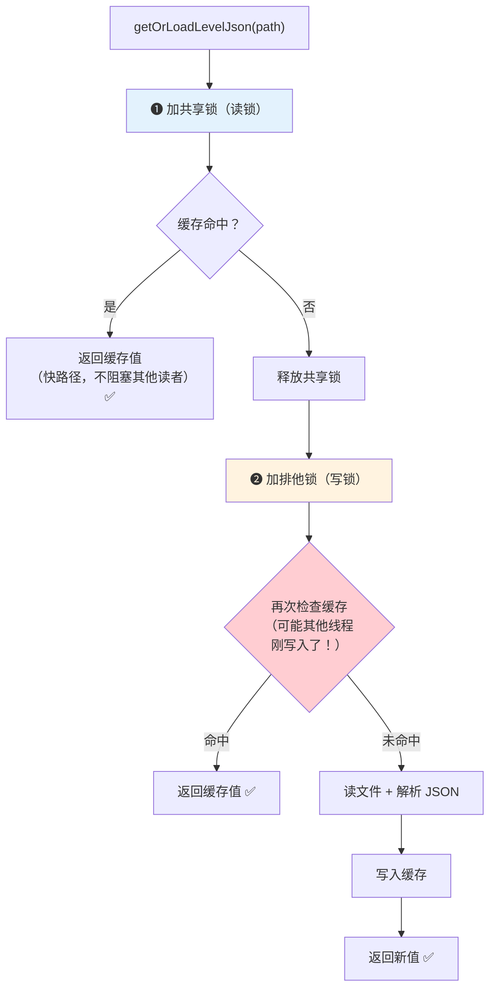
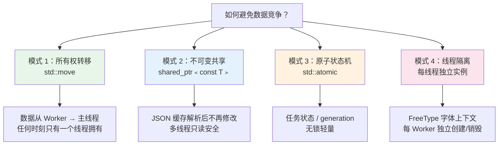
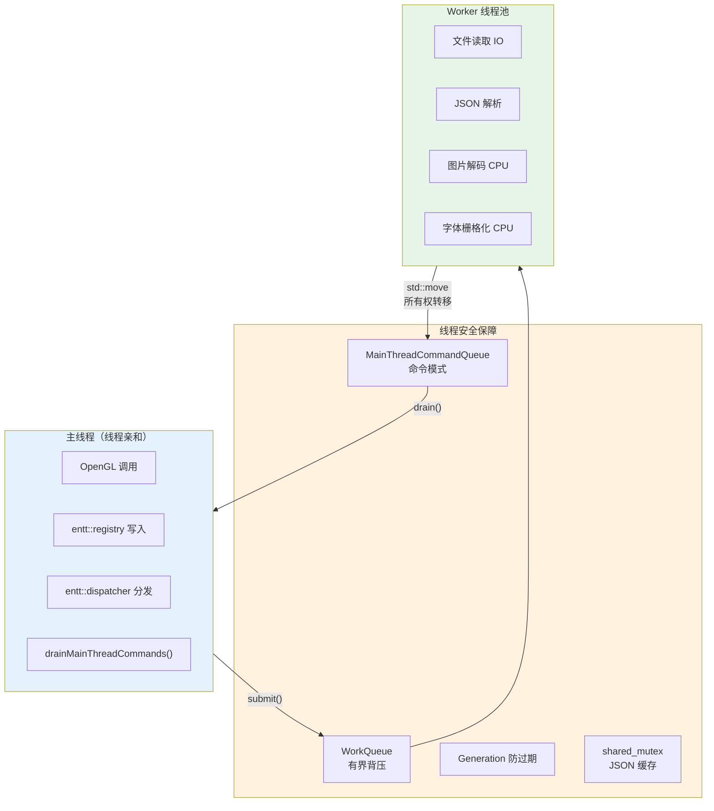

# 07 - 线程安全实践

前几章讲了「如何让多线程工作」，本章讲「如何让多线程不出问题」——工程层面的线程安全保障手段。

---

## 1. `std::shared_mutex` 读写锁

### 问题

`tiled_json_cache` 是全局 JSON 缓存，多个 worker 线程会并发读取（查询已解析的地图/tileset JSON），偶尔需要写入（插入新的解析结果）。

如果用普通 `mutex`，所有读操作都互斥——即使多个线程只是查询缓存，也只能一个一个来。在「多读少写」的场景下非常浪费。

### 解决方案

`std::shared_mutex` 提供两种锁模式：

| 锁模式 | 持锁类 | 并发性 | 用途 |
|--------|--------|--------|------|
| 共享锁（读锁） | `std::shared_lock` | 多个线程可同时持有 | 只读操作 |
| 排他锁（写锁） | `std::unique_lock` | 只有一个线程能持有 | 写入操作 |

```mermaid
gantt
    title shared_mutex 并发时序
    dateFormat X
    axisFormat %s

    section 线程 A
    shared_lock 读        :a1, 0, 3

    section 线程 B
    shared_lock 读        :b1, 0, 2

    section 线程 C
    等待读锁释放          :crit, c0, 0, 3
    unique_lock 写        :c1, 3, 5

    section 线程 D
    等待写锁释放          :crit, d0, 2, 5
    shared_lock 读        :d1, 5, 7
```



> 线程 A、B 同时持有共享锁（读），互不阻塞。线程 C 需要排他锁（写），必须等所有读锁释放。线程 D 的读锁要等线程 C 写完才能获取。

### 在 `tiled_json_cache` 中的使用

> `src/engine/loader/tiled_json_cache.h`

```cpp
// 全局读写锁
inline std::shared_mutex g_json_cache_mutex{};

// 读操作：共享锁
const nlohmann::json& getOrLoadLevelJson(std::string_view path) {
    // 1. 先尝试共享锁读取缓存
    {
        std::shared_lock read_lock(g_json_cache_mutex);
        if (auto it = level_cache.find(key); it != level_cache.end()) {
            return *it->second;  // 命中缓存，多线程可同时读
        }
    }

    // 2. 未命中，用排他锁写入
    {
        std::unique_lock write_lock(g_json_cache_mutex);
        // Double-check：可能其他线程刚刚写入了
        if (auto it = level_cache.find(key); it != level_cache.end()) {
            return *it->second;
        }
        // 读取文件并解析（在锁内，但只有一个线程在做）
        auto json = std::make_shared<nlohmann::json>(loadAndParse(path));
        level_cache.emplace(key, json);
        return *json;
    }
}
```

### Double-Check Locking

上面的代码用了**双重检查锁定**模式：



如果省掉第二次检查（步骤 ❷ 中的再次检查），可能出现两个线程同时发现缓存未命中，都去读文件并写入缓存——浪费了资源。

---

## 2. 线程亲和性断言

某些操作只能在特定线程执行。在调试构建中加入断言，可以在违规时立即发现，而不是等到运行时出现诡异的崩溃。

### 主线程命令队列的 owner 检查

```cpp
// src/engine/async/main_thread_command_queue.h
class MainThreadCommandQueue {
    const std::thread::id owner_thread_id_;

    std::size_t drain(std::size_t max_commands) {
        if (!isOnOwnerThread()) {
            spdlog::warn("MainThreadCommandQueue::drain() called from non-owner thread");
        }
        // ...
    }
};
```

### 建议：为 GL 调用加断言

虽然本项目尚未在所有 GL 调用处加断言，但这是推荐做法：

```cpp
// 示例：纹理上传加线程检查
void TextureLoader::uploadToGPU(const DecodedImage& image) {
    assert(isMainThread() && "GL calls must be on main thread!");
    glGenTextures(1, &id);
    glTexImage2D(..., image.pixels.data());
}
```

这些断言在 Release 构建中被编译器移除，零运行时开销。

---

## 3. 数据竞争与 TSAN

### 什么是数据竞争？

当两个线程同时访问同一内存位置，且至少一个是写操作，且没有同步手段——这就是**数据竞争（data race）**，是 C++ 中的**未定义行为**。

```cpp
// 数据竞争示例
int counter = 0;

// 线程 A
counter++;    // 读-修改-写，非原子

// 线程 B
counter++;    // 同时读-修改-写 → 未定义行为！
```

结果可能是 1 也可能是 2，也可能是完全意想不到的值。编译器可能会基于「不存在数据竞争」的假设做优化，使问题更加隐蔽。

### ThreadSanitizer（TSAN）

TSAN 是编译器提供的运行时检测工具，能在程序运行时检测数据竞争。

#### 在本项目中启用 TSAN

> `cmake/CompilerSettings.cmake`

```cmake
if(ENABLE_TSAN)
    target_compile_options(${TARGET_NAME} PRIVATE -fsanitize=thread -fno-omit-frame-pointer)
    target_link_options(${TARGET_NAME} PRIVATE -fsanitize=thread -fno-omit-frame-pointer)
endif()
```

**构建与运行**：

```bash
# 配置 TSAN 构建
cmake -S . -B build-tsan -DENABLE_TSAN=ON -DBUILD_TESTING=ON

# 编译
cmake --build build-tsan

# 运行测试
cd build-tsan && ctest --output-on-failure
```

**TSAN 输出示例**（如果存在数据竞争）：

```
WARNING: ThreadSanitizer: data race (pid=12345)
  Write of size 4 at 0x7f... by thread T1:
    #0 MapManager::scheduleAsyncPreloadTask()
        src/game/world/map_manager.cpp:380

  Previous read of size 4 at 0x7f... by main thread:
    #0 MapManager::loadMap()
        src/game/world/map_manager.cpp:650
```

TSAN 会精确报告：哪两个线程、在哪一行代码、对哪个内存地址产生了竞争。

#### TSAN 的注意事项

- **性能影响**：TSAN 构建比正常构建慢 5-15 倍，内存占用增大 5-10 倍。只在调试/CI 中使用。
- **不能和 ASAN 同时使用**：Address Sanitizer 和 Thread Sanitizer 不兼容。
- **误报极少**：TSAN 的误报率很低。如果它报告了竞争，几乎一定存在问题。

---

## 4. 避免数据竞争的实践模式



### 模式 1：所有权转移（Move Semantics）

```cpp
// Worker 线程解码图片
auto decoded = ImageDecodeService::decodeRGBA(path);

// 将数据 move 到主线程命令中
main_queue->enqueue([decoded = std::move(*decoded)] {
    // decoded 现在完全属于主线程
    // worker 不再持有任何引用
    uploadToGPU(decoded);
});
```

**没有共享 = 没有竞争。** 数据从 worker 线程转移到主线程，任何时刻只有一个线程拥有数据。

### 模式 2：不可变共享（Const/Shared Pointer）

```cpp
// tiled_json_cache 中，JSON 对象一旦解析完成就不再修改
auto json = std::make_shared<const nlohmann::json>(parse(file));
cache.emplace(key, json);
// 之后所有线程通过 shared_ptr<const json> 读取，安全
```

**只读的数据可以安全共享。** 关键是 `const`——保证没有线程会修改它。

### 模式 3：原子状态机

```cpp
// MapManager 的任务状态
std::atomic<MapPreloadTaskState> state{NotScheduled};

// Worker 线程写
state.store(MapPreloadTaskState::Ready, std::memory_order_release);

// 主线程读
if (state.load(std::memory_order_acquire) == Ready) {
    // 处理结果
}
```

**简单状态用 atomic。** 不需要 mutex，开销极小。

### 模式 4：线程隔离（Thread Confinement）

```cpp
// FontPreprocessService::rasterizeGlyphs 中，每次调用创建独立的 FreeType 上下文
FT_Library library;
FT_Init_FreeType(&library);  // 线程局部的库实例

FT_Face face;
FT_New_Face(library, path, 0, &face);  // 线程局部的字体实例

// ... 栅格化 ...

FT_Done_Face(face);
FT_Done_FreeType(library);  // 用完销毁，不跨线程共享
```

> 参见 `src/engine/resource/font_preprocess_service.cpp`

**每个线程独立拥有自己的资源实例。** FreeType 的 `FT_Library` 和 `FT_Face` 不是线程安全的，所以每个 worker 调用时创建自己的实例，用完销毁。

---

## 5. 常见错误清单

### 错误 1：在 worker 中直接调用 GL API

```cpp
// ✗ 错误
pool.submit([&] {
    auto decoded = decodeImage(path);
    glGenTextures(1, &id);  // 崩溃！GL 上下文不在此线程
});

// ✓ 正确
pool.submit([&] {
    auto decoded = decodeImage(path);
    main_queue->enqueue([decoded = std::move(decoded)] {
        glGenTextures(1, &id);  // 在主线程执行
    });
});
```

### 错误 2：Lambda 捕获悬空引用

```cpp
// ✗ 危险
void someFunction() {
    std::string path = "/maps/farm.tmj";
    pool.submit([&path] {  // path 是局部变量的引用！
        loadFile(path);     // someFunction 返回后 path 已销毁 → 未定义行为
    });
}

// ✓ 正确
void someFunction() {
    std::string path = "/maps/farm.tmj";
    pool.submit([path] {   // 值捕获，复制 path
        loadFile(path);
    });
    // 或者
    pool.submit([path = std::move(path)] {  // 移动捕获
        loadFile(path);
    });
}
```

### 错误 3：忘记检查 generation

```cpp
// ✗ 可能处理过期结果
pool.submit([shared, resource_mgr] {
    auto result = preprocess(path);
    // 没有检查 generation → 可能上传了过期纹理
    main_queue->enqueue([result] { uploadTextures(result); });
});

// ✓ 正确：每个阶段都检查
pool.submit([shared, generation, resource_mgr] {
    auto result = preprocess(path);
    if (shared->generation.load(std::memory_order_acquire) != generation) return;  // 检查！
    main_queue->enqueue([result, shared, generation] {
        if (shared->generation.load(std::memory_order_acquire) != generation) return;  // 再检查！
        uploadTextures(result);
    });
});
```

### 错误 4：析构顺序错误

```cpp
// ✗ 先销毁资源，后停线程
~GameApp() {
    resourceManager_.reset();     // 资源已释放
    threadPool_.stop();           // worker 可能还在用资源 → 崩溃
}

// ✓ 先停线程，后销毁资源
~GameApp() {
    threadPool_.stop();           // 等待所有 worker 退出
    resourceManager_.reset();     // 安全释放
}
```

---

## 6. 测试中的并发验证

### 使用 `waitForIdle()` 做同步断言

```cpp
TEST(ThreadPoolTest, ExecutesSubmittedTasks) {
    ThreadPool pool({.worker_count = 2});
    std::atomic<int> counter{0};

    pool.submit([&] { counter.fetch_add(1); });
    pool.submit([&] { counter.fetch_add(1); });

    pool.waitForIdle();  // 确保所有任务完成

    EXPECT_EQ(counter.load(), 2);  // 安全断言
}
```

### 使用 `std::promise`/`std::future` 控制执行时序

```cpp
TEST(ThreadPoolTest, QueueCapacityAppliesBackpressure) {
    ThreadPool pool({.worker_count = 1, .queue_capacity = 1});

    // 用 promise 让任务阻塞
    std::promise<void> blocker;
    auto future = blocker.get_future();

    pool.submit([&] { future.wait(); });  // 任务会阻塞直到 promise 设值

    // 此时 worker 被占住，队列有 1 个容量
    pool.submit([] {});                   // 填满队列
    EXPECT_FALSE(pool.submit([] {}));     // 第三个被拒绝

    blocker.set_value();  // 释放阻塞任务
}
```

### 预处理服务的同步测试

```cpp
// tests/engine/loader/level_preprocess_service_test.cpp
TEST(LevelPreprocessServiceTest, CollectsTilesetAndTexturePathsFromLevel) {
    // 虽然这个服务设计为在 worker 线程执行，
    // 但可以在测试线程中同步调用来验证正确性
    auto result = LevelPreprocessService::preprocessLevel(level_path);

    EXPECT_TRUE(result.success);
    EXPECT_FALSE(result.data.tilesets.empty());
    EXPECT_FALSE(result.data.texture_paths.empty());
    // 验证路径已排序去重
    EXPECT_TRUE(std::is_sorted(result.data.tileset_paths.begin(),
                                result.data.tileset_paths.end()));
}
```

**测试策略**：
1. **单元测试**：同步调用预处理服务，验证逻辑正确性。
2. **并发测试**：用线程池和 atomic 验证并发行为。
3. **TSAN 构建**：用 sanitizer 检测数据竞争。

---

## 本章要点

| 实践 | 说明 |
|------|------|
| `shared_mutex` | 读写锁，多读少写场景的性能优化 |
| Double-check locking | 先读锁查缓存，未命中再写锁插入 |
| 线程断言 | Debug 构建中检查线程亲和性 |
| TSAN | 编译器级别的数据竞争检测，几乎无误报 |
| 所有权转移 | `std::move` 避免共享 |
| 不可变共享 | `shared_ptr<const T>` 安全共享只读数据 |
| 线程隔离 | 每个 worker 独立创建资源实例 |
| Generation 检查 | 防止处理过期异步结果 |
| 析构顺序 | 先停线程池，再释放资源 |

---

## 总结

回顾整个教程系列，Phase 1 多线程改造的核心原则是：



1. **最小化共享**：数据通过所有权转移（move）跨线程传递，而不是共享访问。
2. **严格的线程边界**：OpenGL、ECS registry、事件分发器只在主线程操作。
3. **异步是加速层**：同步路径始终可用，异步失败只是回退到同步，不影响正确性。
4. **可观测性**：日志、计时、TSAN，出了问题能快速定位。

这些原则不只适用于游戏引擎——任何需要引入多线程的 C++ 项目都可以参考。
