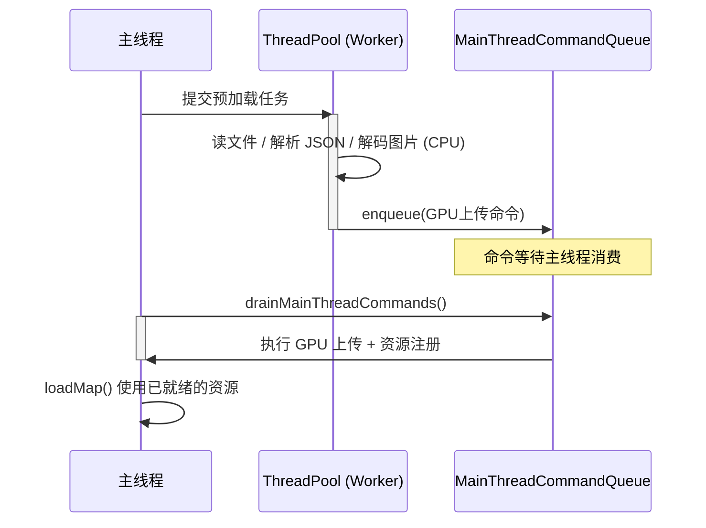
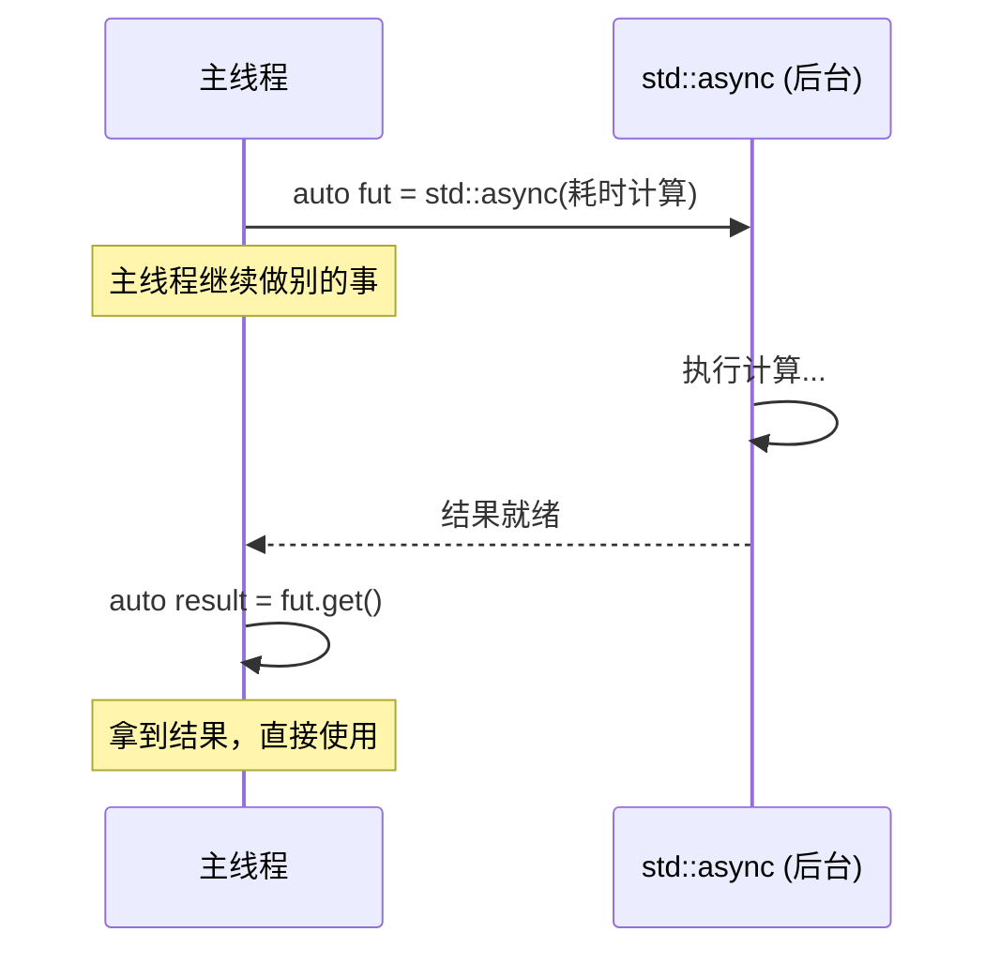
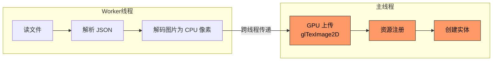
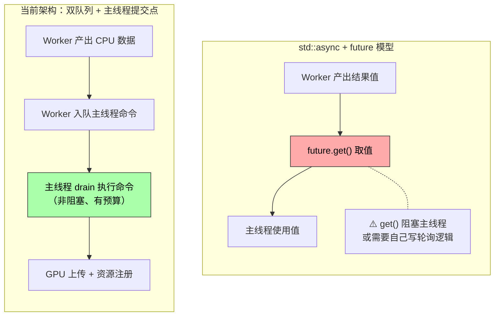
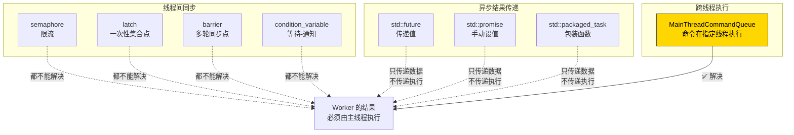
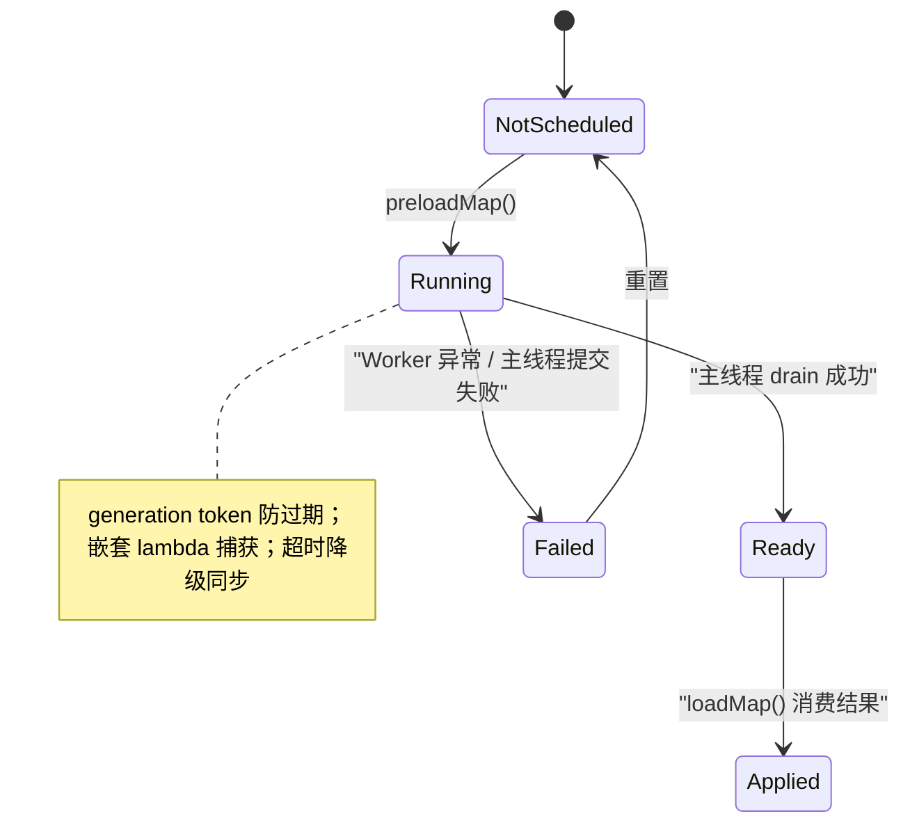
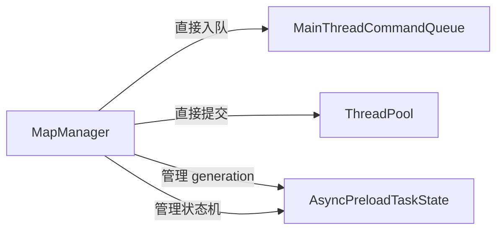
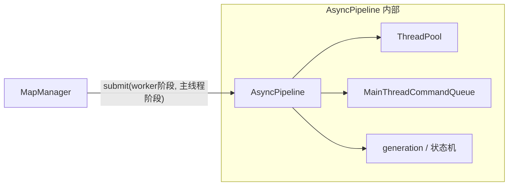

# 08 - 为什么不能用 std::async + std::future 替代当前架构？

学完现代 C++ 的并发工具后，回头审视项目中的 `ThreadPool` + `WorkQueue` + `MainThreadCommandQueue` 三件套，一个自然的疑问浮现：

> 我有 `std::async`，有 `std::future`，还有 C++20 的 `semaphore` / `latch` / `barrier`……
> 能不能用这些"高层工具"替代当前的实现，大幅简化代码？

本章回答这个问题。

---

## 1. 先看当前架构在做什么

回顾 06 章的地图预加载管线，整个流程分为三个阶段：



关键点：**Worker 线程不能执行最终的提交操作（GPU 上传、ECS 写入）**——这些操作必须在主线程完成。

---

## 2. std::async + std::future 的思维模型

`std::async` + `std::future` 的设计哲学很简洁：



**它假设：后台线程能产出一个"完整的结果值"，主线程拿到后直接使用。**

这在很多场景下非常好用，例如：

```cpp
// 纯计算：后台算完，主线程直接用结果
auto fut = std::async(std::launch::async, []() {
    return computePathfinding(start, end);  // 返回路径数据
});

auto path = fut.get();  // 拿到完整的路径，直接使用
```

---

## 3. 为什么它不适用于我们的场景

### 3.1 核心矛盾：OpenGL 的线程亲和性

我们的场景不是"算一个值然后返回"。地图预加载的结果必须经过 **主线程执行的 GPU 上传** 才算完成：



红色部分 **必须在主线程执行**，因为：
- OpenGL 上下文绑定在创建它的线程上
- `entt::registry` 不是线程安全的
- `entt::dispatcher` 不是线程安全的

**`std::future` 只能传递"数据"，不能传递"需要在特定线程执行的操作"。**

### 3.2 如果硬要用 std::async，会怎样？

```cpp
// 方案 A：future.get() 阻塞主线程
auto fut = std::async(std::launch::async, [&]() {
    auto data = parseLevelData(path);
    auto pixels = decodeImage(data);
    return pixels;  // 只能返回 CPU 数据
});

// 问题：get() 会阻塞主线程！
// 如果 Worker 还在解码，主线程就卡在这里，帧率归零。
auto cpu_data = fut.get();  // ← 阻塞！
uploadToGPU(cpu_data);      // 这步倒是在主线程了
```

这和同步加载在体验上几乎没有区别——主线程仍然被阻塞。

```cpp
// 方案 B：轮询 future 状态，避免阻塞
auto fut = std::async(std::launch::async, [&]() {
    return decodeAndParse(path);
});

// 主循环中每帧检查
void onFrame() {
    if (fut.valid() &&
        fut.wait_for(std::chrono::seconds(0)) == std::future_status::ready) {
        auto cpu_data = fut.get();
        uploadToGPU(cpu_data);  // 在主线程执行 GL 操作
    }
}
```

这看起来可行？但你实际上已经在做这些事了：
- "主循环中每帧检查" → 就是 `drainMainThreadCommands()`
- "检查是否就绪然后执行" → 就是 `MainThreadCommandQueue` 的职责

**你只是用 `future` 的 API 重新发明了 `MainThreadCommandQueue`，而且还更弱**——不支持批量 drain、时间预算、多任务排队。

### 3.3 对比总结



---

## 4. C++20 高级并发原语能帮上忙吗？

### 4.1 逐一审视

| 工具 | 它解决什么问题 | 我们的场景需要吗 |
|------|---------------|-----------------|
| `std::counting_semaphore` | 限制同时访问资源的线程数 | 不需要——`ThreadPool` 本身就限制了线程数 |
| `std::binary_semaphore` | 轻量级互斥 | 不需要——已有 `std::mutex` |
| `std::latch` | 等待 N 个线程全部到达 | 不需要——我们不要求所有预加载同时完成 |
| `std::barrier` | 多轮同步屏障 | 不需要——我们没有分阶段的并行计算 |

### 4.2 它们解决的是不同层次的问题



**核心问题不是"线程间如何同步"，而是"Worker 产出的结果需要由主线程来执行提交"。** 标准库中没有现成的工具解决这个问题，所以我们自己实现了 `MainThreadCommandQueue`。

---

## 5. 那现有代码的"复杂感"从何而来？

基础设施本身其实很简洁：

| 模块 | 本质 | 行数 | 复杂度 |
|------|------|------|--------|
| `ThreadPool` | 教程级线程池（04 章） | ~170 行 | 低 |
| `WorkQueue` | 标准生产者-消费者队列（03 章） | ~100 行 | 低 |
| `MainThreadCommandQueue` | 主线程专用消费者队列（05 章） | ~160 行 | 中 |

**真正复杂的是 `MapManager` 中的业务逻辑**：



这些复杂度来自 **业务需求**，不是来自"选错了并发工具"：

- **generation token**：地图可以随时切换，旧任务必须能作废
- **状态机**：预加载结果有"未调度/运行中/就绪/已应用/失败"五种状态
- **超时降级**：异步结果迟到时，必须能回退到同步加载
- **嵌套 lambda**：Worker 阶段和主线程阶段需要捕获不同的上下文

即使换用 `std::async`，这些业务逻辑一个都省不掉。

---

## 6. 如果要简化，方向在哪？

正确的简化方向不是换并发工具，而是 **提升抽象层次**——将三阶段管线封装为统一接口，让 `MapManager` 不再直接操作底层队列。

### 当前：MapManager 直接操作底层



`MapManager` 同时承担了"业务调度"和"并发管理"的职责。

### 改进方向：引入 AsyncPipeline 抽象



```cpp
// 改进后的 MapManager 代码（伪码示意）
void MapManager::preloadMap(const std::string& map_id) {
    preload_handle_ = async_pipeline_.submit(
        // Worker 阶段
        [=]() {
            auto level_data = preprocess_service_.process(map_id);
            auto textures = image_service_.decodeAll(level_data.texture_paths);
            return PreloadResult{level_data, textures};
        },
        // 主线程提交阶段（drain 时自动执行）
        [=](PreloadResult& result) {
            for (auto& tex : result.textures) {
                resource_manager_.uploadTexture(tex);
            }
        }
    );
}

void MapManager::loadMap(const std::string& map_id) {
    if (preload_handle_.isReady()) {
        // 异步结果已就绪，直接使用
    } else {
        // 降级同步加载
    }
}
```

这样 `MapManager` 不再需要关心 `MainThreadCommandQueue` 的入队细节、generation 校验、原子状态管理等——全部沉入 `AsyncPipeline` 内部。

---

## 7. 总结

| 问题 | 回答 |
|------|------|
| `std::async` + `future` 能替代当前架构吗？ | **不能。** `future.get()` 阻塞主线程；`future` 只传数据不传执行。 |
| C++20 的 semaphore / latch / barrier 有用吗？ | **不适用。** 它们解决线程间同步，不解决"跨线程提交执行"。 |
| 当前架构选择正确吗？ | **是的。** "双队列 + 主线程提交点"是游戏引擎的标准模式。 |
| 感觉复杂的根源是什么？ | 业务逻辑（状态机、防过期、降级）堆积在 `MapManager`，而非工具选择错误。 |
| 正确的简化方向是什么？ | 提升抽象层次，将三阶段管线封装为 `AsyncPipeline`，让业务层代码更简洁。 |

### 一句话记住

> **`std::async` 适合"算一个值然后拿回来"；但当"结果的提交本身就是需要在主线程执行的操作"时，你需要命令队列。**

---

## 延伸阅读

- [05 - 主线程命令队列](05-main-thread-command-queue.md)：`MainThreadCommandQueue` 的设计与实现
- [06 - 异步管线实战](06-async-pipeline.md)：地图预加载的完整流程
- [07 - 线程安全实践](07-thread-safety-practices.md)：线程断言、`shared_mutex`、TSAN
