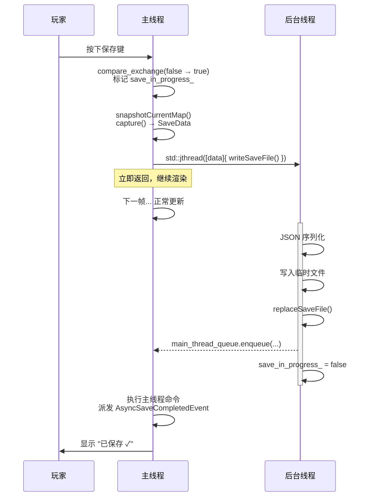
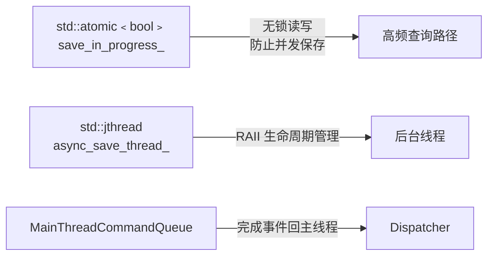
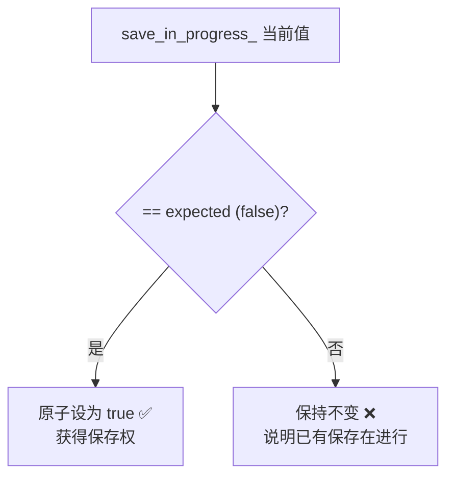
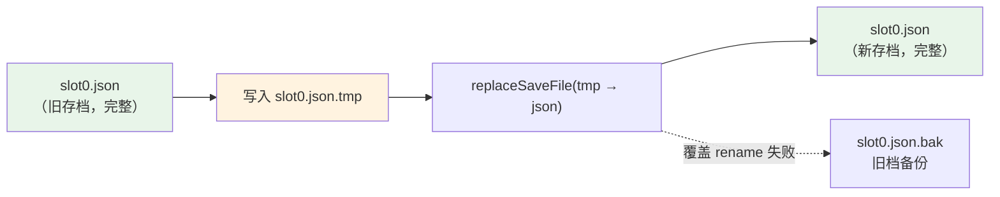

# 09 - 后台存档 I/O

前面几章介绍了异步加载——把读操作搬到后台。本章反过来看**写操作**：如何在后台保存游戏存档，让玩家感受不到卡顿。

> 核心文件：`src/game/save/save_service.h`、`src/game/save/save_service.cpp`

---

## 问题：同步保存的卡顿

```
saveToFile()
  ├─ 快照当前地图 ECS 状态       (~1ms，registry 遍历)
  ├─ 序列化 JSON                 (~5ms，CPU)
  ├─ 写入磁盘                    (~3ms，IO)
  └─ 总计 ~9ms → 吃掉半帧以上
```

对玩家来说，按下保存键时画面卡一下，体验很差。而且随着游戏进度增长（更多农田、更多NPC），序列化时间只会更长。

**解决方案**：主线程只做快照（~1ms），序列化和写盘搬到后台线程。

---

## 整体架构



与异步加载管线（06 章）的关键区别：

| | 异步加载 | 异步保存 |
|---|---|---|
| 线程模型 | 长期运行的 ThreadPool | 每次保存创建一个 jthread |
| 回调机制 | 通过 MainThreadCommandQueue 提交 | 通过 MainThreadCommandQueue 回派完成事件 |
| 失败策略 | 降级为同步加载 | `AsyncSaveCompletedEvent` 携带错误，UI 提示 |

为什么不复用线程池？保存是低频操作（几分钟一次），不值得占用长期 worker。`std::jthread` 创建、执行、销毁，干净利落。

---

## 关键数据成员

> `src/game/save/save_service.h`

```cpp
class SaveService final {
    // ... 依赖引用省略 ...

    std::atomic<bool> save_in_progress_{false};           // 防止并发保存
    std::optional<std::jthread> async_save_thread_{};     // 后台线程句柄
};
```

```cpp
struct AsyncSaveCompletedEvent final {
    std::string file_path{};
    bool success{false};
    std::string error{};
};
```

两个本地同步原语，加上一条主线程队列，各司其职：



---

## 核心流程：`saveToFileAsync()`

> `src/game/save/save_service.cpp`

```cpp
bool SaveService::saveToFileAsync(const std::filesystem::path& file_path, std::string& out_error) {
    out_error.clear();
    cleanupCompletedSaveThread();

    // 1. 原子 CAS：防止并发保存
    bool expected = false;
    if (!save_in_progress_.compare_exchange_strong(expected, true, std::memory_order_acq_rel)) {
        out_error = "保存进行中，请稍后再试。";
        return false;
    }

    // 2. 主线程快照（这一步必须在主线程做，因为要访问 registry）
    map_manager_.snapshotCurrentMap();
    SaveData data = capture(out_error);
    if (!out_error.empty()) {
        save_in_progress_.store(false, std::memory_order_release);
        return false;
    }

    auto* main_thread_queue = &context_.getMainThreadCommandQueue();
    auto* dispatcher = &context_.getDispatcher();

    // 3. 启动后台线程（data 通过移动语义转移所有权）
    async_save_thread_.emplace([this, data = std::move(data), file_path, main_thread_queue, dispatcher]() mutable {
        // ═══ 后台线程 ═══
        std::string write_error;
        const bool success = writeSaveFile(data, file_path, write_error);

        game::defs::AsyncSaveCompletedEvent event{};
        event.file_path = file_path.string();
        event.success = success;
        event.error = std::move(write_error);

        main_thread_queue->enqueue([dispatcher, event = std::move(event)]() mutable {
            dispatcher->enqueue<game::defs::AsyncSaveCompletedEvent>(std::move(event));
        });

        save_in_progress_.store(false, std::memory_order_release);
    });

    return true;
}
```

### 逐步解析

**步骤 1：`compare_exchange_strong`（CAS）**



CAS 是一个原子操作，等价于：
```cpp
// 伪代码（实际是单条原子指令）
if (save_in_progress_ == false) {
    save_in_progress_ = true;
    return true;   // 交换成功
} else {
    expected = save_in_progress_;  // 把当前值写回 expected
    return false;  // 交换失败
}
```

为什么用 CAS 而不是 `if (!flag) flag = true`？因为后者是「读+判断+写」三步操作，两个线程可能同时读到 false，都认为自己抢到了。CAS 是原子的，保证只有一个赢家。

> 在本项目中，保存只在主线程发起，所以并发实际不会发生。但 CAS 是防御性编程，保证即使未来架构变化也不会出 bug。

**步骤 2：主线程快照**

`capture()` 遍历 `entt::registry` 收集所有游戏状态（作物、库存、NPC 等），生成一个自包含的 `SaveData` 值对象。这一步必须在主线程做——因为 registry 不允许并发读写。

**步骤 3：所有权转移 + 完成事件回派**

```cpp
async_save_thread_.emplace([this, data = std::move(data), file_path, main_thread_queue, dispatcher]() mutable {
    // 写文件完成后，把事件投回主线程队列。
});
```

`std::move(data)` 把数据从主线程转移到后台线程的 lambda 中。转移后主线程不再持有数据，后台线程独占所有权——不需要锁。

这是 05 章提到的**所有权转移模式**在存档场景的应用。后台线程完成写盘后不直接派发事件，而是通过 `MainThreadCommandQueue` 把 `AsyncSaveCompletedEvent` 的派发动作交回主线程；`PauseMenuScene` 订阅该事件更新 UI。

### 无异常约束：读档 JSON 解析

本项目采用无异常风格，`loadFromFile()` 不使用 `try/catch`，改为 `nlohmann::json::parse(..., false)`：

```cpp
nlohmann::json json;
if (!parseJsonFileNoExceptions(file_path, json, out_error)) {
    return false;
}
```

`parseJsonFileNoExceptions()` 的核心检查：

```cpp
out_json = nlohmann::json::parse(content, nullptr, false);
if (out_json.is_discarded()) {
    out_error = "解析存档 JSON 失败: " + file_path.string();
    return false;
}
```

这样解析失败直接走返回值和错误字符串，不依赖异常控制流。

同一原则也延伸到字段读取：`SaveData::deserialize()` 和 `SaveMigrator::migrateToLatest()` 会先检查 scalar 类型和范围，再写入 C++ 字段。例如 `schema_version: "8"` 或 `game_time.day: "three"` 会返回错误，而不是让异常从 JSON 库里漏出来。

---

## 原子写盘：`writeSaveFile()`

> `src/game/save/save_service.cpp`

```cpp
static bool writeSaveFile(const SaveData& data,
                           const std::filesystem::path& file_path,
                           std::string& out_error) {
    const nlohmann::json json = serialize(data);

    // 1. 确保目录存在
    std::filesystem::create_directories(file_path.parent_path());

    // 2. 写入临时文件
    auto tmp_path = file_path;
    tmp_path += ".tmp";
    {
        std::ofstream out(tmp_path, std::ios::binary | std::ios::trunc);
        out << json.dump(2);
        out.flush();
        if (!out.good()) {
            out_error = "写入失败: " + tmp_path.string();
            return false;
        }
    }

    // 3. 原子替换或 .bak fallback
    if (!replaceSaveFile(tmp_path, file_path, out_error)) {
        return false;
    }
    return true;
}
```

**为什么先写临时文件再 rename？**

如果直接写目标文件，写到一半断电，存档就损坏了。`rename` 在大多数文件系统上是原子操作——要么完全完成，要么完全没做。这保证存档文件在任何时刻都是完整的。



这个模式叫 **write-then-rename**，在数据库、日志系统中广泛使用。本项目还加了一层 fallback：如果平台不允许 `rename` 覆盖已有目标，就先把旧档移动成 `.bak`，再把 `.tmp` 移到真档；第二步失败时会尝试把 `.bak` 恢复回 `slot0.json`，避免“为了保存新档先删掉旧档”。

另外注意 `writeSaveFile` 是 `static` 函数——不访问任何成员变量，可以安全地在任何线程调用。

---

## 完成通知：主线程队列 + `AsyncSaveCompletedEvent`

```cpp
game::defs::AsyncSaveCompletedEvent event{};
event.file_path = file_path.string();
event.success = success;
event.error = std::move(write_error);

main_thread_queue->enqueue([dispatcher, event = std::move(event)]() mutable {
    dispatcher->enqueue<game::defs::AsyncSaveCompletedEvent>(std::move(event));
});
```

**设计细节**：

1. **后台线程不碰 dispatcher** —— `entt::dispatcher` 仍由主线程消费，worker 只提交一个主线程命令。

2. **完成事件是一次性事实** —— 主线程执行队列命令后，把 `AsyncSaveCompletedEvent` 放进 dispatcher；订阅者收到一次，UI 状态就从“保存中”切回终态。

3. **线程清理** —— 下一次保存或同步保存前，`cleanupCompletedSaveThread()` 会在 `save_in_progress_ == false` 时 join 已完成的 jthread 并释放资源。

---

## UI 集成模式

保存按钮的典型实现：

```cpp
// 初始化 / 清理
void PauseMenuScene::connectRuntimeListeners() {
    dispatcher.sink<game::defs::AsyncSaveCompletedEvent>()
        .connect<&PauseMenuScene::onAsyncSaveCompleted>(this);
}

// 按钮点击
void PauseMenuScene::onSaveClicked() {
    if (save_service_.isSaving()) {
        return;  // 正在保存，忽略
    }

    std::string error;
    if (!save_service_.saveToFileAsync(slot_path, error)) {
        showMessage("保存失败: " + error);
    } else {
        showMessage("保存中...");
        refreshSaveActionButtons();
    }
}

// 完成事件
void PauseMenuScene::onAsyncSaveCompleted(const game::defs::AsyncSaveCompletedEvent& event) {
    showMessage(event.success ? "已保存 ✓" : "保存失败: " + event.error);
    refreshSaveActionButtons();
}
```


**要点**：UI 不用 future，也不让 worker 直接调用 UI；它订阅主线程上的完成事件。保存期间按钮状态仍通过 `isSaving()` 读取 atomic 标志刷新。

---

## 与 06 章异步管线的对比

| 维度 | 异步加载管线 (06) | 异步存档 (09) |
|------|-------------------|---------------|
| 数据流方向 | 磁盘 → 内存 → GPU | 内存 → 磁盘 |
| 线程生命周期 | ThreadPool（长期） | jthread（一次性） |
| 主线程交互 | MainThreadCommandQueue | MainThreadCommandQueue + dispatcher event |
| 并发度 | 多个地图可并行预加载 | 同一时间只允许一次保存 |
| 失败处理 | 降级为同步加载 | 完成事件携带错误信息 |
| 结果消费 | 状态机查询 (Ready/Failed) | `AsyncSaveCompletedEvent` |

**共同点**：主线程做最少的工作（快照/创建实体），耗时操作（序列化/解码）交给后台。

---

## 线程安全分析

```
┌──────────────────────────────────────────────────┐
│ save_in_progress_ (atomic)                        │
│                                                    │
│   主线程写：CAS false→true                        │
│   主线程读：isSaving()                             │
│   后台写：  store(false)                          │
│                                                    │
│   → 无锁，acquire/release 保证可见性             │
├──────────────────────────────────────────────────┤
│ MainThreadCommandQueue                             │
│                                                    │
│   后台线程：enqueue 完成事件派发命令               │
│   主线程：  执行命令并 enqueue dispatcher event    │
│                                                    │
│   → worker 不直接碰 dispatcher 或 UI             │
├──────────────────────────────────────────────────┤
│ SaveData (所有权转移)                              │
│                                                    │
│   主线程：  capture() 创建 → move 到 lambda       │
│   后台线程：独占使用 → 作用域结束自动析构          │
│                                                    │
│   → 同一时刻只有一个线程拥有数据                 │
└──────────────────────────────────────────────────┘
```

三种机制配合，覆盖了三种不同的数据共享场景：
- **Atomic**：简单标志位，高频读取
- **主线程队列**：跨线程把完成通知交回主线程
- **所有权转移**：大块数据，零共享

---

## 本章要点

| 概念 | 说明 |
|------|------|
| CAS（compare_exchange） | 原子地抢占保存权，防止并发保存 |
| 所有权转移 | `std::move` 把 SaveData 从主线程转移给后台线程，避免共享 |
| write-then-rename | 先写临时文件再替换目标，防止断电导致存档损坏；fallback 用 `.bak` 尝试保护旧档 |
| 完成事件 | worker 通过 `MainThreadCommandQueue` 回派 `AsyncSaveCompletedEvent` |
| 事件式 UI | UI 订阅完成事件，保存期间用 `isSaving()` 禁用相关按钮 |

## 下一篇

[10 - ECS 并行调度](10-ecs-parallel-scheduling.md)：如何把 ECS 系统拆分成可并行执行的任务组，安全地在多线程中更新游戏世界。
