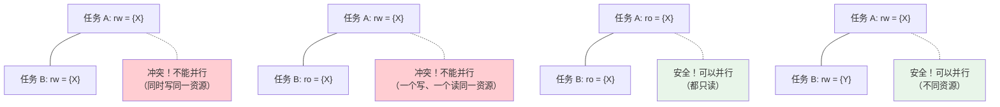
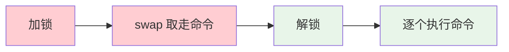
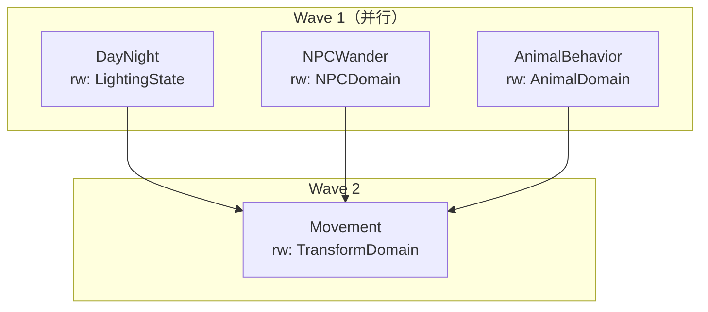
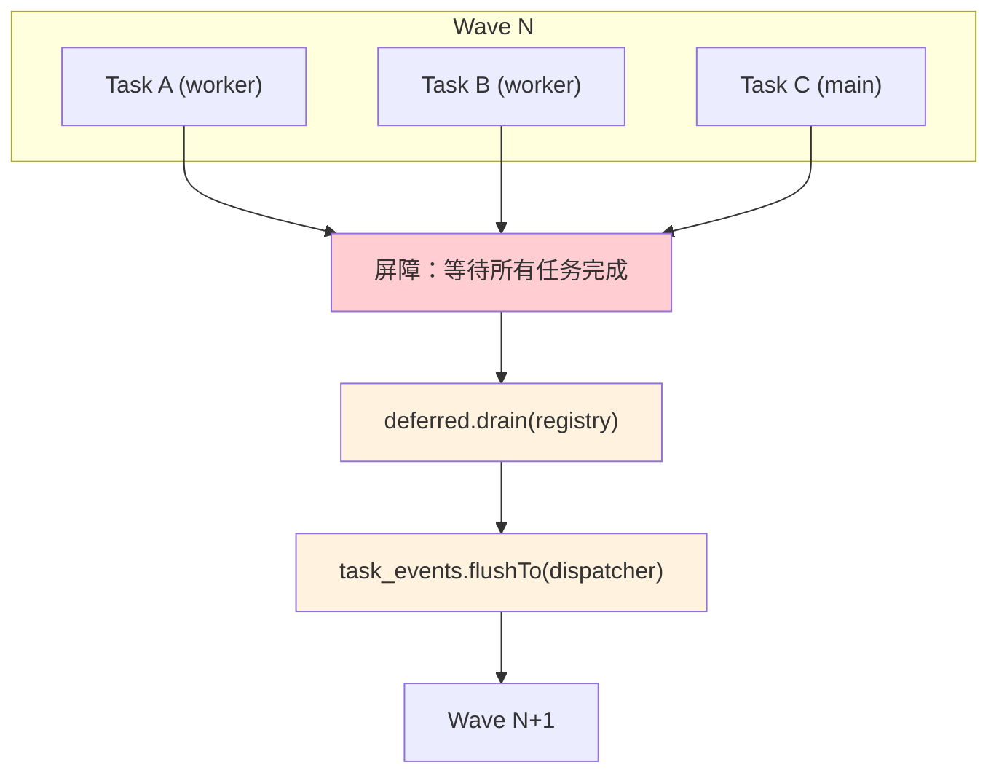
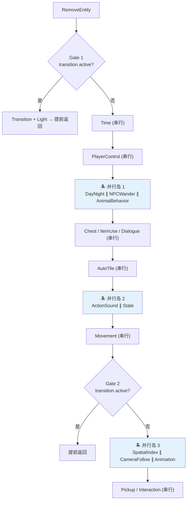
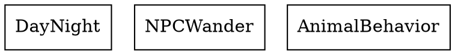
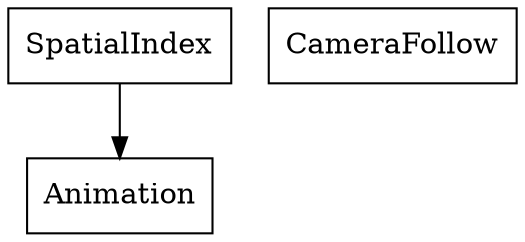

# 10 - ECS 并行调度

前面所有章节处理的都是 IO 密集型任务——文件读写、图片解码、存档序列化。本章进入一个全新领域：**计算密集型**的 ECS 系统更新。我们要让多个游戏系统同时运行在不同线程上。

> 核心文件：`src/engine/system/parallel_wave_scheduler.h`、`src/engine/system/system_task_decl.h`、`src/engine/system/deferred_commands.h`

---

## 问题：串行 tick 的瓶颈

典型的 ECS 游戏循环：

```cpp
void tick(float dt) {
    dayNightSystem.update(dt);        // 光照
    npcWanderSystem.update(dt);       // NPC 行走
    animalBehaviorSystem.update(dt);  // 动物行为
    stateSystem.update(dt);           // 状态机
    movementSystem.update(dt);        // 移动
    spatialIndexSystem.update(dt);    // 空间索引
    cameraFollowSystem.update(dt);    // 摄像机
    animationSystem.update(dt);       // 动画
    // ... 还有更多
}
```

所有系统串行执行。但其中很多系统其实是**互相独立**的——NPC 的行走逻辑和动物的行为逻辑不会互相影响。它们操作不同的组件、不同的实体，完全可以并行。

```mermaid
gantt
    title 串行执行 vs 并行执行
    dateFormat X
    axisFormat %s

    section 串行
    DayNight     :0, 3
    NPCWander    :3, 8
    AnimalBehavior :8, 12

    section 并行
    DayNight     :0, 3
    NPCWander    :0, 5
    AnimalBehavior :0, 4
```



**问题**：怎么知道哪些系统可以并行？手动分析几十个系统的读写依赖既容易出错又难以维护。

**解决方案**：让每个系统**声明**自己读写了哪些资源，调度器**自动**构建依赖图并提取可并行的组。

---

## 声明式任务：`SystemTaskDecl`

> `src/engine/system/system_task_decl.h`

```cpp
enum class ExecutionPolicy {
    MainThreadOnly,   // 必须在主线程执行（如 GL 调用）
    WorkerEligible    // 可以在 worker 线程执行
};

struct SystemTaskDecl {
    std::string name{};                                           // 调试用名称
    ExecutionPolicy policy{ExecutionPolicy::MainThreadOnly};      // 执行策略
    std::function<void(DeferredCommands&, TaskEventBuffer&)> run{}; // 执行体
    std::vector<entt::id_type> ro_resources{};                    // 只读资源
    std::vector<entt::id_type> rw_resources{};                    // 读写资源
    bool sync_point{false};                                       // 同步屏障
};
```

**资源声明**是核心。以本项目的三个系统为例：

```cpp
// DayNight：读 GameTime 和 WorldState，写 GlobalLightingState
SystemTaskDecl{
    .name = "DayNight",
    .policy = ExecutionPolicy::WorkerEligible,
    .run = [](DeferredCommands&, TaskEventBuffer&) { /* ... */ },
    .ro_resources = {RESOURCE_GAME_TIME, RESOURCE_WORLD_STATE},
    .rw_resources = {RESOURCE_GLOBAL_LIGHTING_STATE}
};

// NPCWander：读写 NPC 领域数据
SystemTaskDecl{
    .name = "NPCWander",
    .policy = ExecutionPolicy::WorkerEligible,
    .run = [](DeferredCommands& deferred, TaskEventBuffer&) { /* ... */ },
    .rw_resources = {RESOURCE_NPC_WANDER_DOMAIN}
};

// AnimalBehavior：读写 Animal 领域数据
SystemTaskDecl{
    .name = "AnimalBehavior",
    .policy = ExecutionPolicy::WorkerEligible,
    .run = [](DeferredCommands& deferred, TaskEventBuffer&) { /* ... */ },
    .rw_resources = {RESOURCE_ANIMAL_BEHAVIOR_DOMAIN}
};
```

调度器看到这三个声明后会推导出：
- DayNight 和 NPCWander **无重叠资源** → 可并行
- DayNight 和 AnimalBehavior **无重叠资源** → 可并行
- NPCWander 和 AnimalBehavior **无重叠资源** → 可并行
- 结论：三个系统放在**同一个 wave**，并行执行

### 依赖规则



简单来说：**两个任务可以并行，当且仅当它们的读写资源不冲突**。

---

## 延迟命令：`DeferredCommands`

> `src/engine/system/deferred_commands.h`

Worker 线程不能直接修改 `entt::registry`（增删实体、增删组件）。所有结构性变更必须**延迟到主线程执行**。

```cpp
class DeferredCommands final {
public:
    using Command = std::function<void(entt::registry&)>;

    // 延迟添加/替换组件
    template <typename Component, typename... Args>
    void emplaceOrReplace(entt::entity entity, Args&&... args) {
        enqueue([entity, ... captured = std::forward<Args>(args)](entt::registry& registry) mutable {
            registry.emplace_or_replace<Component>(entity, std::move(captured)...);
        });
    }

    // 延迟移除组件
    template <typename Component>
    void remove(entt::entity entity) {
        enqueue([entity](entt::registry& registry) {
            registry.remove<Component>(entity);
        });
    }

    // 延迟销毁实体
    void destroy(entt::entity entity);

    // 主线程执行所有排队的命令
    void drain(entt::registry& registry);

private:
    void enqueue(Command command);

    mutable std::mutex mutex_{};
    std::vector<Command> commands_{};
};
```

### `drain()` 实现

```cpp
void DeferredCommands::drain(entt::registry& registry) {
    std::vector<Command> commands;
    {
        std::lock_guard lock(mutex_);
        commands.swap(commands_);   // 瞬间取走所有命令，释放锁
    }

    for (auto& command : commands) {
        command(registry);          // 逐个执行
    }
}
```

和 `MainThreadCommandQueue::drain()` 一样的两阶段模式：



锁只在 swap 期间持有，命令执行时不持锁——避免了 worker 在 enqueue 时被阻塞。

### 使用示例

```cpp
// Worker 线程中的 NPC 行走系统
void NPCWanderSystem::update(float dt, DeferredCommands& deferred) {
    for (auto [entity, wander, transform] : registry.view<Wander, Transform>()) {
        // ✅ 可以读写组件的数据（值修改，不改变组件的存在性）
        transform.position += wander.direction * wander.speed * dt;

        if (wander.reached_target) {
            // ❌ 不能直接 remove：registry.remove<Wander>(entity);
            // ✅ 延迟 remove
            deferred.remove<Wander>(entity);
        }
    }
}
```

**关键区分**：
- **修改组件的值**（改变位置、速度等）→ 直接操作，无需延迟
- **修改组件的存在性**（添加、移除、创建实体）→ 必须延迟

---

## 图调度器：`ParallelWaveScheduler`

> `src/engine/system/parallel_wave_scheduler.h`

### 初始化

```cpp
class ParallelWaveScheduler final {
public:
    struct Wave {
        std::vector<std::size_t> task_indices{};  // 同一 wave 内的任务可并行
    };

    explicit ParallelWaveScheduler(std::vector<SystemTaskDecl> tasks,
                                    engine::async::ThreadPool* thread_pool = nullptr);

    [[nodiscard]] const std::vector<Wave>& waves() const noexcept;
    [[nodiscard]] std::vector<double> execute(entt::registry& registry,
                                               entt::dispatcher* dispatcher = nullptr) const;
    [[nodiscard]] std::string dumpDot() const;  // 导出 DOT 格式图
};
```

构造时自动完成：**声明 → DAG → 波次提取**。

### 步骤 1：构建依赖图

> `src/engine/system/parallel_wave_scheduler.cpp`

```cpp
void ParallelWaveScheduler::buildGraph() {
    entt::flow builder;
    for (std::size_t index = 0; index < tasks_.size(); ++index) {
        builder.bind(static_cast<entt::id_type>(index));

        if (!tasks_[index].ro_resources.empty()) {
            builder.ro(tasks_[index].ro_resources.begin(),
                       tasks_[index].ro_resources.end());
        }
        if (!tasks_[index].rw_resources.empty()) {
            builder.rw(tasks_[index].rw_resources.begin(),
                       tasks_[index].rw_resources.end());
        }
        if (tasks_[index].sync_point) {
            builder.sync();
        }
    }

    matrix_ = builder.graph();  // 得到邻接矩阵表示的 DAG
}
```

EnTT 的 `entt::flow` 是一个声明式的资源依赖图构建器：
- `bind(id)` —— 开始声明一个任务节点
- `ro(...)` —— 声明只读资源
- `rw(...)` —— 声明读写资源
- `sync()` —— 插入同步屏障

`builder.graph()` 自动推导出哪些任务之间有依赖（资源冲突），生成有向无环图（DAG）。

### 步骤 2：提取波次

```cpp
void ParallelWaveScheduler::extractWaves() {
    // 计算每个节点的入度（多少个前置依赖）
    std::vector<std::size_t> in_degree(vertex_count, 0);
    for (const auto [from, to] : matrix_.edges()) {
        ++in_degree[to];
    }

    // 入度为 0 的节点组成第一个 wave
    std::vector<std::size_t> current_wave;
    for (std::size_t v = 0; v < vertex_count; ++v) {
        if (in_degree[v] == 0) {
            current_wave.push_back(v);
        }
    }

    // BFS：不断剥离入度为 0 的层
    while (!current_wave.empty()) {
        waves_.push_back(Wave{/* current_wave 的任务索引 */});

        std::vector<std::size_t> next_wave;
        for (const auto vertex : current_wave) {
            for (const auto [from, to] : matrix_.out_edges(vertex)) {
                if (--in_degree[to] == 0) {
                    next_wave.push_back(to);
                }
            }
        }
        current_wave = std::move(next_wave);
    }
}
```

这是经典的**拓扑排序（Kahn 算法）**的层级变体：



同一 wave 内的任务没有依赖关系，可以并行；wave 之间串行执行。

### 步骤 3：执行

```cpp
std::vector<double> ParallelWaveScheduler::execute(entt::registry& registry,
                                                     entt::dispatcher* dispatcher) const {
    std::vector<double> stage_elapsed_ms(tasks_.size(), 0.0);

    for (const auto& wave : waves_) {
        DeferredCommands deferred;
        TaskEventBuffer task_events;

        // 判断是否并行执行
        const bool all_worker = std::all_of(wave.task_indices.begin(), wave.task_indices.end(),
            [this](auto i) { return tasks_[i].policy == ExecutionPolicy::WorkerEligible; });
        const bool run_parallel = thread_pool_ && all_worker && wave.task_indices.size() > 1;

        if (!run_parallel) {
            // 串行执行
            for (const auto index : wave.task_indices) {
                tasks_[index].run(deferred, task_events);
            }
        } else {
            // 并行执行：提交到线程池
            std::vector<std::future<double>> futures;
            for (const auto index : wave.task_indices) {
                auto future = thread_pool_->submitFuture([&]() {
                    auto begin = steady_clock::now();
                    tasks_[index].run(deferred, task_events);
                    return elapsedMs(begin, steady_clock::now());
                });

                if (future.valid()) {
                    futures.push_back(std::move(future));
                } else {
                    // 提交失败：降级为内联执行
                    tasks_[index].run(deferred, task_events);
                }
            }
            // 等待所有 worker 完成
            for (auto& f : futures) {
                f.get();
            }
        }

        // Wave 屏障：所有任务完成后，统一 drain
        deferred.drain(registry);
        if (dispatcher) {
            task_events.flushTo(*dispatcher);
        }
    }

    return stage_elapsed_ms;
}
```

**Wave 屏障**是正确性的关键：



1. Wave 内的所有任务并行运行
2. 等待全部完成（通过 `future.get()`）
3. 主线程 drain 延迟命令（修改 registry）
4. 主线程 flush 事件
5. 进入下一个 wave

---

## 实战：三个并行岛

> `src/game/runtime/system_scheduler.cpp`

本项目在 tick 流程中设置了三个**并行岛（parallel island）**——tick 流程中可以并行执行的区域：



### 岛的声明与缓存

每个岛是一个 `ParallelWaveScheduler`，在首次访问时创建并长期缓存：

```cpp
engine::system::ParallelWaveScheduler& SystemScheduler::midStageParallelIslandScheduler() const {
    if (!mid_stage_parallel_island_scheduler_) {
        std::vector<engine::system::SystemTaskDecl> decls;
        decls.reserve(3);

        decls.push_back(SystemTaskDecl{
            .name = "DayNight",
            .policy = ExecutionPolicy::WorkerEligible,
            .run = [this](DeferredCommands&, TaskEventBuffer&) {
                systems->day_night_system->update(parallel_island_context_.game_time);
            },
            .ro_resources = {RESOURCE_GAME_TIME, RESOURCE_WORLD_STATE},
            .rw_resources = {RESOURCE_GLOBAL_LIGHTING_STATE}
        });

        decls.push_back(SystemTaskDecl{ .name = "NPCWander", /* ... */ });
        decls.push_back(SystemTaskDecl{ .name = "AnimalBehavior", /* ... */ });

        mid_stage_parallel_island_scheduler_ = std::make_unique<ParallelWaveScheduler>(
            std::move(decls), &parallelThreadPool());
    }
    return *mid_stage_parallel_island_scheduler_;
}
```

### 执行与降级

```cpp
// tick() 中调用并行岛 1
prepare_mid_stage_parallel_island_registry(params.registry);  // 预热 storage
setParallelIslandContext(params, find_game_time(params.registry));

auto& scheduler = midStageParallelIslandScheduler();
if (!scheduler.valid()) {
    // 降级为串行
    execute_stage_main_thread(params, SchedulerStage::DayNight, result);
    execute_stage_main_thread(params, SchedulerStage::NPCWander, result);
    execute_stage_main_thread(params, SchedulerStage::AnimalBehavior, result);
} else {
    const auto elapsed = scheduler.execute(params.registry, params.dispatcher);
    // elapsed[i] 包含每个任务的耗时（毫秒），用于性能面板
}
clearParallelIslandContext();
```

如果 scheduler 构建失败（例如检测到循环依赖），自动降级为串行——行为和重构前完全一致。

---

## DOT 图可视化

`ParallelWaveScheduler::dumpDot()` 可以导出 Graphviz DOT 格式：

```cpp
std::string ParallelWaveScheduler::dumpDot() const {
    std::ostringstream out;
    entt::dot(out, matrix_, [this](auto& node_out, const auto vertex) {
        const auto index = vertex_to_task_index_[static_cast<std::size_t>(vertex)];
        node_out << "label=\"" << tasks_[index].name << "\",shape=\"box\"";
    });
    return out.str();
}
```

输出可以粘贴到 [Graphviz 在线工具](https://dreampuf.github.io/GraphvizOnline/) 查看任务依赖图：



当系统有资源冲突时，图中会出现有向边，表示依赖关系：



这对调试和理解调度行为非常有用。

---

## 本章要点

| 概念 | 说明 |
|------|------|
| 声明式资源依赖 | 每个系统声明 `ro_resources` 和 `rw_resources`，调度器自动推导并行性 |
| `DeferredCommands` | Worker 线程不直接修改 registry，延迟到 wave 结束后统一执行 |
| Wave 调度 | 拓扑排序提取层级，同层任务可并行，层间串行 |
| 并行岛 | Tick 流程中安全并行的区域，失败时自动降级为串行 |
| DOT 导出 | 可视化任务依赖图，辅助调试 |

## 下一篇

[11 - 并发事件派发](11-concurrent-event-dispatch.md)：当并行任务需要发送事件时，如何保证线程安全和事件顺序。
