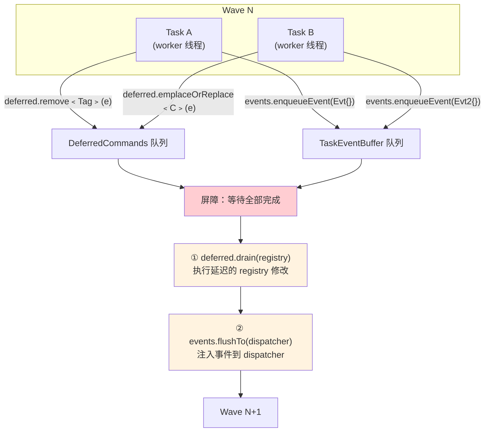
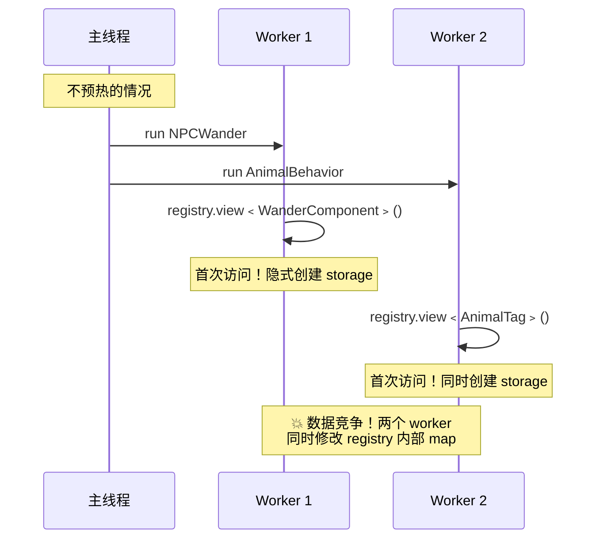
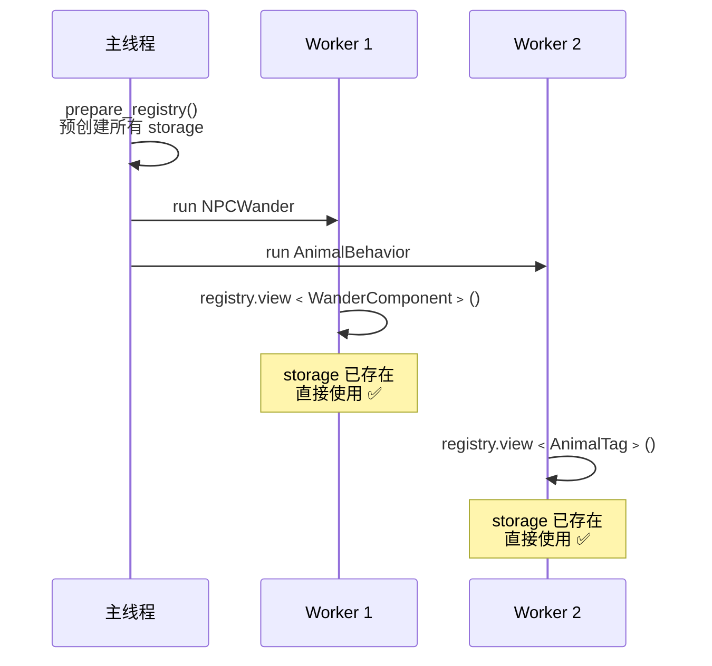
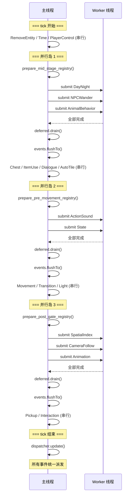
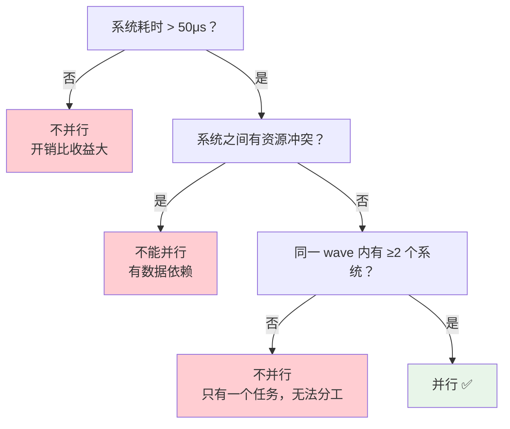
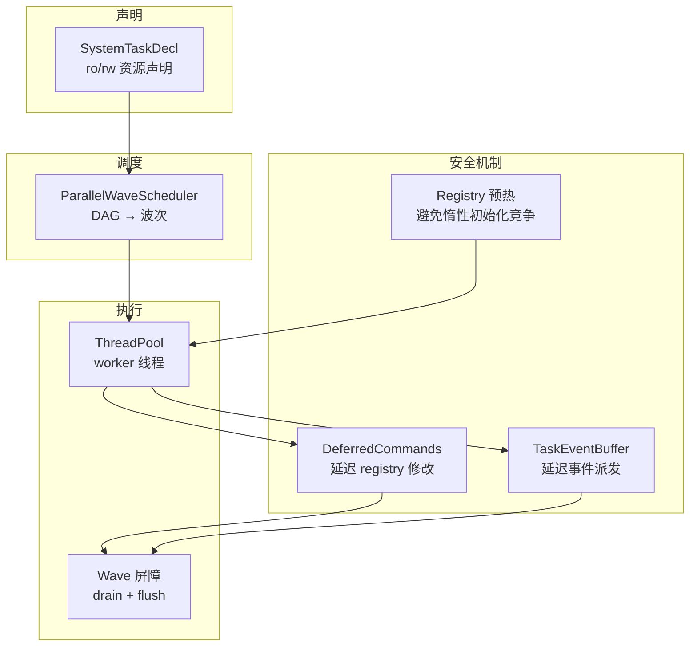

# 11 - 并发事件派发

上一章让多个 ECS 系统并行执行，但有一个问题没有解决：如果并行任务需要**发送事件**怎么办？`entt::dispatcher` 不是线程安全的——多个 worker 同时调用 `dispatcher.enqueue()` 会导致数据竞争。

本章介绍 `TaskEventBuffer`——一个线程安全的事件缓冲区，让 worker 线程安全地产生事件，主线程统一派发。

> 核心文件：`src/engine/system/task_event_buffer.h`、`src/game/runtime/system_scheduler.cpp`

---

## 问题：为什么不能直接 dispatch？

```cpp
// ❌ 危险：多个 worker 同时访问 dispatcher
void AnimationSystem::update(float dt) {
    for (auto [entity, anim] : registry.view<Animation>()) {
        anim.advance(dt);
        if (anim.finished()) {
            dispatcher.enqueue<AnimationFinishedEvent>({entity});  // 数据竞争！
        }
    }
}
```

`entt::dispatcher::enqueue()` 内部使用了 `std::vector`——非线程安全。两个 worker 同时 push 会导致 vector 内部状态损坏。

此外，即使加锁保护 `enqueue()`，还有一个语义问题：如果一个系统在 Wave 中间派发事件，另一个正在运行的系统可能看到不一致的状态。

---

## 解决方案：`TaskEventBuffer`

> `src/engine/system/task_event_buffer.h`

```cpp
class TaskEventBuffer final {
public:
    using Command = std::function<void(entt::dispatcher&)>;

    template <typename Event>
    void enqueueEvent(Event event) {
        enqueueCommand([captured = std::move(event)](entt::dispatcher& dispatcher) mutable {
            using EventType = std::decay_t<Event>;
            dispatcher.enqueue<EventType>(std::move(captured));
        });
    }

    void flushTo(entt::dispatcher& dispatcher);

    [[nodiscard]] bool empty() const;

private:
    mutable std::mutex mutex_{};
    std::vector<Command> commands_{};
};
```

### 设计思路

`TaskEventBuffer` 和 `DeferredCommands` 的结构几乎一样——都是「**线程安全的命令队列 + 主线程 flush**」模式：

| | DeferredCommands | TaskEventBuffer |
|---|---|---|
| 命令类型 | `std::function<void(registry&)>` | `std::function<void(dispatcher&)>` |
| Worker 调用 | `deferred.remove<Tag>(entity)` | `events.enqueueEvent(MyEvent{...})` |
| 主线程执行 | `deferred.drain(registry)` | `events.flushTo(dispatcher)` |
| 保护机制 | `std::mutex` | `std::mutex` |

### `enqueueEvent` 的类型擦除

```cpp
template <typename Event>
void enqueueEvent(Event event) {
    enqueueCommand([captured = std::move(event)](entt::dispatcher& dispatcher) mutable {
        using EventType = std::decay_t<Event>;
        dispatcher.enqueue<EventType>(std::move(captured));
    });
}
```

这个模板方法把任意事件类型包装成 `std::function<void(dispatcher&)>`，实现**类型擦除**——缓冲区不需要知道事件的具体类型，只存储「怎么派发」的操作。

### `flushTo` 实现

```cpp
void TaskEventBuffer::flushTo(entt::dispatcher& dispatcher) {
    std::vector<Command> commands;
    {
        std::lock_guard lock(mutex_);
        commands.swap(commands_);   // 原子取走
    }

    for (auto& command : commands) {
        command(dispatcher);        // 逐个注入到 dispatcher
    }
}
```

和 `DeferredCommands::drain()` 一样的两阶段模式——加锁 swap 取走，解锁后执行。

---

## Wave 中的执行顺序

上一章的 Wave 执行流程现在完整了：



**顺序很重要**：先 drain deferred（修改 registry），再 flush events（注入 dispatcher）。这样事件处理器在帧末收到事件时，registry 已经处于正确状态。

### 帧级事件时序

```
每一帧的完整流程：

tick() {
    for each wave:
        1. 所有任务运行（并行或串行）
        2. deferred.drain(registry)     ← 结构变更
        3. events.flushTo(dispatcher)   ← 事件入队
}

// tick 结束后
dispatcher.update()    ← 所有入队事件统一派发到监听器
```

`dispatcher.update()` 在帧末统一调用，所有事件一起派发。这保证了：
- 不会有**事件级联**（一个事件触发另一个系统立即执行）
- 事件处理器看到的是**帧末的最终状态**
- 行为是确定性的——和串行执行时一样

---

## 实战：带事件的并行系统

### ActionSoundSystem

> `src/game/runtime/system_scheduler.cpp`

```cpp
SystemTaskDecl{
    .name = "ActionSound",
    .policy = ExecutionPolicy::WorkerEligible,
    .run = [this](DeferredCommands&, TaskEventBuffer& task_events) {
        systems->action_sound_system->update(delta_time, task_events);
    },
    .ro_resources = {
        entt::type_hash<StateComponent>::value(),
        entt::type_hash<AudioComponent>::value(),
        entt::type_hash<TransformComponent>::value(),
        entt::type_hash<NeedRemoveTag>::value()
    },
    .rw_resources = {
        entt::type_hash<ActionSoundComponent>::value()
    }
};
```

系统内部：
```cpp
void ActionSoundSystem::update(float dt, TaskEventBuffer& task_events) {
    for (auto [entity, sound, state] : registry.view<ActionSoundComponent, StateComponent>()) {
        if (shouldPlaySound(sound, state)) {
            // ❌ dispatcher.enqueue<SoundPlayEvent>({...});  // 不安全
            // ✅ 使用 TaskEventBuffer
            task_events.enqueueEvent(SoundPlayEvent{sound.sound_id, entity});
        }
    }
}
```

### StateSystem

```cpp
SystemTaskDecl{
    .name = "State",
    .policy = ExecutionPolicy::WorkerEligible,
    .run = [this](DeferredCommands& deferred, TaskEventBuffer& task_events) {
        systems->state_system->update(deferred, task_events);
    },
    // ...
};
```

State 系统同时使用了 `DeferredCommands` 和 `TaskEventBuffer`——它需要移除标签组件（deferred），也需要发送动画播放事件（events）。

### AnimationSystem

```cpp
SystemTaskDecl{
    .name = "Animation",
    .policy = ExecutionPolicy::WorkerEligible,
    .run = [this](DeferredCommands&, TaskEventBuffer& task_events) {
        systems->animation_system->update(delta_time, task_events);
    },
    .rw_resources = {
        entt::type_hash<AnimationComponent>::value(),
        entt::type_hash<SpriteComponent>::value()
    }
};
```

这三个系统形成了一个事件链：
```
ActionSound → SoundPlayEvent
State       → PlayAnimationEvent
Animation   → AnimationFinishedEvent
```

但因为所有事件都在帧末统一派发，不会出现级联——和串行执行时的行为完全一致。

---

## Registry 预热

> `src/game/runtime/system_scheduler.cpp`

在并行岛执行前，主线程需要**预热 registry 的 storage**：

```cpp
void prepare_mid_stage_parallel_island_registry(entt::registry& registry) {
    // EnTT registry 的 storage 是惰性初始化；并发前主线程预热，避免 worker 触发隐式创建。
    (void)registry.storage<NPCTag>();
    (void)registry.storage<AnimalTag>();
    (void)registry.storage<WanderComponent>();
    (void)registry.storage<SleepRoutine>();
    (void)registry.storage<DialogueComponent>();
    (void)registry.storage<AnimalBehaviorState>();
    (void)registry.storage<ActorComponent>();
    (void)registry.storage<StateComponent>();
    (void)registry.storage<StateDirtyTag>();
    (void)registry.storage<TransformComponent>();
    (void)registry.storage<VelocityComponent>();
}
```

### 为什么需要预热？

`entt::registry` 的组件存储是**惰性初始化**的——第一次访问某个组件类型时才创建其 storage 对象。创建过程需要修改 registry 的内部状态（一个 map），不是线程安全的。



预热后：



**规则**：每个并行岛执行前，主线程预热该岛所有任务可能访问的组件类型。`(void)` 强制触发 storage 创建但丢弃返回值。

---

## 完整时序示例

一帧中三个并行岛的执行：



---

## 性能权衡

并行不是免费的。每个并行岛有固定开销：

| 开销来源 | 近似值 |
|----------|--------|
| 线程池任务提交 | ~1-5μs |
| future 创建与等待 | ~1-3μs |
| mutex 加锁（deferred/events） | ~0.1-1μs per call |
| Wave 屏障同步 | ~1-5μs |

如果并行任务本身只需要 10μs，这些开销就占了 30-50%——得不偿失。

**什么时候值得并行？**



本项目的实测数据（2000-tick 跑分）：
- 并行框架开销约 ~22μs/tick
- 在 60fps（16.67ms/帧）下占比约 0.14%
- 当实体数量增长、系统计算变重时，并行收益会超过开销

---

## 设计模式总结

本章和上一章共同构建了一套**安全并行 ECS 执行框架**：



| 原则 | 实现方式 |
|------|----------|
| **不共享可变状态** | 各系统操作不同的 resource domain |
| **延迟写入** | DeferredCommands + TaskEventBuffer |
| **自动依赖分析** | entt::flow 从声明推导 DAG |
| **安全降级** | scheduler.valid() 检查 → 降级串行 |
| **惰性初始化保护** | 主线程预热 storage |

---

## 本章要点

| 概念 | 说明 |
|------|------|
| TaskEventBuffer | 线程安全的事件缓冲区，worker 写入，主线程 flush |
| 类型擦除 | 任意事件类型包装为 `std::function<void(dispatcher&)>` |
| 执行顺序 | tasks → drain deferred → flush events → 下一 wave |
| Registry 预热 | 主线程预创建 storage，避免 worker 触发惰性初始化 |
| 帧末统一派发 | `dispatcher.update()` 在 tick 结束后调用，保证确定性 |

## 回顾

恭喜！到此你已经学习了本项目多线程改造的所有核心内容：

- **01-05**：线程基础设施（线程、锁、队列、线程池、主线程命令队列）
- **06-08**：异步管线实战（地图预加载、线程安全实践、架构选择）
- **09**：后台存档 I/O（一次性 jthread、原子写盘）
- **10-11**：ECS 并行调度（声明式依赖、延迟命令、事件缓冲、并行岛）

从基础设施到 IO 异步化，再到计算并行化——这是一条从简单到复杂、从低风险到高收益的渐进式改造路线。
