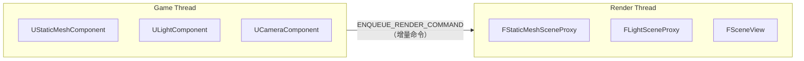
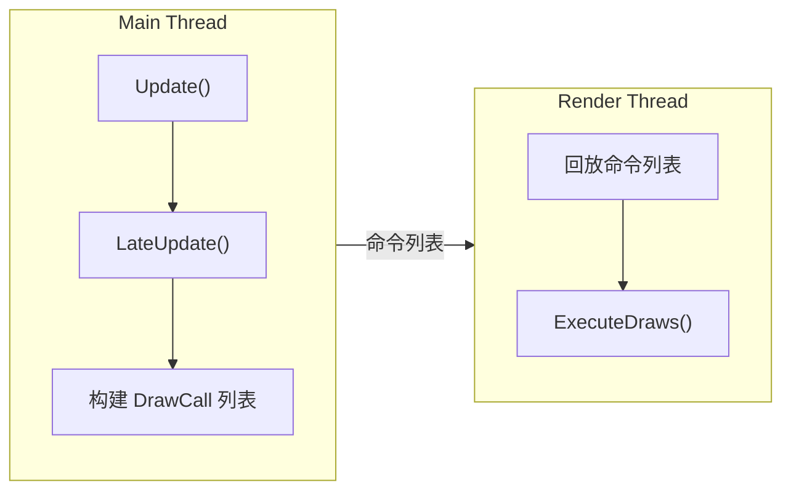
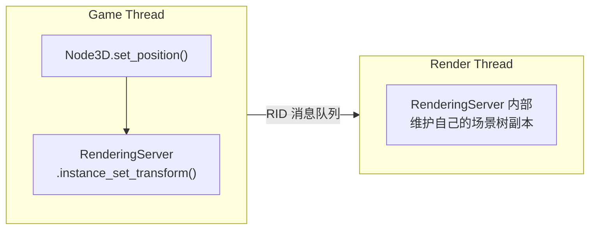
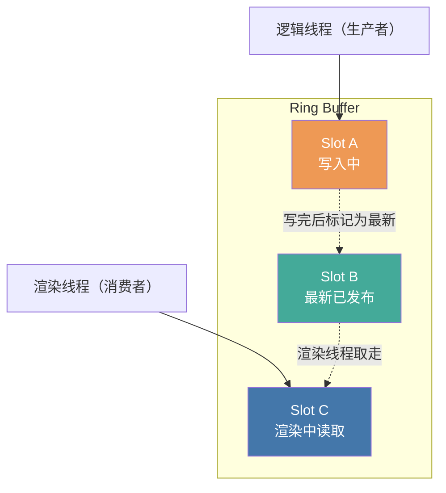
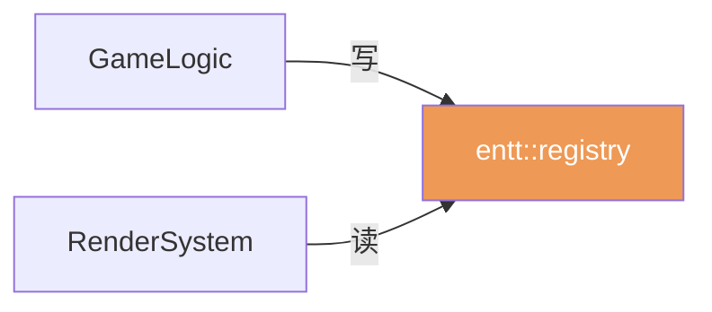
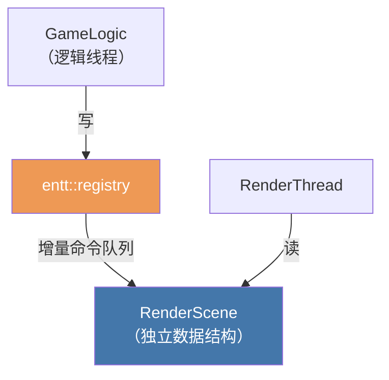

# 12 - 逻辑/渲染线程分离：大引擎怎么做，我们为什么不做

前面的章节把 IO 搬到了后台（Phase 1-4），把 ECS 系统拆成了并行波次（Phase 5-5.5）。到这里，一个自然的问题浮现：**能不能把逻辑和渲染也拆到两个线程上？** 毕竟"成熟的游戏引擎都是这么做的"。

本章深入分析这个问题——先看大引擎实际怎么做，再看我们的架构为什么不需要（也不适合）这么做。

> 对应计划：`plans/archive/multi-thread/phase6-logic-render-split-deferred-plan.md`（状态：Deferred）

---

## 大引擎是怎么拆分的？

先纠正一个常见误解：Unity/Unreal/Godot **不是**给渲染线程拍一份完整的游戏状态快照。它们的做法更精巧——**让渲染线程拥有自己的平行数据世界**。

### Unreal：SceneProxy 代理模型



- 游戏线程的每个可渲染对象在渲染侧有一个**代理**（SceneProxy）
- 游戏线程通过 `ENQUEUE_RENDER_COMMAND` 宏向渲染线程推送增量更新
- 渲染线程永远不访问游戏线程的数据结构
- **延迟：1 帧**（开启 RHI Thread 可达 2 帧）

### Unity：渲染命令缓冲区



- 主线程在 `Update/LateUpdate` 后构建一组渲染命令（draw call 列表）
- 渲染线程负责回放这些命令
- **延迟：1 帧**

### Godot 4：Server 架构



- `RenderingServer` 是独立"服务器"，游戏侧通过 RID（资源 ID）发送增量消息
- 渲染线程只操作自己维护的内部状态
- **延迟：1 帧**

### 共同模式

三个引擎的共同点是：

| 特征 | 说明 |
|------|------|
| **渲染侧拥有独立数据** | 代理对象 / 命令缓冲区 / Server 内部状态 |
| **增量同步** | 不拷贝完整状态，只推送变更 |
| **单向数据流** | 游戏 → 渲染，渲染线程不回写游戏状态 |
| **额外延迟** | 普遍 1 帧（16.7ms @ 60Hz） |

注意：**没有一个引擎是"给渲染线程拍一份完整快照"。** 它们都有一套渲染侧的专属数据结构来避免全量拷贝。

---

## 什么是"三缓冲"？

"三缓冲"在不同上下文里含义完全不同，需要区分清楚。

### GPU 显示缓冲（你可能更熟悉的）

这是 GPU 层面的帧缓冲交换策略，解决画面撕裂和 GPU 空转问题：


- **单缓冲**：直接往屏幕写 → 撕裂
- **双缓冲**：front + back，画完 swap → 无撕裂，但 GPU 可能等 VSync 空转
- **三缓冲**：多一个 spare，GPU 画完立刻写 spare → 更高吞吐

这是 SDL 的 `SDL_GL_SetSwapInterval` 和 `renderer->present()` 处理的层次。

### 游戏状态三缓冲（Phase 6 讨论的）

这是完全不同的概念——在逻辑线程和渲染线程之间做**游戏状态**的传递：



- **双缓冲**：逻辑写完 → 发布 → 渲染读。如果逻辑比渲染快，必须等渲染读完 → 互斥阻塞
- **三缓冲**：三个槽位轮转。逻辑写完 A 后立刻标记为最新、去写 B，不管渲染是否还在读 C → 生产者和消费者几乎不互斥

Phase 6 计划中提到的"RenderSnapshot 三缓冲"指的是这个——一个 lock-free ring buffer with 3 slots，用来在逻辑线程和渲染线程之间传递状态快照。

**大引擎不需要这个，因为它们有渲染代理层做增量同步。** 只有像我们这样"渲染直读 registry"的架构，如果强行拆线程，才需要整体快照 + 三缓冲。

---

## 我们的渲染路径现状

来看我们的渲染是怎么访问数据的：

```cpp
// src/game/scene/game_scene.cpp
void GameScene::render(float interpolation_alpha) {
    // 渲染管线——每个系统直接查询 registry
    systems_->ysort_system->render(registry_, clamped_alpha);
    systems_->render_system->render(registry_, renderer, camera, clamped_alpha);
    systems_->light_system->render(registry_, renderer, clamped_alpha);
    systems_->render_target_system->render(renderer);
}
```

```cpp
// src/engine/system/render_system.cpp
void RenderSystem::render(entt::registry& registry, ...) {
    auto view = registry.view<RenderComponent, TransformComponent, SpriteComponent>(
        entt::exclude<InvisibleTag>);

    for (auto entity : view) {
        const auto& transform = view.get<TransformComponent>(entity);
        // 直接从 registry 读取 position 做插值
        const glm::vec2 render_position =
            glm::mix(transform.previous_position_, transform.position_, alpha);
        renderer.drawSprite(...);
    }
}
```

关键事实：**渲染系统直接查询 `entt::registry`**。这意味着：

- 渲染的数据源 = 游戏逻辑的数据源（同一个 registry）
- 没有渲染侧独立的数据所有权
- 如果要拆线程，逻辑线程写 registry 的同时渲染线程读 registry → **entt 不允许**

---

## 如果要做，需要什么？

要优雅地支持拆分，需要引入一个**渲染侧独立数据层**，类似 Godot 的 Server 模式：

**当前架构**（单线程，安全）：



**拆分友好架构**（需要渲染代理层）：



具体来说：

1. **RenderScene**：渲染线程自己维护一组 sprite 描述、light 参数、camera 状态，不依赖 `entt::registry`
2. **增量同步**：逻辑线程在每帧末尾生成命令（`AddSprite`、`UpdateTransform`、`RemoveEntity`），推入线程安全队列
3. **渲染线程**：每帧开头 drain 命令队列，更新自己的 RenderScene，然后执行渲染

这样就不需要"整体快照 + 三缓冲"——因为渲染线程拥有自己的数据，只接收增量更新。

但这等价于**重写整个渲染管线**。

---

## 为什么不做

| 因素 | 分析 |
|------|------|
| **渲染负载** | 2D 农场 RPG，几百个 sprite + 简单光照，单帧渲染 < 2ms |
| **瓶颈所在** | Phase 5/5.5 已解决 CPU 逻辑并行，渲染从未成为瓶颈 |
| **实施成本** | 引入渲染代理层 = 重写渲染管线，工作量巨大 |
| **额外延迟** | 必然引入 1 帧输入→显示延迟（~16.7ms） |
| **调试复杂度** | 跨线程时序、竞态条件、状态不一致难以定位 |
| **收益** | 几乎为零——渲染时间远未占满帧预算 |

Phase 6 计划标注"Deferred / 不推荐"是完全正确的判断。只有当 profiling 明确指向渲染瓶颈时才需要重新评估。

---

## 总结

| | 拍完整快照 + 三缓冲<br/>（Phase 6 计划描述的） | 渲染代理层 + 增量同步<br/>（大引擎实际做的） |
|---|---|---|
| **内存开销** | 高（全量拷贝） | 低（只存渲染相关字段） |
| **同步开销** | 每帧全量快照 | 增量命令 |
| **实现复杂度** | 中等 | 非常高（等于重写渲染管线） |
| **额外延迟** | 1 帧 | 1 帧 |
| **适用场景** | 紧急优化、临时方案 | 长期架构、3A 引擎 |

对 TinyFarmRPG 来说，**不需要拆分逻辑/渲染线程**。当前的单线程循环（固定逻辑帧 + 插值渲染）已经足够——下一章将深入分析 entt 的多线程能力边界，帮助你理解 Phase 5 的设计为什么是安全的。

---

## 延伸阅读

- `plans/archive/multi-thread/phase6-logic-render-split-deferred-plan.md` — Phase 6 完整计划
- `src/game/scene/game_scene.cpp` — 当前渲染路径
- `src/engine/system/render_system.cpp` — RenderSystem 直接查询 registry 的实现
