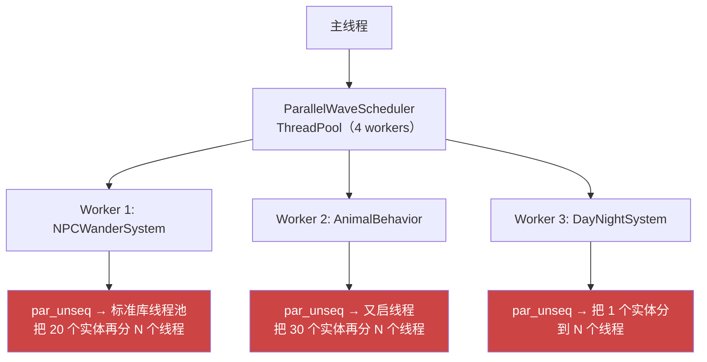
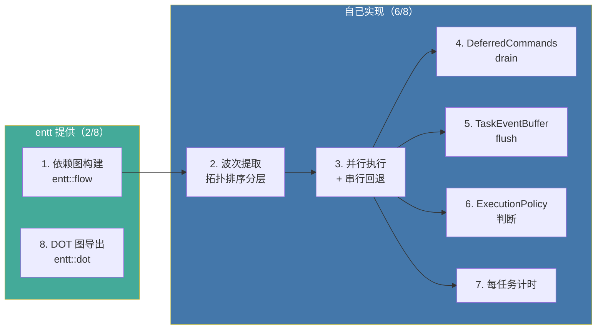
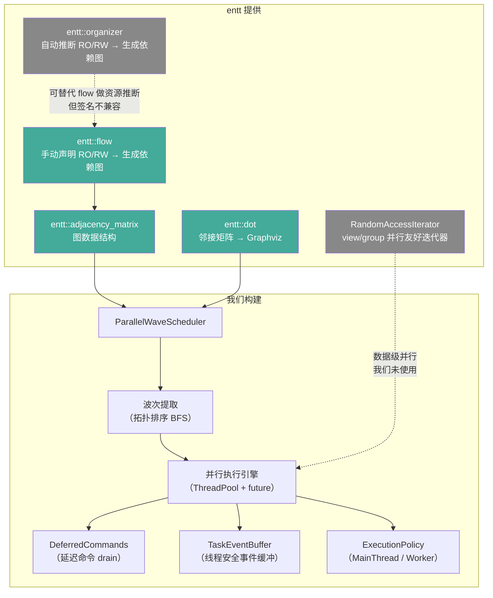

# 13 - entt 的多线程能力与 ParallelWaveScheduler 的定位

第 10 章介绍了 `ParallelWaveScheduler` 如何把 ECS 系统拆成并行波次。但 entt 本身也有多线程相关的文档和工具——我们是不是"重复造轮子"了？本章梳理 entt 实际提供了什么、我们在它之上构建了什么、以及两者之间的边界。

> 核心文件：`src/engine/system/parallel_wave_scheduler.cpp`、`external/entt-3.16.0/docs/md/entity.md`（Multithreading 章节）

---

## entt 的多线程支持：三个层次

entt 不提供"开箱即用的多线程 ECS"。它提供的是**安全保证 + 基础工具**，执行策略由用户实现。

### 层次一：安全保证——不同 storage 可跨线程访问

这是 entt 文档中最重要的声明：

> As long as a thread iterates the entities that have the component `X` or assign and removes that component from a set of entities, another thread can safely do the same with components `Y` and `Z` and everything work like just fine.

翻译成规则：

| | Thread A | Thread B | 安全？ |
|---|---|---|---|
| 不同组件池 | 读写 Position | 读写 Velocity | **安全** |
| 只读共享 | 只读 Position | 只读 Position | **安全** |
| 同池读写并发 | 写 Position | 读 Position | **不安全** |
| 结构性变更 | 创建实体 | 遍历实体 | **不安全** |

**这就是 Phase 5 整个并行调度的理论基础。** `ParallelWaveScheduler` 保证同一个 Wave 内的任务不会同时读写同一个组件类型，从而满足这条规则。

### 层次二：并行友好的迭代器

entt 的 view/group 迭代器满足 `RandomAccessIterator`，可以直接配合标准库并行算法：

```cpp
auto view = registry.view<Position, const Velocity>();

// 同一个 view 的实体，切分到多个线程处理
std::for_each(std::execution::par_unseq,
    view.begin(), view.end(),
    [&view](auto entity) {
        auto& pos = view.get<Position>(entity);
        const auto& vel = view.get<const Velocity>(entity);
        pos.x += vel.dx;
    });
```

这是**数据级并行**——把同一组件类型的大量实体拆分到多个线程处理。

适用场景非常窄：

| 条件 | 适合 | 不适合 |
|------|------|--------|
| 实体数量 | 数千~数万（粒子系统） | 几十~几百（NPC/动物） |
| 每实体计算 | 纯算术，无分支 | 含状态机、查表、分支 |
| 调用位置 | 主线程或独立线程 | 已在 worker 线程中（见下文） |

#### 为什么不要在 worker 线程内使用 par_unseq

`std::execution::par_unseq` 做两件事：

| 部分 | 含义 |
|------|------|
| `par` | 把迭代范围分发到**标准库内部的线程池** |
| `unseq` | 允许 SIMD 向量化 + 乱序执行 |

如果在 `ParallelWaveScheduler` 的 worker 线程内部再用 `par_unseq`，就产生了**嵌套并行**：



问题：
- **线程超额订阅**：你的 ThreadPool + 标准库的线程池 = 远超 CPU 核心数 → 上下文切换暴增
- **两套线程池互相抢 CPU**：你的 ThreadPool 和 libdispatch（macOS）互不感知
- **实体数太少**：2D 农场 RPG 每个系统处理几十个实体，分发开销远大于收益

**结论**：我们的项目只需要任务级并行（不同系统跑在不同线程），不需要数据级并行（同一系统的实体再拆线程）。

### 层次三：entt::organizer——依赖图构建工具

`entt::organizer` 能从函数签名自动推断 RO/RW 资源依赖，生成任务 DAG：

```cpp
entt::organizer organizer;

// organizer 自动分析：Position → RW，const Velocity → RO
organizer.emplace<&movement_system>();

// 自动分析：const Position → RO，Renderable → RW
organizer.emplace<&render_prep_system>();

auto graph = organizer.graph();
// graph 是邻接表，每个 vertex 包含：
//   callback    — 要执行的函数
//   children    — 可达的下游节点
//   top_level   — 是否无入边（可立即执行）
//   ro_count    — 只读资源数
//   rw_count    — 读写资源数
```

**关键限制**：organizer **只生成图，不负责执行**。调度策略、线程池分发、同步屏障全部由用户实现。

---

## 我们的 ParallelWaveScheduler 用了什么

来看 `buildGraph()` 的实现：

```cpp
// src/engine/system/parallel_wave_scheduler.cpp
void ParallelWaveScheduler::buildGraph() {
    entt::flow builder;          // ← entt 的资源依赖图构建器
    for (std::size_t index = 0; index < tasks_.size(); ++index) {
        builder.bind(static_cast<entt::id_type>(index));
        builder.ro(tasks_[index].ro_resources.begin(),
                   tasks_[index].ro_resources.end());
        builder.rw(tasks_[index].rw_resources.begin(),
                   tasks_[index].rw_resources.end());
        if (tasks_[index].sync_point) {
            builder.sync();
        }
    }
    matrix_ = builder.graph();   // ← entt 生成邻接矩阵
}
```

**我们已经在用 entt 的图构建基础设施**——`entt::flow` 正是 entt 提供的资源依赖分析工具。DOT 图导出也用了 `entt::dot`。

---

## organizer vs flow：为什么我们用 flow

| | `entt::flow`（我们在用的） | `entt::organizer` |
|---|---|---|
| 资源声明 | **手动**：`builder.ro(...)` / `builder.rw(...)` | **自动**：从函数参数类型推断 |
| 函数签名要求 | 无要求 | 必须接受 `registry&` 或 `basic_view<...>` |
| 输出 | 邻接矩阵 | 邻接表 + callback |
| 执行调度 | **不提供** | **不提供** |

核心问题在于函数签名。我们的任务签名是：

```cpp
// src/engine/system/system_task_decl.h
struct SystemTaskDecl {
    std::string name{};
    ExecutionPolicy policy{ExecutionPolicy::MainThreadOnly};
    std::function<void(DeferredCommands&, TaskEventBuffer&)> run{};  // ← 这个签名
    std::vector<entt::id_type> ro_resources{};
    std::vector<entt::id_type> rw_resources{};
    bool sync_point{false};
};
```

任务函数接收 `DeferredCommands&` 和 `TaskEventBuffer&`——organizer 无法透视这个签名，不知道任务内部访问了哪些组件。要用 organizer，必须把所有系统改成 organizer 能识别的签名：

```cpp
// organizer 能识别的：
void npc_wander_tick(entt::basic_view<
    entt::get_t<NPCWanderComponent, const GameTime>> view) {
    // 但 DeferredCommands 和 TaskEventBuffer 怎么传入？
    // organizer 没有这个机制。
}
```

即使改了签名，我们还是得自己实现：波次提取、线程池调度、DeferredCommands drain、TaskEventBuffer flush、ExecutionPolicy 判断、计时统计。这些都不是 organizer 提供的。

---

## 职责分解：谁做了什么



如果换用 organizer，最多省掉手动声明 `ro_resources` / `rw_resources` 的步骤，但 2-7 全部还得自己写。这不叫"重复造轮子"——entt 只提供了轮子的毛坯，我们在上面装了轮胎、轮轴和刹车。

---

## 与 entt::organizer 的关系图



实线 = 实际使用的依赖关系。虚线 = 存在但未采用的替代路径。

---

## 总结

| 问题 | 答案 |
|------|------|
| entt 的多线程支持是什么？ | 安全保证 + 基础工具（flow / organizer / 并行迭代器），不含执行引擎 |
| 我们重复造轮子了吗？ | 没有。依赖图构建已复用 `entt::flow`，其余 6 项职责 entt 不提供 |
| 能用 organizer 替代吗？ | 不能。签名不兼容，且 organizer 也不提供执行调度 |
| par_unseq 在 worker 内有用吗？ | 对我们的实体规模：负优化（嵌套并行 + 调度开销 > 计算） |

---

## 延伸阅读

- `external/entt-3.16.0/docs/md/entity.md` — entt 官方文档（Multithreading / Organizer 章节）
- `src/engine/system/parallel_wave_scheduler.cpp` — 完整实现
- `src/engine/system/system_task_decl.h` — 任务声明结构
- [10 - ECS 并行调度](10-ecs-parallel-scheduling.md) — ParallelWaveScheduler 设计详解
- [11 - 并发事件派发](11-concurrent-event-dispatch.md) — TaskEventBuffer 设计详解
