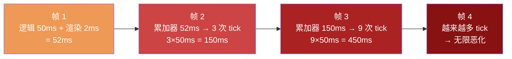
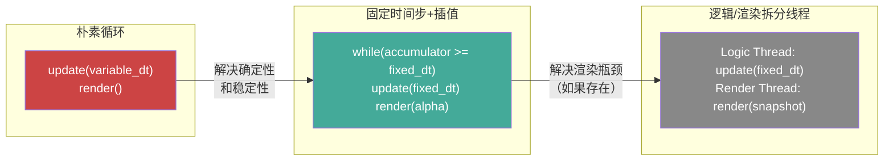
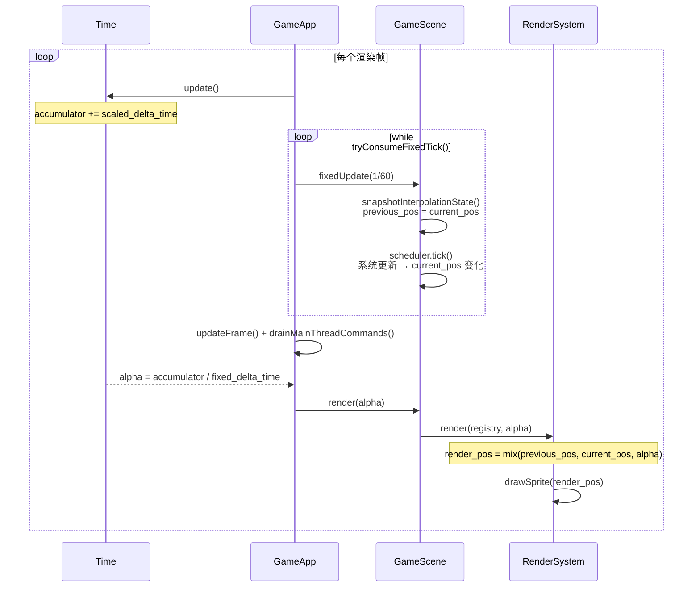

# 14 - 固定时间步与游戏循环：逻辑和渲染如何在同一线程上不同速率运行

上一章解释了为什么不需要拆分逻辑/渲染线程。但这引出一个基础问题：**如果逻辑和渲染都在主线程上，它们的更新速率怎么能不同？** 本章深入分析我们的游戏循环模型——固定时间步 + 插值渲染，这是游戏开发中最重要的模式之一。

> 核心文件：`src/engine/core/game_app.cpp`、`src/engine/core/time.h`、`src/engine/core/time.cpp`

---

## 问题：为什么逻辑不能跟着渲染跑

最直觉的游戏循环：

```cpp
// ❌ 朴素循环——逻辑帧率 = 渲染帧率
while (running) {
    float dt = getFrameDeltaTime();  // 每帧不同：16ms、17ms、33ms...
    update(dt);                       // 逻辑用可变时间步
    render();
}
```

看起来简单，但它有严重缺陷：

### 缺陷一：非确定性

同一段代码在 60fps 和 144fps 下行为不同。考虑一个简单的速度积分：

```cpp
// 每帧执行
position += velocity * dt;
```

60fps 时 `dt = 16.67ms`，执行 60 次/秒。144fps 时 `dt = 6.94ms`，执行 144 次/秒。由于浮点累积误差，1 秒后的 position 值**不完全相同**。

对于精确的物理模拟（跳跃弧线、碰撞检测），这种微小差异会逐渐放大——同一次跳跃在不同帧率下落点不同。

### 缺陷二：不稳定

如果某帧卡了 200ms（后台 GC、磁盘 IO、窗口拖拽）：

```
dt = 0.2 秒  →  position += velocity * 0.2  →  角色瞬移！
```

大的 dt 导致穿墙（tunneling）、弹射、数值爆炸。物理引擎依赖小步长来保证稳定性——0.2 秒的步长对碰撞检测来说是灾难。

### 缺陷三：帧率依赖

经典反面教材：早期《黑暗之魂》PC 版锁 30fps 逻辑，解锁到 60fps 后武器耐久消耗翻倍、跳跃距离变短——就是因为物理和帧率耦合。

---

## 解决方案：固定时间步 + 累加器

我们的 `GameApp::run()` 采用的是 Glenn Fiedler 的经典模型 "Fix Your Timestep!"：

```cpp
// src/engine/core/game_app.cpp（简化）
while (is_running_) {
    handleEvents();                               // 1. 采样输入
    time_->update();                              // 2. accumulator += 本帧流逝时间

    while (time_->tryConsumeFixedTick()) {        // 3. 固定逻辑循环（0~5 次）
        input_manager_->dispatchActionCallbacks();
        update(fixed_delta_time);                 //    每次恒定 1/60 秒
    }

    updateFrame(time_->getUnscaledDeltaTime());   // 4. 帧更新（UI 等）
    drainMainThreadCommands();                    // 5. 执行延迟命令

    render(time_->getInterpolationAlpha());       // 6. 渲染（恰好 1 次）
    dispatcher_->update();                        // 7. 帧末事件结算
}
```

核心思想：**外层循环频率由显示器决定（渲染速率），内层循环次数由累加器自动调节（逻辑速率）。**

### 累加器工作原理

```cpp
// src/engine/core/time.cpp
void Time::update() {
    // ... 计算本帧时间差 ...
    accumulator_ += scaled_delta_time_;     // 累加实际流逝时间
    fixed_ticks_this_frame_ = 0;
}

bool Time::tryConsumeFixedTick() {
    if (fixed_ticks_this_frame_ >= max_ticks_per_frame_) {
        clamp_excess_backlog();             // 防止死亡螺旋
        return false;
    }
    if (accumulator_ < fixed_delta_time_) {
        return false;                       // 时间不够，不 tick
    }
    accumulator_ -= fixed_delta_time_;      // 消费一个 tick 的时间
    ++fixed_ticks_this_frame_;
    return true;
}
```

每次外层循环：累加器增加本帧实际流逝时间。然后内层循环不断消费累加器，每次消费恒定的 `1/60 秒`，直到累加器不足一个 tick。

---

## 不同帧率下的行为

### 显示器 60Hz，逻辑 60Hz（完美同步）

```
时间(ms)  0     16.7   33.3   50.0
          │      │      │      │
渲染帧    R0     R1     R2     R3
逻辑tick  T0     T1     T2     T3
          ↑      ↑      ↑      ↑
        每帧恰好 1 次 tick
```

累加器每帧增加 ~16.7ms，恰好消费一次（16.7ms）。

### 显示器 144Hz，逻辑 60Hz（渲染比逻辑快）

```
时间(ms)  0    6.9   13.9  16.7  20.8  27.8  33.3  34.7
          │     │      │     │     │      │     │     │
渲染帧    R0    R1     R2    ·     R3     R4    ·     R5
逻辑tick  T0    ·      ·    T1     ·      ·    T2     ·
```

- R1：累加器 = 6.9ms < 16.7ms → 0 次 tick → 用 alpha=0.41 插值渲染
- R2：累加器 = 13.9ms < 16.7ms → 0 次 tick → 用 alpha=0.83 插值渲染
- R3：累加器 = 20.8ms ≥ 16.7ms → 1 次 tick → 累加器 = 4.1ms → 渲染

有些渲染帧没有新的逻辑 tick，但**插值让视觉完全流畅**。

### 显示器 30Hz，逻辑 60Hz（渲染比逻辑慢）

```
时间(ms)  0          33.3         66.7
          │           │            │
渲染帧    R0          R1           R2
逻辑tick  T0         T1,T2       T3,T4
          ↑           ↑            ↑
        1 次 tick   2 次 tick    2 次 tick
```

累加器每帧增加 ~33.3ms，消费两次（16.7ms × 2）。逻辑追赶渲染。

### 卡顿（200ms spike）

```
时间(ms)  0    16.7  ...  216.7
          │     │          │
渲染帧    R0    R1         R2
逻辑tick  T0    T1      T2,T3,T4,T5,T6 (最多5次, 剩余丢弃)
```

累加器 = 200ms → 理论需要 12 次 tick → 只执行 5 次（`max_ticks_per_frame_`） → 多余时间丢弃 → 防止死亡螺旋。

---

## 插值：让渲染比逻辑更平滑

渲染帧之间可能没有新的逻辑 tick，但我们不希望画面"卡在"上一个 tick 的位置。插值解决这个问题：

```cpp
// src/engine/core/time.cpp
float Time::getInterpolationAlpha() const {
    return static_cast<float>(accumulator_ / fixed_delta_time_);
    // 范围 [0, 1]：0 = 刚 tick 完，1 = 即将 tick
}
```

```cpp
// src/engine/system/render_system.cpp
void RenderSystem::render(entt::registry& registry, ..., float alpha) {
    for (auto entity : view) {
        const auto& transform = view.get<TransformComponent>(entity);
        // 在上一次 tick 位置和当前 tick 位置之间插值
        const glm::vec2 render_position =
            glm::mix(transform.previous_position_, transform.position_, alpha);
        renderer.drawSprite(sprite, render_position, ...);
    }
}
```

快照时机：

```cpp
// src/game/scene/game_scene.cpp
void GameScene::fixedUpdate(float dt) {
    snapshotInterpolationState();   // ← 在 tick 之前保存 previous_position
    scheduler_->tick(dt, ...);       // ← 逻辑更新（修改 position）
}

void GameScene::snapshotInterpolationState() {
    auto view = registry_.view<TransformComponent>();
    for (auto entity : view) {
        auto& transform = view.get<TransformComponent>(entity);
        transform.previous_position_ = transform.position_;  // 保存"上一帧位置"
    }
    previous_camera_position_ = context_.getCamera().getPosition();
}
```

效果：即使逻辑以 60Hz 运行，渲染在 144Hz 下每帧都能算出一个平滑的中间位置，视觉上没有 60fps 的"顿挫感"。

---

## 死亡螺旋的防护

如果逻辑 tick 本身很慢（比如某帧逻辑花了 50ms），会发生什么？



这就是**死亡螺旋**（spiral of death）：每帧需要更多 tick → 每帧更慢 → 下帧需要更多 tick。

防护措施：

```cpp
// src/engine/core/time.h
Uint64 max_ticks_per_frame_ = 5;   // 每帧最多 5 次 tick
```

```cpp
// src/engine/core/time.cpp — tryConsumeFixedTick()
if (fixed_ticks_this_frame_ >= max_ticks_per_frame_) {
    // 到达上限，丢弃多余时间
    const auto dropped_ticks = static_cast<Uint64>(accumulator_ / fixed_delta_time_);
    if (dropped_ticks > 0) {
        dropped_fixed_ticks_total_ += dropped_ticks;  // 记录统计
        accumulator_ -= static_cast<double>(dropped_ticks) * fixed_delta_time_;
        catch_up_clamped_this_frame_ = true;
    }
    return false;
}
```

超过 5 次 tick 的部分直接丢弃。游戏时间会"跳过"一小段（玩家感受到短暂减速），但不会陷入死亡螺旋。

---

## 这是行业标准



| | 朴素循环 | 固定时间步+插值 | 拆分线程 |
|---|---|---|---|
| 逻辑确定性 | ✗ | ✓ | ✓ |
| 渲染流畅 | 取决于帧率 | ✓（插值） | ✓ |
| 卡顿保护 | ✗ | ✓（max ticks） | ✓ |
| 实现复杂度 | 最低 | 中等 | 最高 |
| 线程安全 | 不涉及 | 不涉及 | 需要状态同步 |

我们的做法（中间列）是**绝大多数游戏的正确选择**。Unity 的 `FixedUpdate()` + `Update()` 就是这个模型——`FixedUpdate` 是固定 tick（默认 50Hz），`Update` 每帧一次。它们也在同一线程上，靠累加器调度频率。

拆分线程（右列）解决的不是"速率解耦"（固定时间步已经解决），而是"渲染太重导致逻辑被阻塞"——对 2D 农场 RPG 不存在这个问题。

---

## 完整的数据流



---

## 常见疑问

### "0 次 tick 的帧是不是浪费了？"

不是。这些帧通过不同的 alpha 值产生不同的插值位置，提供了亚 tick 精度的平滑运动。144Hz 下只有 60 次逻辑更新，但有 144 个不同的渲染位置——这正是插值的价值。

### "丢弃 tick 会不会导致游戏逻辑出错？"

会丢失一小段游戏时间（表现为短暂减速），但不会破坏逻辑一致性。每个 tick 仍然收到恒定的 `1/60 秒`，状态转换是确定的。只是少执行了几次。对于农场 RPG 这类非竞技游戏，这种偶发的减速完全可以接受。

### "Unity 的 FixedUpdate 和我们的有什么区别？"

本质相同。Unity 默认 `Fixed Timestep = 0.02`（50Hz），`Maximum Allowed Timestep = 0.333`（相当于 max ticks ≈ 16）。我们用 60Hz + max 5 ticks，更保守但更安全。

---

## 总结

固定时间步 + 插值渲染是游戏循环的"正确答案"：

- **逻辑确定性**：每个 tick 恒定 `1/60 秒`，不受帧率影响
- **渲染流畅性**：插值 alpha 让任意刷新率都能平滑显示
- **卡顿保护**：max ticks 上限防止死亡螺旋
- **不需要多线程**：速率解耦在单线程上就能实现

这个模式与"逻辑/渲染拆分线程"解决的是**不同的问题**——前者解决速率解耦和确定性，后者解决渲染瓶颈。我们已经解决了前者，而后者对 2D 农场 RPG 不存在。

---

## 延伸阅读

- `src/engine/core/game_app.cpp` — 主循环实现
- `src/engine/core/time.h` / `time.cpp` — 时间管理与累加器
- `docs/engine/loop_timing_contract.md` — 循环时序契约文档
- `src/game/scene/game_scene.cpp` — 快照与插值
- Glenn Fiedler, ["Fix Your Timestep!"](https://gafferongames.com/post/fix_your_timestep/) — 本模式的经典出处
