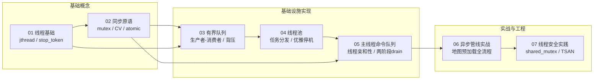

# C++ 多线程教程系列

基于 TinyFarmRPG Phase 1 多线程改造的实战教程。每篇文档结合项目真实代码讲解一个核心概念。

## 目录

| 编号 | 主题 | 核心概念 |
|------|------|----------|
| [01](01-thread-basics.md) | 线程基础 | `std::jthread`、`std::stop_token`、线程生命周期 |
| [02](02-synchronization-primitives.md) | 同步原语 | `mutex`、`condition_variable`、`atomic` |
| [03](03-bounded-queue.md) | 有界队列 | 生产者-消费者模型、背压机制、条件变量配合 |
| [04](04-thread-pool.md) | 线程池 | 任务分发、优雅停机、`std::future` |
| [05](05-main-thread-command-queue.md) | 主线程命令队列 | 跨线程提交、线程亲和性、两阶段 drain |
| [06](06-async-pipeline.md) | 异步管线实战 | 地图预加载全流程、generation 防过期、降级回退 |
| [07](07-thread-safety-practices.md) | 线程安全实践 | `shared_mutex`、线程断言、数据竞争防范 |

## 前置知识

- 熟悉 C++17 基础语法（lambda、`std::optional`、`std::string_view`）
- 了解本项目的基本结构（参见 `docs/overview.md`）

## 阅读顺序

建议按编号顺序阅读。01-02 是基础概念，03-05 是基础设施实现，06-07 是实战集成与工程实践。

## 对应源码

所有教程引用的源码均位于本项目中：

- 线程基础设施：`src/engine/async/`
- 预处理服务：`src/engine/loader/level_preprocess_service.*`、`src/engine/resource/image_decode_service.*`、`src/engine/resource/font_preprocess_service.*`
- 集成点：`src/engine/core/game_app.*`、`src/game/world/map_manager.*`
- 测试：`tests/engine/async/`、`tests/engine/loader/`、`tests/engine/resource/`、`tests/game/`
