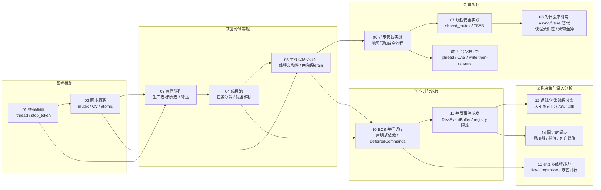

# C++ 多线程教程系列

基于 TinyFarmRPG 多线程改造（Phase 1 – 5.5）的实战教程。每篇文档结合项目真实代码讲解一个核心概念。

## 目录

| 编号 | 主题 | 核心概念 | 对应阶段 |
|------|------|----------|----------|
| [01](01-thread-basics.md) | 线程基础 | `std::jthread`、`std::stop_token`、线程生命周期 | Phase 1 |
| [02](02-synchronization-primitives.md) | 同步原语 | `mutex`、`condition_variable`、`atomic` | Phase 1 |
| [03](03-bounded-queue.md) | 有界队列 | 生产者-消费者模型、背压机制、条件变量配合 | Phase 1 |
| [04](04-thread-pool.md) | 线程池 | 任务分发、优雅停机、`std::future` | Phase 1 |
| [05](05-main-thread-command-queue.md) | 主线程命令队列 | 跨线程提交、线程亲和性、两阶段 drain | Phase 1-2 |
| [06](06-async-pipeline.md) | 异步管线实战 | 地图预加载全流程、generation 防过期、降级回退 | Phase 1-3 |
| [07](07-thread-safety-practices.md) | 线程安全实践 | `shared_mutex`、线程断言、数据竞争防范 | Phase 1 |
| [08](08-why-not-async-future.md) | 为什么不能用 async/future 替代 | 线程亲和性、跨线程提交执行、架构选择 | Phase 1 |
| [09](09-background-save-io.md) | 后台存档 I/O | `compare_exchange`、所有权转移、write-then-rename | Phase 4 |
| [10](10-ecs-parallel-scheduling.md) | ECS 并行调度 | 声明式依赖、DeferredCommands、波次调度、并行岛 | Phase 5 |
| [11](11-concurrent-event-dispatch.md) | 并发事件派发 | TaskEventBuffer、registry 预热、帧末统一派发 | Phase 5.5 |
| [12](12-logic-render-thread-split.md) | 逻辑/渲染线程分离 | 大引擎对比（Unity/Unreal/Godot）、渲染代理、三缓冲 | Phase 6 (Deferred) |
| [13](13-entt-multithreading-and-scheduler.md) | entt 多线程能力与调度器 | entt::flow/organizer、并行迭代器、嵌套并行分析 | Phase 5 深入 |
| [14](14-fixed-timestep-game-loop.md) | 固定时间步与游戏循环 | 累加器模式、插值渲染、死亡螺旋防护、Fix Your Timestep | 游戏循环 |

## 前置知识

- 熟悉 C++17 基础语法（lambda、`std::optional`、`std::string_view`）
- 了解本项目的基本结构（参见 `docs/overview.md`）

## 阅读顺序

建议按编号顺序阅读。01-02 是基础概念，03-05 是基础设施实现，06-08 是实战集成与工程实践，09 是异步 IO 应用，10-11 是 ECS 并行执行，12-14 是架构决策与深入分析。

## 对应源码

所有教程引用的源码均位于本项目中：

- 线程基础设施：`src/engine/async/`
- 预处理服务：`src/engine/loader/level_preprocess_service.*`、`src/engine/resource/image_decode_service.*`、`src/engine/resource/font_preprocess_service.*`
- 异步管线：`src/game/world/map_manager.*`、`src/game/world/async_preload_pipeline.*`
- 存档系统：`src/game/save/save_service.*`
- ECS 并行调度：`src/engine/system/parallel_wave_scheduler.*`、`src/engine/system/system_task_decl.h`、`src/engine/system/deferred_commands.*`、`src/engine/system/task_event_buffer.*`
- 系统调度器：`src/game/runtime/system_scheduler.*`
- 游戏循环与时间：`src/engine/core/game_app.*`、`src/engine/core/time.*`
- 渲染系统：`src/engine/system/render_system.*`、`src/game/scene/game_scene.*`
- 测试：`tests/engine/async/`、`tests/engine/loader/`、`tests/engine/resource/`、`tests/game/`
