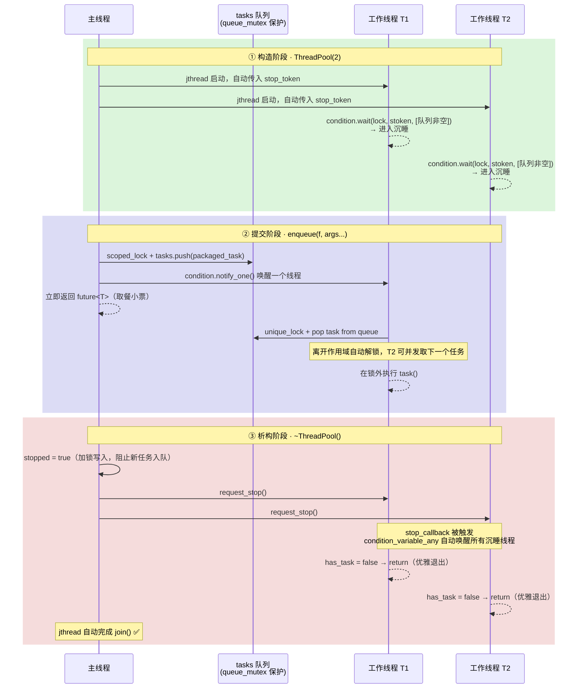

# 学习现代C++的多线程

You said

我想要学习现代C++的多线程

学习现代C++的多线程是一个非常棒且实用的决定！从C++11开始，C++标准库原生支持了多线程编程，并在C++14、C++17，特别是 **C++20** 中引入了大量现代化的并发特性，使得多线程开发更加安全和高效。

为了帮助你系统地掌握这门技术，我为你梳理了一条循序渐进的学习路线：

### 1\. 核心基础：线程的创建与管理 (<thread>)

这是并发编程的起点。你需要了解如何启动一个新线程以及如何管理它的生命周期。

- **`std::thread` (C++11)**: 学习如何传递函数、Lambda表达式以及带参数的函数给线程。
- **`join()` 与 `detach()`**: 理解阻塞主线程等待子线程结束 (`join`) 与让子线程在后台独立运行 (`detach`) 的区别及风险。
- **`std::jthread` (C++20)**: 这是现代C++极力推荐的替代品。它利用了RAII（资源获取即初始化）原则，在析构时会自动调用 `join()` ，避免了忘记 `join()` 导致的程序崩溃问题，并且原生支持线程取消机制 (`std::stop_token`)。

### 2\. 共享数据安全：互斥量与锁 (<mutex>)

当多个线程同时访问和修改同一块数据时，就会发生“数据竞争”（Data Race）。锁是解决这个问题的传统工具。

- **`std::mutex`**: 最基础的互斥锁。
- **RAII 锁管理类 (重点)**: 永远不要手动调用 `lock()` 和 `unlock()` ，而应该使用作用域锁来保证异常安全：
	- **`std::lock_guard` (C++11)**: 轻量级，构造时加锁，析构时解锁。
	- **`std::unique_lock` (C++11)**: 提供更高的灵活性，支持延迟加锁、手动解锁，以及与条件变量配合使用。
	- **`std::scoped_lock` (C++17)**: `lock_guard` 的进阶版，可以同时安全地锁定多个互斥量，完美解决死锁（Deadlock）问题。

### 3\. 线程间通信：条件变量 (<condition\_variable>)

有时线程需要等待某个特定事件发生后才能继续执行（例如经典的“生产者-消费者”模型）。

- **`std::condition_variable`**: 配合 `std::unique_lock` 使用。学习 `wait()`, `notify_one()`, 和 `notify_all()` 方法。
- 理解“虚假唤醒”（Spurious Wakeup）现象，并学会在 `wait()` 中传入Lambda表达式作为判断条件来避免这个问题。

### 4\. 现代并发思维：基于任务的异步编程 (<future>)

在现代C++中，如果仅仅是为了获取一个后台计算的结果，直接操作底层的 `std::thread` 往往显得过于笨重。基于“任务”的并发抽象层级更高，也更安全。

- **`std::async`**: 异步启动一个任务，它会自动决定是开启新线程还是在当前线程执行。
- **`std::future`**: 代表一个未来的结果。主线程可以通过调用 `future.get()` 来阻塞等待并获取异步任务的返回值。
- **`std::promise` 与 `std::packaged_task`**: 用于更底层的异步任务结果传递与封装。

### 5\. 高级特性：C++20 的并发工具

C++20 对多线程库进行了大换血，引入了许多其他高级语言中常见的并发原语：

- **信号量 (`std::counting_semaphore` / `std::binary_semaphore`)**: 用于限制同时访问某个资源的线程数量。
- **倒计时闩 (`std::latch`)**: 允许一个或多个线程向下递减计数器，直到计数器为0时，所有阻塞等待的线程同时继续执行（一次性使用）。
- **屏障 (`std::barrier`)**: 类似于 `latch` ，但可以重复使用，非常适合分阶段的并行计算。

### 6\. 性能巅峰：原子操作与无锁编程 (<atomic>)

锁虽然安全，但会导致线程挂起和上下文切换的开销。对于简单的计数器或标志位，应该使用原子变量。

- **`std::atomic<T>`**: 保证对该变量的操作不可分割，天然防数据竞争（如 `std::atomic<int>` ）。
- **内存顺序 (Memory Order)**: 进阶概念。理解 `std::memory_order_relaxed`, `acquire/release` 等，这是编写高性能“无锁数据结构”（Lock-free programming）的基础，但学习曲线较为陡峭。

---

**学习建议：** 不要一开始就陷入复杂的锁和内存模型中。建议先从简单的 `std::async` 或 `std::jthread` 打印信息开始练手，然后尝试写一个带有 `std::mutex` 的多线程计数器。

你想从哪里开始？ **需要我为你提供一段简单的 C++20 `std::jthread` 或 `std::async` 的入门代码示例吗？**

You said

可以，就按此路径，从第1步开始

太棒了！万丈高楼平地起，我们就从最核心的 **线程创建与生命周期管理** 开始。

在C++中，主程序启动时默认运行的线程称为 **主线程** 。当我们想让程序同时做另一件事时，主线程就可以“派生”（spawn）出一个或多个 **子线程** （Worker threads）。

下面我们对比一下 C++11 的传统做法和 C++20 的现代做法。

### 1\. 经典方式：std::thread (C++11)

要创建一个线程，你只需要包含 `<thread>` 头文件，实例化一个 `std::thread` 对象，并传给它一个可调用对象（如普通函数、类成员函数或 Lambda 表达式）。

**核心规则：你必须明确告诉主线程如何处理这个子线程。**

- **`join()`** ：主线程在这里“阻塞”（暂停），直到子线程执行完毕，两者的执行流在此汇合。
- **`detach()`** ：将子线程与主线程分离，让它在后台自由运行（成为守护线程）。主线程不会等待它。

> **危险警告：** 如果一个 `std::thread` 对象在被销毁（析构）前，既没有调用 `join()` 也没有调用 `detach()` ，C++ 运行时会直接调用 `std::terminate()` 导致 **程序崩溃** 。

**代码示例：**

C++

```cpp
#include <iostream>
#include <thread>
#include <chrono>

// 子线程要执行的任务
void worker_function() {
    std::cout << "子线程: 开始干活..." << std::endl;
    // 模拟耗时操作 (睡眠1秒)
    std::this_thread::sleep_for(std::chrono::seconds(1));
    std::cout << "子线程: 工作完成！" << std::endl;
}

int main() {
    std::cout << "主线程: 启动！" << std::endl;
    
    // 创建并启动子线程
    std::thread t(worker_function); 
    
    std::cout << "主线程: 等待子线程结束..." << std::endl;
    
    // 必须调用 join 或 detach
    t.join(); 
    
    std::cout << "主线程: 退出。" << std::endl;
    return 0;
}
```

---

### 2\. 现代方式：std::jthread (C++20)

`std::thread` 虽然好用，但有一个致命弱点： **异常不安全** 。如果在创建线程和调用 `join()` 之间抛出了异常，由于跳过了 `join()` ，程序会直接崩溃。

为了解决这个问题，C++20 引入了 **`std::jthread`** (Joining Thread)。它巧妙地利用了 C++ 的 RAII（资源获取即初始化）机制： **当 `std::jthread` 对象离开其作用域被销毁时，它的析构函数会自动调用 `join()` 。**

**代码示例（结合 Lambda 表达式）：**

C++

```cpp
#include <iostream>
#include <thread>
#include <chrono>

int main() {
    std::cout << "主线程: 启动！" << std::endl;
    
    { // 创建一个局部作用域
        // 使用 Lambda 表达式直接定义任务
        std::jthread jt([]() {
            std::cout << "jthread 子线程: 正在运行..." << std::endl;
            std::this_thread::sleep_for(std::chrono::seconds(1));
            std::cout << "jthread 子线程: 准备结束。" << std::endl;
        });
        
        std::cout << "主线程: jt 还在作用域内，我们各干各的..." << std::endl;
        
    } // <- 关键点：jt 离开作用域，自动触发析构函数，主线程在此隐式阻塞，等待 jt 执行完毕

    std::cout << "主线程: 退出。" << std::endl;
    return 0;
}
```

你可以看到，使用 `std::jthread` 后，代码不仅更加简洁，而且我们再也不用担心忘记写 `join()` 或者因为异常导致程序崩溃了。在现代 C++ 开发中， **只要编译器支持 C++20，你应该永远优先使用 `std::jthread` 。**

---

给线程传递参数非常简单，直接跟在函数名后面即可，例如： `std::jthread jt(my_func, arg1, arg2);`。但是， **向线程传递“引用”类型（Reference）是一个经典的 C++ 坑点** 。

**需要我为你讲解如何正确地向线程传递参数和引用（如 `std::ref` 的使用），还是你已经准备好进入第2步：使用 `<mutex>` 解决数据竞争问题了？**

You said

继续下一步

好的！现在我们进入多线程编程中最容易踩坑，但也最核心的部分： **第2步 - 共享数据安全与互斥锁 (`<mutex>`)** 。

### 为什么需要锁？（认识数据竞争）

当你只有一个线程时，世界很和平。但当多个线程 **同时访问并修改** 同一块内存（同一个变量）时，就会发生\*\*“数据竞争”（Data Race）\*\*。

想象一个场景：两个线程同时给一个共享的银行账户余额 `counter` 加钱。 `counter++` 看起来是一行代码，但在 CPU 底层其实分为三步：

1. **读取** `counter` 的当前值到寄存器。
2. 将寄存器里的值 **+1** 。
3. 将新值 **写回** `counter` 的内存。

如果两个线程几乎同时执行这三步，它们可能会读到同一个旧值，各自加 1 后写回，导致两次操作最终只加了 1 次。这就是数据竞争导致的结果错误。

---

### 传统做法及其危险性：std::mutex

为了解决这个问题，C++ 提供了 `<mutex>` （互斥量）。你可以把它想象成洗手间的门锁：一个线程进去了，把门反锁（ `lock` ），其他线程只能在门外排队（阻塞等待），直到里面的线程出来开门（ `unlock` ）。

C++

```cpp
std::mutex mtx;

// 危险的做法：手动加锁解锁
mtx.lock();
counter++; 
mtx.unlock();
```

**现代 C++ 强烈警告：永远不要手动调用 `lock()` 和 `unlock()` ！** 为什么？因为如果在 `lock()` 和 `unlock()` 之间发生了异常（Exception），或者你提前 `return` 了， `unlock()` 就永远不会被执行。这会导致 **死锁（Deadlock）** ——其他所有等待这个锁的线程都会被永久卡死。

---

### 现代 C++ 的优雅解法：RAII 锁管理

现代 C++ 同样利用了 RAII（资源获取即初始化）的魔法来解决这个问题：利用局部变量生命周期结束时自动调用析构函数的特性来自动解锁。

我们最常使用的是以下两种（需要 `#include <mutex>` ）：

1. **`std::lock_guard` (C++11)** ：最基础的作用域锁。创建时加锁，离开花括号 `{}` 作用域时自动解锁。
2. **`std::scoped_lock` (C++17)** ： `lock_guard` 的威力加强版。它不仅完全可以替代 `lock_guard` ，还能 **同时安全地锁定多个互斥量** ，底层采用死锁避免算法。 **在现代 C++ 中，无脑首选 `std::scoped_lock` 。**

### 代码实战：安全的并发计数器

我们结合上一节学过的 `std::jthread` ，来看看如何使用 `std::scoped_lock` 保护共享数据：

```cpp
#include <iostream>
#include <thread>
#include <mutex>
#include <vector>

int shared_counter = 0; // 共享数据
std::mutex mtx;         // 保护 shared_counter 的专属锁

void worker_task() {
    for (int i = 0; i < 10000; ++i) {
        // 创建一个局部作用域锁
        // 线程执行到这里时，会自动请求锁定 mtx
        std::scoped_lock lock(mtx); 
        
        // 此时只有当前线程能访问 shared_counter，绝对安全
        shared_counter++; 
        
    } // <- 关键点：离开 for 循环的本次迭代作用域，lock 被销毁，自动解锁 mtx！
}

int main() {
    std::cout << "主线程开始，预期结果是 20000..." << std::endl;

    {
        // 启动两个子线程，它们同时去累加同一个变量
        std::jthread t1(worker_task);
        std::jthread t2(worker_task);
        
    } // 主线程在这里等待 t1 和 t2 执行完毕 (jthread 的特性)

    std::cout << "最终计数器的值: " << shared_counter << std::endl;
    return 0;
}
```

*如果你把 `std::scoped_lock lock(mtx);` 这一行注释掉，你会发现每次运行程序，最终打印的数字都会小于 20000，且每次都不一样，这就是发生了数据竞争。*

---

### 小结与下一步

**核心原则：** 尽量减少锁保护的范围（专业术语叫“缩小临界区”）。锁住的代码越少，其他线程排队等待的时间就越短，程序运行得就越快。

现在你已经掌握了如何让线程互不干扰地修改数据。但这引出了另一个问题： **如果线程 A 需要等待线程 B 把数据准备好之后，A 才能开始工作，该怎么办？** 一直用一个 `while` 循环去死等并检查锁吗？那样太浪费 CPU 了。

这就需要进入我们的 **第3步：使用条件变量 (`std::condition_variable`) 进行线程间通信** 。 准备好继续了吗？

You said

我有个疑问，我还看到过\`std::unique\_lock\`，它有什么特性？

这是一个非常敏锐且关键的提问！你注意到了 C++ 并发编程中的一个重要工具。

如果说 `std::scoped_lock` 是一把“一插到底、绝不松手”的傻瓜式安全锁，那么 **`std::unique_lock` 就是一把功能强大的“瑞士军刀”** 。

`std::unique_lock` 同样遵循 RAII 原则（析构时自动解锁，保证异常安全），但它比 `std::scoped_lock` 和 `std::lock_guard` 提供了 **极大的灵活性** 。当然，这种灵活性是以牺牲一点点微小的性能（内部需要维护一个布尔值来记录当前是否上锁）为代价的。

### std::unique\_lock 的四大杀手锏特性：

#### 1\. 延迟加锁 (Deferred Locking)

你可以先创建一个 `unique_lock` 对象，但 **不立即锁住互斥量** 。这在你需要提前声明锁对象，但稍后才真正需要保护数据时非常有用。

C++

```cpp
std::mutex mtx;
// 仅仅关联了 mtx，但此时并没有加锁！
std::unique_lock<std::mutex> lock(mtx, std::defer_lock); 

// ... 做一些不需要加锁的耗时准备工作 ...

lock.lock(); // 现在才真正加锁
// ... 保护共享数据 ...
// 离开作用域时依然会自动解锁
```

#### 2\. 中途随时解锁和再加锁 (Manual Control)

这是它最常用的场景之一： **极力缩小临界区（锁住的代码范围）** 。 假设你在一个长函数里，只有中间一小块数据需要保护。你可以用 `unique_lock` 加锁，修改完数据后 **立刻手动 `unlock()`** ，然后再去做其他的耗时操作。这样可以大大减少阻塞其他线程的时间。

```cpp
std::unique_lock<std::mutex> lock(mtx);
shared_data++; 
lock.unlock(); // 数据修改完毕，提前手动释放锁！让其他线程可以进来了

// ... 继续执行 1000 行不需要保护的耗时代码 ...
// 如果不用 unique_lock，其他线程就得白白等你这 1000 行代码跑完。
```

#### 3\. 支持所有权转移 (Movable)

`std::scoped_lock` 和 `std::lock_guard` 像焊死在原地一样，不能被复制，也不能被移动。但 `std::unique_lock` 支持移动语义（ `std::move` ）。 这意味着你可以把一个锁从一个函数 **返回** 给另一个函数，或者把它转移到另一个线程中。这在编写复杂的并发数据结构时非常有用。

#### 4\. 它是条件变量 (std::condition\_variable) 的唯一法定伴侣

这是它存在的 **最重要原因** 。当线程需要睡眠等待某个条件发生时，必须配合 `unique_lock` 使用，因为条件变量在让线程休眠时，需要能够在底层自动解锁，被唤醒时又能自动重新加锁。只有 `unique_lock` 具备这种能力。

---

### 总结与最佳实践：我该用哪个？

为了方便记忆，你可以参考这个简单的对比表：

| 特性 / 锁类型 | `std::scoped_lock` (C++17) | `std::unique_lock` (C++11) |
| --- | --- | --- |
| **加锁时机** | 构造时立刻加锁 | 可选（立刻、延迟、尝试加锁） |
| **中途解锁** | ❌ 不允许，必须等离开作用域 | ✅ 允许 (`.unlock()`, `.lock()`) |
| **所有权转移** | ❌ 不可移动 | ✅ 可移动 (`std::move`) |
| **配合条件变量** | ❌ 不可以 | ✅ 必须使用它 |
| **防死锁算法** | ✅ 支持同时锁多个互斥量 | ❌ 不直接支持多锁死锁避免 |
| **性能** | 极致轻量，零额外开销 | 极小开销（内部需保存一个 flag 状态） |

**现代 C++ 黄金法则：**

- 默认无脑使用 **`std::scoped_lock`** 。
- 只有当你需要 **延迟加锁** 、 **随时解锁** 、 **转移锁的所有权** ，或者准备使用 **条件变量 (`std::condition_variable`)** 时，才换成 **`std::unique_lock`** 。

你问出这个问题，说明你已经完全准备好进入下一步了！因为 **第3步：线程间通信（条件变量）** ，正是 `std::unique_lock` 大显身手的舞台。

**准备好看看如何使用 `std::unique_lock` 配合 `std::condition_variable` 来实现经典的“生产者-消费者”模型了吗？**

You said

好，继续下一步

太棒了！现在我们正式进入 **第3步：线程间通信与条件变量 (`<condition_variable>`)** 。

这也是上一节中 `std::unique_lock` 闪亮登场的地方。

### 为什么需要条件变量？（告别“傻等”）

假设有两个线程：\*\*线程A（生产者）\*\*负责下载数据，\*\*线程B（消费者）\*\*负责处理数据。线程B必须等线程A把数据下载完才能开始工作。

如果没有条件变量，线程B只能写一个 `while` 循环不断去检查数据有没有准备好（这叫轮询，Polling）。这种“傻等”会疯狂占用 CPU 资源，导致系统发热发烫，极其低效。

**条件变量 (`std::condition_variable`) 的作用就是：让线程B安心“睡大觉”（阻塞，不占CPU），直到线程A把数据准备好，主动“叫醒”它。**

---

### 核心三剑客

要实现这个优雅的唤醒机制，你永远需要搭配使用这三个组件：

1. **共享数据** （比如一个队列 `std::queue` ，或者一个布尔标志位）。
2. **`std::mutex`** （保护共享数据）。
3. **`std::condition_variable`** （负责让线程等待和唤醒）。

### 核心方法

- **`wait(lock, predicate)`**: 让当前线程陷入沉睡。
	- **魔法所在** ：它在让线程睡觉的瞬间，会 **自动解开** 传给它的 `lock` ，让其他线程（比如生产者）可以获取锁去写入数据。当它被唤醒时，又会 **自动重新加锁** ！这就是为什么这里 **必须** 使用 `std::unique_lock` 。
	- `predicate` 是一个返回布尔值的 Lambda 表达式（判断条件）。
- **`notify_one()`**: 唤醒 **一个** 正在等待这个条件变量的线程。
- **`notify_all()`**: 唤醒 **所有** 正在等待的线程。

---

### 避坑指南：什么是“虚假唤醒”（Spurious Wakeup）？

在多线程操作系统的底层，哪怕没有线程调用 `notify` ，沉睡的线程也有极小的概率被操作系统莫名其妙地唤醒。这就叫 **虚假唤醒** 。

如果线程醒来后直接去取数据，而数据其实还没准备好，程序就会崩溃。 **解决方案** ：永远给 `wait()` 传第二个参数（一个 Lambda 表达式）。 `wait()` 醒来后会先检查这个表达式，如果条件不满足（返回 `false` ），它会自己乖乖接着睡。

---

### 代码实战：经典的生产者-消费者模型

下面这段代码展示了一个极其经典的并发场景：主线程生产数据，子线程消费数据。

C++

```cpp
#include <iostream>
#include <thread>
#include <mutex>
#include <condition_variable>
#include <queue>
#include <chrono>

std::queue<int> data_queue;      // 共享数据：任务队列
std::mutex mtx;                  // 保护队列的锁
std::condition_variable cv;      // 条件变量：用于通信
bool is_finished = false;        // 标志位：生产者是否已经完工

// 消费者线程任务
void consumer_task() {
    while (true) {
        std::unique_lock<std::mutex> lock(mtx);
        
        // 消费者开始等待！
        // 1. 如果队列为空且没完工，自动解锁 mtx，线程陷入沉睡。（while循环卡在这里，不消耗cpu）
        // 2. 被 notify 唤醒时，自动重新加锁 mtx，并检查 Lambda 里的条件。
        // 3. 完美防御“虚假唤醒”。
        cv.wait(lock, []() { 
            return !data_queue.empty() || is_finished; 
        });

        // 醒来并且拿到了锁，开始干活
        if (!data_queue.empty()) {
            int data = data_queue.front();
            data_queue.pop();
            // 假设处理数据需要时间，此时我们可以先解锁，不耽误生产者继续往队列加数据！
            lock.unlock(); 
            
            std::cout << "消费者: 处理了数据 [" << data << "]" << std::endl;
        } else if (is_finished) {
            // 队列空了，且生产者说完工了，退出循环
            std::cout << "消费者: 收到完工信号，下班！" << std::endl;
            break;
        }
    }
}

int main() {
    std::cout << "主线程 (生产者): 启动" << std::endl;
    std::jthread consumer(consumer_task); // 启动消费者子线程

    // 模拟生产者生成数据
    for (int i = 1; i <= 3; ++i) {
        std::this_thread::sleep_for(std::chrono::milliseconds(500)); // 假装生产很慢
        
        {
            // 加锁，往队列塞数据
            std::scoped_lock lock(mtx); // 生产者不需要 wait，用 scoped_lock 即可
            data_queue.push(i);
            std::cout << "主线程 (生产者): 生成了数据 [" << i << "]" << std::endl;
        } // 离开作用域，自动解锁
        
        cv.notify_one(); // 敲黑板：通知消费者“有数据啦，快醒醒！”
    }

    // 生产者完工
    {
        std::scoped_lock lock(mtx);
        is_finished = true;
    }
    cv.notify_one(); // 再次通知消费者，让它检查 is_finished 标志位并退出

    return 0; // jthread 会自动等待消费者线程结束
}
```

**仔细品味这段代码，尤其是 `wait()` 的工作机制以及 `lock.unlock()` 的提前释放机制，这是多线程性能优化的核心。**

到这里，你已经掌握了传统多线程编程的三大基石： **线程管理、互斥锁、条件变量** 。可以说你已经具备了手写线程池的理论基础！

但如果我们只是想简单地把一个耗时的函数丢到后台运算，然后拿到它的返回值，用这套组合拳是不是太繁琐了？

**这就引出了我们的第4步：现代C++基于任务的异步编程 (`<future>` 与 `std::async`)。需要我继续为你展开吗？**

You said

对这一节我有两个疑问：

1\. 什么是“生产者-消费者”模型，它似乎常见于多线程；

2\. notify\_one()和notify\_all()有何区别？你给的范例代码中，可以改成notify\_all()吗？

这两个问题问得非常深刻！这说明你不仅在看语法，更在思考多线程背后的 **架构设计模式** 。我们逐一拆解。

### 1\. 什么是“生产者-消费者”模型？为什么它如此常见？

“生产者-消费者”模型（Producer-Consumer Pattern）不仅是多线程的经典问题，更是整个软件工程中最核心的 **架构解耦** 思想。

**通俗的比喻：餐厅的后厨**

- **生产者 (Producer)** ：厨师。负责炒菜（生成数据/任务）。
- **消费者 (Consumer)** ：服务员。负责把菜端给客人（处理数据/执行任务）。
- **共享区域 (Buffer/Queue)** ：出餐台。

**为什么必须用这种模型？** 假设没有出餐台（没有这个模型），厨师炒完一盘菜，必须亲自跑去大堂端给客人，或者必须死等服务员过来接盘子。如果客人吃得慢，厨师就只能干瞪眼，没法炒下一道菜。 这在编程中叫\*\*“强耦合”与“同步阻塞”\*\*，效率极低。

引入“出餐台”（线程安全的队列）后：

1. **解耦与缓冲** ：厨师（线程A）只管疯狂炒菜，放在出餐台；服务员（线程B）只管从出餐台拿菜。如果厨师炒得快，出餐台（队列）可以暂存菜品；如果服务员端得快，服务员就在出餐台前打盹（ `cv.wait()` ）。
2. **削峰填谷** ：在服务器开发中，如果瞬间涌入一万个用户请求（生产者突发高并发），系统不会立刻崩溃，而是把请求排队放在队列里。后台的几个工作线程（消费者）再按照自己的节奏慢慢处理。

**在 C++ 中的实际应用：** 你日常听到的\*\*“线程池”（Thread Pool）\*\*、日志异步写入、网络请求处理、甚至是显卡渲染管线，底层全都是“生产者-消费者”模型！

---

### 2\. notify\_one() 和 notify\_all() 有何区别？范例代码能改吗？

**简单来说：**

- **`notify_one()`** ：只叫醒 **一个** 正在睡觉的线程。如果有多个线程在等，操作系统会随机挑一个叫醒。
- **`notify_all()`** ：拿着大喇叭，把所有正在等待这个条件变量的线程 **全部叫醒** 。

#### 区别与代价：什么是“惊群效应”？

想象有 5 个消费者线程都在 `cv.wait()` 沉睡。 现在生产者往队列里塞了 **1个** 任务。

- **如果用 `notify_one()`** ：只有 1 个消费者醒来，拿到锁，取出任务去执行。剩下 4 个继续睡。完美，高效。
- **如果用 `notify_all()`** ：5 个消费者 **同时** 被叫醒！它们醒来后的第一件事，就是疯狂抢夺 `std::mutex` 这把锁。
	- 最终只有 1 个线程抢到了锁，拿走了任务。
	- 另外 4 个线程抢锁失败，或者拿到锁后发现队列已经空了（因为被第一个线程拿走了），只能叹口气，重新调用 `wait()` 接着睡。
	- 这种明明只有一个资源，却把所有人都叫醒来抢的现象，在计算机科学中叫\*\*“惊群效应”（Thundering Herd）\*\*。它会造成无意义的 CPU 上下文切换，严重消耗性能。

#### 你的问题：范例代码中，可以改成 notify\_all() 吗？

**答案是：完全可以，程序运行结果一模一样。**

**为什么？**

1. 因为在我们给出的范例中， **只有一个消费者线程** （ `std::jthread consumer` ）。既然只有一个人在睡，叫醒一个和叫醒所有人，效果完全等价，不会引发惊群效应。
2. **最佳实践的转折点** ：
	- 在往队列里 `push` 数据时，因为每次只加一个数据，通常用 `notify_one()` 。
	- 但是！在 **发送完工信号** （ `is_finished = true` ）时，如果你有 **多个消费者线程** ，这里 **必须** 使用 `notify_all()` 。因为你要让所有的消费者都知道“下班了”，让它们全部醒来检查 `is_finished` 标志并退出循环，否则会有线程永远睡死在后台。

---

通过这两个问题，你其实已经把传统多线程最难啃的“并发与同步”骨头啃下来了。

很多时候，我们不需要维护一个长期运行的“消费者”，我们只是想：“ **把这个耗时的数学计算丢到后台去算，主线程先去干别的，等需要结果的时候再拿过来。** ”

如果我们用刚才的锁和条件变量来写，代码会非常臃肿。这时候，就轮到现代 C++ 的高阶并发武器出场了。

**准备好进入第4步：基于任务的异步编程 (`<future>` 与 `std::async`) 了吗？这会让你的代码清爽十倍！**

You said

进入下一步

太棒了！现在我们抛开繁琐的底层锁和条件变量，进入现代 C++ 中写起来最爽、最优雅的部分： **第4步：基于任务的异步编程 (`<future>`)** 。

### 痛点：如何优雅地从线程中获取返回值？

在前面的学习中，无论是 `std::thread` 还是 `std::jthread` ，你可能发现了一个尴尬的问题： **它们都不能直接返回结果** （线程函数的返回值通常是 `void` ）。

如果你想让子线程计算一个数学题，并把结果给主线程，按照传统做法（也就是我们刚刚学的），你必须：

1. 定义一个全局变量存结果。
2. 定义一个 `std::mutex` 保护它。
3. 定义一个 `std::condition_variable` 通知主线程计算完毕。
4. 写一堆加锁、解锁、wait、notify 的代码……

为了拿一个返回值，写这么多代码简直是折磨！现代 C++ 说： **“停，让我来。”**

---

### 救星：std::async 与 std::future

引入 `<future>` 头文件后，你将获得一套极简的“任务分配”机制。你可以把它想象成\*\*“去奶茶店点单”\*\*：

1. **`std::async` (点单并让后台制作)** ：你下达一个任务。C++ 运行时会自动决定是开一个新线程，还是复用已有线程去执行它。
2. **`std::future` (取餐小票)** ：调用 `std::async` 后，它会立刻扔给你一个 `future` 对象。这代表一个\*\*“未来的结果”\*\*。
3. **`.get()` (凭票取餐)** ：当主线程需要这个结果时，调用 `future.get()` 。如果奶茶（结果）做好了，立刻拿走；如果还没做好，主线程就坐在这儿 **阻塞等待** ，直到做好为止。

---

### 代码实战：极简的异步计算

让我们看看代码有多干净（不需要任何 `mutex` 或 `condition_variable` ）：

C++

```cpp
#include <iostream>
#include <future>
#include <chrono>

// 一个耗时的后台计算任务，注意：它直接返回了 int！
int calculate_super_hard_math() {
    std::cout << "后台任务: 开始拼命计算中..." << std::endl;
    std::this_thread::sleep_for(std::chrono::seconds(3)); // 模拟算3秒
    std::cout << "后台任务: 计算完成！" << std::endl;
    return 42; 
}

int main() {
    std::cout << "主线程: 需要一个复杂计算的结果，但我不想干等。" << std::endl;

    // 1. 下达任务，拿到“取餐小票” (future)
    // std::launch::async 强制要求必须开启新线程去执行
    std::future<int> result_future = std::async(std::launch::async, calculate_super_hard_math);

    // 2. 在后台计算的同时，主线程可以去干别的事情！
    std::cout << "主线程: 后台正在算，我先去喝杯咖啡..." << std::endl;
    std::this_thread::sleep_for(std::chrono::seconds(1)); 
    std::cout << "主线程: 咖啡喝完了，来看看结果好了没？" << std::endl;

    // 3. 凭票取餐。如果算完了直接拿走；没算完主线程就在这儿卡住等。
    int final_answer = result_future.get(); 

    std::cout << "主线程: 终于拿到了终极答案: " << final_answer << std::endl;

    return 0;
}
```

### 为什么说它比 std::thread 更现代、更安全？

1. **告别全局变量和锁** ：数据直接通过返回值传递，天然避免了数据竞争！
2. **完美的异常处理** ：如果是 `std::thread` ，子线程里抛出异常（比如除以零），整个程序会直接崩溃终止。但在 `std::async` 中，异常会被安静地捕获，存放在 `future` 里。当你调用 `.get()` 时，这个异常才会在主线程中 **重新抛出** ，让你可以用 `try-catch` 优雅地处理！
3. **线程池的雏形** ：虽然标准的 `std::async` 还不算是完美的线程池，但它把“线程管理”的脏活累活交给了标准库的底层去调度，开发者只需关注“任务”本身。

### 进阶小贴士：启动策略 (Launch Policy)

`std::async` 的第一个参数可以控制它的行为：

- `std::launch::async` ： **必须** 开一个新线程去异步执行。
- `std::launch::deferred` ： **懒加载模式** 。不开新线程，也不立刻执行。只有当你调用 `.get()`或`wate()` 的那一刻，它才在主线程里当场串行执行（常用于延迟计算）。
- 如果什么都不传，标准库会自己看心情（看系统资源）决定用哪种。

---

到这里，你已经掌握了日常开发中 **90% 最常用** 的 C++ 多线程技术！ 面对大部分并发需求，你的第一反应应该是：“ **能不能用 `std::async` 和 `std::future` 解决？** ” 如果不行，再考虑退回到 `std::jthread` 加互斥锁。

**接下来你想怎么探索？**

1. 深入一下 `<future>` 家族底层的 **`std::promise`** 和 **`std::packaged_task`** （看看不用 `async` 怎么手动传递 future）？
2. 还是直接跨入前沿，进入 **第5步：C++20 新增的高级并发工具（信号量、屏障等）** ？

You said

深入一下 <future>

这是一个非常硬核且正确的选择！了解了 `<future>` 家族的底层，你就真正掌握了在 C++ 中构建 **自定义线程池** 或 **复杂异步任务流** 的钥匙。

在上一节我们用了 `std::async` ，它就像个“全自动洗衣机”，你把任务扔进去，它自动帮你创建线程、执行任务，最后把结果塞进 `std::future` 里。

但有时候，我们不需要它那么“全自动”。我们想要 **手动控制** 什么时候产生结果，或者我们想要复用已经建好的线程。这时候，就需要用到 `<future>` 的两个底层基石： **`std::promise`** 和 **`std::packaged_task`** 。

你可以把 `std::future` 想象成一个\*\*“只读的取餐口” **。既然有只读的出口，就必然有写入的入口。 `promise` 和 `packaged_task` 就是两种不同的** “写入入口”\*\*。

---

### 1\. 数据的搬运工：std::promise (手动模式)

`std::promise` 的核心思想是\*\*“传递数据” **，而不是执行函数。 它就像一张** 空白支票\*\*。主线程生成一张空白支票（promise），并把存根（future）留在自己手里，然后把支票交给子线程。子线程在未来的某个时刻，往支票里填上数字（ `set_value` ），主线程的存根上就会立刻显现出这个数字。

**使用场景** ：当结果不是通过一个函数的 `return` 返回，而是需要在线程执行的 **中途** 某个特定时刻传递出来时。

**代码实战：**

C++

```cpp
#include <iostream>
#include <thread>
#include <future>
#include <chrono>

// 子线程任务：注意，我们把 promise 的所有权移动进来了！
void worker_task(std::promise<int> prom) {
    std::cout << "子线程: 正在做一些复杂的准备工作..." << std::endl;
    std::this_thread::sleep_for(std::chrono::seconds(1));
    
    int result = 42; // 得到了结果
    std::cout << "子线程: 算出结果了，立刻兑现承诺 (promise)！" << std::endl;
    
    // 核心：手动把数据塞进 promise，这会唤醒正在等待 future 的线程
    prom.set_value(result); 
    
    std::cout << "子线程: 数据交出去了，但我还可以继续干点别的事..." << std::endl;
    std::this_thread::sleep_for(std::chrono::seconds(1));
}

int main() {
    // 1. 创建一个 promise 对象 (写入端)
    std::promise<int> my_promise;
    
    // 2. 从 promise 获取对应的 future 对象 (读取端)
    std::future<int> my_future = my_promise.get_future();
    
    // 3. 启动子线程。
    // 注意：promise 不能被拷贝，只能使用 std::move 转移所有权给子线程
    std::jthread t(worker_task, std::move(my_promise));
    
    std::cout << "主线程: 等待子线程兑现承诺..." << std::endl;
    
    // 4. 阻塞等待。当子线程调用 set_value 时，这里就会醒来并拿到值。
    int value = my_future.get();
    
    std::cout << "主线程: 拿到值了: " << value << std::endl;
    
    return 0;
}
```

---

### 2\. 函数的打包盒：std::packaged\_task (半自动模式)

`std::packaged_task` 的核心思想是\*\*“打包函数”\*\*。 它其实就是 `std::async` 底层使用的工具。它把你给的函数（或Lambda表达式）打包起来，并在外部暴露出一个 `future` 。 **只要这个打包好的任务被执行，函数的返回值就会自动被塞进那个 `future` 里。**

**使用场景** ：构建 **线程池** 。主线程把无数个函数打包成 `packaged_task` 塞进队列，后台有几个固定的线程不断从队列里取 task 执行。

**代码实战：**

C++

```cpp
#include <iostream>
#include <thread>
#include <future>

// 一个普通的函数
int calculate_sum(int a, int b) {
    std::cout << "任务执行中: 计算 " << a << " + " << b << std::endl;
    return a + b;
}

int main() {
    // 1. 将普通函数打包成 task。模板参数 <int(int, int)> 表示函数的签名 (返回值和参数)
    std::packaged_task<int(int, int)> task(calculate_sum);
    
    // 2. 从 task 中获取 future
    std::future<int> result_future = task.get_future();
    
    // 3. 把打包好的任务交给一个新线程去执行。
    // 同样，task 只能移动，不能拷贝。后边跟着的是函数的参数 10 和 20。
    std::jthread t(std::move(task), 10, 20);
    
    // 或者，你甚至可以直接在当前线程执行它： task(10, 20); 
    
    // 4. 获取结果
    std::cout << "主线程: 拿到的结果是: " << result_future.get() << std::endl;
    
    return 0;
}
```

---

### 小结：我到底该选谁？

帮你总结一个简单的决策树：

1. **我只想要最简单的异步计算返回结果？** 👉 用 `std::async` （全自动，省心）。
2. **我有一个现成的函数，但我不想让 `async` 自动开线程，我想自己把这个函数扔给某个特定的线程（比如线程池）去执行，并在以后拿结果？** 👉 用 `std::packaged_task` （打包函数）。
3. **我的结果不是函数 `return` 的，或者我想在异常发生时手动传一个自定义异常给主线程？** 👉 用 `std::promise` （最高自由度的数据传递）。

掌握了这三剑客，传统的 `std::mutex` 和 `std::condition_variable` 在很多业务场景下就可以光荣退役了。

我们的多线程学习之旅已经完成了大半！接下来是走向前沿或者挑战性能极限： **你是想进入 第5步：体验 C++20 新增的高级并发工具（如信号量 Semaphore，让你轻松控制线程并发数量），还是直接挑战 第6步：原子操作与无锁编程？**

You said

进入第5步

太棒了！我们终于来到了现代 C++ 并发编程的“奢华配置”阶段： **第5步 - C++20 的高级并发工具** 。

在 C++20 之前，如果你想实现诸如“只允许 3 个线程同时下载”或者“等 5 个线程全部初始化完毕再一起开始运算”的功能，你只能痛苦地用 `std::mutex` 配合 `std::condition_variable` 自己造轮子。

C++20 终于把其他高级语言（如 Java, C#）里早就有的三大并发原语（Primitives）加入了标准库： **信号量 (`Semaphore`)、倒计时闩 (`Latch`) 和 屏障 (`Barrier`)** 。

它们的作用就是： **让你写更少的代码，实现更复杂的线程协调机制。**

---

### 1\. 流量控制者：信号量 (<semaphore>)

如果你去过热门餐厅，一定知道“限流”的概念：餐厅里只有 10 张桌子，满了之后，外面的人就得排队；里面出来一桌，外面才能进去一桌。

**信号量（Semaphore）就是多线程世界的“门口保安”。它专门用来限制能够同时访问某个共享资源的线程数量。**

- **`std::counting_semaphore<Max>`** ：允许多个线程同时进入。
- **`std::binary_semaphore`** ：特化版本，最多只允许 1 个线程进入（相当于更轻量、更快、但不具备所有者限制的 `std::mutex` ）。

**核心操作** ：

- **`acquire()`** ：申请进入（拿走一个号）。如果没号了，线程就在这里阻塞等待。
- **`release()`** ：离开并归还（还回一个号）。唤醒门外等待的线程。

**代码实战：限制同时下载的线程数** 假设我们有 10 个下载任务，但带宽有限，最多只允许 3 个任务同时下载：

C++

```cpp
#include <iostream>
#include <thread>
#include <semaphore>
#include <vector>
#include <chrono>

// 核心：创建一个信号量，最大并发数为 3，初始可用名额也是 3
std::counting_semaphore<3> download_semaphore(3);

void download_task(int task_id) {
    std::cout << "任务 " << task_id << " 准备就绪，排队等待下载名额...\n";
    
    // 1. 申请名额 (如果没有名额了，就会在这里卡住)
    download_semaphore.acquire(); 
    
    std::cout << "--> 任务 " << task_id << " 获取到名额，开始下载！\n";
    std::this_thread::sleep_for(std::chrono::seconds(2)); // 模拟耗时下载
    std::cout << "<-- 任务 " << task_id << " 下载完成。\n";
    
    // 2. 释放名额 (让给其他排队的任务)
    download_semaphore.release(); 
}

int main() {
    std::vector<std::jthread> threads;
    // 瞬间启动 10 个线程，但你能看到每次只有 3 个在真正在下载
    for (int i = 1; i <= 10; ++i) {
        threads.emplace_back(download_task, i);
    }
    return 0; // jthread 自动等待所有线程结束
}
```

---

### 2\. 起跑枪与终点线：倒计时闩 (<latch>)

**Latch 是一种“一次性”的线程同步点。** 你可以设置一个初始计数值（比如 5）。线程可以调用 `count_down()` 让计数器减 1。其他线程可以调用 `wait()` 阻塞自己， **直到计数器归零，所有被阻塞的线程才会同时被释放并继续执行** 。

**使用场景** ：

- **起跑枪** ：主线程准备好所有数据，然后通过 Latch 归零让 10 个工作线程 **同时** 开跑。
- **终点线** ：主线程等待 5 个子线程全部完成初始化工作，主线程再继续往下走。

**代码实战：主线程等待多个子线程完工**

C++

```cpp
#include <iostream>
#include <thread>
#include <latch>
#include <vector>

// 初始化一个 Latch，计数值为 3
std::latch work_done(3); 

void worker_setup(int id) {
    std::cout << "工人 " << id << " 正在搭建脚手架...\n";
    std::this_thread::sleep_for(std::chrono::milliseconds(500 * id));
    std::cout << "工人 " << id << " 准备完毕！\n";
    
    // 关键点：完成任务，计数器减 1。
    // 注意：线程调用 count_down 后不会阻塞，可以继续干别的事！
    work_done.count_down(); 
}

int main() {
    std::cout << "包工头 (主线程): 等你们 3 个都搭好脚手架，我再开始运砖。\n";
    
    std::jthread t1(worker_setup, 1);
    std::jthread t2(worker_setup, 2);
    std::jthread t3(worker_setup, 3);
    
    // 主线程在此死等，直到 Latch 的计数器变成 0
    work_done.wait(); 
    
    std::cout << "包工头 (主线程): 全部准备就绪，大干一场！\n";
    return 0;
}
```

---

### 3\. 多阶段任务统筹：屏障 (<barrier>)

**Barrier 就像是可重复使用的 Latch，专门用于“分阶段”的批处理计算。**

假设有 3 个线程合作渲染一张图片，图片分为多个图层：

1. 3个线程分别计算底图 -> **遇到 Barrier，互相等待** -> 所有人都算完底图了。
2. 3个线程一起计算阴影 -> **遇到 Barrier，互相等待** -> 所有人都算完阴影了。
3. 3个线程一起计算高光...

它最强大的地方在于，当每轮任务全部到达 Barrier 时，它可以自动执行一个 **完成回调函数（Completion Function）** （比如合并这一轮的图层），然后再自动把计数器重置，开启下一轮。

*(由于 Barrier 的使用场景相对特定，主要用于高性能计算、物理引擎或复杂渲染管线，初学者了解其概念即可，日常业务开发极少用到)*

---

### 阶段总结

至此，多线程的“同步与通信”工具箱你已经全部集齐了：

- 防数据竞争？用 `std::mutex` （ `scoped_lock` ）。
- A等B通知？用 `std::condition_variable` 。
- 要异步结果？用 `std::async` / `std::future` 。
- 限制并发数？用 `std::counting_semaphore` 。
- 等所有人到齐？用 `std::latch` 。

以上所有工具，底层或多或少都会让线程“挂起排队”（让出 CPU），我们称之为 **阻塞式并发** 。

但如果你的程序对性能要求苛刻到了极点（比如高频交易系统），连“排队”和“系统唤醒”的几微秒开销都无法忍受，那就只剩最后一条极其陡峭的巅峰之路了： **第6步，不使用任何锁的并发编程（ `std::atomic` 与无锁数据结构）** 。

**准备好深吸一口气，跟我一起窥探一下原子操作（Atomic）的硬核魔法了吗？还是说你想在这几个高级原语上再停留一下？**

You said

继续下一步

恭喜你，你已经登顶了！现在我们进入现代 C++ 并发编程的“无氧地带”、性能的绝对巅峰： **第6步 - 原子操作与无锁编程 (`<atomic>`)** 。

在前面的学习中，无论是互斥锁、信号量还是条件变量，它们的核心逻辑都是\*\*“阻塞” **：当一个线程在操作数据时，其他线程必须在门外“排队睡觉”（挂起）。 线程的挂起和唤醒需要操作系统内核介入，这会产生** 上下文切换（Context Switch）\*\*。对于高频交易、游戏引擎底层、实时音视频处理等对微秒甚至纳秒级延迟敏感的场景，这种开销是致命的。

**无锁编程（Lock-free Programming）的哲学是：不要让线程睡觉，让它们一直在 CPU 上跑，通过硬件级别的特殊指令来保证数据安全。**

---

### 1\. 魔法的开端：std::atomic

“Atomic” 的字面意思是“原子的”，在物理学中（曾经）代表不可分割的最小单位。在编程中， **原子操作意味着这个操作要么完全执行，要么完全不执行，绝不会停在中间状态被其他线程打断。**

回想一下第2步中讲的 `counter++` 。普通变量的 `++` 分为三步（读、改、写），极其容易发生数据竞争。 但如果你把它变成 `std::atomic<int>` ，这三步就会在 **CPU 硬件指令层面** 被揉成一个不可分割的单一操作！

**代码实战：无锁并发计数器**

```cpp
#include <iostream>
#include <thread>
#include <atomic>
#include <vector>

// 仅仅把普通 int 换成了 std::atomic<int>
std::atomic<int> shared_counter{0}; 

void worker_task() {
    for (int i = 0; i < 10000; ++i) {
        // 这里的 ++ 操作是“原子的”！
        // 无论多少个线程同时执行这一行，都不会发生数据丢失，也不需要加锁。
        shared_counter++; 
    }
}

int main() {
    std::cout << "主线程开始，预期结果是 20000..." << std::endl;

    {
        std::jthread t1(worker_task);
        std::jthread t2(worker_task);
    } 

    std::cout << "最终计数器的值: " << shared_counter << std::endl; // 绝对是准确的 20000
    return 0;
}
```

我们用 `std::atomic` 重写第2步中的计数器， **注意，这里没有任何 `std::mutex` 锁！**

这段代码不仅比加锁的版本更短，而且 **运行速度极快** ，因为线程完全不需要排队和睡眠。

---

### 2\. 无锁编程的核心算法：CAS (Compare-And-Swap)

你可能会问： `++` 可以靠硬件做到原子化，那如果我想做更复杂的操作呢？比如“只有当变量等于 5 时，我才把它改成 10”？

这就要用到无锁编程的心脏： **CAS（比较并交换）操作** 。 在 C++ 中，它对应的方法是 `compare_exchange_weak` 或 `compare_exchange_strong` 。

它的逻辑非常硬核（类似于乐观锁）：

1. 我先看一眼共享变量现在的值（比如是 A）。
2. 我在自己线程的局部变量里，算出它下一步应该变成的值（比如是 B）。
3. **CAS 瞬间发力** ：拿着 A 去跟共享变量当前的值对比。
	- 如果它还是 A，说明这期间没有别人动过它，我立刻把它替换成 B（成功！）。
	- 如果它变成了 C，说明有别的线程捷足先登了。我的计算作废，把 C 拿回来，重新计算，再试一次（这叫 **自旋，Spin** ）。

这种方式虽然会让失败的线程不停地循环重试（消耗一小部分 CPU），但因为没有发生线程休眠，它的整体吞吐量往往惊人地高。

---

### 3\. 深水区警告：内存顺序 (Memory Order)

这是整个 C++ 标准库中最艰深、最容易让人秃头的部分。

为了压榨极致性能，现代 CPU 和编译器都会对你的代码进行 **指令重排（Instruction Reordering）** 。你写的代码是 A 在前，B 在后，但 CPU 可能会先执行 B，再执行 A，只要它觉得这不影响单线程下的最终结果。

但在多线程下，这种重排会导致灾难！

默认情况下， `std::atomic` 使用的是最安全的 `std::memory_order_seq_cst` （顺序一致性），它会强制所有线程看到完全一样的操作顺序，这会带来微小的性能损耗。

如果你为了追求极限的 1% 性能，你可以手动指定内存顺序，例如：

- `std::memory_order_relaxed` ：极度宽松。我只保证当前这一个变量的原子性，别的我不管，CPU 你随便重排。（常用于单纯的计数器）。
- `std::memory_order_acquire` / `std::memory_order_release` ：成对使用。用来建立线程间的“同步关系”，确保某个线程写完数据后，另一个线程一定能看到最新数据。

> **给初学者的忠告** ：除非你要去写基础架构库（比如造一个无锁并发队列 `Lock-free Queue` 供几万人使用），或者你去面试顶级大厂的底层 C++ 岗位，否则 **永远不要去碰自定义的 Memory Order** 。默认的顺序一致性已经足够快且绝对安全。

---

### 终点站的总结

太了不起了！你已经完整走完了现代 C++ 多线程的 6 步进阶之路：

1. **`std::jthread`** ：优雅地管理线程生死。
2. **`std::scoped_lock`** ：用最安全的方式解决数据竞争。
3. **`std::condition_variable`** ：让线程之间文明地排队通信（生产者-消费者）。
4. **`std::async` / `std::future`** ：像点外卖一样处理异步任务，告别繁琐的锁。
5. **`<semaphore>` / `<latch>`** ：像交通指挥员一样统筹复杂的并发流量 (C++20)。
6. **`std::atomic`** ：抛弃锁，压榨 CPU 硬件的极限性能。

**作为完结篇，你想怎么检验一下你的学习成果？** 是想让我给你出一道\*\*“生产者-消费者”的实战小测验\*\*，还是想看一段 **结合了前面所有知识的“现代 C++ 极简线程池 (Thread Pool)”的完整代码架构** ？

You said

看一段结合了前面所有知识的“现代 C++ 极简线程池 (Thread Pool)”的完整代码架构

太棒了！这是对前面所有知识最完美的一次综合实战。

写出一个工业级、现代化、且没有 Bug 的线程池，一直被视为 C++ 多线程学习的“毕业设计”。在 C++11 时代，这需要大量晦涩的锁状态管理和手动的析构控制。

但在 **C++20** 的加持下，我们可以利用 `std::jthread` 和它自带的取消机制（ `std::stop_token` ），写出一个极其优雅、极度精简的线程池。

> **💡 深入理解 `std::stop_token` (停止令牌)**
> 
> 在 C++20 之前，如果主线程想通知子线程“停下来，别干了”（比如用户点击了取消，或者程序准备退出），我们通常需要手动定义一个全局（或共享的） `std::atomic<bool> stop_flag`，并在子线程的循环或密集计算中不断检查 `if (stop_flag.load()) break;`。这种做法存在两个痛点：一是代码繁琐，二是如果线程正卡在 `cv.wait()` 里沉睡，它根本没机会醒来去检查这个标志（往往必须配合 `notify_all()` 强行叫醒所有人再检查）。
> 
> **`std::jthread` 引入的 `std::stop_token` 体系完美解决了这个痛点：**
> 
> 1. **自动生成与传递**：当你用 `jthread` 启动一个任务，如果这个任务函数主动接收一个 `std::stop_token` 参数，`jthread` 内部会自动生成一个绑定的停止状态（stop state），并把令牌（token）发给任务函数。
> 2. **随时发出停止请求**：在主线程，可以通过调用 `jthread.request_stop()` 主动发出停止信号。更棒的是，当 `jthread` 对象被析构（销毁）时，它会自动帮你隐式调用 `request_stop()`。
> 3. **完美的睡眠唤醒联动（王炸特性）**：C++20 专门新增了 `std::condition_variable_any`，它的 `wait()` 方法可以直接把 `stop_token` 作为参数传入。**如果线程正在 `wait` 中沉睡，一旦收到 `stop_token` 传来的停止请求，该线程会无视常规的唤醒条件，立刻结束等待并“惊醒”！** 这意味着你的子线程绝不会因为挂起而永远睡死在后台，真正实现了优雅退出。

请看这段“集大成者”的代码。我会在注释中帮你复习我们走过的每一步：

### 现代 C++20 极简线程池 (Header-only)

C++

```cpp
#include <iostream>
#include <vector>
#include <queue>
#include <thread>
#include <mutex>
#include <condition_variable>
#include <future>
#include <functional>
#include <type_traits>
#include <chrono>
#include <stdexcept>

class ThreadPool {
public:
    // 构造函数：启动指定数量的工作线程
    explicit ThreadPool(size_t num_threads) {
        for (size_t i = 0; i < num_threads; ++i) {
            // 【第1步】使用 C++20 的 jthread 创建线程
            // jthread 会自动给运行的函数传入一个 std::stop_token (停止令牌)
            workers.emplace_back([this](std::stop_token stoken) {

                // 这是一个不断循环的消费者
                while (true) {
                    std::function<void()> task;

                    { // 【第2步】使用互斥锁保护队列
                        std::unique_lock<std::mutex> lock(queue_mutex);

                        // 【第3步】使用条件变量等待任务
                        // C++20 魔法：condition_variable_any 内部自动为 stop_token 注册
                        // stop_callback，当 request_stop() 被调用时自动唤醒此线程，
                        // 无需外部再手动 notify_all()。
                        // 它会陷入沉睡，直到：1. 队列有任务了  或  2. 收到停止信号(析构时)
                        bool has_task = condition.wait(lock, stoken, [this] {
                            return !tasks.empty();
                        });

                        // has_task 为 false 意味着被停止信号唤醒且队列已空，优雅退出
                        if (!has_task) {
                            return;
                        }

                        // 醒来且有任务，从队列中取出一个任务
                        task = std::move(tasks.front());
                        tasks.pop();
                    } // 离开作用域，自动解锁。让其他工作线程可以继续取任务

                    // 执行任务 (注意：必须在锁的范围之外执行，否则退化成串行！)
                    task();
                }
            });
        }
    }

    // 提交任务的接口：接受任意函数和任意参数
    // [[nodiscard]]: future 是获取结果/异常的唯一途径，忽略返回值几乎都是 bug
    // requires: 编译期约束 F 必须可以用 Args... 调用，提供清晰的编译错误信息
    template<typename F, typename... Args>
        requires std::invocable<F, Args...>
    [[nodiscard]] auto enqueue(F&& f, Args&&... args) {
        // 推导函数的返回值类型
        using return_type = std::invoke_result_t<F, Args...>;

        // 【第4步】使用 packaged_task 打包函数，以便提取 future
        // 因为 std::function 必须是可拷贝的，而 packaged_task 只能移动，所以我们用 shared_ptr 包裹它
        auto task = std::make_shared<std::packaged_task<return_type()>>(
            // C++20 lambda init-capture pack 替代 std::bind：
            // 正确转发每个参数，支持引用语义，行为透明，可读性更强
            [f = std::forward<F>(f), ...args = std::forward<Args>(args)]() mutable {
                return std::invoke(std::move(f), std::move(args)...);
            }
        );

        // 获取对应的 future，准备返回给调用者
        std::future<return_type> res = task->get_future();

        {
            // 【第2步】加锁，把任务塞进队列 (生产者)
            std::scoped_lock lock(queue_mutex); // C++17 作用域锁

            // 防止线程池停止后继续投递任务（任务将永远不会被执行）
            if (stopped) {
                throw std::runtime_error("enqueue on stopped ThreadPool");
            }

            // 将 packaged_task 擦除类型，封装成统一的 void() 形式塞入队列
            tasks.emplace([task]() { (*task)(); });
        }

        // 【第3步】通知一个正在沉睡的工作线程："起来干活了！"
        condition.notify_one();

        return res; // 返回取餐小票
    }

    // 析构函数：销毁线程池
    ~ThreadPool() {
        {
            std::scoped_lock lock(queue_mutex);
            stopped = true; // 先设停止标志，防止析构期间新任务入队
        }
        // request_stop() 会触发 condition_variable_any 内部注册的 stop_callback，
        // 自动 notify_all() 唤醒所有正在 wait 的线程，无需再手动调用。
        // jthread 析构时也会自动完成 request_stop() + join()，
        // 此处提前调用是为了让多个线程能并行地进入退出流程，而非逐个串行 join。
        for (auto& worker : workers) {
            worker.request_stop();
        }
    }

private:
    bool stopped = false;                     // 停止标志，受 queue_mutex 保护
    std::queue<std::function<void()>> tasks;  // 任务队列
    std::mutex queue_mutex;                   // 队列互斥锁
    std::condition_variable_any condition;    // C++20: 配合 stop_token 必须用 _any 版本
    // 关键：workers 必须最后声明，这样析构时最先销毁并完成 join，
    // 避免工作线程访问已被销毁的 mutex/condition。
    std::vector<std::jthread> workers;        // 线程数组
};
```

#### 线程池生命周期图解

一图胜千言。下图以时序视角呈现线程池的三个关键阶段——**构造**（工作线程进入沉睡）、**提交任务**（生产者-消费者协作）、**析构**（stop_token 触发优雅退出）：



> **关键细节**：`workers` 在类的私有成员中**最后声明**，意味着它**最先被析构**。这保证了所有工作线程 `join()` 完成后，`queue_mutex` 和 `condition` 才会被销毁，彻底消除悬空引用风险。

---

### 测试代码：如何使用这个线程池？

让我们写一个 `main` 函数，把几个耗时的计算丢进线程池，体验一下它有多爽：

C++

```cpp
// 模拟一个极其耗时的任务
int heavy_calculation(int a, int b) {
    std::this_thread::sleep_for(std::chrono::seconds(2));
    return a * b;
}

int main() {
    std::cout << "主线程: 启动线程池 (4个工作线程)\n";
    ThreadPool pool(4);

    // 把任务丢进线程池，瞬间返回 3 张"取餐小票" (future)
    std::cout << "主线程: 提交 3 个计算任务...\n";
    auto result1 = pool.enqueue(heavy_calculation, 10, 20);
    auto result2 = pool.enqueue(heavy_calculation, 30, 40);
    auto result3 = pool.enqueue([](int n) { // 也支持 Lambda 表达式！
        std::this_thread::sleep_for(std::chrono::seconds(1));
        return n * n;
    }, 5);

    std::cout << "主线程: 任务已提交，我先去干别的...\n";

    // 凭票取餐 (阻塞等待结果)
    std::cout << "结果 1: " << result1.get() << std::endl; // 预期 200
    std::cout << "结果 2: " << result2.get() << std::endl; // 预期 1200
    std::cout << "结果 3: " << result3.get() << std::endl; // 预期 25

    std::cout << "主线程: 所有结果获取完毕，准备退出，线程池将自动安全销毁。\n";
    return 0;
}
```

### 为什么这段代码堪称现代 C++ 的典范？

1. **绝对的异常安全** ：没有手动 `lock/unlock` ，没有手动 `new/delete` ，没有手动 `join/detach` 。RAII 哲学贯穿始终——资源生命周期与对象生命周期严格绑定，不会因异常而泄漏。
2. **极简的退出机制** ：以前写线程池，最难的就是 `~ThreadPool()` 。你需要维护一个 `bool stop` 标志，加锁修改，再手动 `notify_all()` 。而在 C++20 中，`std::jthread` + `std::stop_token` + `std::condition_variable_any` 三者形成完美内部联动——`request_stop()` 自动唤醒所有沉睡线程，`jthread` 析构时自动 `join()`，整个退出路径仅需寥寥数行。
3. **泛型编程 (Templates)** ：`enqueue` 利用可变参数模板、完美转发 (`std::forward`) 和 `std::invoke_result_t`，可接收**任何签名**的函数与参数，并精确返回对应类型的 `future`，无需调用方关心任何类型细节。
4. **C++20 语言特性的恰当运用**：`requires std::invocable<F, Args...>` 在编译期拦截非法调用并给出清晰错误；`[[nodiscard]]` 强制调用者持有 `future`（丢弃即 bug）；lambda init-capture pack（`...args = std::forward<Args>(args)`）以透明语义替代晦涩的 `std::bind`。每一处特性都服务于实际需求，而非炫技。

---

**恭喜你，至此你不仅走完了路线图，还成功阅读并理解了一份优秀的 C++ 工业级源码！** 多线程的理论学习到此告一段落，剩下的就是在实际项目中不断踩坑和积累经验了。