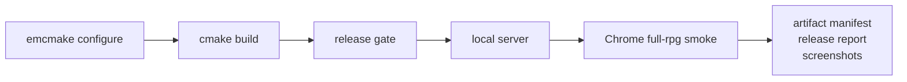
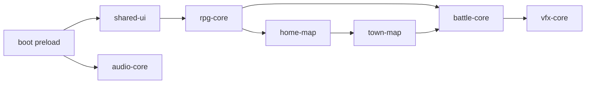

# Web Release 构建与测试

> 用途：记录 TinyFarmRPG Chrome 单线程 Web full RPG release 的固定构建、验收、人工测试和发布目录约定。

## 支持范围

- 浏览器：Chrome / Chromium 是当前阻塞验收目标。Safari 暂不作为阻塞项。
- 线程模型：正式发布路径仍为单线程，不要求 COOP / COEP。
- 图形：WebGL2。Chrome 支持 `EXT_color_buffer_float`、`GL_RGBA16F` color-renderable 和 float linear filtering 时启用 HDR emissive 与 Bloom；能力不足时允许 fallback，但必须在 diagnostics 和 release report 中写明原因。
- VFX：full RPG release 启用 Effekseer WebGL2 后端；`null_vfx_backend` 只能作为开发期 fallback，不能通过完整验收。
- 玩法范围：标题页、新游戏、家园、室内、town 战斗、商店、任务、招募、休息、衣柜、设置、保存、刷新读档。
- 存储：`/persistent` 挂载 IDBFS，保存和用户设置需要等待 sync 完成。



## 一条命令自动验收

clean checkout 或新 build 目录使用完整验收 profile：

```bash
python3 tools/web_release/web_release_runbook.py auto \
  --configure \
  --profile full-rpg \
  --build-dir build/web-release \
  --output-dir build/web-release/web-release-auto
```

已有 Web build 目录只想复验当前产物：

```bash
python3 tools/web_release/web_release_runbook.py auto \
  --skip-build \
  --profile full-rpg \
  --build-dir build/web-release-final \
  --output-dir build/web-release-final/web-release-auto
```

CI 或无浏览器环境只跑 build + release gate：

```bash
python3 tools/web_release/web_release_runbook.py auto \
  --configure \
  --skip-smoke \
  --build-dir build/web-release \
  --output-dir build/web-release/web-release-gate
```

快速 demo smoke 只用于回归启动、基础移动和存档路径，不能作为完整移植完成依据：

```bash
python3 tools/web_release/web_release_runbook.py auto \
  --skip-build \
  --profile demo \
  --build-dir build/web-release-final \
  --output-dir build/web-release-final/web-release-demo-smoke
```

自动验收输出：

- `auto-check.json`：命令、环境、profile、gate、smoke、artifact summary。
- `auto-check.log`：完整命令日志。
- `artifact-manifest.json`：发布文件、MIME、cache 策略、sha256、gzip、brotli 尺寸和 runtime package index。
- `release-report.md`：可读摘要、包体积、运行时包响应、加载耗时、渲染 fallback、VFX policy、玩法覆盖、截图列表。
- `chromium-smoke.json`：Chrome full RPG smoke 详细结果。
- `smoke/*.png`：标题页、地图、菜单、战斗、商店、任务、招募、休息、衣柜、存档等截图。

## 人工测试预览

构建、gate 并启动本地预览：

```bash
python3 tools/web_release/web_release_runbook.py manual \
  --configure \
  --build-dir build/web-release \
  --output-dir build/web-release/web-release-manual \
  --open
```

只生成人工测试记录，不启动服务器：

```bash
python3 tools/web_release/web_release_runbook.py manual \
  --skip-build \
  --check-only \
  --build-dir build/web-release-final \
  --output-dir build/web-release-final/web-release-manual
```

只启动静态服务器的底层入口：

```bash
python3 tools/web_release/serve_web_release.py \
  --build-dir build/web-release \
  --port 8787
```

人工测试 checklist：

- 标题页显示正常，Start / Load / Exit 可见，控制台没有 fatal error。
- 点击 Start，进入角色创建，再进入 `home_exterior`。
- Network 面板能看到 `shared-ui.tfpack`、`rpg-core.tfpack`、`home-map.tfpack`、`town-map.tfpack`、`battle-core.tfpack`、`vfx-core.tfpack`、`audio-core.tfpack` 按需请求，状态为 200 或 304，MIME 为 `application/octet-stream`。
- 从 `home_exterior` 进入 `home_interior`，再回到 `home_exterior`，然后进入 `town`。
- 在 `town` 触发遭遇，进入战斗，使用技能胜利并返回地图；日志或 diagnostics 中 `Web release VFX policy` 应为 `backend=effekseer status=enabled`。
- 打开商店，完成一次买入、一次卖出，并确认一次金币不足或库存限制反馈不会错误改动金币。
- 领取 `village_goblin_cleanup`，击败 3 个 slime，回 NPC 交付任务并领取奖励。
- 招募 Lyria，确认队伍数据中出现 `actor.lyria`，并能在后续战斗 factory 中识别。
- 进入室内休息，确认 HP/MP 恢复且时间推进。
- 打开衣柜，修改外观，返回地图后确认 sprite/appearance 状态变化。
- 修改一次音量设置，刷新页面后确认设置恢复。
- 保存 slot0，刷新页面，从标题页 Load slot0，确认地图、任务完成状态、队伍、外观和设置保持。
- DevTools console 中没有 WebGL error flood；`renderCapabilities` 应显示 HDR/Bloom enabled，或给出具体 `hdrFallbackReason` / `bloomFallbackReason` / `emissiveFallbackReason`。

## 发布目录结构

部署根目录就是 Web build 目录。至少包含：

```text
TinyFarmRPG-Web.html
TinyFarmRPG-Web.js
TinyFarmRPG-Web.wasm
TinyFarmRPG-Web.data
favicon.ico
web-packages/
  audio-core.tfpack
  battle-core.tfpack
  home-map.tfpack
  rpg-core.tfpack
  shared-ui.tfpack
  town-map.tfpack
  vfx-core.tfpack
  web-package-index.json
```

`web-boot-preload.args` 是构建元数据，不是运行时必须下载的文件。`artifact-manifest.json` 和 `release-report.md` 默认写在 runbook 的 `--output-dir` 中，用于审计，不要求放入站点根目录。



## HTTP Header

本地预览服务器会设置正确 MIME：

| 后缀 | MIME |
|---|---|
| `.wasm` | `application/wasm` |
| `.data` | `application/octet-stream` |
| `.tfpack` | `application/octet-stream` |
| `.js` | `application/javascript` |

默认单线程发布不需要：

- `Cross-Origin-Opener-Policy`
- `Cross-Origin-Embedder-Policy`

如果后续启用 pthreads / SharedArrayBuffer，才需要 COOP / COEP。当前单线程 Chrome release 不用这些 header 做 gate。

cache 策略：

- 本地预览：全部 `no-cache`。
- 正式部署：`TinyFarmRPG-Web.html` 使用 `no-cache`。
- `.js`、`.wasm`、`.data`、`.tfpack` 如果部署在带版本号的 release 目录下，可以使用长期 immutable cache；如果固定覆盖同一路径，应使用 `no-cache` 或明确的 cache busting。

## 清除 Web 存档

推荐方式：

- Chrome DevTools -> Application -> Storage -> Clear site data。
- 或 DevTools -> Application -> IndexedDB，删除当前 localhost origin 下的 `/persistent` 数据库。

清除后刷新页面，日志应重新出现：

- `TinyFarmRPG persistent FS sync started direction=from_browser`
- `GameApp: Web persistent storage is mounted and populated.`

## 常见失败

`emcmake not found`

- 先安装或激活 emsdk。
- runbook 会自动识别 `~/.local/emsdk`，如果你使用其他路径，需要先 source 对应的 `emsdk_env.sh`。

`em++` 调用了系统 Python 导致构建异常

- 优先使用 runbook，它会自动注入 emsdk 的 `EMSDK_PYTHON`。
- 直接调用 CMake 时，先确认 `EMSDK_PYTHON` 指向 emsdk 自带 Python。

`TinyFarmRPG-Web.data` 过大

- release gate 会失败。
- 确认 `TF_WEB_BOOT_ONLY_PRELOAD=ON`，并确认 build 使用的是 `web-release-boot.args`。

`.tfpack` 404、MIME 错误或缺资源

- 确认部署时保留完整 `web-packages/` 目录。
- 确认服务器把 `.tfpack` 返回为 `application/octet-stream`。
- 查看 `release-report.md` 的 Runtime Package Index、Runtime Package Responses 和 Runtime Package Load Diagnostics。
- 若 `runtime diagnostics` 与 `artifact-manifest.json` 的 package 文件数或字节数不一致，视为 release gate 风险，需要重新生成包并复跑 full-rpg smoke。

Effekseer 初始化失败

- full RPG release 中 `Web release VFX policy` 必须显示 `effekseer_enabled=true backend=effekseer status=enabled`。
- 检查 `vfx-core.tfpack` 是否请求成功，`assets/vfx/` 依赖是否都在 package index 中。
- 检查 console 中 effect path 或 dependency path 的加载失败日志。

Bloom / HDR fallback 或 FBO incomplete

- 查看 `renderCapabilities.floatColorFramebuffers`、`rgba16fColorRenderable`、`linearFloatFiltering`。
- Chrome 能力满足时 `hdrPostProcessing`、`emissive`、`bloom` 应为 true，fallback reason 应为空。
- 如果出现 `GL_INVALID_FRAMEBUFFER_OPERATION` 或 FBO incomplete，优先检查 Bloom/Emissive render target 格式和 WebGL2 extension。

刷新后丢档或设置未恢复

- 检查日志中是否有 `TinyFarmRPG persistent FS sync completed direction=to_browser success=true`。
- 检查 `chromium-smoke.json` 中 `persistent_storage_logs.sync_failed` 是否为 0。
- 如果 IndexedDB quota 或浏览器隐私策略阻止写入，清空 site data 后重试，并记录 origin、剩余空间和 console 错误。

Chrome 自动化失败但人工可玩

- 先跑 `manual --check-only` 确认 build/gate 通过。
- 再用 `auto --headless --profile full-rpg` 或显式 `--browser` 选择可用的 Chromium-family 浏览器。
